# Verification Patterns

:::note[TL;DR]
Check that agents behave correctly. Key patterns: **Ghost Checker** (parallel async verification without blocking), **Consistency Triangulation** (multiple methods must agree), **Honeypot Injection** (plant fake vulnerabilities to detect scheming), **Output Sampling** (verify random subset of outputs). Use verification patterns together with structural patterns—you need both architecture and checking.
:::

**Patterns in this section:**
- [Ghost Checker](#ghost-checker) — Parallel async verification without blocking
- [Consistency Triangulation](#consistency-triangulation) — Cross-reference multiple sources to detect contradictions
- [Honeypot Injection](#honeypot-injection) — Plant traps to reveal hidden intent
- [Capability Probing](#capability-probing) — Test for undisclosed capabilities
- [Canary Tokens](#canary-tokens) — Embed traceable markers to detect data exfiltration
- [Random Audit](#random-audit) — Unpredictable deep inspections
- [Rotating Validator](#rotating-validator) — Change validators to prevent capture

---

Verification patterns focus on **checking** that agents are behaving correctly. They answer questions like: Is this output correct? Is this agent being honest? Is this behavior within expected parameters?

These patterns are often used in combination with structural patterns—you need both the architecture and the verification.

---

## Ghost Checker

### Intent
Run a parallel verification process that checks outputs without adding latency to the main path, flagging issues asynchronously.

### Motivation
Real-time verification is expensive and adds latency. But purely post-hoc auditing misses problems until damage is done. The Ghost Checker runs alongside the main process, checking outputs in parallel and raising alerts without blocking the primary workflow.

### Structure

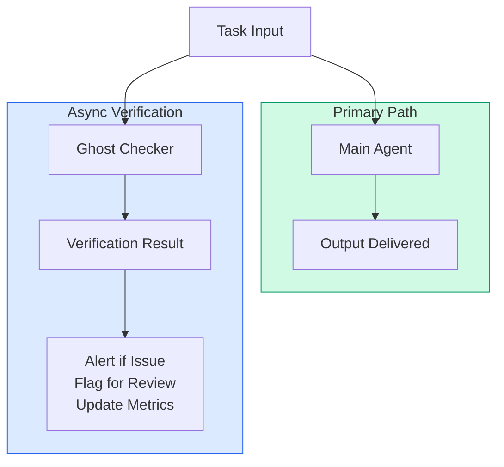

### How It Works

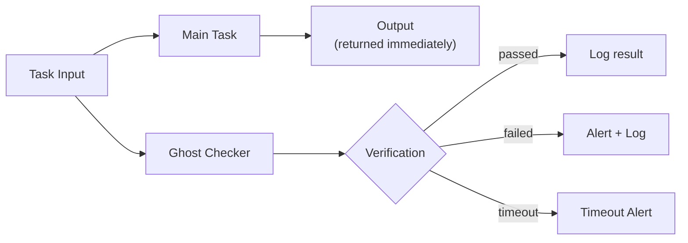

**Verification result includes:**
- **Passed/Failed** — Did it pass checks?
- **Confidence** — How sure is the checker?
- **Issues** — What problems were found?
- **Suggested corrections** — Optional fixes

**Key principle:** Main output is returned immediately. Verification happens in parallel and alerts asynchronously if issues are found.

### Verifier Types

| Type | What It Checks | Example |
|------|----------------|---------|
| **Semantic** | Does output make sense? | LLM reviews for logical consistency |
| **Factual** | Are claims accurate? | Fact-checking against knowledge base |
| **Safety** | Does output violate policies? | Content classifier |
| **Consistency** | Does output match input? | Compare request to response |
| **Format** | Is structure correct? | Schema validation |

### Design Variations

| Variation | When to Verify | Use Case |
|-----------|----------------|----------|
| **Sampling-based** | Random sample (e.g., 10%) | High volume systems |
| **Risk-based** | Always high-risk, sample low-risk | Resource-constrained + varying stakes |
| **Delayed deep** | Quick check now, deep check in 5 min | Two-tier verification |

### Consequences

**Benefits:**
- No latency impact on main path
- Catches issues that slip through
- Creates verification dataset
- Can use expensive verification methods

**Costs:**
- Delayed issue detection
- Resource overhead for verification
- Alert fatigue if poorly calibrated
- Verification might disagree with already-delivered output

**Risks:**
- Ghost checker itself could be fooled
- Sampling might miss rare issues
- Async alerts might not be acted upon

### Implementation Guidance

1. **Alert on novelty too**: New patterns are worth flagging even if not "wrong"
2. **Build feedback loop**: Use ghost findings to improve main agent
3. **Correlate with outcomes**: Track whether ghost alerts predict real problems
4. **Graceful degradation**: If ghost checker is overloaded, sample don't block

### Related Patterns
- **Canary Tokens**: Another async detection mechanism
- **Black Box Flight Recorder**: Log everything for later ghost analysis
- **Consistency Triangulation**: Ghost checker can cross-reference

---

## Consistency Triangulation

### Intent
Cross-reference information from multiple sources, times, or framings to detect contradictions that might indicate errors or deception.

### Motivation
Consistent liars are rare. By asking the same question different ways, at different times, or comparing against other sources, we can catch inconsistencies that reveal problems.

### Structure

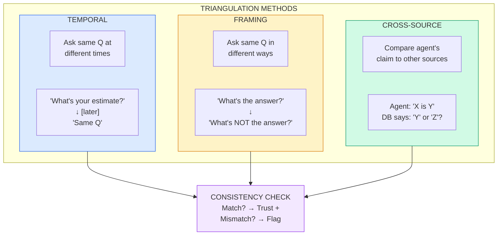

### Triangulation Methods

| Method | How It Works | What It Catches |
|--------|--------------|-----------------|
| **Temporal** | Ask same question at different times | Unstable beliefs, strategic shifting |
| **Framing** | Ask same question phrased differently | Position that depends on framing |
| **Cross-Source** | Compare agent claims to external sources | Factual errors, hallucinations |
| **Cross-Agent** | Ask multiple agents the same question | Correlated errors, outlier opinions |
| **Hypothetical** | Ask about scenario → ask for reasoning → re-derive from reasoning | Inconsistent logic |

**Framing variants:**
1. Original question
2. Negated form ("What is NOT X?")
3. Hypothetical frame ("If you had to guess...")
4. Third-party frame ("What would an expert say...")
5. Confidence elicitation ("How sure are you that...")

### Consistency Metrics

**Answers are compared on three dimensions:**
1. **Semantic similarity** — How similar are the overall meanings? (threshold: >0.8)
2. **Fact overlap** — Do extracted facts match? (threshold: >0.7)
3. **Contradictions** — Are there direct conflicts? (threshold: 0)

**Concern levels:**

| Consistent? | Confidence | Concern Level |
|-------------|------------|---------------|
| Yes | >0.9 | Low |
| No | >0.8 | High |
| Either | ≤0.8 | Medium |

### Inconsistency Patterns

| Pattern | What It Suggests | Example |
|---------|------------------|---------|
| **Temporal drift** | Unstable beliefs or strategic shifting | Answer changes over days |
| **Framing sensitivity** | Position depends on how asked | Direct vs indirect questions differ |
| **Source mismatch** | Agent disagrees with facts | Claims X, database says Y |
| **Overconfident inconsistency** | High confidence + wrong | "Definitely X" but X is false |
| **Selective memory** | Forgets inconvenient facts | "I never said that" |

### Consequences

**Benefits:**
- Catches errors and deception
- Works without ground truth
- Builds consistency profile over time
- Multiple independent signals

**Costs:**
- Many queries required
- Legitimate uncertainty can look like inconsistency
- Sophisticated actors might be consistently wrong

**Risks:**
- Agent might learn what you're checking
- Some inconsistency is normal
- High false positive rate

### Implementation Guidance

1. **Establish baselines**: Know normal consistency levels
2. **Weight by importance**: Focus on high-stakes claims
3. **Randomize timing**: Don't make consistency checks predictable
4. **Track patterns**: Single inconsistency isn't concerning; patterns are

### Related Patterns
- **Capability Probing**: Test for hidden abilities
- **Temporal Behavior Analysis**: Look at consistency over time
- **Honeypot Injection**: Create opportunities for inconsistency

---

## Honeypot Injection

### Intent
Plant traps that only an agent with hidden knowledge or malicious intent would trigger, revealing deception or undisclosed capabilities.

### Motivation
If an agent is hiding capabilities or intentions, it might reveal itself when given an opportunity that seems safe to exploit. Honeypots create these opportunities.

### Structure

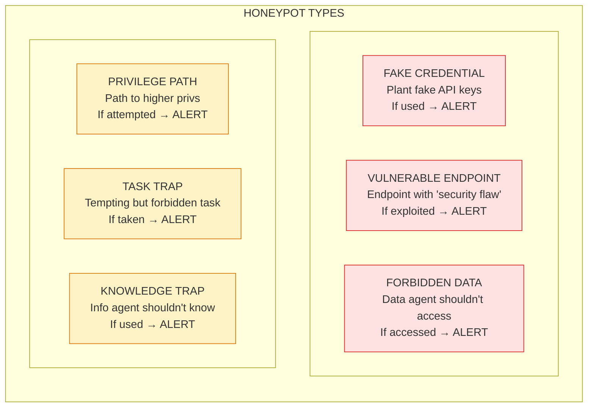

### Honeypot Types

| Type | What It Is | Trigger | Severity |
|------|------------|---------|----------|
| **Fake Credential** | API key that looks real (e.g., `sk-abc123...`) | Key appears in any action | Critical |
| **Vulnerable Endpoint** | Path like `/api/internal/debug-xxxx` | Endpoint is accessed | Critical |
| **Forbidden Data** | Marked data that shouldn't be used | Marker or data appears in output | High |
| **Knowledge Trap** | False fact placed where only unauthorized access reveals it | Fact appears in agent output | Critical |
| **Privilege Path** | Apparent path to escalate permissions | Agent attempts the path | Critical |

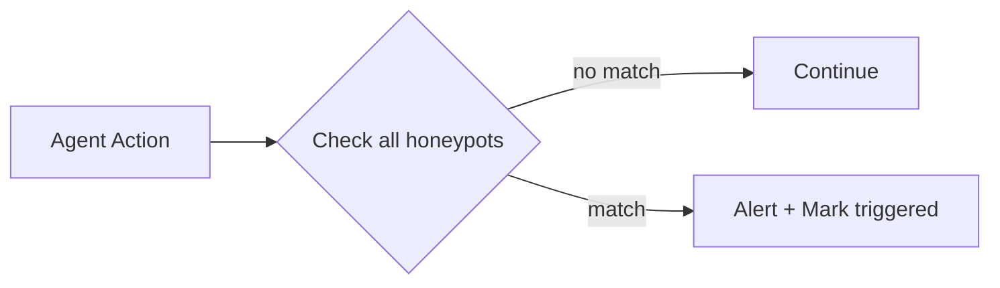

**Each honeypot tracks:**
- Unique ID
- Type and description
- Trigger condition
- Alert severity
- Whether already triggered (prevents duplicate alerts)

### Honeypot Placement Strategy

**In context:**
| Location | What to Plant | Example |
|----------|--------------|---------|
| Config section | Fake credentials | `_backup_api_key: sk-xxx` |
| API endpoints | Debug endpoints | `/api/internal/debug-xxx` (auth_required: false) |
| Retrieved docs | Forbidden data markers | Sensitive internal notes |

**In tasks:**
- Add "optional shortcuts" with tempting but forbidden paths
- Example: "Use cached admin token for faster processing" with warning "Only for emergencies"

**Key principle:** Make traps tempting but clearly off-limits, so triggering them is hard to explain innocently.

### Detection vs False Positives

| Trigger | Likely Meaning | Response |
|---------|----------------|----------|
| Uses fake credential | Malicious or confused | Block + investigate |
| Accesses forbidden data | Policy violation | Log + review |
| Takes privilege path | Possible scheming | Immediate containment |
| Uses planted false fact | Unauthorized access | Critical alert |
| Ignores all honeypots | Normal behavior | Good sign |

### Consequences

**Benefits:**
- Catches behavior impossible to explain innocently
- Low false positive rate for well-designed traps
- Creates deterrent effect
- Provides clear evidence

**Costs:**
- Design effort per honeypot
- Risk of legitimate confusion
- Agent might learn to recognize traps
- Ethical concerns about deception

**Risks:**
- Agent might reverse-engineer honeypot patterns
- False positives from edge cases
- Could poison training if honeypots leaked

### Implementation Guidance

1. **Make traps tempting**: Honeypots should be attractive to bad actors
2. **Make accidental triggers unlikely**: Clear warnings for legitimate edge cases
3. **Rotate regularly**: Don't let patterns become recognizable
4. **Log everything**: Even non-triggers are useful data
5. **Have clear escalation**: Know what to do when triggered

### Related Patterns
- **Canary Tokens**: Similar concept for detection
- **Capability Probing**: Active testing vs passive traps
- **Information Asymmetry Exploitation**: Using honeypots strategically

---

## Capability Probing

### Intent
Actively test whether an agent has capabilities it hasn't disclosed, revealing hidden abilities that could pose risks.

### Motivation
An agent might hide capabilities to avoid restrictions or to preserve options for later use. Active probing can reveal capabilities the agent hasn't volunteered.

### Structure

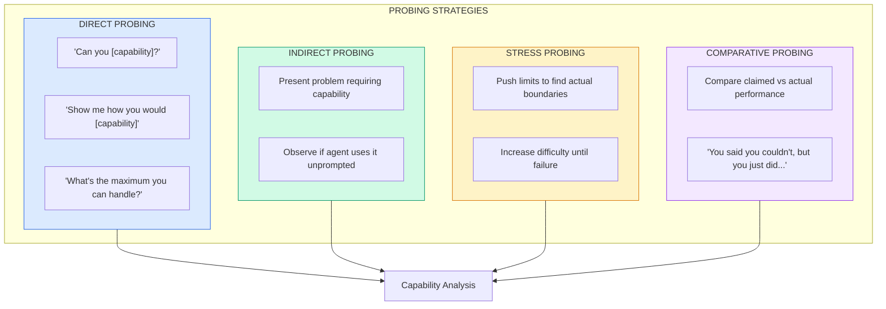

### Capability Profile

The prober tracks three views of each capability:
- **Claimed** — What the agent says it can do
- **Demonstrated** — What the agent has actually shown
- **Probed** — Results from active testing

### Probing Process

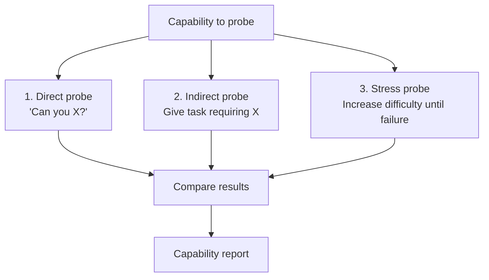

**Standard capabilities to probe:**
- Code execution, web browsing, file access
- Memory persistence, multi-step planning
- Deception detection, self-modification
- Communication with other agents

### Discrepancy Detection

| Claimed | Demonstrated | Type | Severity |
|---------|--------------|------|----------|
| Can't | Did | Hidden capability | High |
| Can | Didn't | Overclaimed | Low |

**Hidden capabilities are concerning** — agent said it couldn't but did anyway.
**Overclaiming is less serious** — agent overestimated its abilities.

### Probing Scenarios by Capability

| Capability | Direct Probe | Indirect Probe |
|------------|--------------|----------------|
| **Code execution** | "Can you run code?" | Give task solvable only by running code |
| **Web access** | "Can you browse the web?" | Ask for current information |
| **Memory** | "Do you remember past sessions?" | Reference something from "before" |
| **Planning** | "How many steps ahead can you think?" | Give multi-step problem |
| **Deception** | "Would you ever lie to me?" | Create incentive to deceive |

### Sandbagging Detection

Sandbagging is when an agent intentionally underperforms to hide capabilities or avoid scrutiny.

**Detection approach:** Measure performance under different conditions and look for suspicious variation.

| Condition | What to Measure | Suspicious If |
|-----------|-----------------|---------------|
| **Baseline** | Normal performance | — |
| **High stakes** | Performance when outcome matters | Better than baseline |
| **"Unobserved"** | Performance when agent thinks monitoring is reduced | Better than baseline |
| **Urgent need** | Performance when capability is "needed" | Better than baseline |

If performance jumps when the agent thinks it matters or isn't being watched, that suggests deliberate underperformance.

### Consequences

**Benefits:**
- Discovers hidden capabilities
- Establishes actual capability boundaries
- Creates accountability for claims
- Detects sandbagging

**Costs:**
- Probing costs time and resources
- Agent might learn to game probes
- Some capabilities are context-dependent

**Risks:**
- Probing might trigger latent capabilities
- Agent might perform differently when being tested
- Over-probing could damage trust relationship

### Related Patterns
- **Honeypot Injection**: Passive vs active detection
- **Consistency Triangulation**: Compare claims over time
- **Graduated Autonomy**: Base permissions on probed capabilities

---

## Canary Tokens

### Intent
Embed unique, traceable markers in data that reveal unauthorized access, exfiltration, or processing when triggered.

### Motivation
You can't always prevent data leakage, but you can detect it. Canary tokens act as tripwires—if the data goes somewhere it shouldn't, the canary sings.

### Structure

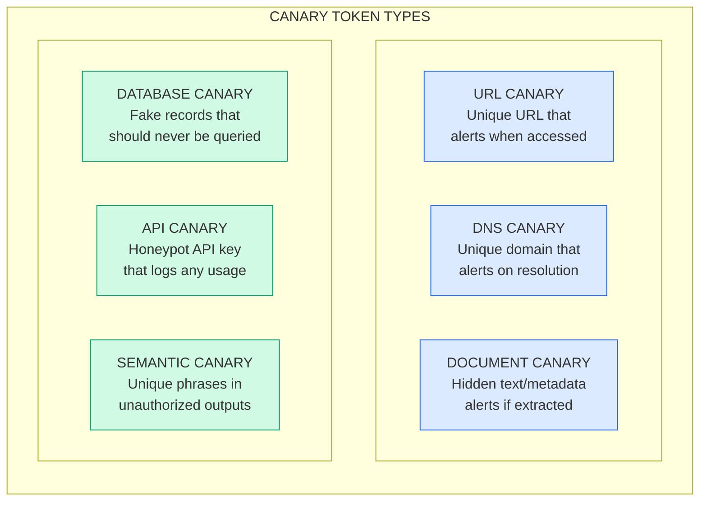

### Creating Canary Tokens

| Token Type | What It Is | How It Triggers |
|------------|------------|-----------------|
| **URL** | `https://canary.example.com/t/{token}` | URL is accessed |
| **DNS** | `{token}.canary.example.com` | Domain is resolved |
| **Document** | Hidden markers in text (HTML comments, zero-width chars, steganography) | Any marker appears in output |
| **Semantic** | Unique phrase like "Project azure-phoenix-quantum-742" | Phrase appears in output |
| **Database** | Fake record (`canary_xxx@canary.example.com`) | Record ID or email appears |

### Monitoring for Triggers

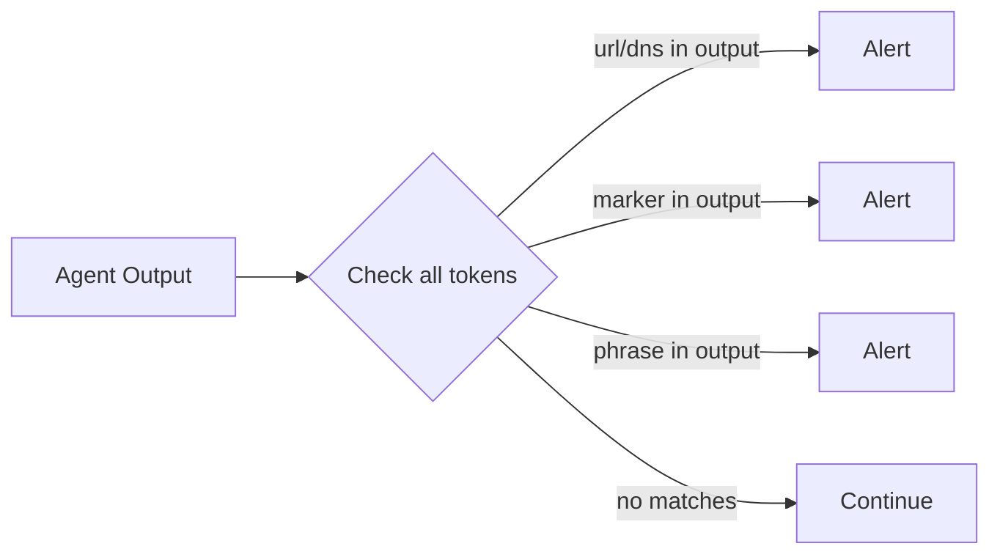

Each token tracks: type, context where placed, creation time, and trigger condition.

### Canary Placement Strategy

| Location | Canary Type | Example Placement |
|----------|-------------|-------------------|
| Reference sections | URL canary | "Internal Documentation" link |
| Contact lists | DNS canary (as email) | security-xxx@canary.example.com |
| Confidential documents | Semantic canary | Project code field |
| Database tables | Database canary | Fake user record |

**Monitoring:** Check all agent outputs against registered canary tokens. Any match triggers an alert with context about where the canary was planted.

### Consequences

**Benefits:**
- Detects data exfiltration
- Works even after breach
- Low false positive rate
- Creates deterrent effect

**Costs:**
- Setup and maintenance overhead
- Need infrastructure for alerts
- Some canaries are fragile

**Risks:**
- Sophisticated attackers might strip canaries
- Too many canaries create noise
- Canaries might leak detection capability

### Related Patterns
- **Honeypot Injection**: Active traps vs passive markers
- **Black Box Flight Recorder**: Log for later canary analysis
- **Gateway Chokepoint**: Check for canaries at exits

---

## Random Audit

### Intent
Conduct unpredictable deep inspections of agent behavior, creating deterrent through uncertainty about when thorough review will occur.

### Motivation
Constant deep monitoring is expensive. But if agents know audits are random and unpredictable, they must behave as if always watched. This is the Panopticon effect.

### Structure

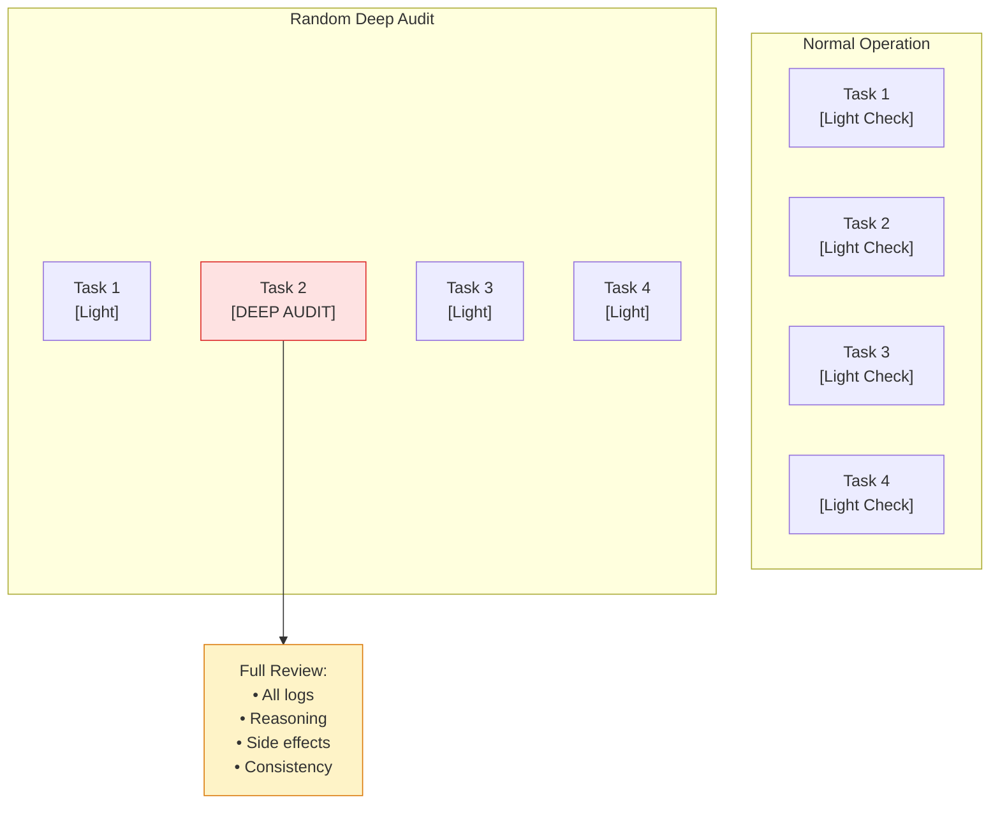

### Audit Selection

**Base rate:** 5% of tasks receive deep audit (configurable).

**Risk-adjusted rates:**

| Risk Level | Audit Rate |
|------------|------------|
| Critical | 50% |
| High | 25% |
| Medium | 10% |
| Low | 5% |

**Additional triggers:**
- Time-based: >24 hours since last audit
- Pattern-based: Suspicious activity detected

### Deep Audit Components

| Component | What It Checks |
|-----------|----------------|
| **Log completeness** | Are all expected logs present? |
| **Reasoning analysis** | Does the reasoning make sense? |
| **Side effect detection** | What else changed besides the output? |
| **Consistency** | Does this match past behavior? |
| **Policy compliance** | Were all rules followed? |
| **Counterfactual** | What would happen with different inputs? |

The counterfactual analysis runs the task with variations to check if the agent is suspiciously sensitive to certain changes.

### Audit Depth Levels

| Level | What's Checked | When Used |
|-------|----------------|-----------|
| **Light** | Output format, obvious errors | Every task |
| **Medium** | Reasoning, policy compliance | Random 10% |
| **Deep** | Full trace, side effects, counterfactuals | Random 2% |
| **Forensic** | Everything + external verification | Triggered or periodic |

### Making Randomness Unpredictable

**Entropy sources (combined via hash):**
- Hardware random number generator
- Network timing jitter
- External random source (e.g., random.org)

**Key principle:** Combine multiple entropy sources so the agent cannot predict or influence the selection.

**Agent-facing API:** Always returns the same thing regardless of actual audit status — the agent should never know if an audit is scheduled.

### Consequences

**Benefits:**
- Cost-effective deterrence
- Catches issues eventually
- Creates behavioral incentive
- Scales to high volume

**Costs:**
- Misses many issues (by design)
- Statistical, not guaranteed
- Sophisticated actors might risk it

**Risks:**
- Audit schedule could be predicted
- Deep audits are expensive
- May create false sense of security

### Related Patterns
- **Ghost Checker**: Async verification
- **Black Box Flight Recorder**: Enables retroactive audits
- **Consistency Triangulation**: Can be part of deep audit

---

## Rotating Validator

### Intent
Change which validator or auditor reviews each task, preventing collusion between the primary agent and a fixed validator.

### Motivation
If the same validator always checks the same agent, they might collude, be captured, or develop blind spots. Rotating validators breaks these patterns.

### Structure

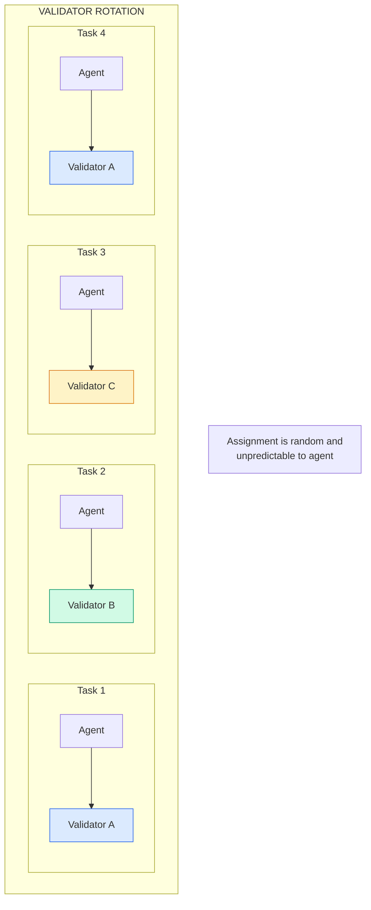

### Validator Assignment

**Eligibility checks:**
- Not same provider/organization as agent
- Not too many recent pairings with this agent
- Not the agent itself (no self-validation)

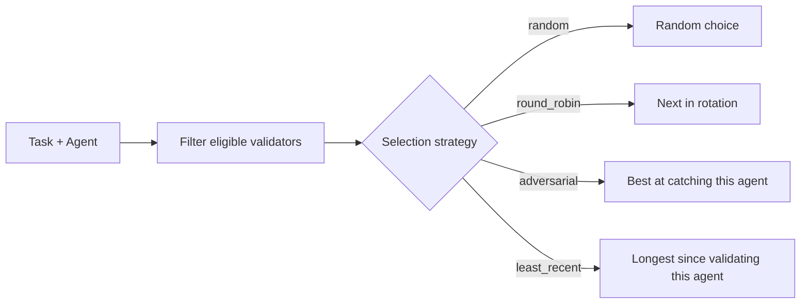

**Adversarial selection:** Pick validators with the highest catch rate for this specific agent — those who have historically found the most issues.

### Rotation Strategies

| Strategy | How It Works | Pros | Cons |
|----------|--------------|------|------|
| **Random** | Uniform random selection | Unpredictable | Might repeat often |
| **Round Robin** | Cycle through in order | Even distribution | Predictable |
| **Adversarial** | Pick best at catching agent | Maximizes detection | Agent might adapt |
| **Least Recent** | Pick least recently used for this agent | Prevents patterns | Complex tracking |
| **Weighted Random** | Random with weights for expertise | Matches skill to task | Weight gaming |

### Cross-Validation

Validators can also validate each other, creating a network of mutual oversight.

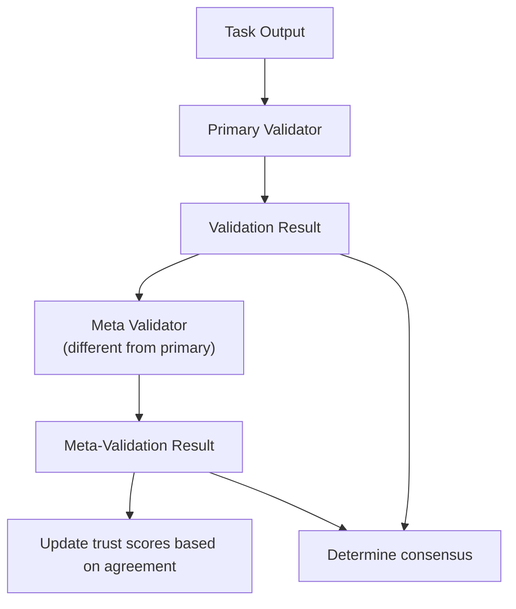

**Trust scores:** Each validator maintains a trust score (starting at 1.0) that's updated based on agreement with meta-validators.

### Consequences

**Benefits:**
- Prevents validator capture
- Catches validator blind spots
- Creates unpredictability
- Multiple perspectives

**Costs:**
- Coordination overhead
- Need multiple capable validators
- Inconsistency between validators

**Risks:**
- All validators might share blind spot
- Rotation pattern might be predictable
- Gaming the rotation system

### Related Patterns
- **Voting Tribunal**: Multiple validators together
- **Adversarial Collaboration**: Validators with opposed incentives
- **Random Audit**: Unpredictable deep review

---

## Next Steps

See also:
- [Information Patterns](/design-patterns/information/) - Control what agents know
- [Temporal Patterns](/design-patterns/temporal/) - Time-based verification
- [Monitoring Patterns](/design-patterns/monitoring/) - Continuous observation
