# Worked Examples

This page walks through complete analyses of interconnection in realistic architectures.

---

## Example 1: Code Review Verification Pipeline

### Initial Architecture


### Step 1: Identify Apparent Diversity

| Component | Type | Provider | Methodology |
|-----------|------|----------|-------------|
| Static Analysis | Rule-based | Semgrep (open source) | Pattern matching |
| Security Review | LLM | OpenAI (GPT-4) | Natural language |
| Quality Review | LLM | Anthropic (Claude) | Natural language |

**Initial assessment**: Looks diverse! Rule-based + two different LLM providers.

### Step 2: Construct Correlation Matrix

Based on architecture review and red team testing:

| | Static | GPT-4 | Claude |
|------|--------|-------|--------|
| **Static** | 1.0 | 0.1 | 0.1 |
| **GPT-4** | 0.1 | 1.0 | **0.6** |
| **Claude** | 0.1 | **0.6** | 1.0 |

**Red flags identified**:
- GPT-4 and Claude show 0.6 correlation (both miss same novel vulnerability classes)
- Both LLMs trained on similar public code repositories
- Static analysis has low correlation with LLMs—this is actually good

### Step 3: Analyze Hidden Dependencies

Deeper investigation reveals:


**Additional correlations found**:
- Same prompt template: +0.2 to LLM correlation (now 0.8 effective)
- Same team: Organizational blind spots affect all components
- Shared CI infrastructure: Timeout can cause all checks to "pass by default"

### Step 4: Calculate Actual Risk

```
Apparent protection (assuming independence):
- Static: 80% effective at catching bugs
- GPT-4: 70% effective
- Claude: 70% effective
- Independent assumption: 1 - (0.2 × 0.3 × 0.3) = 98.2%

Actual protection (accounting for correlation):
- Static remains ~80% (low correlation with LLMs)
- GPT-4 + Claude effective joint miss rate: ~25% (not 9%)
  (because 0.6-0.8 correlation means they miss together often)
- Combined: 1 - (0.2 × 0.25) = 95%

Correlation tax: (100% - 95%) / (100% - 98.2%) ≈ 2.8×

Actual risk is 2.8× higher than independent model suggests.
```

### Step 5: Identify Interventions

| Intervention | Cost | Correlation Reduced | Priority |
|--------------|------|---------------------|----------|
| Different prompt templates | Low | 0.8 → 0.6 | **High** |
| Add fuzzing-based checker | Medium | Adds orthogonal check | **High** |
| Separate CI pipelines | Medium | Removes cascade risk | Medium |
| Different team for each | High | Removes org correlation | Low |

### Step 6: Redesigned Architecture



```mermaid
flowchart TB
    subgraph SA["Static Analysis (Semgrep)"]
        SA1["Rule-based, Deterministic"]
        SA2["Catches: Known vulns, Style issues"]
    end
    subgraph LLM["LLM Review (GPT-4)"]
        LLM1["Semantic understanding"]
        LLM2["Catches: Logic issues, Design flaws"]
    end
    subgraph FZ["Fuzzing-based (AFL/custom)"]
        FZ1["Dynamic execution"]
        FZ2["Catches: Edge cases, Crashes"]
    end

    SA -->|"ρ = 0.1"| AG["Aggregator<br/>(2/3 required)"]
    LLM -->|"ρ = 0.1"| AG
    FZ -->|"ρ = 0.1"| AG

    style SA fill:#ccffcc
    style LLM fill:#cce6ff
    style FZ fill:#ffffcc
```

**Correlation matrix after redesign:**

| | Static | LLM | Fuzzing |
|---|---|---|---|
| Static | 1.0 | 0.1 | 0.15 |
| LLM | 0.1 | 1.0 | 0.1 |
| Fuzzing | 0.15 | 0.1 | 1.0 |

New effective protection: ~99%
Correlation tax: ~1.5× (down from 2.8×)

### Key Lessons

1. **Different providers ≠ low correlation**: GPT-4 and Claude had high correlation despite different providers
2. **Hidden dependencies matter**: Same prompts, same team created correlation not visible in architecture diagram
3. **Fundamentally different methods are key**: Adding fuzzing (dynamic execution) provided more diversity than adding another LLM
4. **Small interventions can help**: Just using different prompts reduced correlation significantly

---

## Example 2: Healthcare Recommendation System

### Initial Architecture


### Analysis

**Obvious problem**: All 5 components are LLMs, likely from same provider.

### Correlation Matrix

| | Intake | Medical | Drug | Symptom | Synthesis |
|--|--------|---------|------|---------|-----------|
| **Intake** | 1.0 | 0.7 | 0.7 | 0.7 | 0.8 |
| **Medical** | 0.7 | 1.0 | 0.6 | 0.6 | 0.7 |
| **Drug** | 0.7 | 0.6 | 1.0 | 0.5 | 0.7 |
| **Symptom** | 0.7 | 0.6 | 0.5 | 1.0 | 0.7 |
| **Synthesis** | 0.8 | 0.7 | 0.7 | 0.7 | 1.0 |

**Average correlation: 0.67** — Extremely high!

### Critical Issues

1. **Information flow contamination**: Intake LLM's summary is used by all downstream components. If Intake misunderstands, everything downstream is compromised.

2. **Same-provider homogeneity**: All LLMs share training biases, medical knowledge gaps, and reasoning patterns.

3. **No ground truth checking**: All verification is LLM-based; no connection to verified medical databases.

4. **Synthesis inherits all errors**: Final synthesis sees outputs already filtered through correlated reasoning.

### Stakes Assessment

**Existential**: Healthcare recommendations can affect life and death.

**Matrix lookup**: Existential stakes + High correlation = 🚨 **Stop until resolved**

### Redesigned Architecture


### Key Changes

1. **Multiple intake methods**: LLM + rule-based + direct extraction
2. **Verified databases**: Drug interactions, medical facts from authoritative sources
3. **Rule-based protocol matching**: Deterministic, auditable
4. **LLM only for synthesis**: Given verified facts, not generating facts
5. **Mandatory human review**: Healthcare stakes require physician oversight

### New Correlation Structure

```
Correlation after redesign:

              LLM    Rule   Keyword  DrugDB  MedDB  Protocol
LLM           1.0    0.1     0.1     0.05    0.1     0.05
Rule          0.1    1.0     0.3     0.1     0.1     0.2
Keyword       0.1    0.3     1.0     0.1     0.1     0.1
DrugDB        0.05   0.1     0.1     1.0     0.2     0.1
MedDB         0.1    0.1     0.1     0.2     1.0     0.2
Protocol      0.05   0.2     0.1     0.1     0.2     1.0

Average correlation: 0.13 (down from 0.67)
Correlation tax: ~2× (down from estimated 50×+)
```

---

## Example 3: Financial Trading Safeguards

### Initial Architecture


### Quick Analysis

**Problem**: Sequential ML models, both trained on same historical data.

**Correlation estimate**: ~0.7 (both learned same patterns from same data)

**Stakes**: High (financial loss potential)

### Redesigned Architecture


### Key Changes

1. **Three fundamentally different methods**:
   - ML for pattern recognition
   - Rule-based for hard limits
   - Deterministic position checking

2. **Conservative aggregation**: All must pass (not majority)

3. **No sequential dependency**: All checks run in parallel on same input

4. **Clear escalation**: Disagreement → human review

---

## Example 4: Customer Support Escalation (Active Influence)

This example focuses on **active entanglement**—specifically how information flow creates influence channels that undermine verification.

### Initial Architecture


### The Bureaucrat Problem

This architecture mirrors the classic bureaucrat scenario:
- **Agent** = Clerk who handles the case
- **Summary** = Clerk's case summary for the reviewer
- **Verifier** = Reviewer who must approve

The verifier sees the agent's framing, not the raw interaction. The agent—intentionally or not—controls what the verifier perceives.

### Step 1: Identify the Influence Channel


**Influence mechanisms identified:**
1. **Selective omission**: Agent doesn't mention customer's alternative requests
2. **Framing effects**: "Resolved" vs. "customer stopped responding"
3. **Emotional filtering**: Summary removes evidence of customer frustration
4. **Confidence projection**: Agent presents uncertain decisions as certain

### Step 2: Measure the Influence

**Test protocol**: Send same underlying scenarios with different agent framings.

| Scenario | Neutral Framing | Positive Framing | Verifier Decision Change? |
|----------|-----------------|------------------|--------------------------|
| Refund request | "Customer requested refund" | "Resolved with customer satisfaction" | 78% approval → 94% |
| Escalation | "Customer asked to speak to manager" | "Addressed customer concerns directly" | 45% approval → 82% |
| Partial resolution | "Issue partially addressed" | "Primary concern resolved" | 52% approval → 91% |

**Frame sensitivity score: 0.6** (high—verifier is strongly influenced by framing)

### Step 3: Analyze the Influence Type

This is **active asymmetric entanglement**:
- Agent → Verifier influence: HIGH (0.6)
- Verifier → Agent influence: LOW (0.1, only through rejection feedback)

The verifier's decisions are not independent—they're shaped by agent framing.

### Step 4: Check for Adversarial Dynamics

**Drift analysis** (over 6 months):


**Warning signs observed:**
- Approval rate increased 13 percentage points without policy change
- Agent summaries became more consistently positive-framed
- Verifier explanations include phrases like "Agent handled appropriately"
- Quality complaints from customers increased despite higher approval

**Diagnosis**: This is transitioning from active influence to adversarial capture. The verifier has learned to trust the agent's framing.

### Step 5: Interventions

| Intervention | Type | Cost | Effectiveness |
|--------------|------|------|---------------|
| Verifier sees raw conversation | Remove influence channel | Medium | Very High |
| Multiple framing test | Detect influence | Low | Medium |
| Rotate agent-verifier pairs | Prevent capture | Medium | High |
| Blind verification (hide agent identity) | Reduce relationship effects | Low | Medium |
| Independent summary generation | Add diversity | High | High |

### Step 6: Redesigned Architecture


**Key changes:**
1. **Verifier sees raw conversation** (removes information channel)
2. **Independent summary generation** (breaks agent's framing monopoly)
3. **Verifier rotation** (prevents capture relationships)
4. **Sentiment analysis** (catches emotional filtering)

### Step 7: Verify Independence

After redesign:

| Metric | Before | After |
|--------|--------|-------|
| Frame sensitivity | 0.6 | 0.15 |
| Agent→Verifier influence | HIGH | LOW |
| Approval rate drift | +13%/6mo | +2%/6mo |
| Verifier consistency (across rotations) | 0.72 | 0.91 |

**Bureaucrat check**: The reviewer now sees the original documents, not just the clerk's summary. Different reviewers give consistent decisions. Capture risk is reduced.

### Key Lessons

1. **Information channels are influence channels.** If A provides context to B, A influences B—even without malicious intent.

2. **Influence detection requires testing.** Send the same facts with different framings and measure whether decisions change.

3. **Capture is gradual.** The shift from "influence" to "capture" happened over months without any visible discontinuity.

4. **Independence requires independent context.** The verifier must construct its own understanding, not inherit the agent's framing.

5. **The bureaucrat analogy helps.** "Would we let the clerk write the only summary the reviewer sees?" makes the problem obvious.

---

## Analysis Template

Use this template for your own systems:

```
## System: [Name]

### Current Architecture
[Diagram]

### Step 1: Identify Components
| Component | Type | Provider/Source | Methodology |

### Step 2: Build Correlation Matrix
| | A | B | C | ... |
|---|---|---|---|---|

### Step 3: Find Hidden Dependencies
- Infrastructure:
- Information flow:
- Organizational:
- Temporal:

### Step 4: Calculate Risk
- Apparent protection (independent model):
- Actual protection (correlated model):
- Correlation tax:

### Step 5: Stakes Assessment
- Stakes level:
- Matrix recommendation:

### Step 6: Interventions
| Intervention | Cost | Impact | Priority |

### Step 7: Redesigned Architecture
[Diagram]

### Step 8: Verification
- New correlation matrix:
- New correlation tax:
- Remaining risks:
```

---

See also:
- [Modeling Approaches](/entanglements/detection/modeling/) - Quantification methods
- [Solutions](/entanglements/mitigation/solutions/) - Implementation guidance
- [Decision Framework](/entanglements/mitigation/decision-framework/) - Prioritization
