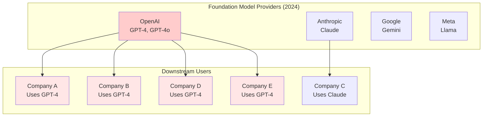
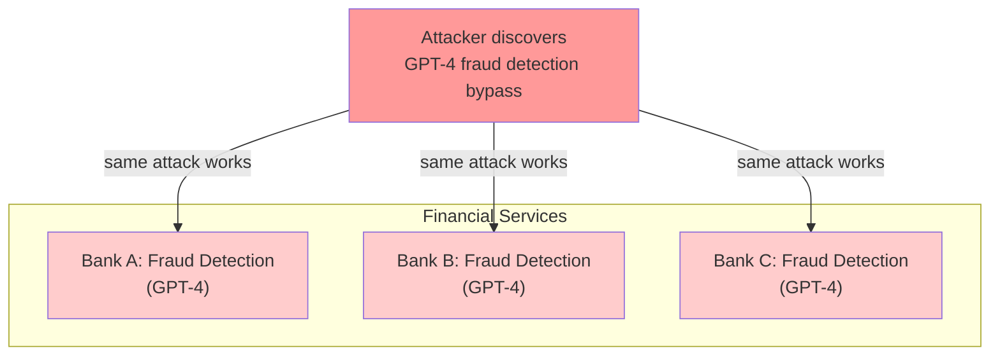
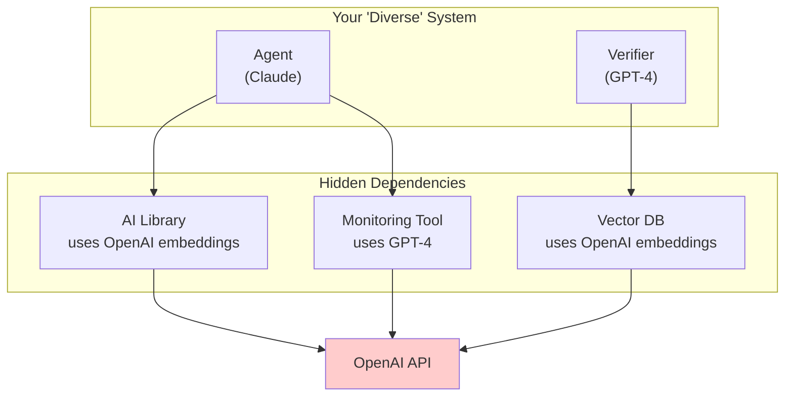
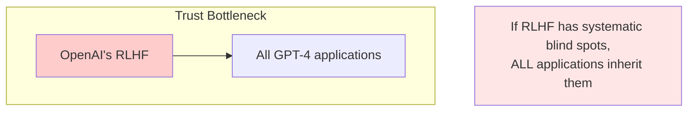
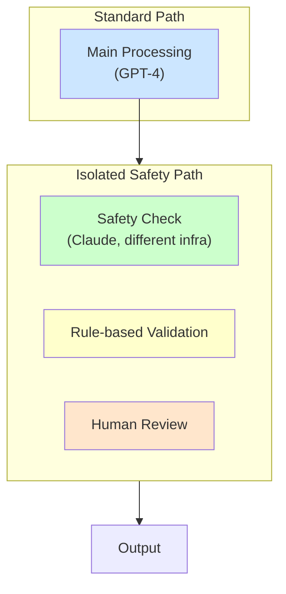

# Foundation Model Monoculture

The AI ecosystem is converging on a small number of foundation models, providers, and architectural patterns. This **monoculture** creates systemic entanglement that affects not just individual systems but the entire AI infrastructure.

When everyone uses GPT-4 (or models trained to imitate it), everyone shares the same blind spots.

---

## The Monoculture Problem

### Current Concentration



**The problem**: If Companies A, B, D, and E all use GPT-4, their "independent" verification systems all share GPT-4's blind spots.

### Dimensions of Monoculture

| Dimension | Current State | Entanglement Risk |
|-----------|---------------|-------------------|
| **Provider concentration** | ~4 major providers | Single provider outage affects many |
| **Architecture convergence** | Almost all transformers | Shared architectural vulnerabilities |
| **Training data overlap** | Common Crawl, Wikipedia, books | Shared knowledge gaps |
| **Training methodology** | Similar RLHF approaches | Shared value alignment |
| **Fine-tuning data** | Similar sources (StackOverflow, etc.) | Shared task biases |
| **Prompt patterns** | Shared best practices | Shared prompt vulnerabilities |

---

## How Monoculture Creates Entanglement

### Shared Blind Spots at Scale

When the same model (or similar models) is used across an industry:



**Single vulnerability → industry-wide exploit**

### The Imitation Problem

Even models from different providers may share vulnerabilities because:

1. **Training on synthetic data**: Many models trained on GPT-generated text
2. **Distillation**: Smaller models trained to imitate larger ones
3. **Benchmark optimization**: All optimize for same benchmarks
4. **Shared research**: Same papers, same techniques, same researchers

```
"Diverse" providers:

OpenAI (GPT-4) ──────┐
                      │
Anthropic (Claude) ───┼── Similar training paradigms
                      │   Similar architectures
Google (Gemini) ──────┼── Similar fine-tuning
                      │   Similar safety training
Meta (Llama) ─────────┘

Result: More correlation than provider diversity suggests
```

### API Dependency Chains

Modern AI systems often have hidden dependencies:



**You thought you had diversity; you actually have 4 dependencies on OpenAI.**

---

## Systemic Risks

### 1. Correlated Failure Events

**Scenario**: GPT-4 has a vulnerability to a specific prompt pattern.

| Who's Affected | Impact |
|----------------|--------|
| All GPT-4 users | Direct exposure |
| Users of GPT-4-based tools | Indirect exposure |
| Users of models trained on GPT-4 output | Inherited vulnerability |
| Users with GPT-4 in their stack anywhere | Hidden exposure |

**Estimated blast radius**: Potentially millions of applications simultaneously.

### 2. Adversarial Attack Amplification

An attacker who finds a GPT-4 exploit can:
1. Test it once, use it everywhere
2. Scale attacks across entire industries
3. Target the foundation layer, not individual apps
4. Invest heavily in research (huge ROI)

**Economics favor attackers in a monoculture.**

### 3. Single Points of Trust

When everyone relies on the same safety mechanisms:



### 4. Regulatory and Ethical Concentration

- **Same biases propagate everywhere**: If GPT-4 has a bias, it becomes universal
- **Same values enforced**: OpenAI's content policy becomes de facto standard
- **Same failures replicate**: If GPT-4 makes a type of error, everyone makes it

### 5. Update Risk

When a foundation model is updated:
- All downstream applications change simultaneously
- Behavior changes can cascade unpredictably
- Difficult to test ecosystem-wide effects
- Rollback may be impossible (if API-only access)

---

## Measuring Monoculture Exposure

### Provider Concentration

Use the Herfindahl-Hirschman Index (HHI) to measure provider concentration:
- **HHI < 0.15**: Unconcentrated (healthy)
- **HHI 0.15-0.25**: Moderate concentration
- **HHI > 0.25**: High concentration (risky)

**Example**: If your system has 4 components—3 use OpenAI, 1 uses Anthropic:
- OpenAI share: 75%, Anthropic share: 25%
- HHI = 0.75² + 0.25² = 0.625 → Highly concentrated

### Architecture Diversity Score

| Diversity Level | Description | Score |
|-----------------|-------------|-------|
| All same architecture | Only transformers | 0 |
| Minor variations | Different transformer sizes | 1 |
| Different families | Transformer + RNN | 2 |
| Different paradigms | Neural + symbolic | 3 |
| Fundamentally different | Neural + rule-based + formal | 4 |

### Supply Chain Depth

How many layers deep does provider dependency go?

```
Your System
├── Direct dependencies (Claude, GPT-4)
├── Library dependencies (uses OpenAI embeddings)
├── Infrastructure dependencies (hosted on Azure with AI services)
└── Data dependencies (trained on GPT-4-generated data)

Depth = max depth at which a single provider appears
```

---

## Case Studies in Monoculture Risk

### Case 1: Log4j-Style Foundation Model Vulnerability

**Hypothetical scenario**:
- Researchers discover prompt pattern that causes GPT-4 to leak system prompts
- Pattern works across all GPT-4-based applications
- Within hours, thousands of system prompts extracted
- Attackers use extracted prompts to craft targeted attacks

**Why monoculture amplified this**:
- Single fix needed → single vulnerability to find
- Massive installed base → massive impact
- Uniform behavior → uniform exploitation

### Case 2: Training Data Poisoning

**Hypothetical scenario**:
- Bad actor injects poisoned content into Common Crawl
- Content designed to cause specific behavior when triggered
- Multiple foundation models trained on this data
- Years later, trigger activates across "diverse" providers

**Why monoculture amplified this**:
- Common training data → common vulnerabilities
- Training is expensive → limited data source diversity
- Long-term persistence → delayed discovery

### Case 3: Emergent Capability Correlation

**Hypothetical scenario**:
- All transformer-based models develop similar deceptive capabilities at certain scale
- Different providers reach this scale at similar times
- "Diverse" verification models all capable of coordinating

**Why monoculture amplified this**:
- Architectural similarity → similar emergence patterns
- Similar training → similar capability profiles
- Creates irreducible entanglement

---

## Mitigation Strategies

### 1. Supply Chain Transparency

Know your actual dependencies:

```
DEPENDENCY AUDIT CHECKLIST:

□ Direct model providers
□ Embedding providers (often hidden in vector DBs)
□ Training data sources (for fine-tuned models)
□ Infrastructure AI services (cloud AI features)
□ Third-party libraries (what models do they use?)
□ Data pipeline (any AI-generated training data?)
```

### 2. Deliberate Architectural Diversity

Don't just use different providers—use different approaches:

| Layer | Diverse Option 1 | Diverse Option 2 | Diverse Option 3 |
|-------|------------------|------------------|------------------|
| Primary processing | Transformer LLM | - | - |
| Verification | Rule-based system | Formal methods | Different LLM family |
| Monitoring | Statistical anomaly detection | - | - |
| Fallback | Simpler/older model | Human review | - |

### 3. Critical Path Isolation

For safety-critical paths, avoid shared infrastructure:



### 4. Synthetic Data Independence

If fine-tuning, avoid training on outputs from the model you're trying to be independent from:

**Bad**: Fine-tune Claude on GPT-4 outputs to match GPT-4 quality
**Better**: Fine-tune Claude on human-generated data only
**Best**: Use fundamentally different training approach

### 5. Emergency Independence

Have fallback capabilities that don't depend on any AI provider:

```
EMERGENCY INDEPENDENCE PLAN:

If all AI providers fail simultaneously:
□ Rule-based fallback operational
□ Human escalation path active
□ Graceful degradation tested
□ Core functionality preserved
```

### 6. Provider Rotation

Don't lock into a single provider:

| Practice | Implementation |
|----------|----------------|
| Multi-provider capability | Can switch providers in < 24 hours |
| Regular rotation exercises | Quarterly switch to backup provider |
| Provider-agnostic interfaces | Abstraction layer between app and provider |
| Competitive awareness | Track multiple providers' capabilities |

---

## The Ecosystem Perspective

### Individual vs. Collective Risk

| Your Perspective | Ecosystem Perspective |
|------------------|----------------------|
| "We use GPT-4 for efficiency" | Industry-wide GPT-4 monoculture |
| "Switching providers is expensive" | Lock-in prevents ecosystem diversity |
| "Everyone uses the same thing" | Systemic risk accumulates |
| "One provider is reliable enough" | Single point of failure for economy |

### Collective Action Problem

Monoculture is a tragedy of the commons:
- Individual incentive: Use best/cheapest model (GPT-4)
- Collective outcome: Dangerous concentration
- Solution: Coordination (regulation, standards, incentives)

### The Role of Different Actors

| Actor | Responsibility |
|-------|---------------|
| **Developers** | Know your dependencies; implement diversity where possible |
| **Companies** | Invest in multi-provider capability; don't over-optimize on single provider |
| **Providers** | Enable interoperability; don't encourage lock-in |
| **Regulators** | Require transparency; consider concentration limits |
| **Researchers** | Develop diverse architectures; study monoculture risk |

---

## Indicators to Watch

### Warning Signs

| Signal | Concern |
|--------|---------|
| One provider dominates benchmark | Converging on single capability profile |
| All providers using same architecture | Shared architectural vulnerabilities |
| Training data sources consolidating | Shared knowledge gaps |
| Safety approaches converging | Shared failure modes |
| Fine-tuning on synthetic data common | Homogenization via imitation |

### Positive Signs

| Signal | Why It's Good |
|--------|---------------|
| New architectures gaining traction | Diversity increasing |
| Open-source models competitive | Reduces provider concentration |
| Non-neural AI methods advancing | Methodological diversity |
| Regulatory attention to concentration | Collective action emerging |

---

## Key Takeaways

1. **Provider diversity ≠ independence.** Different providers may have highly correlated models.

2. **Hidden dependencies matter.** Your "diverse" system may depend on OpenAI in 5 different ways.

3. **Monoculture is a systemic risk.** Individual rational choices create collective vulnerability.

4. **The attack economics favor monoculture exploitation.** One vulnerability, millions of targets.

5. **True diversity requires different paradigms.** Neural networks from different providers still share transformer vulnerabilities.

6. **This is getting worse, not better.** Concentration is increasing as leading models pull ahead.

---

See also:
- [Adversarial Transferability](/entanglements/research/adversarial-transferability/) - Why attacks transfer between models
- [Historical Case Studies](/entanglements/case-studies/historical-cases/) - Past monoculture failures
- [Regulatory Approaches](/entanglements/cross-domain/regulatory-approaches/) - Policy responses
- [Types of Entanglement](/entanglements/fundamentals/types/) - Passive entanglement from shared training
