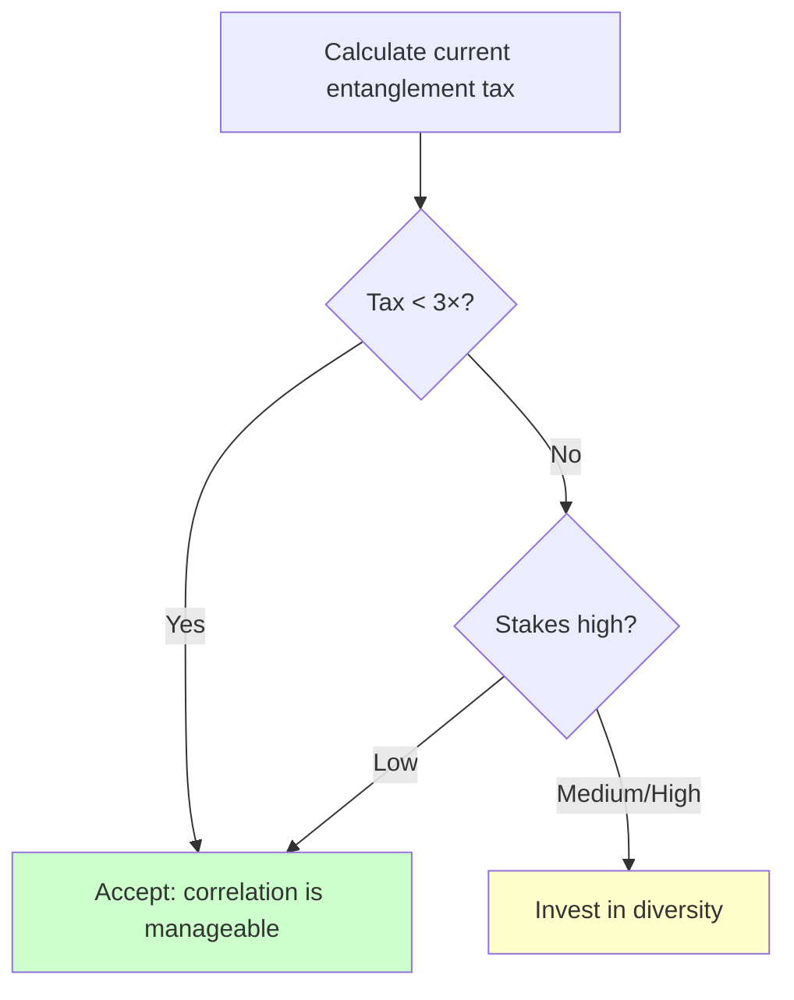

# Correlation Calculator

This page provides practical tools for calculating the **entanglement tax**—the gap between your perceived protection (assuming independent layers) and your actual protection (accounting for correlations).

Use these calculations to understand how much your multi-layer defenses are really worth.

---

## The Core Formula

### Independent Case (Ideal)

If layers are truly independent:

```
P(failure) = P(L₁ fails) × P(L₂ fails) × P(L₃ fails) × ...
           = p₁ × p₂ × p₃ × ...
```

**Example**: Three 90% effective layers
```
P(all fail) = 0.1 × 0.1 × 0.1 = 0.001 = 0.1%
Overall effectiveness = 99.9%
```

### Correlated Case (Reality)

If layers have correlation ρ:

```
P(all fail) ≈ p₁ × (p₂|L₁ failed) × (p₃|L₁,L₂ failed) × ...
```

This is complex in general, but for equal layers with pairwise correlation ρ:

```
P(all fail) ≈ p × [ρ + (1-ρ)×p]^(n-1)

where:
  p = individual layer failure rate
  ρ = pairwise correlation coefficient
  n = number of layers
```

---

## Quick Reference Tables

### Two-Layer System

**Individual layer effectiveness: 90% (failure rate = 0.1)**

| Correlation (ρ) | P(Both Fail) | Effective Protection | Entanglement Tax |
|-----------------|--------------|---------------------|------------------|
| 0.0 (independent) | 1.0% | 99.0% | 1× |
| 0.1 | 1.9% | 98.1% | 1.9× |
| 0.2 | 2.8% | 97.2% | 2.8× |
| 0.3 | 3.7% | 96.3% | 3.7× |
| 0.4 | 4.6% | 95.4% | 4.6× |
| 0.5 | 5.5% | 94.5% | 5.5× |
| 0.6 | 6.4% | 93.6% | 6.4× |
| 0.7 | 7.3% | 92.7% | 7.3× |
| 0.8 | 8.2% | 91.8% | 8.2× |
| 0.9 | 9.1% | 90.9% | 9.1× |
| 1.0 (identical) | 10.0% | 90.0% | 10× |

**Key insight**: Even modest correlation (ρ = 0.3) makes your two-layer system 3.7× worse than independent.

### Three-Layer System

**Individual layer effectiveness: 90% (failure rate = 0.1)**

| Correlation (ρ) | P(All Fail) | Effective Protection | Entanglement Tax |
|-----------------|-------------|---------------------|------------------|
| 0.0 (independent) | 0.10% | 99.90% | 1× |
| 0.1 | 0.27% | 99.73% | 2.7× |
| 0.2 | 0.52% | 99.48% | 5.2× |
| 0.3 | 0.86% | 99.14% | 8.6× |
| 0.4 | 1.28% | 98.72% | 12.8× |
| 0.5 | 1.78% | 98.22% | 17.8× |
| 0.6 | 2.36% | 97.64% | 23.6× |
| 0.7 | 3.03% | 96.97% | 30.3× |
| 0.8 | 3.78% | 96.22% | 37.8× |
| 0.9 | 4.60% | 95.40% | 46.0× |
| 1.0 (identical) | 10.00% | 90.00% | 100× |

**Key insight**: With three layers, even ρ = 0.3 gives you ~9× entanglement tax. At ρ = 0.5, you're paying 18× for perceived protection.

### Five-Layer System

**Individual layer effectiveness: 90% (failure rate = 0.1)**

| Correlation (ρ) | P(All Fail) | Effective Protection | Entanglement Tax |
|-----------------|-------------|---------------------|------------------|
| 0.0 (independent) | 0.001% | 99.999% | 1× |
| 0.1 | 0.009% | 99.991% | 9× |
| 0.2 | 0.034% | 99.966% | 34× |
| 0.3 | 0.093% | 99.907% | 93× |
| 0.4 | 0.206% | 99.794% | 206× |
| 0.5 | 0.396% | 99.604% | 396× |
| 0.6 | 0.688% | 99.312% | 688× |
| 0.7 | 1.105% | 98.895% | 1105× |
| 0.8 | 1.671% | 98.329% | 1671× |
| 0.9 | 2.409% | 97.591% | 2409× |
| 1.0 (identical) | 10.000% | 90.00% | 10000× |

**Key insight**: Entanglement tax compounds with more layers. Five "independent" layers with ρ = 0.3 are paying ~100× tax—you think you have 99.999% protection but actually have ~99.9%.

---

## Calculator Functions

### Python Implementation

```python
import numpy as np
from scipy.stats import multivariate_normal

def simple_entanglement_tax(p: float, rho: float, n: int) -> dict:
    """
    Calculate entanglement tax for n equally-correlated layers.

    Args:
        p: Individual layer failure probability (e.g., 0.1 for 90% effective)
        rho: Pairwise correlation between layers (0 to 1)
        n: Number of layers

    Returns:
        Dictionary with failure probabilities and entanglement tax
    """
    # Independent case
    p_independent = p ** n

    # Correlated case (approximation for equal pairwise correlation)
    p_correlated = p * (rho + (1-rho)*p) ** (n-1)

    # Entanglement tax
    tax = p_correlated / p_independent

    return {
        'layers': n,
        'individual_failure_rate': p,
        'correlation': rho,
        'p_fail_independent': p_independent,
        'p_fail_correlated': p_correlated,
        'protection_independent': 1 - p_independent,
        'protection_correlated': 1 - p_correlated,
        'entanglement_tax': tax
    }


# Examples
print("Two 90% layers with 30% correlation:")
result = simple_entanglement_tax(0.1, 0.3, 2)
print(f"  Independent: {result['p_fail_independent']:.4%}")
print(f"  Correlated:  {result['p_fail_correlated']:.4%}")
print(f"  Tax: {result['entanglement_tax']:.1f}×")

print("\nThree 90% layers with 30% correlation:")
result = simple_entanglement_tax(0.1, 0.3, 3)
print(f"  Independent: {result['p_fail_independent']:.4%}")
print(f"  Correlated:  {result['p_fail_correlated']:.4%}")
print(f"  Tax: {result['entanglement_tax']:.1f}×")
```

### Monte Carlo Simulation

For more complex correlation structures:

```python
def monte_carlo_joint_failure(
    failure_rates: list,
    correlation_matrix: np.ndarray,
    n_samples: int = 100000
) -> dict:
    """
    Estimate joint failure probability via Monte Carlo.

    Args:
        failure_rates: List of individual failure probabilities
        correlation_matrix: n×n correlation matrix between layers
        n_samples: Number of Monte Carlo samples

    Returns:
        Dictionary with estimated probabilities
    """
    n_layers = len(failure_rates)

    # Generate correlated normal samples
    mean = np.zeros(n_layers)
    samples = multivariate_normal.rvs(mean, correlation_matrix, n_samples)

    # Convert to uniform via CDF, then to binary failures
    from scipy.stats import norm
    uniform_samples = norm.cdf(samples)

    # Each layer fails if uniform sample < failure rate
    failures = np.zeros((n_samples, n_layers), dtype=bool)
    for i, p in enumerate(failure_rates):
        failures[:, i] = uniform_samples[:, i] < p

    # Count joint failures (all layers fail)
    all_fail = failures.all(axis=1)
    p_all_fail = all_fail.mean()

    # Independent estimate
    p_independent = np.prod(failure_rates)

    return {
        'p_all_fail_estimated': p_all_fail,
        'p_all_fail_independent': p_independent,
        'entanglement_tax': p_all_fail / p_independent,
        'effective_redundancy': -np.log10(p_all_fail) / -np.log10(failure_rates[0])
    }


# Example: Three layers with different correlations
failure_rates = [0.1, 0.1, 0.1]
correlation_matrix = np.array([
    [1.0, 0.4, 0.2],  # Layer 1-2 correlation 0.4, 1-3 correlation 0.2
    [0.4, 1.0, 0.3],  # Layer 2-3 correlation 0.3
    [0.2, 0.3, 1.0]
])

result = monte_carlo_joint_failure(failure_rates, correlation_matrix)
print(f"Estimated joint failure: {result['p_all_fail_estimated']:.4%}")
print(f"Independent would predict: {result['p_all_fail_independent']:.4%}")
print(f"Entanglement tax: {result['entanglement_tax']:.1f}×")
```

---

## Effective Redundancy

Another way to measure entanglement is **effective redundancy**—how many truly independent layers would give you the same protection?

### Definition

```
Effective Redundancy = log(p_fail) / log(p_single)

where:
  p_fail = actual joint failure probability
  p_single = individual layer failure probability
```

### Interpretation

| Nominal Layers | Correlation | Actual p_fail | Effective Redundancy |
|----------------|-------------|---------------|---------------------|
| 3 | 0.0 | 0.001 | 3.0 layers |
| 3 | 0.3 | 0.009 | 2.0 layers |
| 3 | 0.5 | 0.018 | 1.7 layers |
| 3 | 0.7 | 0.030 | 1.5 layers |
| 5 | 0.0 | 0.00001 | 5.0 layers |
| 5 | 0.3 | 0.00093 | 3.0 layers |
| 5 | 0.5 | 0.00396 | 2.4 layers |

**Interpretation**: You have 3 nominal layers, but with ρ = 0.5, they provide only 1.7 layers worth of protection.

---

## Real-World Correlation Estimates

What correlation values are realistic for AI systems?

### Same LLM Provider, Same Model

**Estimated ρ: 0.8-0.95**

Two instances of GPT-4 will make nearly identical mistakes. Use different prompts/temperatures to reduce slightly.

### Same LLM Provider, Different Models

**Estimated ρ: 0.5-0.7**

GPT-4 and GPT-3.5 have different capabilities but similar training data and architectural approaches.

### Different LLM Providers

**Estimated ρ: 0.3-0.6**

GPT-4 vs Claude vs Gemini. Different training but similar architectures, overlapping data sources, similar RLHF approaches.

### Neural Network vs Rule-Based

**Estimated ρ: 0.1-0.3**

Fundamentally different failure modes, but some correlation on adversarial inputs crafted to exploit task structure.

### Neural Network vs Formal Verification

**Estimated ρ: 0.0-0.1**

Formal verification checks specified properties exactly. Neural networks fail in completely different ways.

### Neural Network vs Human Expert

**Estimated ρ: 0.2-0.4**

Humans have different failure modes but can be influenced by AI outputs. Higher if human is time-pressured or trusts AI.

---

## Worked Examples

### Example 1: Code Review Bot

**Setup**:
- Layer 1: GPT-4 reviews code for security issues (90% effective)
- Layer 2: Claude reviews code for security issues (90% effective)
- Layer 3: Static analysis tool (90% effective)

**Correlation estimates**:
- GPT-4 ↔ Claude: ρ = 0.5 (both LLMs, similar training)
- GPT-4 ↔ Static analysis: ρ = 0.2 (different paradigms)
- Claude ↔ Static analysis: ρ = 0.2 (different paradigms)

**Average pairwise correlation**: ~0.3

**Calculation**:
```python
result = simple_entanglement_tax(0.1, 0.3, 3)
# P(all fail): ~0.9% vs independent 0.1%
# Entanglement tax: ~9×
```

**What you thought**: 99.9% protection
**What you have**: ~99.1% protection
**Entanglement tax**: ~9×

### Example 2: Trading System Safeguards

**Setup**:
- Layer 1: LLM evaluates trade safety (95% effective)
- Layer 2: Rule-based limit checking (99% effective)
- Layer 3: Anomaly detection (90% effective)
- Layer 4: Human review for large trades (99% effective for reviewed trades)

**Correlation estimates**:
- LLM ↔ Rules: ρ = 0.1
- LLM ↔ Anomaly detection: ρ = 0.3
- Rules ↔ Anomaly detection: ρ = 0.1
- Human ↔ All others: ρ = 0.2 (influenced by AI summaries)

**Monte Carlo simulation** with this correlation structure:
```
P(all fail) ≈ 0.00015% vs independent 0.00005%
Entanglement tax: ~3×
```

This is relatively good because of paradigm diversity (rules vs neural).

### Example 3: Homogeneous LLM Stack

**Setup**:
- Layer 1: GPT-4 agent
- Layer 2: GPT-4 safety checker
- Layer 3: GPT-4 reviewer
- All 90% effective individually

**Correlation**: ρ = 0.9 (same model)

**Calculation**:
```python
result = simple_entanglement_tax(0.1, 0.9, 3)
# P(all fail): ~4.6% vs independent 0.1%
# Entanglement tax: 46×
```

**What you thought**: 99.9% protection
**What you have**: ~95.4% protection

This is nearly as bad as having one layer (90%). Your three layers are worth about 1.1 effective layers.

---

## Decision Guidelines

### When Is Correlation Acceptable?

| Risk Level | Target Protection | Maximum Acceptable ρ |
|------------|-------------------|----------------------|
| Low stakes | 95% | Up to 0.7 |
| Medium stakes | 99% | Up to 0.3 |
| High stakes | 99.9% | Up to 0.15 |
| Critical | 99.99% | Essentially zero |

### Correlation Reduction Strategies

| Strategy | Correlation Reduction | Cost |
|----------|----------------------|------|
| Use different LLM providers | ρ drops by ~0.2 | Higher operational complexity |
| Add rule-based layer | ρ drops by ~0.3 | Development cost, rigidity |
| Add formal verification | ρ drops by ~0.4 | High development cost, limited scope |
| Add human review | ρ drops by ~0.3 | Latency, scalability limits |
| Use fundamentally different paradigm | ρ drops by ~0.5 | May not be available |

### When to Invest in Independence



---

## Implementation Checklist

### Measuring Your System's Correlation

```
STEP 1: IDENTIFY LAYERS
□ List all verification/safety layers
□ Document provider for each
□ Document approach for each (neural, rule-based, formal, human)

STEP 2: ESTIMATE PAIRWISE CORRELATIONS
For each pair (i, j):
□ Same provider? If yes: ρ ≈ 0.7-0.9
□ Same paradigm (both LLMs)? If yes: ρ ≈ 0.4-0.6
□ Different paradigms? If yes: ρ ≈ 0.1-0.3
□ Information flow between them? If yes: add ~0.1 to ρ

STEP 3: BUILD CORRELATION MATRIX
□ Construct n×n matrix of pairwise correlations
□ Ensure matrix is positive semi-definite (valid correlation matrix)

STEP 4: CALCULATE ENTANGLEMENT TAX
□ Use Monte Carlo simulation for complex correlation structure
□ Or use simple formula for uniform correlation

STEP 5: COMPARE TO REQUIREMENTS
□ Is effective redundancy sufficient for your risk level?
□ If not, which correlations should be reduced?
```

---

## Key Formulas Summary

### Quick Formulas

| Measure | Formula |
|---------|---------|
| Independent failure probability | p^n |
| Correlated failure (uniform ρ) | p × [ρ + (1-ρ)×p]^(n-1) |
| Entanglement tax | P(fail, correlated) / P(fail, independent) |
| Effective redundancy | log(P_fail) / log(p_single) |
| Mutual information (bits) | Σ P(x,y) log[P(x,y)/(P(x)P(y))] |

### Rules of Thumb

1. **Each 0.1 increase in ρ roughly doubles your entanglement tax** (for 3 layers at p=0.1)

2. **Adding layers has diminishing returns**: The n-th layer at correlation ρ adds only (1-ρ) × effectiveness of first layer

3. **Paradigm diversity is worth more than provider diversity**: Different approaches reduce ρ by ~0.3-0.5; different providers reduce by ~0.1-0.2

4. **Information flow increases correlation**: If A's output influences B's decision, expect ρ to increase by 0.1-0.2

---

See also:
- [Formal Definitions](/entanglements/formal-definitions/) - Mathematical foundations
- [Metrics](/entanglements/metrics/) - Practical measurement approaches
- [Modeling Approaches](/entanglements/modeling/) - Visualization and analysis
- [Decision Framework](/entanglements/decision-framework/) - When to invest in independence
