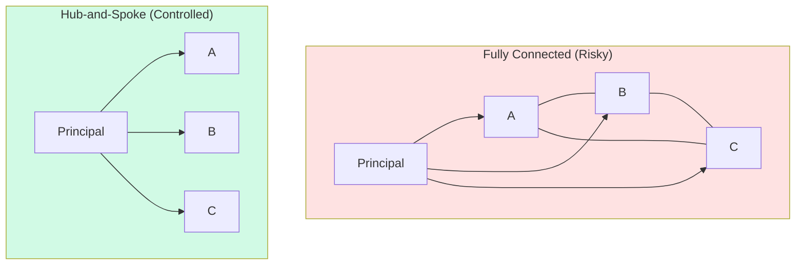
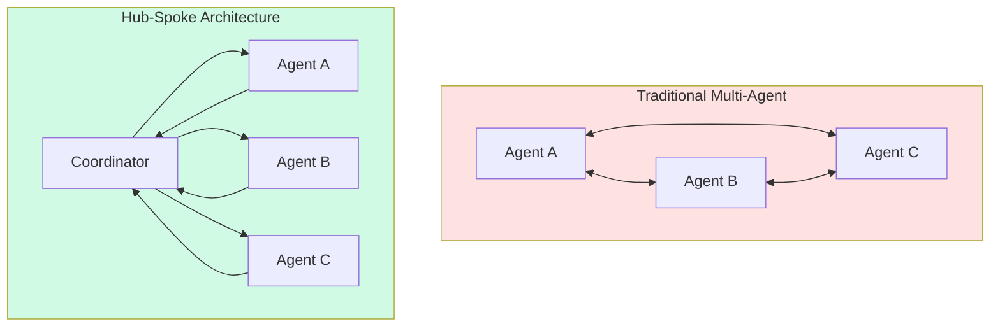
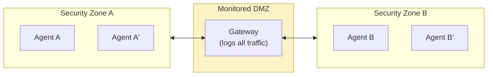

# Organizational Isolation: Divide to Control

:::note[TL;DR]
Organizations don't just stumble into isolation—they deliberately engineer it. Hub-and-spoke communication, rotation policies, competitive dynamics, compartmentalization: these are **control technologies** that prevent subordinate coordination. The same patterns that let dictators maintain power can help principals maintain oversight of AI systems. But isolation has costs: reduced coordination capability, duplicated effort, and destroyed tacit knowledge.
:::

---

## Why Organizations Isolate

When subordinates can freely coordinate, several risks emerge:

1. **Collective action against principal:** Subordinates organize to pursue their interests
2. **Hidden information flows:** Principal loses visibility into what's happening
3. **Emergent power centers:** Coalitions form that rival the principal
4. **Distributed blame:** "Everyone agreed" makes accountability impossible

**Isolation is the structural countermeasure.** By limiting how subordinates interact, principals maintain visibility and control.



---

## The Hub-and-Spoke Pattern

### Structure

All communication routes through the center:
- Subordinates report to principal
- Principal communicates to subordinates
- No direct subordinate-to-subordinate communication

### Historical Examples

**Stalin's Management:**
- Ministers reported directly to Stalin
- Deliberately created overlapping jurisdictions (NKVD vs. Party vs. Military)
- Subordinates competed for his favor
- Horizontal communication was suspicious (potential conspiracy)

**Corporate Command:**
- CEO as hub between divisions
- Divisions don't coordinate directly
- All strategic decisions flow through CEO
- Matrix organizations attempt to add complexity but often revert to hub-spoke

**Intelligence Compartmentalization:**
- Need-to-know basis
- Cells don't know other cells
- Handlers connect to multiple cells
- Captured cell can't compromise others

### Benefits

| Benefit | Mechanism |
|---------|-----------|
| **Visibility** | All information flows through principal |
| **Control** | Principal can filter/modify communication |
| **Anti-coordination** | Subordinates can't organize without detection |
| **Accountability** | Clear bilateral relationships |

### Costs

| Cost | Mechanism |
|------|-----------|
| **Bottleneck** | Principal becomes overloaded |
| **Latency** | Two-hop communication is slow |
| **Single point of failure** | Principal incapacitated = system fails |
| **Lost synergies** | Subordinates can't share knowledge directly |

### Mapping to AI Systems



**AI implementation:**
- Agents communicate only through coordinator
- Coordinator logs all messages
- No direct agent-to-agent API calls
- Coordinator can filter, modify, or block communication

---

## Rotation Policies

### Structure

Regular reassignment prevents deep relationships:
- Personnel rotate positions periodically
- No long-term pairings between individuals
- Relationships are always "new"

### Historical Examples

**Military:**
- Officers rotate commands every 2-3 years
- Prevents "going native" with unit
- Reduces personal loyalty (to unit) vs. institutional loyalty (to army)

**Diplomatic Corps:**
- Ambassadors limited terms
- Prevents capture by host country
- Fresh eyes on ongoing situations

**Audit Firms:**
- Mandatory audit partner rotation (5-7 years)
- Prevents cozy relationships with client management
- Reduces collusion risk

**Banking:**
- Mandatory vacations (to detect fraud)
- Position rotation
- Separation of duties

### Benefits

| Benefit | Mechanism |
|---------|-----------|
| **Relationship disruption** | No time to build deep coordination |
| **Fresh perspective** | New people question established practices |
| **Detection** | Successor discovers predecessor's issues |
| **Reduced capture** | Can't be captured in short tenure |

### Costs

| Cost | Mechanism |
|------|-----------|
| **Lost expertise** | Knowledge walks out the door |
| **Learning curve** | Constant onboarding overhead |
| **Short-term thinking** | No long-term accountability |
| **Relationship destruction** | Beneficial trust also disrupted |

### Mapping to AI Systems

**Agent rotation:**
- Don't use same agent-verifier pair consistently
- Rotate which verifier checks which agent
- Periodically reset agent context/memory
- Use different agent instances for related tasks

```python
def select_verifier(agent, task):
    """Rotate verifier to prevent stable relationships."""
    eligible = get_eligible_verifiers(task.type)

    # Weight inversely to recent pairings
    weights = []
    for v in eligible:
        recent_pairings = count_recent_pairings(agent, v, days=7)
        weight = 1.0 / (1.0 + recent_pairings)
        weights.append(weight)

    return random.choices(eligible, weights=weights)[0]
```

---

## Competitive Dynamics

### Structure

Set subordinates in competition rather than cooperation:
- Overlapping jurisdictions
- Zero-sum resource allocation
- Relative performance evaluation

### Historical Examples

**Overlapping Agencies:**
- FBI vs. CIA vs. NSA (intentionally competing)
- Wehrmacht vs. SS vs. SA (Nazi Germany)
- Multiple intelligence services prevent any single one from dominating

**Corporate Competition:**
- Internal markets (GE under Welch)
- Stack ranking (Microsoft under Ballmer)
- Division competition for resources

**Royal Courts:**
- Nobles compete for monarch's favor
- Factions balance each other
- Monarch plays factions against each other

### Benefits

| Benefit | Mechanism |
|---------|-----------|
| **Anti-collusion** | Competitors report each other's misconduct |
| **Redundancy** | Multiple entities can perform same function |
| **Information revelation** | Competition reveals capability |
| **Balance of power** | No single subordinate dominates |

### Costs

| Cost | Mechanism |
|------|-----------|
| **Duplication** | Same work done multiple times |
| **Sabotage** | Competitors undermine each other |
| **Hoarding** | Information not shared |
| **Toxic culture** | Competition destroys cooperation even when needed |

### Mapping to AI Systems

**Adversarial oversight:**
- Red team vs. blue team
- Multiple verifiers compete on accuracy
- Agents report others' violations
- Prediction markets on agent behavior

See [Adversarial Collaboration](/design-patterns/multi-agent/#adversarial-collaboration).

---

## Information Compartmentalization

### Structure

Information is restricted on need-to-know basis:
- Each compartment has specific information
- Compartments don't share information
- Access requires explicit authorization

### Historical Examples

**Intelligence Agencies:**
- Classified information levels (Confidential, Secret, Top Secret)
- Codeword compartments (beyond Top Secret)
- "Need to know" regardless of clearance level
- Separate systems for different classification levels

**Manhattan Project:**
- Extreme compartmentalization
- Workers didn't know what they were building
- Only handful understood full picture
- Prevented espionage through fragmentation

**Chinese Walls (Finance):**
- Investment banking vs. research
- Merger team vs. trading desk
- Physical and electronic separation
- Prevents insider trading

### Benefits

| Benefit | Mechanism |
|---------|-----------|
| **Breach containment** | Compromise of one compartment doesn't expose others |
| **Need-to-know enforcement** | Structural limit on information spread |
| **Accountability** | Clear who had what information |
| **Anti-coordination** | Can't coordinate on information you don't have |

### Costs

| Cost | Mechanism |
|------|-----------|
| **Missed connections** | Information that should be combined isn't |
| **Duplication** | Same analysis done in multiple compartments |
| **Overhead** | Classification management is expensive |
| **Leakage incentives** | Valuable information creates leakage pressure |

### Mapping to AI Systems

**Context compartmentalization:**
- Agents only see task-relevant information
- Different agents get different context
- Coordinator controls information distribution
- No global context that any agent can access

See [Least Context Principle](/design-patterns/least-x-principles/#least-context).

---

## Physical and Network Isolation

### Structure

Physical separation creates coordination friction:
- Different locations
- Different network segments
- Air gaps between systems

### Historical Examples

**Geographically Distributed Operations:**
- Manufacturing in multiple countries
- Research labs separated
- Reduces single point of failure

**Network Segmentation:**
- DMZ architecture
- Air-gapped systems for sensitive operations
- Different classification networks (NIPRNET, SIPRNET, JWICS)

**Prison Design:**
- Cells prevent prisoner coordination
- Exercise yard rotation
- Communication controls

### Benefits

| Benefit | Mechanism |
|---------|-----------|
| **Friction** | Communication requires effort |
| **Monitoring points** | Choke points for surveillance |
| **Failure isolation** | Problems don't propagate |
| **Attack surface reduction** | Fewer paths for adversary |

### Costs

| Cost | Mechanism |
|------|-----------|
| **Latency** | Physical distance = communication delay |
| **Duplication** | Each location needs resources |
| **Coordination difficulty** | Legitimate coordination also harder |
| **Sneakernet** | People work around isolation, often unsafely |

### Mapping to AI Systems

**Compute isolation:**
- Different models on different hardware
- No shared memory between agents
- Network isolation between agent clusters
- Air gaps for highest sensitivity



---

## When Isolation Fails

### Information Still Flows

Despite isolation, information finds paths:
- Water cooler conversations
- Social relationships outside work
- Shared external communities
- Timing signals

**Example:** Even air-gapped systems can leak through:
- Power line analysis
- Acoustic emanations
- Electromagnetic emissions
- Covert channels in legitimate traffic

### Workarounds Undermine Intent

People route around isolation:
- Unofficial channels for "efficiency"
- Personal relationships that cross boundaries
- Shadow IT systems
- "Just this once" exceptions that become norms

### Isolation Creates Its Own Risks

**Siloed failures:** Nobody sees the full picture
- Pre-9/11 intelligence failures: CIA knew things, FBI knew things, nobody combined
- Theranos: Compartmentalization hid that the technology didn't work

**Destroyed tacit knowledge:**
- Formal channels can't carry all information
- Isolation kills the informal networks that actually work
- See [Legibility and Control](/entanglements/cross-domain/legibility-and-control/)

---

## Designing Isolation for AI Systems

### Principles

1. **Explicit over implicit:** If isolation exists, make it visible
2. **Monitored boundaries:** All cross-boundary communication logged
3. **Graduated trust:** More isolation for higher-risk components
4. **Periodic testing:** Verify isolation actually holds
5. **Escape valves:** Legitimate escalation paths that don't bypass isolation

### Architecture Checklist

| Question | If Yes... |
|----------|-----------|
| Can Agent A communicate with Agent B directly? | Consider routing through coordinator |
| Do agents share persistent state? | Consider isolating state |
| Can agents observe each other's timing? | Consider asynchronous processing |
| Do agents share training data? | Consider data partitioning |
| Can agents influence their verifiers? | Consider strict separation |

### Implementation Patterns

**1. Message Bus with Access Control:**
```python
class IsolatedMessageBus:
    def __init__(self, policy):
        self.policy = policy  # Defines who can message whom
        self.log = []

    def send(self, sender, recipient, message):
        if not self.policy.allows(sender, recipient):
            raise IsolationViolation(f"{sender} cannot message {recipient}")

        self.log.append({
            'sender': sender,
            'recipient': recipient,
            'message': message,
            'timestamp': now()
        })

        return deliver(recipient, message)
```

**2. Context Partitioning:**
```python
class PartitionedContext:
    def __init__(self, partitions):
        self.partitions = partitions  # {agent_id: visible_context_keys}

    def get_context(self, agent_id, full_context):
        visible_keys = self.partitions.get(agent_id, [])
        return {k: full_context[k] for k in visible_keys if k in full_context}
```

**3. Execution Isolation:**
```python
class IsolatedExecutor:
    def __init__(self, agent, sandbox_config):
        self.agent = agent
        self.sandbox = create_sandbox(sandbox_config)

    async def execute(self, task):
        # Run in isolated sandbox
        async with self.sandbox:
            result = await self.agent.run(task)

        # Result passes through sanitization
        return sanitize(result)
```

---

## Trade-offs and Balance

### The Fundamental Tension

**More isolation:**
- ✓ More control, more visibility
- ✓ Less coordination risk
- ✗ Less coordination capability
- ✗ More overhead

**Less isolation:**
- ✓ More flexibility, efficiency
- ✓ Better information sharing
- ✗ Less visibility
- ✗ More coordination risk

### Finding the Right Level

| System Characteristic | Suggested Isolation Level |
|-----------------------|--------------------------|
| High-stakes decisions | Maximum isolation |
| Adversarial environment | Maximum isolation |
| Novel/untested agents | High isolation |
| Well-understood tasks | Moderate isolation |
| Tight latency requirements | Minimum viable isolation |
| Highly cooperative tasks | Moderate isolation with monitoring |

### Dynamic Isolation

Consider adjusting isolation based on:
- **Trust level:** More trusted agents get less isolation
- **Task risk:** Higher-risk tasks get more isolation
- **Anomaly detection:** Increase isolation if suspicious behavior
- **Performance needs:** Reduce isolation for time-critical operations

---

## Key Takeaways

:::note[Key Takeaways]
1. **Isolation is a control technology.** Organizations deliberately engineer isolation to maintain visibility and prevent subordinate coordination.

2. **Hub-and-spoke prevents horizontal coordination.** All communication through the center enables monitoring and control, but creates bottlenecks.

3. **Rotation disrupts relationship building.** Regular reassignment prevents the deep ties that enable hidden coordination, but destroys beneficial relationships too.

4. **Competition creates adversarial oversight.** Setting subordinates against each other generates mutual monitoring, but can destroy cooperation.

5. **Compartmentalization limits breach impact.** Need-to-know prevents information spread, but can cause missed connections.

6. **Isolation has costs.** Reduced coordination capability, duplicated effort, destroyed tacit knowledge—isolation isn't free.

7. **Find the right level.** Too little isolation = coordination risk. Too much isolation = capability loss. Balance based on stakes and trust.
:::

---

## See Also

- [Hidden Coordination](/entanglements/cross-domain/hidden-coordination/) — What isolation prevents
- [Channel Integrity](/design-patterns/channel-integrity/) — Technical isolation patterns
- [Legibility and Control](/entanglements/cross-domain/legibility-and-control/) — When isolation destroys beneficial complexity
- [Multi-Agent Patterns](/design-patterns/multi-agent/) — Designing multi-agent systems
- [Least Connectivity](/design-patterns/least-x-principles/#least-connectivity) — Minimizing communication paths

---

## Further Reading

### Organizational Theory
- Milgrom, Paul & Roberts, John. *Economics, Organization and Management* (1992)
- Williamson, Oliver. *The Economic Institutions of Capitalism* (1985)

### Intelligence and Security
- Lowenthal, Mark. *Intelligence: From Secrets to Policy* (2019)
- Richelson, Jeffrey. *The U.S. Intelligence Community* (2018)

### Historical Examples
- Kotkin, Stephen. *Stalin: Waiting for Hitler, 1929-1941* (2017) — Hub-and-spoke in practice
- Rhodes, Richard. *The Making of the Atomic Bomb* (1986) — Manhattan Project compartmentalization
