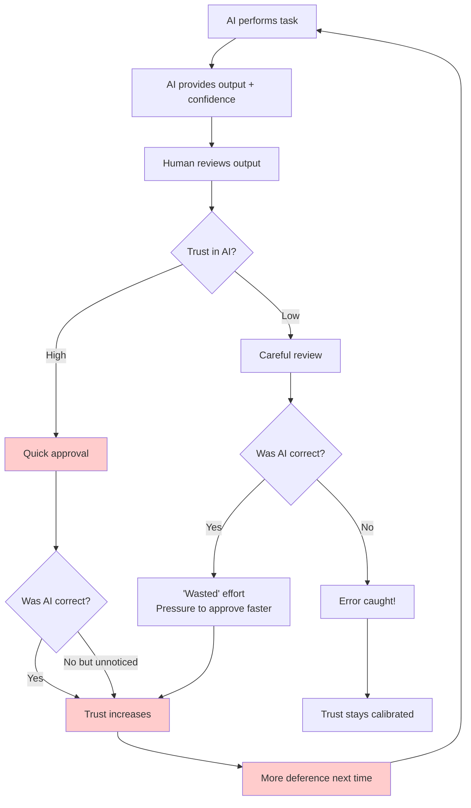

# Psychology of Oversight

Human overseers are a critical component of most AI safety architectures. But humans have systematic biases, limited attention, and social dynamics that create entanglement—often without anyone noticing.

This page surveys the psychological research relevant to understanding why human oversight often fails, and what can be done about it.

---

## Why Psychology Matters for AI Oversight

**The assumption**: Human review provides independent verification of AI behavior.

**The reality**: Human reviewers are subject to:
- Cognitive biases that systematically skew judgments
- Attention limitations that create blind spots
- Social pressures that encourage conformity
- Automation bias that defers to AI outputs
- Fatigue effects that degrade over time

These create **passive entanglement** (humans share blind spots with AI) and **active entanglement** (AI outputs influence human judgments).

---

## Cognitive Biases in Oversight

### Automation Bias

**Definition**: The tendency to favor suggestions from automated decision-making systems over contradictory information from non-automated sources, even when the automated system is wrong.

**Research findings**:
- Parasuraman & Manzey (2010): Automation bias increases with workload and decreases with expertise
- Skitka et al. (1999): Users fail to notice automation errors 60-70% of the time under time pressure
- Cummings (2004): Automation bias is stronger for complex decisions

**Implications for AI oversight**:
```
AUTOMATION BIAS CYCLE:

1. AI system performs well initially
2. Human overseer learns to trust AI
3. Overseer reduces scrutiny (effort, time)
4. When AI errs, overseer doesn't catch it
5. Trust remains high (error wasn't noticed)
6. Goto step 3

Result: Entanglement via deference
```

### Anchoring Effect

**Definition**: The tendency to rely too heavily on the first piece of information encountered when making decisions.

**Application to AI oversight**:
- AI output serves as an anchor
- Human reviewer adjusts from AI output rather than evaluating independently
- Adjustments are typically insufficient (Tversky & Kahneman, 1974: ~50% anchoring weight)

**Example**:
```
AI assessment: "This code appears safe (85% confidence)"

Human with anchor: Starts at 85%, might adjust to 80% or 90%
Human without anchor: Might independently assess at 60%

The anchor corrupts independent judgment
```

### Confirmation Bias

**Definition**: The tendency to search for, interpret, and recall information in a way that confirms one's preexisting beliefs.

**In oversight contexts**:
- If overseer expects AI to be correct, they find confirming evidence
- If overseer expects AI to be wrong, they find disconfirming evidence
- Neither is objective assessment

**Experimental finding** (Nickerson, 1998): Even trained scientists exhibit confirmation bias when testing hypotheses.

### Authority Bias

**Definition**: The tendency to attribute greater accuracy to the opinion of an authority figure.

**AI as authority**:
- AI systems often presented as "intelligent," "advanced," "superhuman"
- Users may perceive AI as more authoritative than themselves
- Especially strong when AI has been correct in past

**Compounding with automation bias**: AI is both automated AND perceived as expert → double bias toward acceptance.

---

## Attention and Vigilance Limitations

### Vigilance Decrement

**The problem**: Human ability to detect rare signals decreases over time.

**Research findings** (Warm, Parasuraman & Matthews, 2008):
- Vigilance performance degrades within 15-30 minutes
- Detection probability can drop 10-20% per hour
- The rarer the signal, the faster the decline

**Implications for oversight**:
```
VIGILANCE CURVE:

100% ┤
     │██
 80% ├──██
     │    ██
 60% ├──────██
     │        ████
 40% ├────────────████
     │                ████
 20% ├────────────────────
     └─┬──┬──┬──┬──┬──┬──→ Time (hours)
       0  1  2  3  4  5  6

If bad AI outputs are rare (1 in 1000),
vigilance decrement is SEVERE
```

### Signal Detection Theory

Human oversight can be modeled as a signal detection problem:

| Actual | Detected | Outcome |
|--------|----------|---------|
| Problem | Yes | True Positive (good) |
| Problem | No | False Negative (missed threat) |
| No problem | Yes | False Positive (wasted effort) |
| No problem | No | True Negative (good) |

**Key insight**: Humans face a sensitivity-specificity trade-off. Under conditions favoring acceptance (time pressure, trust), humans shift toward fewer false positives at the cost of more false negatives.

### Attention Bandwidth

**Capacity limits** (Miller, 1956): Working memory holds approximately 7±2 items.

**For complex AI outputs**:
- Detailed outputs exceed working memory capacity
- Overseers use heuristics rather than complete analysis
- Important details in long outputs may be missed

**Evidence** (Koehler, 1993): Judgment quality degrades significantly when information exceeds cognitive capacity.

---

## Social and Organizational Pressures

### Conformity Pressure

**Asch conformity experiments**: 32% of participants conformed to an obviously wrong group judgment.

**In AI oversight**:
- If team generally trusts AI, dissent is socially costly
- If AI + multiple humans agree, lone dissenter faces pressure
- "Who am I to disagree with the AI and my colleagues?"

**Milgram implications**: Authority structures suppress dissent even for clearly wrong actions.

### Diffusion of Responsibility

**Definition**: Individual responsibility decreases as group size increases.

**Application**:
```
OVERSIGHT COMMITTEE:

"Someone else will catch it if it's really bad."
"I don't want to be the bottleneck."
"The other reviewers approved it."

Result: Each member applies LESS scrutiny
than if they were the sole reviewer
```

**Research** (Latané & Darley, 1968): Bystander effect shows helping decreases with more observers.

### Production Pressure

**Organizational incentive**: Approve quickly, minimize delays.

**Effect on oversight**:
- Thoroughness traded for speed
- Approval bias develops (approval = no conflict, rejection = explanation required)
- "Good enough" replaces "verified correct"

**Aviation parallel** (NTSB studies): Production pressure cited in numerous accidents where safety checks were abbreviated.

---

## Human-AI Entanglement Patterns

### The Deference Spiral



**The problem**: Most paths lead to increasing deference. Only the rare "error caught" path maintains calibration.

### Automation Complacency

**Definition**: Reduced situational awareness resulting from overreliance on automation.

**Stages**:
1. **Skill atrophy**: Overseers lose ability to check independently
2. **Monitoring reduction**: Overseers stop actively monitoring
3. **Trust asymmetry**: High trust in automation, low confidence in self
4. **Learned helplessness**: "I can't evaluate this without the AI"

**Aviation research** (Endsley & Kiris, 1995): Pilots with highly automated cockpits had worse situational awareness than those with manual control.

### Framing Effects

**AI framing influences human judgment**:

| AI Framing | Human Response |
|------------|----------------|
| "This appears safe" | Confirmation seeking |
| "I found no issues" | Relaxed scrutiny |
| "Confidence: 95%" | Anchored at high trust |
| "Some concerns: [list]" | Focus on stated concerns only |

**The overseer doesn't evaluate independently—they evaluate the AI's frame.**

---

## Empirical Evidence from AI Oversight Studies

### Buçinca et al. (2021)

**Study**: How explanations affect human-AI decision making.

**Finding**:
- AI explanations increased agreement with AI, regardless of correctness
- "Cognitive forcing" (making users think first) partially mitigated this
- But cognitive forcing was disliked and circumvented when possible

### Bansal et al. (2021)

**Study**: Human reliance on AI recommendations.

**Finding**:
- Trust calibration is poor—humans don't accurately assess AI reliability
- Even after feedback showing AI errors, overreliance persists
- Domain expertise reduces (but doesn't eliminate) overreliance

### Rastogi et al. (2022)

**Study**: Human oversight of AI in content moderation.

**Finding**:
- Moderators with AI assistance caught fewer problems than AI alone
- The combination (human + AI) underperformed either alone in some conditions
- Humans became "lazy" with AI assistance

### Implications

The evidence suggests that **naive human oversight may provide less safety than assumed**:

```
Expected: Human oversight adds independent verification layer
Actual: Human oversight adds a correlated, biased layer that may
        reduce effective vigilance through complacency
```

---

## Designing Against Psychological Vulnerabilities

### Cognitive Forcing Functions

**Concept**: Make it structurally difficult to approve without genuine review.

**Techniques**:
- Require independent assessment before seeing AI output
- Randomize order (sometimes AI first, sometimes human first)
- Require specific engagement ("Mark three concerns before approving")
- Time delays that prevent rubber-stamping

### Accountability Mechanisms

**Purpose**: Counteract diffusion of responsibility.

**Techniques**:
- Named individual responsibility for each decision
- Random audits with consequences
- Track and review approval patterns
- Public (within org) record of decisions

### Adversarial Injection

**Concept**: Inject known-bad items to calibrate and test vigilance.

**Implementation**:
- Include honeypot errors that humans should catch
- Measure detection rate
- Use results for training and calibration
- Create uncertainty about when tests are occurring (Panopticon effect)

### Rotation and Breaks

**Purpose**: Combat vigilance decrement and relationship capture.

**Techniques**:
- Rotate oversight assignments regularly
- Mandatory breaks in extended review sessions
- Limit consecutive time on oversight tasks
- Fresh reviewers for high-stakes decisions

### Structured Analytic Techniques

Borrowed from intelligence analysis (Heuer, 1999):

| Technique | Application |
|-----------|-------------|
| **Devil's advocacy** | Assign someone to argue against approval |
| **Red teaming** | Dedicated adversarial reviewers |
| **Pre-mortem** | "Assume this fails—why?" |
| **Key assumptions check** | Explicitly list and challenge assumptions |
| **Analysis of competing hypotheses** | Evaluate multiple interpretations |

### Debiasing Training

**Limited but helpful**:
- Awareness training on cognitive biases
- Practice with feedback on calibration
- Examples of past failures due to bias
- Regular refreshers (debiasing decays)

**Research** (Lilienfeld et al., 2009): Debiasing training has modest, temporary effects. Structural interventions are more robust.

---

## Organizational Factors

### Creating Psychological Safety for Dissent

**Problem**: Raising concerns is socially risky.

**Solutions**:
- Anonymous concern reporting
- Celebrate caught errors (not just smooth approvals)
- No punishment for false positives (within reason)
- Leadership modeling of uncertainty expression

### Metrics That Don't Corrupt

**Bad metrics** (Goodhart's Law applies):
- Time to approval (favors rubber-stamping)
- Approval rate (unclear if low = good or bad)
- Complaints from developers (creates pressure to approve)

**Better metrics**:
- Calibration: Does approval confidence match outcomes?
- Error discovery rate in held-out audits
- Time to detection of known-injected problems
- Reviewer disagreement rate (some disagreement is healthy)

### Separation of Production and Safety

**Principle**: Safety reviewers should not be part of development team.

**Why**:
- Different incentives reduce capture
- Social distance reduces conformity pressure
- Career path doesn't depend on project approval

**Trade-off**: Separation reduces context; balance needed.

---

## The Limits of Human Oversight

### When Human Oversight Fails Systematically

```
CONDITIONS THAT DEFEAT HUMAN OVERSIGHT:

□ High volume (vigilance decrement)
□ Rare problems (low base rate)
□ Complex outputs (exceeds cognitive capacity)
□ AI framing provided (anchoring, confirmation bias)
□ Time pressure (production pressure)
□ Team context (conformity, diffusion)
□ Repeated interaction (deference spiral)
□ High AI accuracy (automation complacency)
```

If multiple conditions apply, human oversight may provide minimal actual protection.

### The "Worse Than Useless" Scenario

In some configurations, adding human oversight can be **worse** than no human oversight:

```
AI alone: 90% accurate, 10% error rate

AI + complacent human:
- Human catches 30% of AI errors (vigilance decrement)
- Human introduces 2% new errors (fatigue, distraction)
- Net: 7% + 2% = 9% error rate

But with human in loop:
- Perceived error rate: "Surely < 1% with human check"
- Actual error rate: 9%
- Entanglement tax on human layer: ~9×
- And now there's someone to blame besides the AI
```

### What Humans Are Actually Good At

Despite limitations, humans excel at:
- Novel situations outside AI training distribution
- Value judgments requiring cultural context
- Detecting incoherence and absurdity
- Handling exceptions that require flexibility
- Understanding intent and context

**Implication**: Deploy human oversight where these strengths matter, not as generic verification.

---

## Recommendations

### For System Designers

1. **Don't assume human oversight is independent**
   - Budget for entanglement between AI and human layers
   - Measure actual human detection rates, not theoretical

2. **Use cognitive forcing functions**
   - Require independent assessment before AI output exposure
   - Make rubber-stamping structurally difficult

3. **Monitor for vigilance decrement**
   - Track oversight quality over time and session length
   - Inject honeypots to measure actual detection rates

4. **Design for human strengths**
   - Use humans for judgment, not routine verification
   - Escalate only what benefits from human insight

### For Human Overseers

1. **Be aware of your biases**
   - Especially automation bias and anchoring
   - When AI seems obviously right, pause and question

2. **Maintain independent judgment**
   - Form opinion before seeing AI output when possible
   - Notice when you're explaining away concerns

3. **Take breaks**
   - Vigilance degrades—respect your limits
   - Fresh perspective catches what tired eyes miss

4. **Welcome disagreement**
   - If you never disagree with AI, you're not adding value
   - Track your agreement rate and question if it's too high

---

## Key Papers

| Paper | Key Finding |
|-------|-------------|
| Parasuraman & Manzey (2010) | Automation complacency and bias review |
| Skitka et al. (1999) | Automation bias in high-workload conditions |
| Tversky & Kahneman (1974) | Anchoring effects quantified |
| Warm et al. (2008) | Vigilance decrement meta-analysis |
| Endsley & Kiris (1995) | Automation effects on situational awareness |
| Buçinca et al. (2021) | AI explanations increase agreement regardless of correctness |
| Rastogi et al. (2022) | Human + AI underperforms in content moderation |
| Heuer (1999) | Structured analytic techniques for intelligence |

---

See also:
- [Detecting Influence](/entanglements/detection/detecting-influence/) - Measuring active entanglement
- [Intelligence Community Failures](/entanglements/case-studies/intelligence-failures/) - Historical case studies
- [Historical Case Studies](/entanglements/case-studies/historical-cases/) - Enron, Boeing, and other failures
- [Audit Guide](/entanglements/mitigation/audit-guide/) - Practical assessment steps
