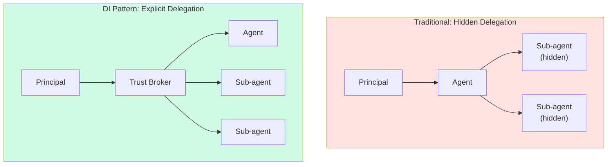
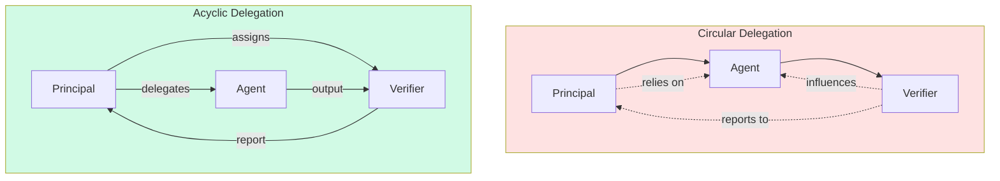
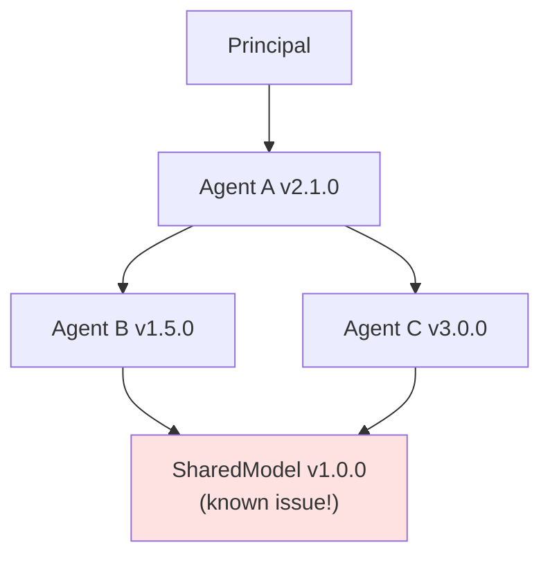
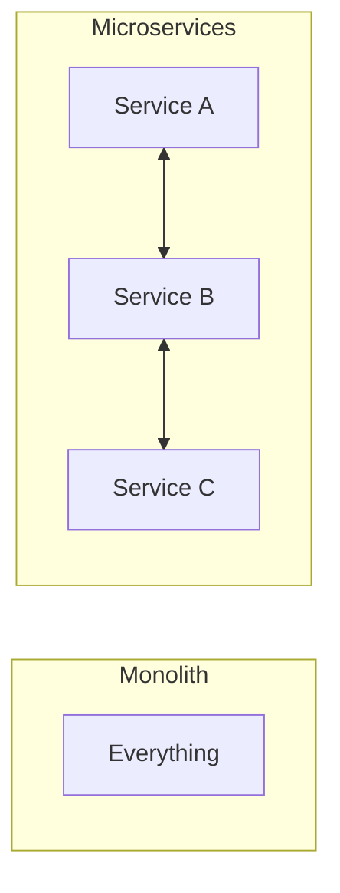

# Software Dependency Patterns

:::note[TL;DR]
Software engineering has spent 50 years learning to manage dependencies. The hard-won lessons—dependency injection, interface segregation, acyclic dependencies, loose coupling—map directly to delegation architecture. The DI container is a trust broker. An interface is an explicit entanglement contract. A circular dependency is a circular entanglement. We should learn from these patterns.
:::

---

## Why Software Engineering Matters Here

Software systems face the same fundamental challenge as delegation architectures: **managing relationships between components at scale**.

The problems are isomorphic:

| Software Problem | Delegation Problem |
|------------------|-------------------|
| Component A depends on B | Agent A trusts Agent B |
| Hidden coupling | Hidden entanglement |
| Circular dependencies | Circular trust relationships |
| Dependency hell | Cascading delegation risk |
| Brittle monoliths | Monolithic agents |
| Tight coupling | Excessive entanglement |

Software engineers learned that you can't eliminate dependencies, but you can make them **explicit, unidirectional, and substitutable**. The same principles apply to trust relationships.

---

## The Dependency Injection Pattern

### The Problem: Hidden Dependencies

Consider code where a component creates its own dependencies:

```python
# BAD: Hidden dependency
class OrderProcessor:
    def __init__(self):
        self.database = MySQLDatabase()  # Hidden!
        self.payment = StripePayment()    # Hidden!
        self.email = SendGridEmail()      # Hidden!

    def process(self, order):
        self.database.save(order)
        self.payment.charge(order.total)
        self.email.notify(order.customer)
```

**Problems:**
- You can't see the dependencies without reading the code
- You can't substitute dependencies (testing, different providers)
- The component is tightly coupled to specific implementations
- Changes to dependencies require changing this component

### The Solution: Dependency Injection

Dependencies are provided ("injected") from outside:

```python
# GOOD: Explicit dependencies
class OrderProcessor:
    def __init__(self, database, payment, email):
        self.database = database
        self.payment = payment
        self.email = email

    def process(self, order):
        self.database.save(order)
        self.payment.charge(order.total)
        self.email.notify(order.customer)

# Dependencies are explicit and substitutable
processor = OrderProcessor(
    database=PostgresDatabase(),
    payment=StripePayment(),
    email=SendGridEmail()
)
```

**Benefits:**
- Dependencies are visible in the interface
- Easy to substitute (test doubles, alternative implementations)
- Component doesn't need to know about dependency construction
- Changes to dependencies are isolated

### Mapping to Delegation

| DI Concept | Delegation Equivalent |
|------------|----------------------|
| **Dependency** | Trust relationship |
| **Injection** | Explicit delegation assignment |
| **Interface** | Trust contract |
| **Substitution** | Rotating agents/verifiers |
| **DI Container** | Trust broker/coordinator |

**The DI Container as Trust Broker:**

Just as a DI container manages all dependencies and wires components together, a **trust broker** could:
- Manage all delegation relationships
- Make relationships explicit and auditable
- Enable substitution of trusted parties
- Enforce relationship constraints



---

## The Inversion of Control Principle

### The Traditional Approach

High-level modules depend on low-level modules:

```
BusinessLogic → Database → FileSystem
```

If Database changes, BusinessLogic must change. The high-level policy is coupled to low-level details.

### Inversion of Control (IoC)

Both high and low-level modules depend on abstractions:

```
BusinessLogic → IDatabaseInterface ← Database
                                    ← TestDatabase
                                    ← CacheDatabase
```

**Key insight:** The interface is owned by the high-level module. Low-level modules implement it.

### Mapping to Delegation

**Traditional delegation:**
```
Principal → Agent → Agent's chosen sub-agents
```

The principal is at the mercy of the agent's choices.

**Inverted delegation:**
```
Principal → IAgentInterface ← Agent A
                           ← Agent B
                           ← Agent C
```

The principal defines what "acting on my behalf" means. Agents conform to that contract.

**Implication:** The principal should define the trust interface, not accept whatever the agent offers.

---

## The Acyclic Dependencies Principle

### Why Cycles Are Dangerous

A circular dependency creates a **tight coupling loop**:

```
A → B → C → A  (cycle!)
```

**Problems:**
- Can't deploy A without B without C without A
- Testing any component requires all components
- Changes propagate around the loop
- Deadlocks and initialization problems

### Detection and Breaking Cycles

**Detection:** Build tools (like `deptry`, `madge`, `jdepend`) analyze the dependency graph and flag cycles.

**Breaking cycles:**

1. **Extract interface:** If A→B→A, extract common interface I that both implement
   ```
   A → I ← B
   ```

2. **Dependency inversion:** Make A depend on abstraction, not B directly

3. **Merge:** If A and B are so coupled they can't be separated, maybe they're one component

4. **Event-based decoupling:** Instead of direct call, use events/messages

### Mapping to Delegation

**Circular delegation is circular entanglement:**

```
Principal → Agent → Verifier → Principal  (who really decides?)
```

**Problems in delegation:**
- Who has authority?
- Infinite regress of verification
- Accountability becomes unclear
- Gaming becomes possible (each blames the other)

**Breaking delegation cycles:**

1. **Clear hierarchy:** Principal → Agent, Principal → Verifier (no Agent → Verifier)
2. **Asymmetric relationships:** Information flows one way
3. **Time boundaries:** Each delegation has finite scope, doesn't loop back



---

## Interface Segregation

### The Problem: Fat Interfaces

A component that depends on a large interface depends on more than it needs:

```java
// FAT INTERFACE
interface Employee {
    void calculatePay();
    void calculateTax();
    void generateReport();
    void sendNotification();
    void updateProfile();
    void processTimesheet();
    // ... 50 more methods
}
```

Every consumer depends on the whole interface, even if they only use one method.

### The Solution: Focused Interfaces

Split into small, focused interfaces:

```java
interface Payable {
    void calculatePay();
}

interface Taxable {
    void calculateTax();
}

interface Reportable {
    void generateReport();
}
```

Each consumer depends only on what it needs.

### Mapping to Delegation

**Fat delegation:** An agent with broad capabilities creates broad trust surface:

```
Agent can: read files, write files, execute code,
           access network, modify system settings, ...
```

Every task delegated to this agent grants access to all capabilities.

**Segregated delegation:** Narrow capabilities per task:

```
FileReader can: read files (read-only)
FileWriter can: write files (specified paths only)
CodeExecutor can: execute code (sandboxed)
```

Each delegation uses minimal capability set.

**This is the [Least Capability Principle](/design-patterns/least-x-principles/) expressed in software terms.**

---

## Stable Dependencies Principle

### The Principle

**Depend on things more stable than yourself.**

- Volatile components should depend on stable ones
- Stable components should not depend on volatile ones
- "Stability" = resistance to change

### Measuring Stability

**Afferent coupling (Ca):** Number of components that depend on this one
**Efferent coupling (Ce):** Number of components this one depends on

**Instability:** I = Ce / (Ca + Ce)
- I = 0: Maximally stable (many dependents, no dependencies)
- I = 1: Maximally unstable (no dependents, many dependencies)

**Principle:** Dependencies should point toward stability (lower I).

### Mapping to Delegation

**Delegation stability:** Trust relationships should point toward more stable entities.

- Delegate volatile decisions to stable principles
- Don't stake critical decisions on volatile agents
- Build stable "trust infrastructure" that many components rely on

| Component | Stability | Should Depend On |
|-----------|-----------|------------------|
| Ad-hoc task agent | Low (ephemeral) | Stable verifier, stable rules |
| Core verifier | Medium | Stable principles, human oversight |
| Human oversight | High | Constitutional constraints, laws |
| Laws/principles | Very high | Nothing (foundational) |

**Implication:** High-stakes delegations should route through stable infrastructure, not volatile agents.

---

## Package Management Lessons

### Dependency Hell

When dependencies have dependencies, problems multiply:

```
Your app
  ├── LibraryA v2.0
  │   └── SharedLib v1.5
  └── LibraryB v3.0
      └── SharedLib v2.0  ← CONFLICT!
```

**Symptoms:**
- Version conflicts
- Unexpected behavior from transitive dependencies
- "It works on my machine"
- Security vulnerabilities in deep dependencies

### Solutions from Package Management

**1. Lock files:** Pin exact versions of entire dependency tree
```
SharedLib: 1.5.3  # Exact version, not range
```

**2. Dependency trees:** Visualize full transitive dependencies
```bash
npm ls  # Shows full tree
pip-tree  # Python equivalent
```

**3. Vulnerability scanning:** Automated detection of known issues in dependencies
```bash
npm audit
snyk test
```

**4. Semantic versioning:** Signal breaking changes
- Major: Breaking changes
- Minor: New features, backward compatible
- Patch: Bug fixes only

### Mapping to Delegation

**Delegation depth problem:** When agents delegate to sub-agents:

```
Principal → Agent A → Agent B → Agent C → ???
```

How do you know what Agent C does? What if Agent C has a vulnerability?

**Solutions:**

| Package Management | Delegation Equivalent |
|-------------------|----------------------|
| Lock file | Fixed agent versions/configurations |
| Dependency tree | Full delegation graph visualization |
| Vulnerability scan | Agent audit for known issues |
| Semantic versioning | Explicit capability versioning |

**Visualization:**



**Key insight:** Just like `npm audit`, we need `delegation audit` to scan for known issues in the transitive trust graph.

---

## Circular Dependency Detection Tools

### What Exists for Software

**Static analysis:**
- `madge` (JavaScript) — Visualizes and detects cycles
- `deptry` (Python) — Finds dependency issues
- `jdepend` (Java) — Package dependency analysis
- `NDepend` (.NET) — Advanced dependency analysis

**Build-time enforcement:**
- Many build systems can fail on circular imports
- Layered architecture linters enforce direction

### What We Need for Delegation

**Delegation graph analyzers:**
- Static: What can delegate to what?
- Dynamic: What actually delegated to what?
- Cycle detection: Find circular trust relationships

**Real-time monitoring:**
- Track delegation chains as they execute
- Alert on unexpected depth or cycles
- Visualize trust flow

**Audit tools:**
- "Show me all paths from Principal to Agent X"
- "What is my transitive exposure through Agent A?"
- "Are there cycles in my verification structure?"

---

## Microservices and Bounded Contexts

### The Pattern

Instead of one monolith, decompose into independent services:



**Bounded context:** Each service owns its domain, communicates through defined APIs.

### Benefits

- **Independent deployment:** Change one without changing others
- **Failure isolation:** One crashes, others continue
- **Team autonomy:** Different teams own different services
- **Technology heterogeneity:** Different services can use different stacks

### Mapping to Delegation

**Monolithic agent:** One agent with all capabilities, all context, all authority

**Decomposed delegation:** Many specialized agents with bounded scope

| Microservice Concept | Delegation Equivalent |
|---------------------|----------------------|
| Service boundary | Capability boundary |
| API contract | Trust interface |
| Independent deployment | Independent agent updates |
| Failure isolation | Blast radius containment |
| Bounded context | Least context principle |

This is precisely the [Decomposed Coordination](/design-patterns/decomposed-coordination/) pattern.

---

## Practical Implementation

### Dependency Injection for Agents

**Pattern:** Agent receives its sub-agents from the principal, doesn't choose them itself.

```python
# Traditional: Agent chooses its helpers
class ResearchAgent:
    def __init__(self):
        self.search = GoogleSearch()  # Hidden choice
        self.summarizer = GPT4()       # Hidden choice

    def research(self, topic):
        results = self.search.query(topic)
        return self.summarizer.summarize(results)

# DI Pattern: Principal injects dependencies
class ResearchAgent:
    def __init__(self, search_provider, summarizer):
        self.search = search_provider
        self.summarizer = summarizer

    def research(self, topic):
        results = self.search.query(topic)
        return self.summarizer.summarize(results)

# Principal controls the delegation chain
agent = ResearchAgent(
    search_provider=AuditedSearch(),
    summarizer=ConstrainedSummarizer()
)
```

### Interface-First Agent Design

**Pattern:** Define trust interfaces before implementation.

```python
# Define the trust contract
class IVerifier(Protocol):
    def verify(self, action: Action) -> VerificationResult:
        """Verify whether action is safe to execute."""
        ...

# Multiple implementations possible
class HumanVerifier(IVerifier):
    def verify(self, action: Action) -> VerificationResult:
        return ask_human(action)

class RuleBasedVerifier(IVerifier):
    def verify(self, action: Action) -> VerificationResult:
        return apply_rules(action)

class MLVerifier(IVerifier):
    def verify(self, action: Action) -> VerificationResult:
        return ml_model.predict(action)
```

The interface defines what "verification" means. Implementations are substitutable.

### Acyclic Delegation Enforcement

**Pattern:** Build-time checking for circular delegation.

```python
def check_delegation_acyclic(delegation_graph):
    """Fail if delegation graph has cycles."""
    visited = set()
    stack = set()

    def visit(node):
        if node in stack:
            raise CircularDelegationError(f"Cycle detected at {node}")
        if node in visited:
            return

        stack.add(node)
        for delegate in delegation_graph.get(node, []):
            visit(delegate)
        stack.remove(node)
        visited.add(node)

    for node in delegation_graph:
        visit(node)

# Use in system initialization
delegation_graph = {
    'principal': ['agent_a', 'verifier'],
    'agent_a': ['tool_1', 'tool_2'],
    'verifier': [],  # Leaf node - no delegation
}
check_delegation_acyclic(delegation_graph)  # Passes

# This would fail:
bad_graph = {
    'principal': ['agent'],
    'agent': ['verifier'],
    'verifier': ['agent'],  # Cycle!
}
check_delegation_acyclic(bad_graph)  # Raises CircularDelegationError
```

---

## Key Takeaways

:::note[Key Takeaways]
1. **Dependency Injection → Explicit delegation.** Don't let agents choose their own sub-agents. Inject dependencies from above.

2. **Inversion of Control → Principal-defined interfaces.** The principal defines what "acting on my behalf" means. Agents conform.

3. **Acyclic Dependencies → No circular trust.** Circular delegation creates accountability loops. Detect and break cycles.

4. **Interface Segregation → Least capability.** Small, focused trust interfaces beat fat, general ones.

5. **Stable Dependencies → Stable trust infrastructure.** High-stakes delegations should route through stable, well-tested infrastructure.

6. **Package management → Delegation auditing.** Scan the transitive delegation graph for vulnerabilities, conflicts, and unexpected depth.

7. **Microservices → Decomposed coordination.** Many bounded agents beat one monolithic agent.
:::

---

## See Also

- [Decomposed Coordination](/design-patterns/decomposed-coordination/) — The architectural pattern
- [Least X Principles](/design-patterns/least-x-principles/) — Interface segregation for trust
- [Solutions](/entanglements/mitigation/solutions/) — Reducing entanglement
- [Channel Integrity](/design-patterns/channel-integrity/) — Preventing unauthorized dependencies
- [Alliance Cascades](/case-studies/human-systems/alliance-cascades/) — When hidden dependencies cause catastrophe

---

## Further Reading

### Software Architecture
- Martin, Robert C. *Clean Architecture* (2017) — SOLID principles and dependency management
- Fowler, Martin. *Patterns of Enterprise Application Architecture* (2002)
- Newman, Sam. *Building Microservices* (2021) — Decomposition patterns

### Dependency Injection
- Seemann, Mark. *Dependency Injection Principles, Practices, and Patterns* (2019)
- Gamma et al. *Design Patterns* (1994) — Original IoC patterns

### Package Management
- Cox, Russ. "Semantic Import Versioning" (Go blog, 2018)
- npm documentation on dependency resolution
