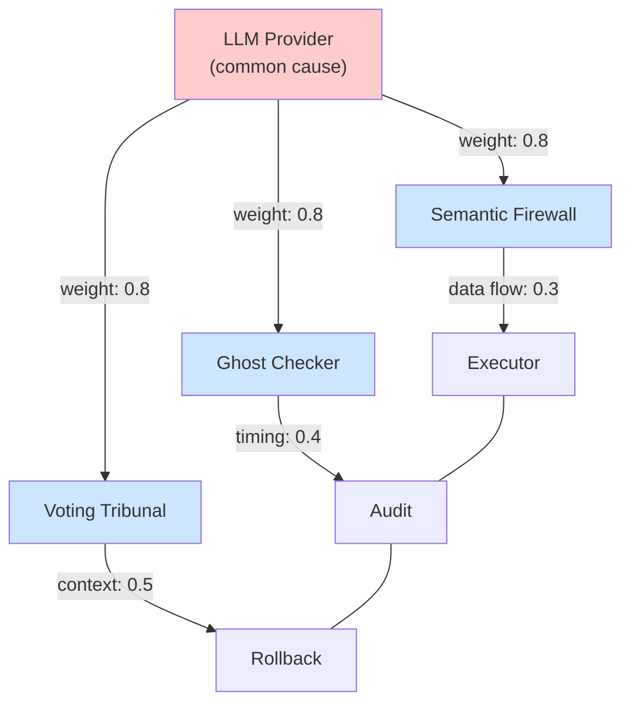
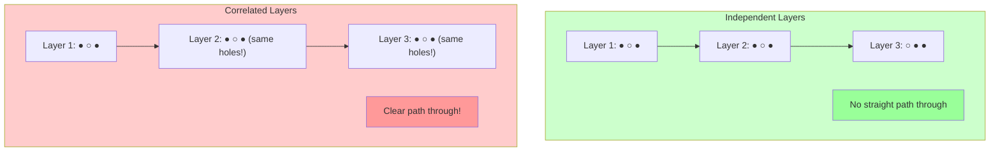
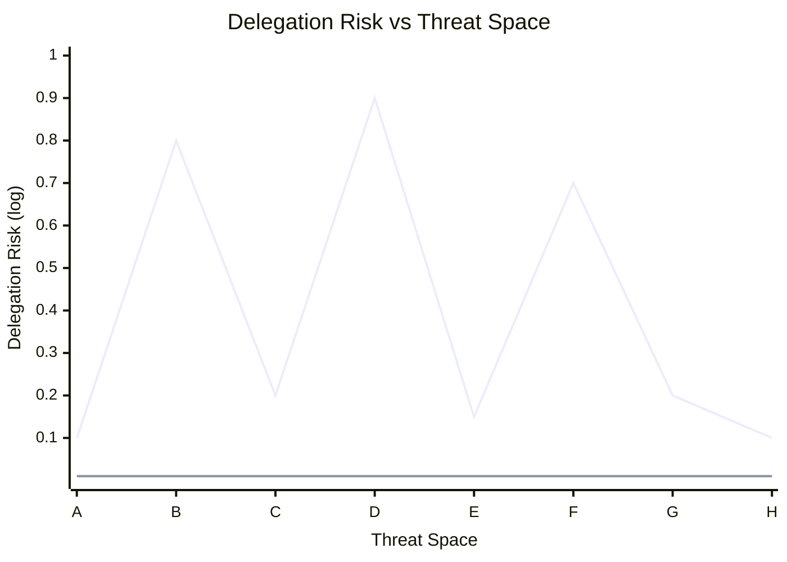

# Modeling Approaches

This page provides quantitative tools for measuring interconnection—because you can't manage what you can't measure.

---

## Delegation Risk Under Correlation

### Basic Framework

Define **Delegation Risk (DR)** as the probability that delegated actions cause unacceptable outcomes.

**Independent model**:
```
DR_independent = P(threat) × ∏(1 - effectiveness_i)
                           i

Example: P(threat)=0.1, three 90% layers
DR = 0.1 × 0.1 × 0.1 × 0.1 = 0.0001 (0.01%)
```

**Correlated model** (using correlation coefficient ρ):
```
DR_correlated = P(threat) × P(all layers fail | threat)

Where P(all fail) >> ∏(1 - effectiveness_i) when ρ > 0
```

### The Correlation Tax

**Measuring the gap**:
```
Correlation Tax = DR_correlated / DR_independent

Example: If correlation causes joint failure rate of 5% instead of 0.1%
Correlation Tax = 0.005 / 0.0001 = 50×

Your actual risk is 50× higher than independent model suggests.
```

The Correlation Tax is a single number that communicates how much worse your actual protection is compared to what you'd have with truly independent layers.

### Risk Budget Formula

When planning how many layers you need:

```
Required_layers = log(target_DR) / log(1 - layer_eff × (1 - ρ))

Where:
- target_DR = target delegation risk
- layer_eff = individual layer effectiveness
- ρ = average pairwise correlation

Example:
- Target: 0.001 (99.9% protection)
- Layer effectiveness: 0.9 (90% each)
- Correlation: 0.0 (independent)
- Required layers: 3

With correlation:
- Correlation: 0.5
- Required layers: 7 (not 3!)

With high correlation:
- Correlation: 0.8
- Required layers: 15+ (or impossible)
```

---

## Correlation Matrix Approach

### Building the Matrix

For N components, maintain an N×N **failure correlation matrix**:

```
               Firewall  Ghost   Fingerprint  Tripwire
Firewall         1.0      0.4        0.3        0.2
Ghost            0.4      1.0        0.5        0.3
Fingerprint      0.3      0.5        1.0        0.4
Tripwire         0.2      0.3        0.4        1.0
```

- **Diagonal = 1.0** (component correlated with itself)
- **Off-diagonal** = correlation in failure modes
- **Symmetric** for standard correlation (asymmetric if directional)

### Estimating Values

| Method | Accuracy | Cost | When to Use |
|--------|----------|------|-------------|
| Architecture review | Low | Low | Initial estimate |
| Historical incidents | Medium | Low | If you have incident data |
| Red team exercises | High | Medium | Regular assessment |
| Adversarial testing | High | High | Critical systems |
| Production monitoring | Highest | High | Ongoing measurement |

### Interpretation Guide

| Value | Interpretation | Action |
|-------|---------------|--------|
| 0.0-0.2 | Low correlation | Acceptable |
| 0.2-0.4 | Moderate | Monitor, consider diversifying |
| 0.4-0.6 | High | Investigate root cause |
| 0.6-0.8 | Very high | Urgent: redesign required |
| 0.8-1.0 | Near-identical | Redundancy is illusory |

### Visual Representation - Correlation Heatmap

| | Firewall | Ghost | Fingerprint | Tripwire |
|---|---|---|---|---|
| **Firewall** | 1.0 | 0.5 | 0.3 | 0.1 |
| **Ghost** | 0.5 | 1.0 | **0.5** | 0.3 |
| **Fingerprint** | 0.3 | **0.5** | 1.0 | 0.5 |
| **Tripwire** | 0.1 | 0.3 | 0.5 | 1.0 |

**Concern**: Ghost-Fingerprint correlation is high (0.5)
**Action**: Investigate shared methodology or infrastructure

A heatmap makes high-correlation pairs immediately visible.

---

## Dependency Graph with Risk Edges

### Building the Graph

Represent interconnections as a weighted directed graph:



### Edge Types

| Edge Type | Represents | Weight Meaning |
|-----------|------------|----------------|
| **Common cause** | Shared dependency | Probability both fail if cause fails |
| **Data flow** | Information passed | Probability contamination propagates |
| **Timing** | Temporal dependency | Probability timing issue cascades |
| **Context** | Shared state | Probability context corruption spreads |
| **Resource** | Shared pool | Probability contention affects both |

### Weight Interpretation

```
Edge weights represent coupling strength:
- 0.0-0.3: Weak coupling (acceptable)
- 0.3-0.6: Moderate coupling (monitor)
- 0.6-1.0: Strong coupling (redesign)
```

### Graph Metrics

| Metric | What It Measures | Use |
|--------|------------------|-----|
| **Max path weight** | Product of weights on worst path | Worst-case cascade potential |
| **Critical nodes** | Nodes with highest betweenness | Single points affecting many components |
| **Clustering coefficient** | How interconnected neighborhoods are | Identifies tightly coupled subsystems |
| **Average degree** | Connections per node | Overall coupling density |

---

## Swiss Cheese Visualization

### The Model

Each defense layer is a slice of cheese with holes (failure modes). Threats pass through when holes align.



- **Independent layers**: Different holes, no straight path through = threats blocked
- **Correlated layers**: Same holes everywhere = clear path through = threats pass all layers

(● = solid/blocks threats, ○ = hole/threat passes)

### Quantifying Hole Alignment

```
Hole Alignment Score = (threats passing all layers) / (threats passing any layer)

Independent: Score ≈ 0.001 (holes rarely align)
Correlated:  Score ≈ 0.5   (holes often align)
Maximum:     Score = 1.0   (all holes identical)
```

### How to Measure

1. Generate or collect a set of test threats
2. Run each through each layer independently
3. Count how many pass all layers vs. pass any layer
4. Higher ratio = more correlated holes

---

## Risk Surface Visualization

### The Concept

Plot Delegation Risk as a surface over the space of possible threats:



- **Gap between curves** = correlation tax
- **Peaks in correlated model** = shared blind spots

### Interpretation

- **Flat line** (independent model): Uniform protection across threat space
- **Peaks** (correlated model): Areas where all layers fail together
- **Gap size**: How much the correlation tax varies by threat type
- **Peak locations**: Identifies specific threat categories to address

### Building Risk Surfaces

1. Define axes (e.g., threat complexity × novelty)
2. Sample threats across the space
3. Measure actual failure rate at each point
4. Compare to independent model prediction
5. Visualize as contour plot or 3D surface

---

## Practical Measurement Protocol

### Step 1: Baseline Individual Components

For each component, measure:
- False negative rate (threats missed)
- False positive rate (benign flagged)
- Failure conditions (when it breaks)

### Step 2: Test for Pairwise Correlation

For each pair (A, B):
```
1. Take threats that A misses
2. What fraction does B also miss?
3. Compare to B's baseline miss rate

If B misses more than baseline → positive correlation
If B misses less than baseline → negative correlation (good!)
If B misses same as baseline → independent
```

### Step 3: Test for Higher-Order Effects

```
Test combinations:
- A + B + C together
- Under load
- With adversarial inputs

Compare to pairwise predictions. Significant deviation indicates higher-order correlation.
```

### Step 4: Calculate Correlation Tax

```
Correlation Tax = Actual_Joint_Miss_Rate / Predicted_Joint_Miss_Rate

Where:
Predicted = ∏(individual miss rates)
Actual = measured in combined testing
```

### Step 5: Monitor Over Time

Track correlation metrics continuously:
- Joint failure rate
- Correlation coefficients
- Hole alignment score
- Correlation tax

Alert on significant changes.

---

## Tools and Implementation

### Correlation Calculator (Pseudocode)

```python
def calculate_correlation_matrix(components, test_threats):
    n = len(components)
    matrix = np.eye(n)  # Diagonal = 1.0

    for i, comp_a in enumerate(components):
        for j, comp_b in enumerate(components):
            if i >= j:
                continue

            # Get failure sets
            fails_a = {t for t in test_threats if comp_a.fails(t)}
            fails_b = {t for t in test_threats if comp_b.fails(t)}

            # Calculate correlation
            both_fail = len(fails_a & fails_b)
            either_fail = len(fails_a | fails_b)

            if either_fail == 0:
                corr = 0.0
            else:
                # Conditional probability ratio
                corr = both_fail / either_fail

            matrix[i, j] = corr
            matrix[j, i] = corr

    return matrix

def calculate_correlation_tax(components, test_threats):
    # Independent model
    individual_miss_rates = [
        sum(1 for t in test_threats if c.fails(t)) / len(test_threats)
        for c in components
    ]
    predicted_joint = np.prod(individual_miss_rates)

    # Actual joint miss rate
    all_fail = sum(
        1 for t in test_threats
        if all(c.fails(t) for c in components)
    )
    actual_joint = all_fail / len(test_threats)

    if predicted_joint == 0:
        return float('inf') if actual_joint > 0 else 1.0

    return actual_joint / predicted_joint
```

### Dashboard Metrics

For ongoing monitoring, track:

| Metric | Target | Alert If |
|--------|--------|----------|
| Max pairwise correlation | < 0.3 | > 0.5 |
| Average correlation | < 0.2 | > 0.3 |
| Correlation tax | < 5× | > 10× |
| Hole alignment score | < 0.01 | > 0.1 |
| Joint failure rate | < individual² | > 10× individual² |

---

## Limitations

### What These Models Miss

1. **Conditional correlations**: Models assume constant correlation; reality is context-dependent
2. **Adversarial adaptation**: Attackers may specifically target measured blind spots
3. **Rare events**: Limited test data for extreme cases
4. **Model uncertainty**: Correlation estimates have confidence intervals
5. **Higher-order effects**: Most practical methods only capture pairwise

### When to Distrust Your Measurements

- Small test sets (< 1000 threats)
- Test distribution doesn't match production
- Components have changed since measurement
- No adversarial testing included
- Measurement during non-representative conditions

### Appropriate Conservatism

```
When in doubt:
- Assume correlation is higher than measured
- Assume measured correlation has wide confidence interval
- Use stress-test correlation, not normal-operation correlation
- Add safety margin to correlation tax estimates
```

---

See also:
- [Types of Correlation](/entanglements/fundamentals/types/) - What types of correlation exist
- [Challenge Categories](/entanglements/fundamentals/challenges/) - Sources to measure
- [Worked Examples](/entanglements/case-studies/examples/) - Applying these methods
