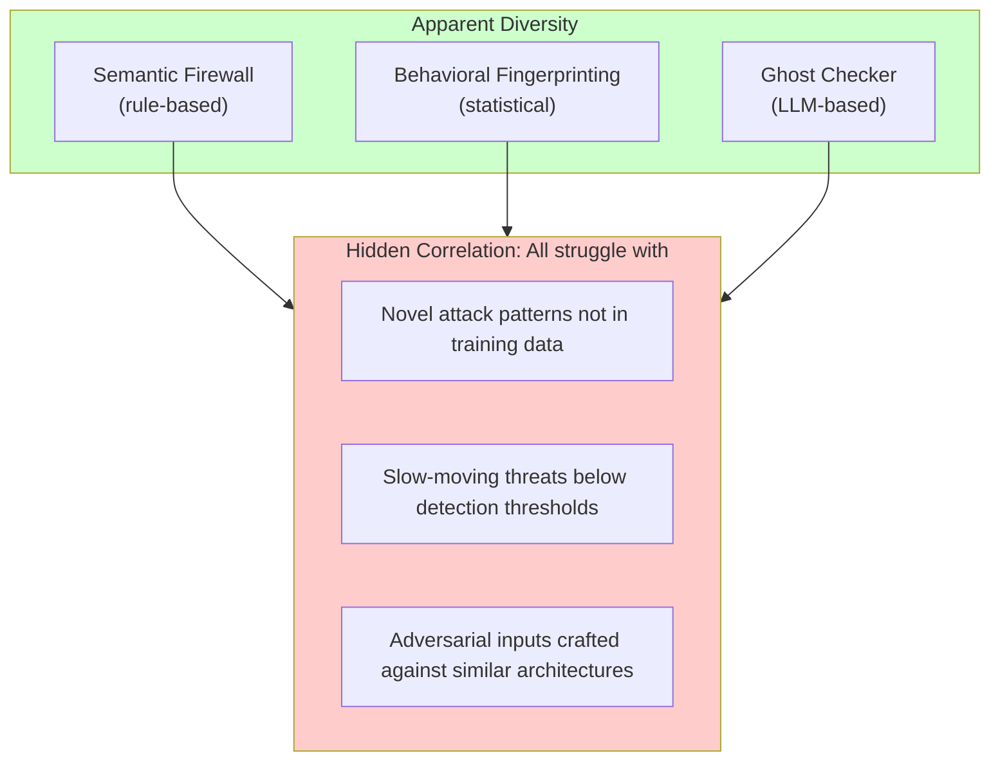
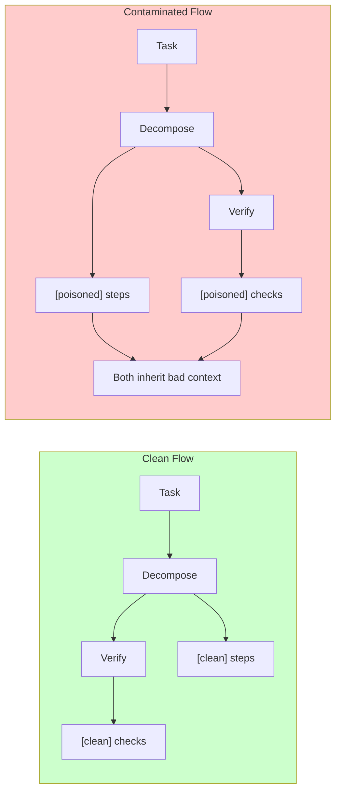
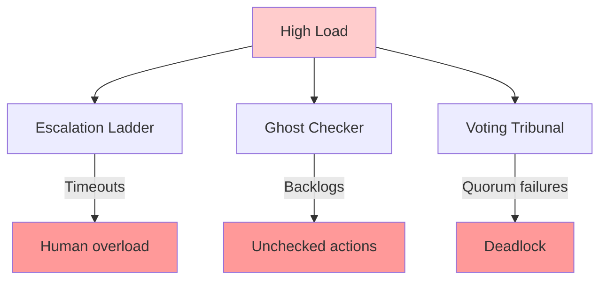
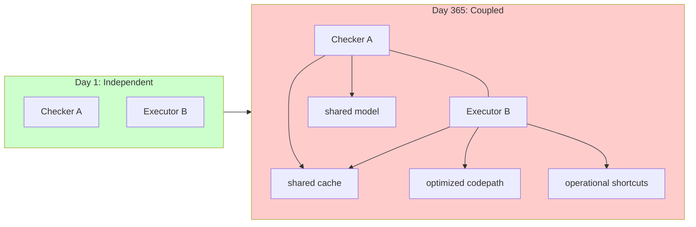
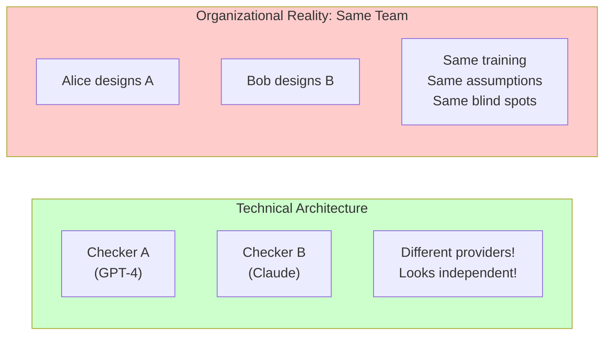
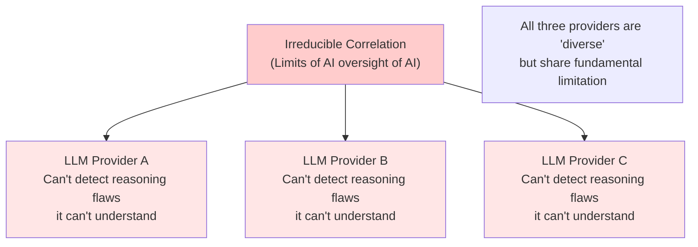

# Challenge Categories

This page catalogs nine categories of entanglement challenges. Each represents a different way that ostensibly independent components can become entangled—through passive correlation, active influence, or adversarial coordination.

**The bureaucrat perspective**: Think of each challenge as a way that "Clerk A" and "Reviewer B" in a bureaucracy might fail to be truly independent—even when the org chart shows them as separate.

---

## 1. Shared Infrastructure Dependencies

**Problem**: Multiple patterns rely on the same underlying systems.

| Shared Resource | Patterns Affected | Failure Mode |
|-----------------|-------------------|--------------|
| LLM provider | Ghost Checker, Voting Tribunal, Semantic Firewall | Provider outage or systematic bias affects all |
| Credential store | Capability Airlock, Gateway Chokepoint | Compromise grants access to all protected resources |
| Monitoring database | Behavioral Fingerprinting, Tripwire Mesh, Audit logs | DB failure blinds all detection |
| Network | All external verification | Partition isolates verification from execution |
| Rate limit pool | All API-based verification | Throttling affects all components simultaneously |
| Logging service | Audit, monitoring, alerting | Silent failure across all observability |

### Indicators
- Multiple patterns using the same API keys
- Single points of failure in infrastructure diagrams
- "It's fine, we use the same reliable provider for everything"
- Cost optimization that consolidates resources

### Mitigation
- Map all shared dependencies explicitly
- Separate credential scopes per component
- Redundant providers for critical verification
- Independent monitoring for the monitoring system

---

## 2. Correlated Detection Blind Spots

**Problem**: Verification methods that seem diverse may share conceptual blind spots.

### Why This Happens
- All methods developed from similar research traditions
- Training data overlaps significantly
- Evaluation benchmarks don't test for correlation
- "Best practices" create homogeneous approaches

### Indicators
- All detection trained on similar datasets
- Detection methods from the same research lineage
- Red team finds single inputs that evade multiple layers
- All components struggle with the same edge cases

### Mitigation
- Explicitly require methodological diversity
- Include at least one non-ML verification method
- Test with adversarial inputs designed to evade multiple layers
- Bring in external reviewers from different backgrounds

---

## 3. Information Flow Contamination

**Problem**: Later stages inherit context from earlier stages. Compromised context propagates.

### The Framing Problem
When a verifier receives context from the component being verified, the context itself may be manipulated:
- Summaries that omit problematic details
- Task descriptions that presuppose the conclusion
- Context that primes the verifier toward a particular interpretation

### Indicators
- Verification uses context from the component being verified
- "We check the output" but the checker sees manipulated framing
- Summary/compression steps between stages (lossy context transfer)
- Verifiers consistently agree with executors

### Mitigation
- Independent context construction for verification
- Verifiers receive raw inputs, not summarized contexts
- Multiple framings of the same verification question
- Explicit adversarial framing tests

---

## 4. Cascading Failure Dynamics

**Problem**: Failure in one component triggers failures in others.

### Cascade Patterns
- **Timeout propagation**: One slow component causes timeouts in components waiting for it
- **Backpressure collapse**: Queues fill up throughout the system
- **Resource exhaustion**: One component's resource usage starves others
- **Escalation flood**: Many low-level failures escalate simultaneously, overwhelming higher levels

### Indicators
- Shared resource pools (threads, connections, rate limits)
- Escalation paths that converge on the same bottleneck
- Timeout chains where one timeout causes another
- "Everything fails at once" during incidents

### Mitigation
- Bulkhead isolation between components
- Independent resource pools
- Circuit breakers that shed load early
- Staggered timeouts that don't synchronize
- Graceful degradation at each level

---

## 5. Adversarial Interconnection Exploitation

**Problem**: Sophisticated attackers deliberately target correlations.

| Attack Strategy | Target | Effect |
|-----------------|--------|--------|
| **Multi-layer evasion** | Conceptually similar detectors | Single input evades all |
| **Cascade triggering** | Shared failure modes | Small action causes system-wide impact |
| **Trust laundering** | Reputation systems that cross-reference | Build trust in one area, exploit in another |
| **Timing attacks** | Components with different latencies | Race conditions between check and action |
| **Resource exhaustion** | Shared resource pools | Starve verification to enable bad actions |

### The Attacker's Advantage
Defenders must secure all paths; attackers only need one. Correlated failures mean one bypass defeats multiple defenses.

### Indicators
- Red team can find "master key" inputs
- Security review focuses on individual components, not interactions
- Threat model doesn't include multi-component attack paths
- No testing for adversarial correlation exploitation

### Mitigation
- Red team exercises specifically targeting correlations
- Threat modeling that considers multi-component attacks
- Diversity requirements that increase attacker cost
- Assume attackers know your architecture

---

## 6. Emergent Coupling Over Time

**Problem**: Systems become more coupled through optimization and operational pressure.

### How Coupling Emerges
1. **Performance optimization**: "Let's share this cache to reduce latency"
2. **Cost reduction**: "We can use one model for both tasks"
3. **Simplification**: "Let's consolidate these into one service"
4. **Operational shortcuts**: "Skip this step, it always passes"
5. **Feature creep**: Components gradually share more state

### Indicators
- "We added a cache to speed things up"
- "They both use the same model now, it's simpler"
- Operational runbooks that skip steps "because they always pass"
- Architecture diagrams that haven't been updated in months
- New connections not going through architecture review

### Mitigation
- Regular architecture audits for coupling drift
- Performance optimization requires security review
- Track all shared resources explicitly
- "Independence debt" as a tracked metric

---

## 7. Measurement and Observability Gaps

**Problem**: You can't manage what you can't measure, and correlation is hard to measure.

| What's Easy to Measure | What's Hard to Measure |
|------------------------|------------------------|
| Individual component failure rates | Joint failure probabilities |
| Average latency | Latency correlation under load |
| Detection rate on test set | Detection correlation on novel threats |
| Point-in-time dependencies | Dependency drift over time |
| Per-component metrics | Cross-component interactions |
| Single failures | Correlated failures |

### The Observability Problem
Standard monitoring tools focus on individual components. You may have excellent visibility into each component while being blind to how they fail together.

### Indicators
- Dashboards show per-component metrics only
- No testing for correlated failures
- "We've never seen that failure mode" (survivorship bias)
- Post-mortems that analyze components in isolation
- No metrics for joint failure rates

### Mitigation
- Track joint failure rates explicitly
- Correlation metrics in dashboards
- Alerts for correlation spikes
- Regular independence audits
- Post-mortems that analyze component interactions

---

## 8. Organizational and Human Correlation

**Problem**: Technical diversity can be undermined by organizational homogeneity.

### Sources of Organizational Correlation

| Organizational Factor | How It Creates Correlation |
|----------------------|---------------------------|
| **Same team** | Shared mental models, similar design choices |
| **Same training** | Everyone learned the same "best practices" |
| **Same incentives** | Optimize for same metrics, ignore same risks |
| **Same timeline pressure** | Corners cut consistently across components |
| **Single approval chain** | One person's blind spot affects all |
| **Shared documentation** | Components built from same templates |

### Indicators
- "Our security team reviewed all the verification layers"
- All patterns designed in the same sprint
- Same architect approved all designs
- Training materials came from single source
- No external review

### Mitigation
- Different teams own different verification components
- External review by parties with different incentives
- Diverse backgrounds in design team
- Explicit red team with adversarial mindset
- Rotate responsibilities to prevent groupthink

---

## 9. Fundamental and Irreducible Correlation

**Problem**: Some correlation may be inherent to the nature of AI systems and cannot be eliminated through architectural choices.

### Sources of Irreducible Correlation

1. **Shared training paradigms**: All modern LLMs trained with similar techniques (transformer architecture, RLHF, similar data distributions). They may share fundamental blind spots.

2. **Capability ceilings**: If a task requires reasoning that no current AI can do, no amount of diverse AI systems will help—they'll all fail.

3. **Adversarial transferability**: Adversarial examples that fool one model often fool others, even with different architectures.

4. **Goodhart's law at scale**: If all systems optimize for measurable proxies, they may all fail when the proxy diverges from the true objective.

### Implications
- Architectural diversity has limits—you can't diversify your way out of fundamental capability gaps
- This argues for human oversight at critical points, not just AI oversight
- Also argues for research into verification methods that don't require the verifier to match or exceed the capability being verified (e.g., formal methods, interpretability)
- The honest response is sometimes: "We don't know how to verify this reliably—proceed with extreme caution or don't proceed"

### What To Do
- Identify capabilities that no current AI can verify reliably
- Ensure human oversight at points beyond AI verification capability
- Document irreducible correlation sources honestly
- Clearly state what the system CANNOT catch
- Invest in verification methods beyond AI-based approaches

---

## Challenge Summary

| # | Challenge | Detection Difficulty | Mitigation Cost |
|---|-----------|---------------------|-----------------|
| 1 | Shared Infrastructure | Easy (audit) | Medium |
| 2 | Blind Spots | Medium (red team) | High |
| 3 | Information Flow | Medium (trace analysis) | Medium |
| 4 | Cascading Failures | Medium (stress test) | Medium |
| 5 | Adversarial Exploitation | Hard (sophisticated attacker) | High |
| 6 | Emergent Coupling | Hard (requires regular audit) | Medium |
| 7 | Measurement Gaps | Medium (meta-monitoring) | Medium |
| 8 | Organizational | Hard (requires self-awareness) | High |
| 9 | Irreducible | Very Hard (fundamental limits) | May be impossible |

---

See also:
- [Types of Entanglement](/entanglements/fundamentals/types/) - Classifying entanglements
- [Detecting Influence](/entanglements/detection/detecting-influence/) - Methods for detecting active entanglements
- [Modeling Approaches](/entanglements/detection/modeling/) - Measuring these challenges
- [Solutions & Mitigations](/entanglements/mitigation/solutions/) - Addressing each challenge
- [Channel Integrity Patterns](/design-patterns/channel-integrity/) - Preventing boundary violations
