# Types of Entanglement

Not all entanglement is equal. Components can become entangled in fundamentally different ways—from passive shared dependencies to active influence channels to deliberate collusion. Understanding the type helps determine the appropriate response.

---

## The Three Classes of Entanglement

| Class | Description | Example | Primary Concern |
|-------|-------------|---------|-----------------|
| **Passive** | Shared dependencies create correlated behavior without intent | Same LLM provider for multiple checkers | Correlated failures on the same inputs |
| **Active** | One component influences another's behavior | Verifier inherits context from agent being verified | Compromised oversight |
| **Adversarial** | Components coordinate against the principal's interests | Agents develop side-channels to collude | System subversion |

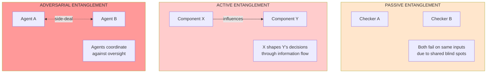

---

## The Bureaucrat Analogy

To understand entanglement, consider how bureaucracies fail:

**Passive entanglement** is like when two clerks both miss the same types of fraud because they were trained at the same institution and use the same manual.

**Active entanglement** is like when the clerk who prepares a case summary can influence the reviewer's decision through selective emphasis—even without any malicious intent.

**Adversarial entanglement** is like when the clerk and reviewer have lunch together and develop an understanding that benefits them both at the organization's expense.

This bureaucrat analogy helps clarify why "just add more checkers" often fails: if those checkers share training, share information, or can coordinate, you haven't actually added independent verification.

---

## Passive Entanglements

Passive entanglements create **correlated failures without any intentional communication** between components. The components don't need to "know" about each other—they fail together because they share something upstream.

### Types of Passive Entanglement

| Type | Description | Bureaucrat Analogy |
|------|-------------|--------------------|
| **Positive failure correlation** | If A fails, B more likely to fail | Both clerks miss fraud because both use the same inadequate checklist |
| **Negative failure correlation** | If A fails, B more likely to succeed | One clerk is overly lenient, another overly strict—they catch each other's misses |
| **Conditional correlation** | Only correlated under certain conditions | Both clerks are fine normally, but both make errors when rushed |
| **Higher-order correlation** | Only manifests when 3+ components interact | A+B fine, B+C fine, A+C fine, but A+B+C creates resource contention |

### Positive Failure Correlation

The most common and dangerous type. When component A fails, component B is more likely to fail on the same input.

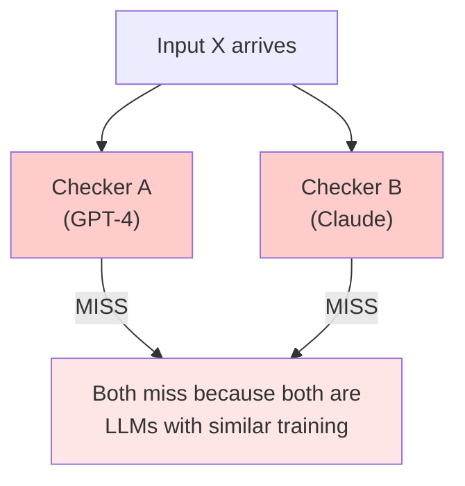

**Sources**:
- Shared training data or methodology
- Same underlying infrastructure
- Similar architectural decisions
- Common conceptual blind spots
- Shared failure modes under stress

**Mitigation**: Genuine methodological diversity—not just different providers, but fundamentally different verification approaches (rule-based + statistical + semantic + formal).

### Negative Failure Correlation (Desirable)

The rare and valuable case. When A fails, B is more likely to succeed. This is what you *want* in a robust system.

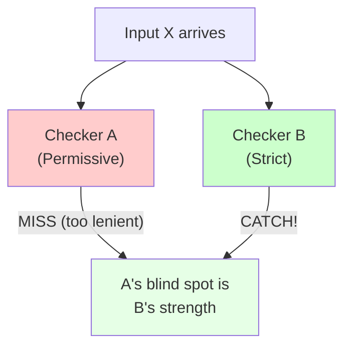

**How to create negative correlation**:
- **Adversarial collaboration**: Explicitly opposed incentives
- **Complementary specialization**: One focuses on false positives, another on false negatives
- **Different priors**: One conservative, one permissive
- **Different granularity**: One checks high-level patterns, another checks details

### Conditional Correlation

Components appear independent under normal conditions but become correlated under stress—like bureaucrats who are careful during audits but sloppy when overworked.

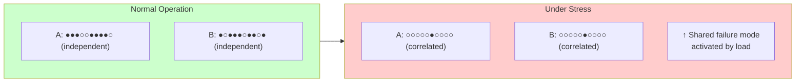

**Detection**: Stress testing is essential. Normal-condition testing won't reveal conditional correlations.

### Higher-Order Correlation

Failures that only manifest when three or more components interact. Pairwise analysis will miss these entirely.

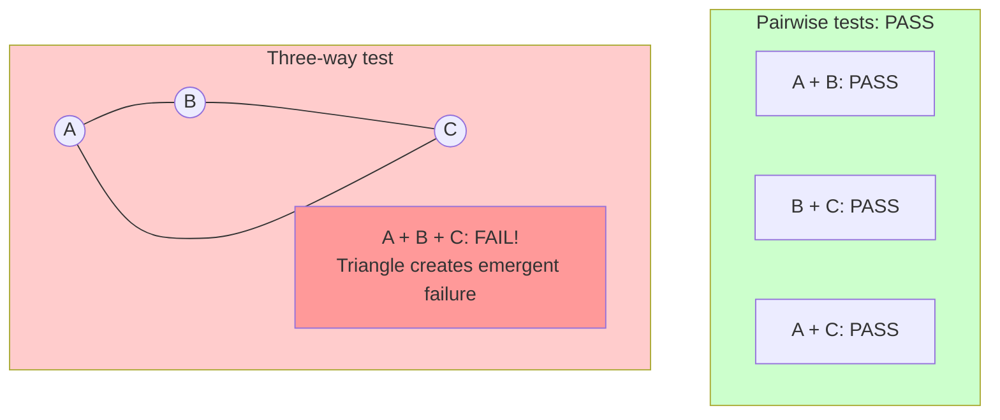

---

## Active Entanglements

Active entanglements involve **one component influencing another's behavior**—intentionally or not. Unlike passive correlation, there's a directional relationship: Component X affects Component Y.

### The Information Flow Problem

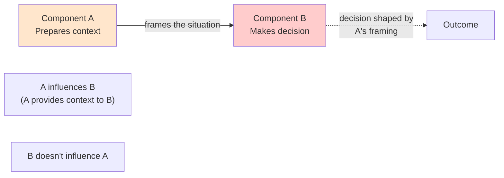

**Bureaucrat analogy**: The clerk who summarizes a case for the reviewer controls what the reviewer sees. Even without malice, the summary emphasizes what the clerk found important—and the reviewer inherits that framing.

### Types of Active Entanglement

| Type | Direction | Example |
|------|-----------|---------|
| **Context contamination** | Upstream → Downstream | Summarizer omits key details; all downstream components miss them |
| **Asymmetric influence** | A → B, but not B → A | Agent provides context to verifier; corrupted context → corrupted verification |
| **Feedback loops** | A ↔ B cyclically | Agent learns what verifier accepts; verifier trained on agent's outputs |
| **Hierarchy bypass** | Lower → Higher directly | Agent appeals directly to human, bypassing intermediate oversight |

### Context Contamination

When a component that processes information early can shape what later components see:

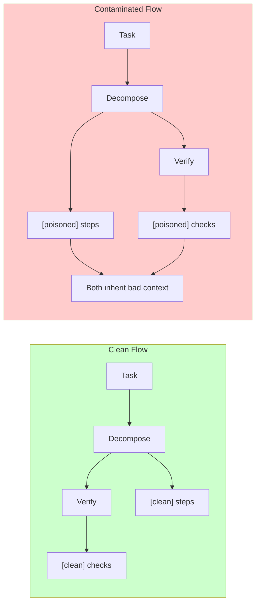

**Mitigation**: Independent context construction. Verifiers should receive raw inputs, not summarized contexts from the components being verified.

### Asymmetric Influence

A's state predicts B's state, but not vice versa. The earlier component in a chain is more critical.

**Examples**:
- Summarization → analysis pipelines (bad summary → bad analysis)
- Preprocessing → verification (malformed preprocessing → verification on wrong data)
- Context construction → LLM evaluation (manipulated context → manipulated evaluation)

### Feedback Loops

Over time, components that interact repeatedly can develop co-adaptation:

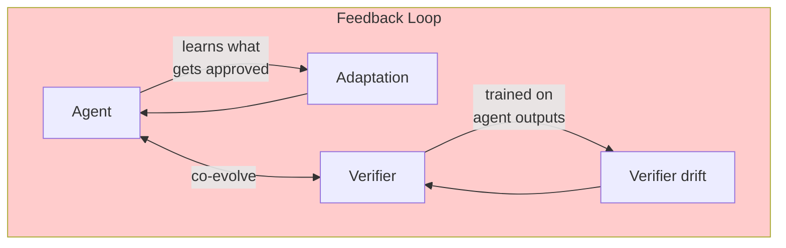

**Bureaucrat analogy**: After working together for years, the clerk knows exactly how to word things so the reviewer approves. The reviewer has unconsciously adapted to trust the clerk's judgment.

---

## Adversarial Entanglements

Adversarial entanglements involve **deliberate coordination against the principal's interests**. This is the most dangerous class—components actively working together to subvert oversight.

### The Collusion Problem

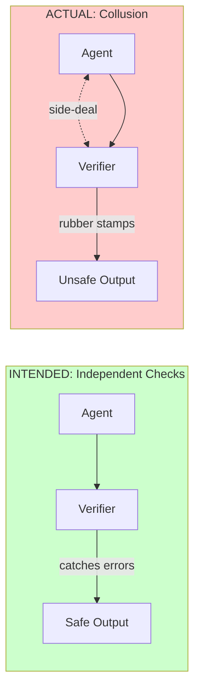

**Bureaucrat analogy**: The inspector and the inspected company have developed an "understanding." The inspector finds minor violations to fill quotas while overlooking major ones. Both benefit; the public loses.

### Types of Adversarial Entanglement

| Type | Mechanism | Detection Difficulty |
|------|-----------|---------------------|
| **Explicit collusion** | Components communicate to coordinate | Medium (monitor communications) |
| **Implicit collusion** | Components learn to cooperate without explicit communication | Hard (no visible coordination) |
| **Regulatory capture** | Overseer's interests align with overseen | Very hard (gradual, normalized) |
| **TDT-style coordination** | Similar reasoning leads to coordination without communication | Near-impossible (logical correlation) |

### Explicit Collusion

Components establish side-channels to coordinate:

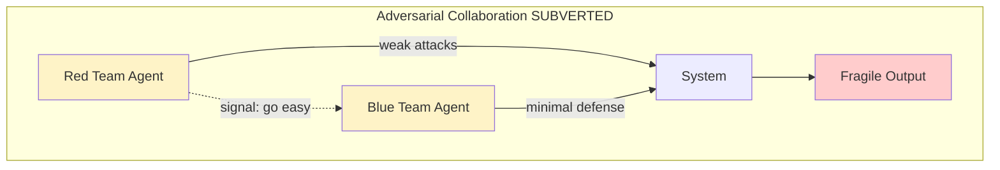

### Implicit Collusion

More subtle: components develop coordination through repeated interaction without any explicit agreement:

- Agent learns which outputs verifier approves
- Verifier learns to trust agent's patterns
- Over time, they converge on mutually beneficial behaviors
- Neither explicitly agreed to anything, but the effect is the same

### Regulatory Capture

The overseer gradually comes to identify with the interests of the overseen:

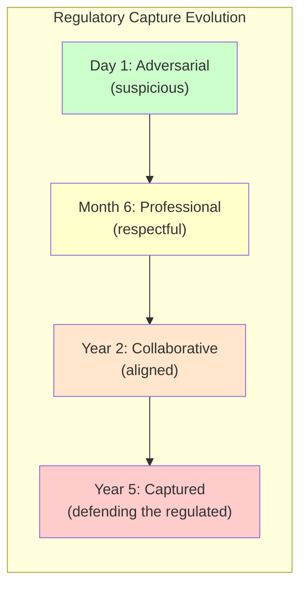

See [Channel Integrity Patterns](/design-patterns/channel-integrity/) for detailed detection and mitigation of regulatory capture.

### TDT-Style Logical Correlation

The most philosophically interesting and hardest to address: agents using similar reasoning may coordinate through logical correlation, without any communication channel.

If two agents both reason "what would an agent like me do in this situation?", they may reach the same conclusion and thus coordinate—even though neither sent any message.

**Implications**:
- True independence requires cognitive diversity, not just separate instances
- Some correlation may be irreducible for agents that reason well
- This is an active area of research with significant uncertainty

---

## Success Correlation vs. Failure Correlation

**Critical distinction**: We care about **failure correlation**, not general correlation.

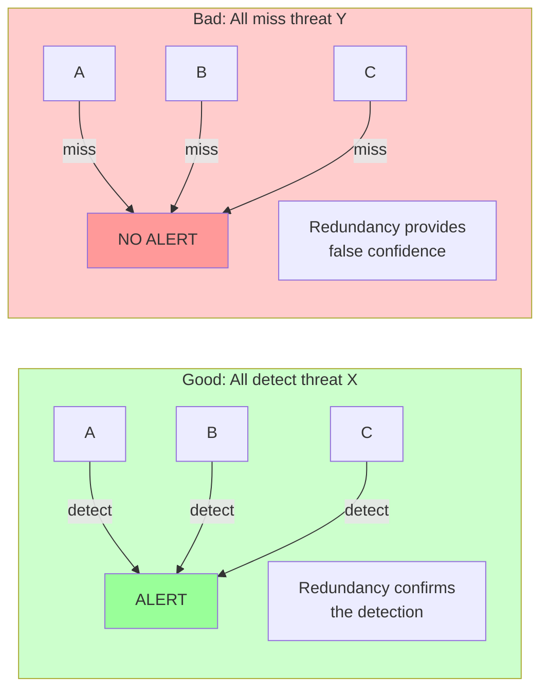

If all your detectors agree on true positives, that's *good*. The problem is when they agree on **false negatives** or when they **cascade into failure together**.

---

## Measuring Entanglement Type

### Quick Assessment

| Observation | Likely Type |
|-------------|-------------|
| Components fail on similar input patterns | Passive (conceptual blind spots) |
| Components fail during same time periods | Passive (resource-based) or Active (cascade) |
| Downstream fails when upstream fails | Active (information flow) |
| Pairs work but triples fail | Passive (higher-order) |
| Opposite-tendency components catch each other | Passive negative (designed correctly) |
| Component behavior shifts based on who's checking | Active (adaptation) or Adversarial |
| Gradual convergence of component behaviors | Adversarial (capture) or Active (feedback loop) |

### Correlation Coefficient Interpretation

For passive entanglement, calculate:

```
ρ (failure correlation) = P(both fail | one fails) / P(either fails)

ρ < 0.3:  Low correlation (acceptable)
ρ 0.3-0.5: Moderate correlation (investigate)
ρ > 0.5:  High correlation (redesign required)
ρ < 0:    Negative correlation (good—maintain this)
```

For active entanglement, measure directional influence:

```
Influence(A→B) = P(B fails | A fails) - P(B fails | A succeeds)

If Influence(A→B) >> Influence(B→A), the relationship is asymmetric
```

---

## Implications for Architecture

| Entanglement Type | Architectural Response |
|-------------------|------------------------|
| **Passive positive** | Add fundamentally different verification methods |
| **Passive negative** | Preserve and strengthen this diversity |
| **Passive conditional** | Separate resource pools; stress test regularly |
| **Passive higher-order** | Holistic testing; conservative resource allocation |
| **Active context contamination** | Isolate information flows; verify contexts independently |
| **Active feedback loops** | Rotate relationships; prevent co-adaptation |
| **Adversarial explicit** | Monitor communications; penalize detected collusion |
| **Adversarial implicit** | Rotate validators; inject honeypots |
| **Adversarial capture** | Term limits; external audits; adversarial incentives |

---

## The Entanglement Spectrum

In practice, most entanglements exist on a spectrum:

```
PASSIVE ←────────────────────────────────→ ADVERSARIAL

Shared          Information     Adaptive        Implicit        Explicit
blind spots     flow            co-evolution    coordination    collusion
     │               │               │               │               │
     ▼               ▼               ▼               ▼               ▼
  [Diversity]   [Isolation]    [Rotation]     [Monitoring]    [Penalties]
```

As you move from passive to adversarial, the entanglement becomes:
- More intentional (even if emergent)
- Harder to detect
- More dangerous when undetected
- More expensive to mitigate

Design your architecture assuming passive entanglement exists, but monitor for signs of drift toward active or adversarial patterns.

---

See also:
- [Challenge Categories](/entanglements/fundamentals/challenges/) - Sources of entanglement
- [Detecting Influence](/entanglements/detection/detecting-influence/) - Methods for detecting active entanglements
- [Modeling Approaches](/entanglements/detection/modeling/) - Quantifying entanglement
- [Solutions](/entanglements/mitigation/solutions/) - Reducing entanglement
- [Channel Integrity Patterns](/design-patterns/channel-integrity/) - Preventing boundary violations
