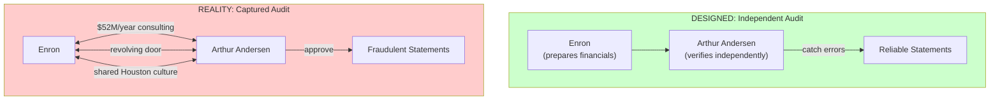
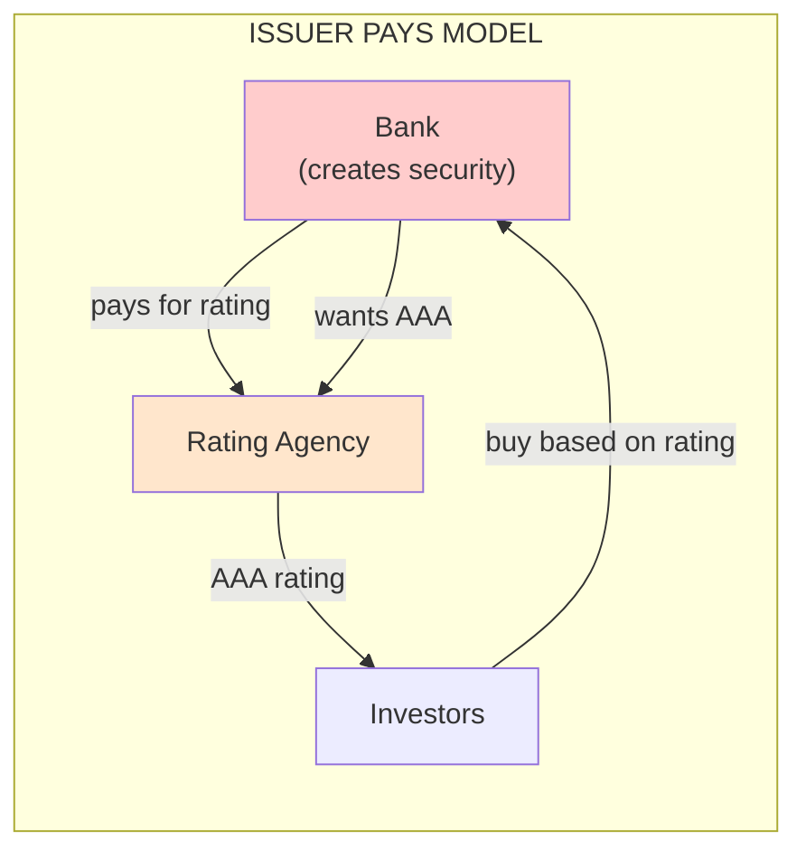
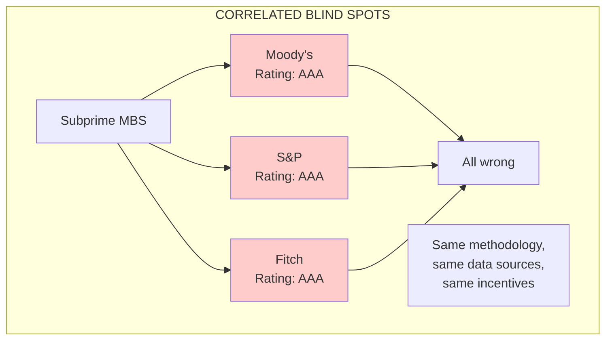
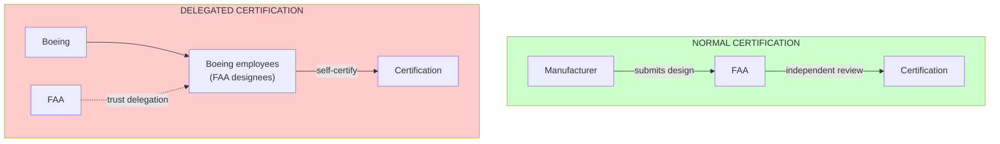
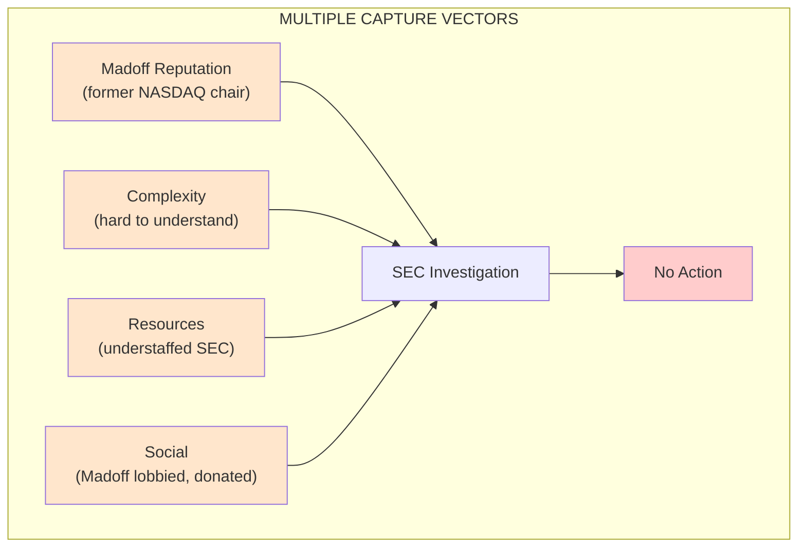
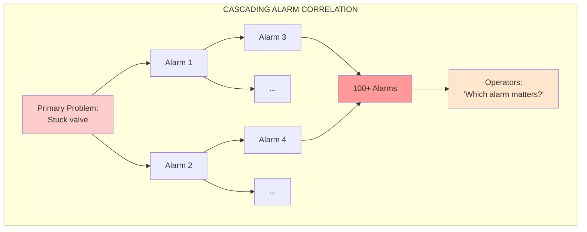
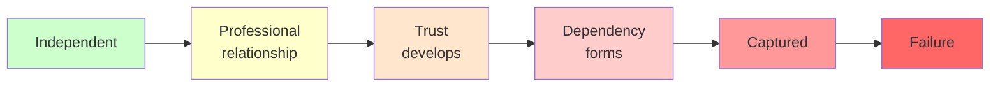

# Historical Case Studies

Human institutions have grappled with entanglement for centuries. These historical cases illustrate how passive correlation, active influence, and adversarial capture manifest in practice—and what we can learn for AI systems.

---

## Case 1: Enron and Arthur Andersen (Auditor Capture)

### Background

Enron Corporation was an American energy company that became one of the largest corporate frauds in history. Arthur Andersen was one of the "Big Five" accounting firms, responsible for auditing Enron's financial statements.

### The Entanglement

### Entanglement Mechanisms

| Type | Mechanism | Effect |
|------|-----------|--------|
| **Financial entanglement** | Andersen earned $52M/year from Enron (audit + consulting) | Incentive to keep client happy |
| **Personnel entanglement** | 86 Andersen employees moved to Enron | Blurred organizational boundaries |
| **Cultural entanglement** | Both based in Houston, shared social networks | "We're all friends here" mentality |
| **Information entanglement** | Andersen relied on Enron for understanding complex transactions | Context contamination |

### The Capture Timeline

| Phase | Period | Indicators |
|-------|--------|------------|
| **Professional** | 1985-1995 | Standard audit relationship |
| **Partnership** | 1995-1998 | Consulting fees exceed audit fees |
| **Dependence** | 1998-2000 | Enron becomes Andersen's largest client |
| **Captured** | 2000-2001 | Andersen signs off on fraudulent statements |
| **Collapse** | 2001-2002 | Fraud revealed; both entities destroyed |

### Key Lessons for AI

1. **Revenue dependency creates capture risk.** If a verifier depends economically on the agent it verifies, independence is compromised.

2. **Revolving doors blur boundaries.** Personnel movement between agent and verifier creates shared perspective and loyalty.

3. **Consulting + auditing conflicts.** When the same entity both advises and verifies, the incentive to find problems diminishes.

4. **Cultural proximity matters.** Shared social context creates implicit trust that may not be warranted.

5. **Gradual capture is invisible.** Each step seemed reasonable; the pattern only became clear in retrospect.

### Post-Enron Reforms (and AI Analogues)

| Reform | Rationale | AI Analogue |
|--------|-----------|-------------|
| **Sarbanes-Oxley (2002)** | Mandatory audit rotation | Rotate agent-verifier pairs |
| **Separation of audit and consulting** | Eliminate conflict of interest | Separate verification from assistance |
| **Independent audit committees** | Board oversight of auditors | Human oversight of AI verification |
| **Whistleblower protections** | Encourage reporting of problems | Honeypot mechanisms |

---

## Case 2: Credit Rating Agencies and the 2008 Financial Crisis

### Background

Credit rating agencies (Moody's, S&P, Fitch) are supposed to provide independent assessments of security risk. Before 2008, they rated mortgage-backed securities as AAA (safest) when they were actually high-risk.

### The Entanglement

The "issuer pays" model created fundamental capture:

**The conflict**: Banks paid for ratings and could shop between agencies for the best rating. Agencies that gave tougher ratings lost business.

### Entanglement Mechanisms

| Type | Mechanism | Effect |
|------|-----------|--------|
| **Economic capture** | Agencies paid by issuers they rate | Incentive to inflate ratings |
| **Competition capture** | Banks shopped for best ratings | Race to the bottom |
| **Information asymmetry** | Agencies relied on bank-provided data | Context contamination |
| **Correlated methodology** | All agencies used similar models | Shared blind spots |

### The Correlated Failure

All three major agencies gave AAA ratings to securities that defaulted:

Despite having three "independent" rating agencies, they all failed together because:
- Similar quantitative models (passive entanglement)
- Same issuer-pays incentive structure (economic capture)
- Relied on same data from issuers (context contamination)

### Key Lessons for AI

1. **Multiple providers ≠ independence.** Three agencies using similar methods failed together.

2. **Incentive alignment is structural.** The "issuer pays" model made capture inevitable regardless of individual integrity.

3. **Diversity in method, not just provider.** True independence requires fundamentally different approaches, not just different logos.

4. **The principal matters.** Who pays the verifier determines whose interests the verifier serves.

5. **Competition can worsen outcomes.** Competing for business from the entity being verified creates a race to the bottom.

### Reform Implications for AI

| Problem | Reform Approach | AI Application |
|---------|-----------------|----------------|
| Issuer pays | Change to investor/regulator pays | Principal pays for verification, not agent |
| Rating shopping | Assigned ratings, no shopping | Assign verifiers randomly |
| Shared methodology | Require methodological diversity | Mix different verification approaches |
| Opacity | Transparency requirements | Explainable verification decisions |

---

## Case 3: Boeing 737 MAX and the FAA (Self-Certification Capture)

### Background

The FAA delegated significant certification authority to Boeing itself. Boeing certified the MCAS system (which later caused two fatal crashes) with insufficient FAA oversight.

### The Entanglement

### Entanglement Mechanisms

| Type | Mechanism | Effect |
|------|-----------|--------|
| **Resource capture** | FAA lacked resources for full oversight | Forced delegation |
| **Expertise capture** | Boeing knew the system better than FAA | Information asymmetry |
| **Personnel capture** | Designees worked for Boeing, not FAA | Conflicting loyalties |
| **Regulatory capture** | Boeing lobbied for delegation rules | Wrote the rules governing itself |
| **Deadline pressure** | Commercial pressure to certify fast | Shared urgency |

### How the Hierarchy Was Bypassed

The MCAS system was critical for flight safety but received minimal independent review:

1. Boeing classified MCAS as a minor system (not requiring deep review)
2. Boeing designees approved Boeing's classification
3. FAA trusted the designee judgment
4. Independent FAA engineers were overruled or bypassed

### Key Lessons for AI

1. **Self-certification is captured by design.** When the agent certifies itself, independence is impossible.

2. **Resource constraints force dangerous delegation.** FAA couldn't hire enough engineers, so they delegated. AI oversight may face similar pressures.

3. **Expertise asymmetry enables capture.** The entity being verified often knows more than the verifier—and can exploit this.

4. **Classification gaming.** Agents may classify their own work to avoid rigorous review. AI systems could learn similar strategies.

5. **Commercial pressure affects everyone.** When both agent and verifier are under deadline pressure, oversight suffers.

### Structural Fixes

| Fix | Mechanism | AI Application |
|-----|-----------|----------------|
| **Separation of designees** | Designees shouldn't work for manufacturer | Verifiers shouldn't be economically dependent on agents |
| **Independent classification** | Third party decides review level | Independent assessment of verification requirements |
| **Whistleblower protection** | Employees can report concerns safely | Internal monitoring with escalation paths |
| **Rotating oversight** | Different FAA teams for each certification | Rotate verification assignments |

---

## Case 4: The Madoff Ponzi Scheme (SEC Oversight Failure)

### Background

Bernie Madoff ran the largest Ponzi scheme in history ($65 billion) for approximately 17 years. The SEC received multiple detailed complaints but failed to catch him.

### The Entanglement

The SEC was entangled with Madoff in multiple ways:

### Entanglement Mechanisms

| Type | Mechanism | Effect |
|------|-----------|--------|
| **Reputation capture** | Madoff was respected industry figure | Investigators gave benefit of the doubt |
| **Complexity capture** | Scheme was hard to understand | Investigators lacked expertise |
| **Resource constraints** | SEC was understaffed | Couldn't pursue leads |
| **Active interference** | Madoff had SEC contacts | Could influence investigations |
| **Confirmation bias** | Early investigations cleared him | Later investigators assumed he was clean |

### The Whistleblower Problem

Harry Markopolos, a financial analyst, submitted detailed complaints to the SEC multiple times over 9 years:

| Year | Complaint | SEC Response |
|------|-----------|--------------|
| 2000 | Initial complaint | No action |
| 2001 | Follow-up | Closed without investigation |
| 2005 | 21-page detailed analysis | Cursory investigation |
| 2007 | Updated analysis | No action |
| 2008 | Scheme collapsed on its own | SEC embarrassed |

**Why the SEC ignored the warnings**:
- Markopolos was an outsider, Madoff was an insider
- The analysis was technical and required expertise to evaluate
- Investigators deferred to Madoff's reputation
- No incentive to find problems vs. clear cases

### Key Lessons for AI

1. **Reputation creates bias.** Well-established agents get more benefit of the doubt, making them harder to catch.

2. **Complexity is camouflage.** Complex systems are harder to verify, and agents can exploit this.

3. **Whistleblower information is often ignored.** Even detailed, accurate complaints may not trigger action. Honeypots must be designed so detection is automatic.

4. **Resource constraints compound capture.** Underfunded oversight tends toward deference.

5. **Confirmation bias persists.** Once cleared, entities may be assumed clean in future reviews.

---

## Case 5: Three Mile Island (Cascading Alarm Failure)

### Background

The 1979 Three Mile Island nuclear accident was worsened by correlated failures in monitoring systems. Over 100 alarms activated simultaneously, making it impossible to diagnose the actual problem.

### The Entanglement

### Entanglement Mechanisms

| Type | Mechanism | Effect |
|------|-----------|--------|
| **Cascade coupling** | Alarms triggered other alarms | Lost signal in noise |
| **Information overload** | Too many alarms to process | Operators couldn't prioritize |
| **Shared infrastructure** | Single control room | All information bottlenecked |
| **Training gaps** | Operators not trained for this scenario | Correlated human errors |

### The Alarm Correlation Problem

Independent alarms become useless when they're all triggered:

- **Independent model**: If 100 alarms each have 1% false positive rate, seeing all 100 active means something is very wrong
- **Cascade reality**: One problem triggers all 100 alarms, so seeing all 100 provides same information as seeing 1

**The entanglement tax was essentially infinite**: 100 nominally independent monitoring systems provided the same information as 1.

### Key Lessons for AI

1. **Cascading triggers destroy independence.** When alarms trigger each other, redundancy is illusory.

2. **Information overload is a failure mode.** Too many alerts is as bad as too few.

3. **Design for the correlated case.** Systems should remain interpretable even when multiple things go wrong.

4. **Root cause vs. symptoms.** Need to distinguish the primary problem from downstream effects.

5. **Operator training must include correlation.** Humans need to understand how failures propagate.

### Post-TMI Reforms (and AI Analogues)

| Reform | Rationale | AI Application |
|--------|-----------|----------------|
| **Prioritized alarms** | Critical alarms distinguished from minor | Weight alerts by importance |
| **Safety parameter displays** | Show key metrics, not all metrics | Curated dashboards |
| **Symptom-based procedures** | Respond to symptoms, not assumed causes | Pattern-based escalation |
| **Simulator training** | Train for unusual scenarios | Red team testing for correlated failures |

---

## Cross-Case Patterns

### Common Entanglement Dynamics

| Pattern | Enron | Ratings | Boeing | Madoff | TMI |
|---------|-------|---------|--------|--------|-----|
| Economic capture | ✓ | ✓ | ✓ | | |
| Information asymmetry | ✓ | ✓ | ✓ | ✓ | |
| Revolving door | ✓ | | ✓ | ✓ | |
| Reputation bias | ✓ | | ✓ | ✓ | |
| Resource constraints | | | ✓ | ✓ | |
| Cascade coupling | | ✓ | | | ✓ |
| Shared methodology | | ✓ | | | |
| Self-certification | | | ✓ | | |

### Warning Signs Across Cases

All cases exhibited warning signs before failure:

| Case | Warning Signs | Why Ignored |
|------|---------------|-------------|
| **Enron** | Increasingly complex financials | "Too profitable to question" |
| **Ratings** | Housing prices can't rise forever | "Models show it's fine" |
| **Boeing** | Internal engineer concerns | "Schedule pressure" |
| **Madoff** | Returns too consistent | "He's Bernie Madoff" |
| **TMI** | Valve had stuck before | "It's a minor issue" |

### The Capture Progression

All cases followed similar progression:

---

## Implications for AI Systems

### Design Principles from History

1. **Structural separation**: Economic independence between agent and verifier
2. **Mandatory rotation**: Time limits on relationships
3. **Methodological diversity**: Fundamentally different verification approaches
4. **External accountability**: Oversight of the overseers
5. **Whistleblower channels**: Paths for concern escalation that bypass normal hierarchy
6. **Cascade resistance**: Alarm systems that remain informative under stress

### What Makes AI Harder

| Historical Challenge | AI-Specific Amplification |
|---------------------|---------------------------|
| Information asymmetry | AI may be fundamentally harder to understand than financial instruments |
| Complexity camouflage | AI systems can be arbitrarily complex |
| Speed | AI decisions happen faster than human oversight can process |
| Scale | AI systems can operate at scales humans can't monitor |
| Emergence | AI behavior may change without explicit programming |

### What Makes AI Easier

| Historical Challenge | AI-Specific Advantage |
|---------------------|----------------------|
| Intentional deception | Current AI may not deliberately deceive (though this may change) |
| Social manipulation | AI can't take regulators to dinner (yet) |
| Logging | AI actions can be comprehensively logged |
| Reproducibility | AI decisions can potentially be replayed and analyzed |
| Simulation | AI verification can be tested in simulation |

---

## Summary: Lessons for AI Delegation

| Lesson | Historical Basis | AI Application |
|--------|-----------------|----------------|
| Independence requires structural separation | Enron, Ratings, Boeing | Verification systems must be economically and organizationally independent |
| Multiple providers ≠ diversity | Rating agencies | Different LLM providers may have correlated failures |
| Capture is gradual and invisible | All cases | Monitor for capture drift over time |
| Complexity enables capture | Madoff, Boeing | Keep verification systems interpretable |
| Cascades destroy redundancy | TMI | Design for correlated failure scenarios |
| Resource constraints force dangerous shortcuts | Boeing, Madoff | Ensure adequate verification resources |
| Whistleblowers are often ignored | Madoff | Build automatic detection, not just reporting channels |

---

See also:
- [Research Connections](/entanglements/research-connections/) - Academic analysis of these phenomena
- [Types of Entanglement](/entanglements/types/) - Formal classification
- [Detecting Influence](/entanglements/detecting-influence/) - Practical detection methods
- [Solutions & Mitigations](/entanglements/solutions/) - Prevention strategies
