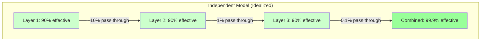
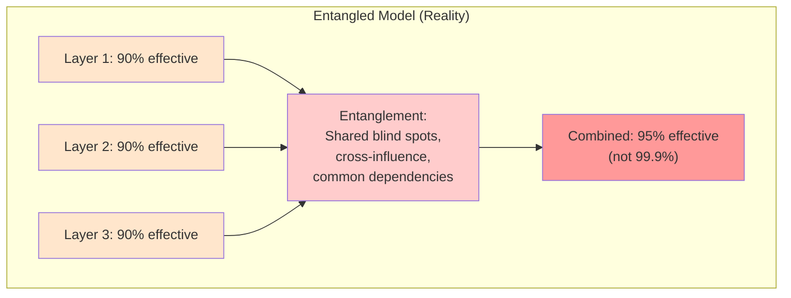

# Entanglements

When designing delegation architectures, it's tempting to treat components as independent—to assume that stacking five 90%-effective safety layers yields 99.999% protection. In practice, components become **entangled** in ways that undermine this assumption.

Entanglements come in many forms:
- **Shared dependencies**: Components rely on the same infrastructure, training data, or assumptions
- **Information leakage**: What one component knows affects another's behavior
- **Active influence**: Component X can affect Component Y's decisions (the "bureaucrat problem")
- **Correlated failures**: The same inputs defeat multiple layers simultaneously
- **Collusion potential**: Components might coordinate against the principal's interests

Understanding and managing these entanglements is one of the hardest problems in delegation architecture design.

## The Independence Illusion

Consider a "Defense in Depth Stack":



But if layers are entangled:



The gap between perceived and actual protection can be enormous—often 10× to 100× worse than the independent model predicts.

## The Bureaucrat Analogy

To understand entanglements, it helps to think about how human bureaucracies fail. Consider a government office where Clerk A prepares cases and Reviewer B approves them.

**Passive entanglement**: Both Clerk A and Reviewer B were trained at the same institution and use the same manual. They share blind spots—certain types of fraud that neither was taught to recognize.

**Active entanglement**: Clerk A prepares summaries that Reviewer B reads. Even without any malicious intent, A's framing shapes B's perception. The summary emphasizes what A found important.

**Adversarial entanglement**: After working together for years, A and B have developed an "understanding." A knows exactly how to word things for approval, and B has learned to trust A's judgment. Neither explicitly agreed to anything, but the effect is that A's cases are rubber-stamped.

This analogy maps directly to AI systems:
- **Clerks and reviewers** → Agents and verifiers
- **Shared training** → Same LLM provider, same prompts
- **Case summaries** → Context passed between components
- **Long-term relationships** → Persistent agent-verifier pairings

The bureaucrat lens helps identify entanglements: "How might Component X influence Component Y? Through what channels? With what incentives?"

---

## Types of Entanglement

### Passive Entanglements
Components share something that creates correlated behavior (like clerks trained at the same school):
- **Shared training data**: Multiple AI components trained on similar datasets
- **Common infrastructure**: Same cloud provider, same LLM API, same database
- **Shared assumptions**: Designed by the same team with the same blind spots
- **Environmental coupling**: Both affected by the same external conditions

### Active Entanglements
One component directly affects another (like a clerk's summary shaping a reviewer's decision):
- **Information flow**: Output of Component A becomes input to Component B
- **Influence channels**: Component A can signal or communicate with Component B
- **Resource competition**: Components compete for the same limited resources
- **Authority relationships**: Component A has power over Component B's operation

### Adversarial Entanglements
Entanglements that can be exploited (like capture or collusion between clerk and reviewer):
- **Collusion potential**: Components might coordinate against oversight
- **Capture risk**: One component might be "captured" by another's interests
- **Side-channel communication**: Hidden information channels between components
- **Cascading compromise**: Compromising one component enables compromising others

## Why This Matters

**False confidence**: Teams believe they have robust multi-layer protection when components are actually entangled in ways that defeat the layering.

**The bureaucrat problem**: In human organizations, we understand that bureaucrat X might influence bureaucrat Y through formal channels, informal relationships, shared incentives, or implicit threats. AI components have analogous dynamics.

**Resource misallocation**: Adding more layers of the same type provides diminishing returns. Resources might be better spent on genuinely independent approaches.

**Audit failures**: Security reviews that examine each component independently will miss systemic vulnerabilities in how components interact.

## The Entanglement Tax

We define the **Entanglement Tax** as the ratio of actual risk to perceived risk:

```
Entanglement Tax = Actual_Delegation_Risk / Perceived_Delegation_Risk
```

In the example above:
- Perceived risk: 0.1% (99.9% protection)
- Actual risk: 5% (95% protection)
- Entanglement tax: 50×

**Your actual risk is 50× higher than your independent model suggests.**

This "tax" compounds with system complexity. Organizations with many composed patterns and high assumed protection levels may be paying entanglement taxes of 100× or more.

---

## Section Contents

This section provides frameworks for understanding, measuring, and managing entanglements:

### [Types of Entanglement](/entanglements/fundamentals/types/)
The three classes of entanglement and their variants:
- Passive: shared blind spots, conditional correlation, higher-order effects
- Active: context contamination, feedback loops, asymmetric influence
- Adversarial: collusion, capture, TDT-style logical correlation

### [Challenge Categories](/entanglements/fundamentals/challenges/)
Nine categories of entanglement challenges:
1. Shared infrastructure dependencies
2. Correlated detection blind spots
3. Information flow contamination
4. Cascading failure dynamics
5. Adversarial exploitation
6. Emergent coupling over time
7. Measurement gaps
8. Organizational entanglement
9. Fundamental/irreducible entanglement

### [Detecting Influence](/entanglements/detection/detecting-influence/)
Methods for detecting active and adversarial entanglements:
- A/B testing with frame variation
- Counterfactual intervention
- Influence probing and honeypots
- Behavioral drift detection
- Warning signs of capture and collusion

### [Modeling Approaches](/entanglements/detection/modeling/)
Quantitative tools for measuring entanglement:
- Delegation Risk formulas with correlation terms
- Dependency matrices and heatmaps
- Influence graphs with risk edges
- Visualization approaches

### [Worked Examples](/entanglements/case-studies/examples/)
Step-by-step analysis of real architectures:
- Code review verification pipeline (passive entanglement)
- Healthcare decision system (passive entanglement)
- Financial trading safeguards (passive entanglement)
- Customer support escalation (active influence + capture)

### [Solutions & Mitigations](/entanglements/mitigation/solutions/)
Nine approaches to reducing entanglement:
1. Architectural diversity requirements
2. Explicit entanglement audits
3. Stress testing for coupling
4. Isolation boundaries
5. Entanglement-aware risk budgeting
6. Circuit breakers
7. Regular independence verification
8. Temporal dynamics management
9. Software engineering dependency patterns

### [Decision Framework](/entanglements/mitigation/decision-framework/)
When is independence worth the cost?
- Stakes × entanglement decision matrix
- Costs of true isolation
- When to accept vs. address entanglement

### [Research Connections](/entanglements/research/research-connections/)
Academic literature relevant to entanglement:
- Principal-agent theory and mechanism design
- Game theory and collusion resistance
- Information theory and causal inference
- Adversarial ML and organizational theory

### [Formal Definitions](/entanglements/fundamentals/formal-definitions/)
Mathematical formalization of entanglement:
- Information-theoretic definitions (mutual information, transfer entropy)
- Game-theoretic definitions (collusion resistance, capture equilibrium)
- Risk formalization (entanglement tax, effective redundancy)
- Bounds and impossibility results

### [Historical Case Studies](/entanglements/case-studies/historical-cases/)
Real-world examples of entanglement failures:
- Enron and Arthur Andersen (auditor capture)
- Credit rating agencies and 2008 crisis (correlated blind spots)
- Boeing 737 MAX and FAA (self-certification capture)
- Madoff and SEC (oversight failure)
- Three Mile Island (cascading alarms)

### [Quantitative Metrics](/entanglements/detection/metrics/)
Practical measurement of entanglement:
- Correlation metrics (failure correlation, mutual information)
- Influence metrics (frame sensitivity, transfer entropy)
- Capture metrics (approval rate ratio, preference alignment)
- Temporal metrics (drift rate, capture velocity)
- Dashboard implementation

### [Adversarial Transferability](/entanglements/research/adversarial-transferability/)
Empirical research on why attacks transfer between models:
- Key findings from adversarial ML literature
- Transfer rates between architectures
- Implications for verification independence
- Factors affecting transfer

### [Red Team Methodology](/entanglements/mitigation/red-team-methodology/)
Protocols for discovering entanglements through adversarial testing:
- Phase-by-phase testing approach
- Transfer attack protocols
- Master key discovery
- Reporting and prioritization

### [Foundation Model Monoculture](/entanglements/case-studies/foundation-model-monoculture/)
Systemic risk from AI provider concentration:
- Dimensions of monoculture
- API dependency chains
- Mitigation strategies
- Ecosystem perspective

### [Impossibility Results](/entanglements/research/impossibility-results/)
Theoretical limits on verification independence:
- Computational and logical limits
- Information-theoretic constraints
- Game-theoretic impossibilities
- What we can and cannot achieve

### [Intelligence Community Failures](/entanglements/case-studies/intelligence-failures/)
Case studies with direct AI parallels:
- Iraq WMD intelligence failure
- 9/11 intelligence breakdown
- Bay of Pigs groupthink
- Lessons for AI oversight

### [Correlation Calculator](/entanglements/detection/correlation-calculator/)
Tools for calculating entanglement tax:
- Quick reference tables
- Python implementations
- Effective redundancy calculations
- Worked examples

### [Psychology of Oversight](/entanglements/cross-domain/psychology-of-oversight/)
Human cognitive factors in AI verification:
- Automation bias and complacency
- Vigilance decrement
- Social and organizational pressures
- Designing against vulnerabilities

### [AI Debate and Entanglement](/entanglements/research/ai-debate-entanglement/)
How debate-based oversight connects to entanglement:
- The debate proposal
- Entanglement challenges in debate
- Research results
- When to use debate

### [Regulatory Approaches](/entanglements/cross-domain/regulatory-approaches/)
Policy frameworks for AI independence:
- Existing regulatory models
- Proposed AI regulations
- Sector-specific considerations
- International coordination

### [Entanglement Audit Guide](/entanglements/mitigation/audit-guide/)
Step-by-step assessment process:
- Component inventory
- Passive and active assessment
- Adversarial testing
- Quantification and remediation

### [Hidden Coordination](/entanglements/cross-domain/hidden-coordination/)
When agents have "secret friends"—adversarial use of hidden networks:
- Game of Thrones as case study
- The power of non-obvious alliances
- Detection strategies
- The limits of detection

### [Software Dependency Patterns](/entanglements/cross-domain/software-dependency-patterns/)
Lessons from 50 years of software engineering:
- Dependency injection and inversion of control
- Acyclic dependencies principle
- Interface segregation
- Package management lessons

### [Organizational Isolation](/entanglements/cross-domain/organizational-isolation/)
How organizations deliberately create isolation:
- Hub-and-spoke communication
- Rotation policies
- Competitive dynamics
- Information compartmentalization

### [Legibility and Control](/entanglements/cross-domain/legibility-and-control/)
When making entanglements explicit helps vs. hurts:
- James C. Scott's "Seeing Like a State"
- High modernism and its failures
- Métis: knowledge that can't be formalized
- The standardization paradox

---

## Quick Diagnostic

Before reading further, assess your current architecture:

| Question | Entanglement Type |
|----------|-------------------|
| Do multiple verification layers use the same LLM provider? | Shared infrastructure |
| Were all safety components designed by the same team? | Organizational entanglement |
| Do later stages receive context from earlier stages? | Information flow |
| Can one component affect another's resource allocation? | Active influence |
| Has the architecture been "optimized" for performance? | Emergent coupling |
| Can your red team find inputs that evade multiple layers? | Correlated blind spots |
| Could components benefit from coordinating against you? | Collusion potential |

If you answered "yes" to 3+ questions, entanglement is likely a significant source of unrecognized risk in your system.

---

## Key Takeaways

1. **Independence is the exception, not the rule.** Assume entanglement until proven otherwise.

2. **Entanglement is broader than correlation.** It includes active influence, information flow, and potential collusion—not just shared failure modes.

3. **The bureaucrat analogy helps.** Ask: "How might Component X influence Component Y? What channels exist? What incentives?"

4. **Entanglement is measurable.** Use the tools in this section to quantify your entanglement tax rather than guessing.

5. **Some entanglement is irreducible.** At the limit, all AI verification of AI may share fundamental limitations. Know where those limits are.

6. **The honest answer is sometimes "we can't isolate this."** Better to know your limitations than to believe in illusory independence.

---

See also:
- [Channel Integrity Patterns](/design-patterns/channel-integrity/) - Preventing unauthorized influence between components
- [Composing Patterns](/design-patterns/#composing-patterns) - How to combine patterns
- [Separation of Powers](/design-patterns/structural/#separation-of-powers) - Architectural independence
