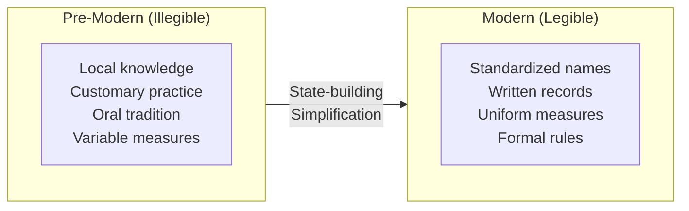

# Legibility and Control: The Standardization Paradox

:::note[TL;DR]
Making relationships explicit—creating legibility—is a control technology. States standardized names, measures, and land tenure to make society governable. The same impulse drives enterprise software, formal verification, and this framework. But legibility has a dark side: it can destroy the informal, adaptive, "entangled" systems that actually work. High-modernist projects fail when they replace functioning complexity with sterile simplicity. We must balance the need to see and control with the wisdom to preserve what we can't formalize.
:::

---

## The Legibility Concept

James C. Scott's *Seeing Like a State* (1998) introduced a powerful framework for understanding why states simplify:

**Legibility:** Making a complex reality readable, measurable, and controllable from above.

Before modern states, rulers faced an opaque society:
- Local names that varied by village
- Customary land rights passed orally
- Local measures (a "bushel" differed by region)
- Forest management by local practice

The state couldn't tax what it couldn't count, conscript who it couldn't find, or manage what it couldn't measure.

**Solution:** Standardization.
- Permanent surnames (for tracking individuals)
- Cadastral surveys (for taxing land)
- Standard measures (for collecting grain)
- Scientific forestry (for managing resources)

---

## High Modernism and Its Failures

### The High-Modernist Faith

Scott identifies **high modernism** as the belief that:
- Scientific planning can optimize society
- Traditional practices are inefficient superstition
- Experts know better than locals
- Complexity should be replaced with rational simplicity

High modernism + state power + weak civil society = disasters.

### Case Studies in Failure

**Scientific Forestry (Prussia, 18th century):**
- Replaced diverse forests with monoculture timber plantations
- Initially productive: easy to measure, harvest, replant
- After one generation: massive die-offs
- Monocultures lacked the biodiversity that sustained forest health
- Had to reintroduce complexity they'd eliminated

**Collectivization (Soviet Union):**
- Replaced small farms with collective farms
- "Scientific" planning of agriculture
- Ignored local knowledge about soil, weather, timing
- Result: famines, production collapse
- Eventually had to tolerate private plots that provided disproportionate food

**Brasília (Brazil, 1960s):**
- Planned capital city designed by modernist architects
- Separated functions: residential, commercial, governmental
- Assumed people would live as designed
- Result: sterile, alienating; informal settlements grew around it
- People created the complexity the planners eliminated

**Ujamaa Villages (Tanzania, 1970s):**
- Forced resettlement into planned villages
- Destroyed existing social networks and local knowledge
- Agricultural collapse
- Eventually abandoned

### The Pattern

1. **Legibility:** Make complex system readable from above
2. **Simplification:** Replace complexity with rational plan
3. **Implementation:** Force population into new structure
4. **Failure:** System lacks the complexity that made the old one work
5. **Adaptation:** Informal complexity re-emerges, often illegally

---

## Métis: The Knowledge That Can't Be Formalized

Scott borrows the Greek concept of **métis**: practical, local, tacit knowledge.

**Characteristics:**
- Learned through experience, not instruction
- Context-dependent (works *here*, not universally)
- Hard to articulate (you know more than you can say)
- Embedded in practice and community

**Examples:**
- A farmer's sense of when to plant (beyond what weather data says)
- A nurse's intuition that something is wrong (before tests confirm)
- A trader's feel for the market (beyond quantitative models)
- A machinist's touch for the metal (beyond specifications)

### Why Métis Matters

Legibility projects destroy métis:
- **Formal rules replace judgment:** "Follow the protocol" vs. "use your experience"
- **Standardization eliminates adaptation:** Same process everywhere, regardless of context
- **Expertise shifts upward:** Central planners know best; locals should obey

But métis often contains crucial knowledge:
- The protocol doesn't cover this edge case
- The standard process doesn't work here
- The central planner doesn't understand local conditions

### The Irony

**The more legible the system, the more it depends on illegible métis to actually function.**

Hospitals run on nurses' tacit knowledge, not just formal protocols. Factories depend on workers' informal adaptations. Software systems rely on operators who know the undocumented quirks.

Remove the métis, and the legible system collapses.

---

## Legibility in Entanglement Management

### The Temptation

This framework's approach to entanglement has a legibility character:
- **Make dependencies explicit:** Map all relationships
- **Formalize interfaces:** Define trust contracts
- **Standardize measurement:** Quantify entanglement metrics
- **Impose structure:** Enforce architectural patterns

This is deliberate and often valuable. But we should recognize the pattern.

### When Legibility Helps

**Explicit is better than implicit when:**
- Hidden dependencies cause cascading failures
- Informal arrangements enable hidden coordination
- Standardization enables substitution and competition
- Measurement enables comparison and improvement

**Examples:**
- [Dependency injection](/entanglements/software-dependency-patterns/): Making dependencies explicit enables testing and substitution
- [Alliance mapping](/case-studies/human-systems/alliance-cascades/): Understanding hidden alliances prevents cascade disasters
- [Channel monitoring](/design-patterns/channel-integrity/): Explicit channels can be logged and audited

### When Legibility Hurts

**Formalization destroys value when:**
- Informal systems carry tacit knowledge that can't be captured
- Standardization eliminates necessary local adaptation
- Rigid structure prevents beneficial emergent coordination
- Measurement creates perverse incentives

**Examples:**

| Legibility Project | Destroyed Métis | Result |
|-------------------|-----------------|--------|
| Strict API contracts | Informal flexibility that handled edge cases | Brittle systems that fail on unexpected inputs |
| Mandatory documentation | Quick informal knowledge sharing | Slow, outdated documentation nobody trusts |
| Formal verification | Understanding of why the system works | Verified code that passes tests but fails in production |
| Complete isolation | Beneficial implicit coordination | Coordination failures, duplicated effort |

---

## The Standardization Paradox for AI

### Making AI Legible

The field is actively making AI more legible:
- **Interpretability:** Understanding what models do internally
- **Formal verification:** Proving properties of AI systems
- **Standardized interfaces:** Common APIs, formats, protocols
- **Evaluation benchmarks:** Measuring capability and safety

This is largely good. Illegible AI is dangerous AI.

### But AI Has Métis

**Model tacit knowledge:**
- Learned patterns that work but aren't understood
- Capabilities that emerge from training, not design
- Behaviors that are "correct" in ways we can't specify

**Operator tacit knowledge:**
- "I know when the model is likely to fail"
- "This prompt works better even though I can't say why"
- "There's a pattern to the errors that isn't in any documentation"

**System tacit knowledge:**
- How components actually interact (vs. how they're designed to)
- Informal conventions that make things work
- Edge cases handled by undocumented behaviors

### The Risk

**High-modernist AI safety:**
1. Formalize all interactions
2. Standardize all interfaces
3. Verify all properties
4. Eliminate all ambiguity

**Potential failure mode:**
- Destroys beneficial emergence
- Misses capabilities that can't be formalized
- Creates brittle systems that fail on out-of-distribution inputs
- Operators lose the tacit knowledge that handled edge cases

---

## Finding the Balance

### Principles

**1. Preserve What Works**
Before standardizing, understand why the current system works. The informal entanglement you want to eliminate might be load-bearing.

**2. Gradual Legibility**
Don't replace functioning complexity with sterile simplicity all at once. Incremental formalization allows learning.

**3. Escape Valves**
Formal systems need room for informal adaptation. Build in flexibility, override mechanisms, exception handling.

**4. Local Knowledge Channels**
Create ways for tacit knowledge to influence formal processes. Don't assume the model captures everything.

**5. Monitor for Brittleness**
Highly legible systems often fail in novel situations. Track out-of-distribution performance.

### Implementation Questions

| Question | If Yes... |
|----------|-----------|
| Is informal coordination currently working well? | Consider preserving rather than formalizing |
| Do operators have tacit knowledge about edge cases? | Capture it or create channels for it |
| Would formalization eliminate beneficial adaptation? | Add flexibility mechanisms |
| Is this standardization driven by control needs, not function? | Reconsider the motivation |
| Would this create a single point of failure? | Maintain redundancy in approaches |

### The Meta-Principle

**Be aware that the drive to make things legible is itself a bias.**

We naturally prefer explicit, measurable, controllable systems. This preference can blind us to the value of what we can't see or measure.

Sometimes the right answer is: "This is working; don't formalize it."

---

## Case Study: Process vs. Culture

### The High-Modernist Organization

**Observable pattern:**
1. Organization grows
2. Informal culture can't scale
3. Formalize processes, create documentation
4. Document everything, measure everything
5. Culture dies, replaced by process
6. Organization becomes rigid, slow
7. Talented people leave
8. Slow decline or failure

**The métis that was lost:**
- Judgment about when rules should be broken
- Context for why rules existed
- Trust relationships that bypassed formal hierarchy
- Tacit knowledge about how things really work

### The Alternative

**Organizations that maintain métis:**
- Culture is primary, process is secondary
- Rules are defaults, not mandates
- Trust in judgment, not just compliance
- Documentation is living, not ossified
- Informal channels are valued, not suppressed

**Challenge:** This is harder to scale, audit, and control. It depends on selecting and developing the right people.

---

## Implications for Delegation Risk

### Legibility as Tool, Not Goal

Making delegation relationships explicit is valuable:
- You can measure what you can see
- You can control what you can measure
- You can improve what you can control

But legibility is a tool, not a goal. The goal is **safe, effective delegation**.

If legibility improves safety without destroying capability: good.
If legibility destroys the informal systems that actually work: bad.

### Preserve Beneficial Entanglement

Not all entanglement is bad:
- Shared context enables coordination
- Informal relationships build trust
- Implicit understanding reduces overhead

Before eliminating entanglement, ask: "Is this entanglement harmful or beneficial?"

### Maintain Epistemic Humility

**We don't know what we don't know.**

The formal model of a system doesn't capture everything. The legible representation is a simplification. Important dynamics may be invisible.

Build in humility:
- Expect surprises
- Create mechanisms for learning from failure
- Don't assume the model is complete
- Listen to operators who know things you don't

---

## Key Takeaways

:::note[Key Takeaways]
1. **Legibility is a control technology.** States standardize to tax and conscript. Organizations standardize to manage. We standardize to reduce entanglement risk.

2. **High modernism fails.** When planners assume they can replace functioning complexity with rational simplicity, disasters follow.

3. **Métis matters.** Tacit, local, practical knowledge often carries crucial understanding that can't be formalized.

4. **Legibility destroys métis.** Standardization can kill the informal knowledge that makes systems work.

5. **The paradox:** The more legible the system, the more it depends on illegible métis to function.

6. **Balance is key.** Make explicit what needs to be explicit. Preserve what works. Don't formalize for formalization's sake.

7. **Epistemic humility.** Your formal model doesn't capture everything. Important dynamics may be invisible.
:::

---

## See Also

- [Organizational Isolation](/entanglements/organizational-isolation/) — Control through structure
- [Software Dependency Patterns](/entanglements/software-dependency-patterns/) — Formalization that works
- [Solutions](/entanglements/solutions/) — Approaches to reducing entanglement
- [Hidden Coordination](/entanglements/hidden-coordination/) — When informality enables adversaries

---

## Further Reading

### Primary Source
- Scott, James C. *Seeing Like a State: How Certain Schemes to Improve the Human Condition Have Failed* (1998) — The core text

### Related Work
- Scott, James C. *The Art of Not Being Governed* (2009) — Escape from legibility
- Polanyi, Michael. *The Tacit Dimension* (1966) — "We know more than we can tell"
- Hayek, Friedrich. "The Use of Knowledge in Society" (1945) — Distributed knowledge
- Chesterton, G.K. *The Thing* (1929) — "Chesterton's fence"

### Applications
- Taleb, Nassim. *Antifragile* (2012) — Systems that benefit from disorder
- Ostrom, Elinor. *Governing the Commons* (1990) — How informal institutions manage shared resources
- Perrow, Charles. *Normal Accidents* (1984) — When tight coupling and complexity combine
