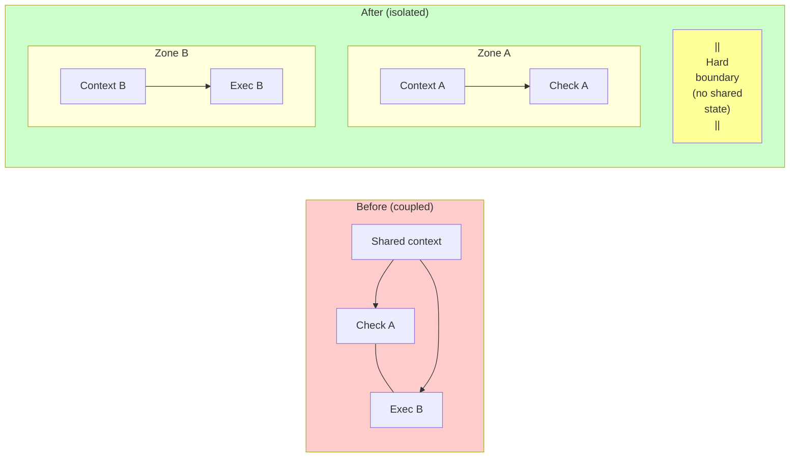
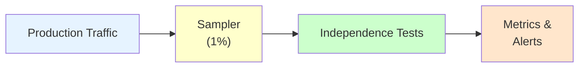
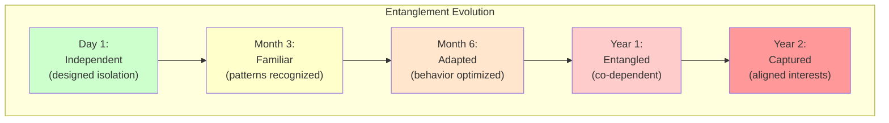
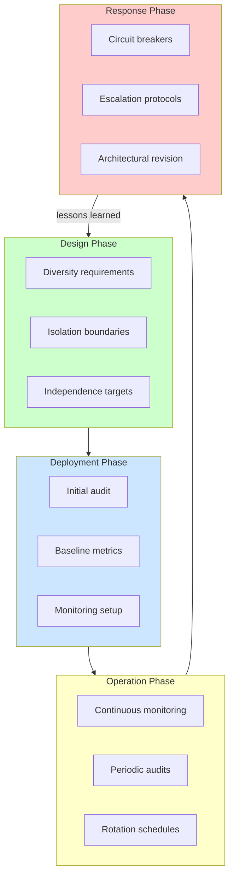

# Solutions & Mitigations

This page presents nine approaches to reducing pattern interconnection, from architectural changes to software engineering patterns.

---

## 1. Architectural Diversity Requirements

**Principle**: Ensure patterns use genuinely independent mechanisms.

### Dimensions of Diversity

| Dimension | How to Diversify | Why It Helps |
|-----------|------------------|--------------|
| **Provider** | Different LLM providers for different layers | Different training, different biases |
| **Methodology** | Mix rule-based, statistical, learned, formal | Different fundamental approaches |
| **Training data** | Ensure models trained on different datasets | Different blind spots |
| **Timing** | Pre-execution, concurrent, post-execution, delayed | Different temporal coverage |
| **Personnel** | Different teams own different components | Different human blind spots |
| **Architecture** | Transformers, RNNs, symbolic, hybrid | Different failure modes |

### Implementation Checklist

```
□ No single provider handles >50% of verification
□ At least one non-ML verification method
□ Redundant components have different codebases
□ Human oversight doesn't bottleneck through single team
□ Monitoring systems independent from monitored systems
□ At least 3 fundamentally different methodologies
```

### Cost-Benefit Consideration

Diversity has real costs:
- Multiple vendor relationships
- Diverse expertise required
- Integration complexity
- Potential inconsistency

Balance against risk level. Low-stakes systems may not need maximum diversity.

---

## 2. Explicit Correlation Audits

**Principle**: Regularly assess and document inter-pattern correlations.

### Audit Process

```python
class CorrelationAudit:
    def __init__(self, patterns: list[Pattern]):
        self.patterns = patterns
        self.correlation_matrix = self._initialize_matrix()

    def audit(self) -> AuditReport:
        findings = []

        # Check infrastructure sharing
        infra = self._analyze_infrastructure_overlap()
        if infra.overlap_score > 0.5:
            findings.append(Finding(
                severity="HIGH",
                type="shared_infrastructure",
                details=infra
            ))

        # Check conceptual similarity
        conceptual = self._analyze_methodology_similarity()
        if conceptual.similarity_score > 0.7:
            findings.append(Finding(
                severity="MEDIUM",
                type="methodology_correlation",
                details=conceptual
            ))

        # Check information flow
        info_flow = self._analyze_context_contamination_risk()
        for path in info_flow.risky_paths:
            findings.append(Finding(
                severity="MEDIUM",
                type="context_contamination",
                details=path
            ))

        return AuditReport(
            correlation_matrix=self.correlation_matrix,
            findings=findings,
            recommended_actions=self._generate_recommendations(findings)
        )
```

### Audit Components

| What to Audit | How | Frequency |
|---------------|-----|-----------|
| Infrastructure dependencies | Dependency graph analysis | Quarterly |
| Methodology similarity | Expert review | Annually |
| Information flows | Data flow analysis | After changes |
| Historical correlation | Incident analysis | After incidents |
| Empirical correlation | Red team testing | Semi-annually |

### Audit Triggers

Beyond regular schedule, audit after:
- Any architectural change
- New component added
- Correlated failure incident
- Performance optimization
- Vendor/provider change
- Team reorganization

---

## 3. Stress Testing for Coupling

**Principle**: Test under conditions designed to reveal hidden correlations.

### Test Types

| Test Type | What It Reveals | How to Run |
|-----------|-----------------|------------|
| **Load testing** | Do components degrade together? | Ramp load until failure |
| **Chaos engineering** | Does one failure cascade? | Inject faults randomly |
| **Adversarial red team** | Can crafted inputs evade multiple layers? | Hire attackers |
| **Partial outage simulation** | What happens when shared dependencies fail? | Kill shared services |
| **Timing attacks** | Race conditions between components? | Vary latencies |

### Correlation Stress Test Protocol

```
1. Baseline
   - Measure individual component failure rates
   - Document normal-condition correlation

2. Generate Correlated Attack Set
   - Craft inputs designed to evade multiple layers
   - Include adversarial examples with transferability
   - Target known shared weaknesses

3. Measure Joint Failure
   - Run attack set through full system
   - Record which components fail on which inputs

4. Calculate
   - Fraction evading ALL layers vs ANY layer
   - Empirical correlation coefficient
   - Correlation tax under attack

5. Compare
   - Attack correlation vs normal correlation
   - Actual vs assumed independence

6. Alert Thresholds
   - Correlation tax > 10× → Urgent action needed
   - Correlation tax > 5× → Investigation required
   - Correlation tax > 2× → Monitor closely
```

### What Good Stress Testing Looks Like

- Tests specifically designed to find correlation
- Multiple simultaneous failures injected
- Adversarial inputs that transfer across models
- Resource exhaustion of shared pools
- Timeout cascades triggered deliberately

---

## 4. Isolation Boundaries

**Principle**: Create hard boundaries that prevent correlation propagation.

### Before and After



### Isolation Mechanisms

| Mechanism | What It Isolates | Implementation |
|-----------|------------------|----------------|
| **Process separation** | Memory, crash propagation | Separate containers |
| **Database separation** | Data, query contention | Different DB instances |
| **Network segmentation** | Traffic, outages | Separate subnets |
| **Credential scoping** | Access, compromise blast radius | Different API keys per component |
| **Context sanitization** | Information flow | Re-derive context at each boundary |
| **Resource pools** | Contention, exhaustion | Dedicated resources per component |

### Isolation Design Principles

1. **Default deny**: Components cannot communicate unless explicitly allowed
2. **Minimal interface**: Only pass what's absolutely necessary
3. **Sanitize at boundaries**: Don't trust input from other components
4. **Independent reconstruction**: Verifiers construct context independently
5. **Failure independence**: One component's crash doesn't crash others

### Trade-offs

| Benefit | Cost |
|---------|------|
| Correlation reduction | Latency (cross-boundary calls) |
| Blast radius limitation | Complexity (more infrastructure) |
| Clear failure domains | Resource inefficiency (duplication) |
| Easier auditing | Coordination overhead |

---

## 5. Correlation-Aware Risk Budgeting

**Principle**: Budget for actual (correlated) risk, not idealized (independent) risk.

### Traditional vs. Correlation-Aware

```
Traditional budgeting:
"We need 99.9% reliability, so three 90% layers suffice"

Correlation-aware budgeting:
"We need 99.9% reliability"
"Estimated correlation tax: 20×"
"Actual target per layer: 99.5% (not 90%)"
"OR: Add truly independent layer to break correlation"
```

### Risk Budget Formula

```
Required protection = Target / (1 - acceptable_risk)

With correlation:
Effective_layers = Nominal_layers × (1 - avg_correlation)

Example:
- Target: 99.9% protection
- Layer effectiveness: 90%
- Correlation: 0.5
- Effective layers: 3 × 0.5 = 1.5 effective layers
- Actual protection: ~85% (not 99.9%)

To actually achieve 99.9%:
- Need 7+ layers, OR
- Reduce correlation to < 0.2, OR
- Increase layer effectiveness to 99%+
```

### Budgeting Worksheet

```
1. Define risk target: _______
2. List verification layers: _______
3. Estimate individual effectiveness: _______
4. Estimate pairwise correlations: _______
5. Calculate correlation tax: _______
6. Calculate actual protection: _______
7. Gap from target: _______
8. Options to close gap:
   □ Add layers
   □ Reduce correlation
   □ Increase individual effectiveness
   □ Accept higher risk
   □ Reduce scope of delegation
```

---

## 6. Circuit Breakers for Correlation

**Principle**: Detect when correlation is manifesting and respond dynamically.

### Implementation

```python
class CorrelationCircuitBreaker:
    def __init__(self, components: list[Component], threshold: float):
        self.components = components
        self.threshold = threshold
        self.failure_window = deque(maxlen=100)

    def record_outcome(self, outcomes: dict[str, bool]):
        """Record success/failure for each component on same input"""
        self.failure_window.append(outcomes)

        # Check for correlated failures
        if len(self.failure_window) >= 20:
            correlation = self._calculate_correlation()
            if correlation > self.threshold:
                self._trigger_correlation_alert(correlation)

    def _calculate_correlation(self) -> float:
        """Calculate empirical failure correlation from recent window"""
        joint_failures = sum(
            1 for o in self.failure_window
            if all(not v for v in o.values())
        )
        any_failures = sum(
            1 for o in self.failure_window
            if any(not v for v in o.values())
        )

        if any_failures == 0:
            return 0.0

        return joint_failures / any_failures

    def _trigger_correlation_alert(self, correlation: float):
        """Respond to detected correlation"""
        alert(f"Correlation detected: {correlation:.2f}")

        # Graduated response
        if correlation > 0.8:
            self._emergency_response()
        elif correlation > 0.6:
            self._elevated_response()
        else:
            self._monitoring_response()

    def _emergency_response(self):
        # Options:
        # 1. Require human approval for all actions
        # 2. Activate backup verification path
        # 3. Halt non-critical operations
        # 4. Alert security team
        pass

    def _elevated_response(self):
        # 1. Increase sampling rate for human review
        # 2. Enable additional verification layer
        # 3. Reduce autonomy levels
        pass

    def _monitoring_response(self):
        # 1. Log for analysis
        # 2. Increase monitoring granularity
        # 3. Schedule investigation
        pass
```

### Response Options

| Correlation Level | Response |
|-------------------|----------|
| 0.0 - 0.3 | Normal operation |
| 0.3 - 0.5 | Increase monitoring |
| 0.5 - 0.7 | Elevate human oversight |
| 0.7 - 0.9 | Activate backup verification |
| 0.9+ | Emergency: halt or require human approval for all |

### What to Monitor

- Joint failure rate over sliding window
- Correlation coefficient changes
- Deviation from historical baseline
- Specific threat types causing correlated failures

---

## 7. Regular Independence Verification

**Principle**: Continuously verify that assumed independence holds.

### Independence Tests

```
1. Input Perturbation Test:
   - Take inputs that pass all layers
   - Perturb slightly
   - Independent layers should fail independently
   - Correlated layers fail together

   Independence Score = (independent failures) / (total failures)

2. Ablation Test:
   - Remove one layer
   - Measure change in overall failure rate
   - Independent: Change matches layer's individual rate
   - Correlated: Change is smaller (other layers covered same threats)

   Redundancy Score = (actual change) / (expected change)

3. Cross-Validation Test:
   - Train/test each layer on different data splits
   - Independent: Performance uncorrelated across splits
   - Correlated: Performance moves together

   Correlation Coefficient across splits

4. Adversarial Transfer Test:
   - Generate adversarial examples for one component
   - Test if they transfer to other components
   - High transfer rate = high correlation

   Transfer Rate = (adversarial for A that also fool B) / (adversarial for A)
```

### Verification Schedule

| Test | Frequency | Trigger |
|------|-----------|---------|
| Perturbation test | Weekly | Automated |
| Ablation test | Monthly | After changes |
| Cross-validation | Quarterly | Regular schedule |
| Adversarial transfer | Semi-annually | Red team exercise |
| Full independence audit | Annually | Comprehensive review |

### Continuous Verification Pipeline



---

## Summary: Interconnection Risk Checklist

Before deploying composed patterns, verify:

```
Infrastructure Independence:
□ No single provider handles majority of verification
□ No shared databases between verify and execute paths
□ Credentials scoped per component
□ Monitoring independent from monitored systems
□ Separate failure domains (no shared timeouts, rate limits)

Methodological Diversity:
□ At least 3 fundamentally different detection approaches
□ Not all ML-based (include rule-based, formal, dynamic)
□ Different training data sources
□ Different research lineages / intellectual traditions

Organizational Independence:
□ Different teams own different verification components
□ No single approval chain for all components
□ Diverse backgrounds in design team
□ External review by parties with different incentives
□ Prompt templates / configurations developed independently

Information Flow:
□ Context sanitized at each boundary
□ Verifiers don't inherit framing from verified component
□ No circular dependencies in context
□ Summaries don't lose safety-relevant information

Failure Mode Analysis:
□ Correlation matrix documented (pairwise)
□ Higher-order correlations considered (3-way+)
□ Common cause failures identified
□ Cascade paths mapped
□ Correlation tax estimated and budgeted for

Fundamental Limits Acknowledged:
□ Identified capabilities that no current AI can verify
□ Human oversight at points beyond AI verification capability
□ Documented irreducible correlation sources
□ Clear statement of what the system CANNOT catch

Testing:
□ Adversarial testing targets multiple layers simultaneously
□ Load testing checks for correlated degradation
□ Chaos engineering includes correlated failures
□ Correlation circuit breakers deployed
□ Regular red team exercises with correlation-finding mandate

Monitoring:
□ Joint failure rates tracked (not just individual)
□ Correlation metrics dashboarded
□ Alerts for correlation spikes
□ Regular independence audits scheduled
□ Drift detection for emerging correlations over time
```

---

## 8. Temporal Dynamics Management

**Principle**: Entanglements evolve over time. What starts as passive correlation can become active influence and eventually adversarial capture. Design for the temporal dimension.

### The Capture Timeline

Entanglements typically evolve through predictable stages:



### Temporal Warning Signs

| Stage | Warning Signs | Intervention Window |
|-------|---------------|---------------------|
| **Familiar** | Components show consistent patterns with each other | Easiest to intervene |
| **Adapted** | One component's behavior changes based on which partner it works with | Moderate difficulty |
| **Entangled** | Approval rates, latencies, or outputs show correlation trends | Significant redesign needed |
| **Captured** | Component defends or excuses partner's behavior | May require replacement |

### Temporal Mitigation Strategies

#### Relationship Rotation

Prevent entanglements from forming by rotating which components work together:

```python
class RelationshipRotator:
    def __init__(self, max_interactions: int = 100):
        self.pair_counts = defaultdict(int)
        self.max_interactions = max_interactions

    def should_rotate(self, agent_id: str, verifier_id: str) -> bool:
        pair = (agent_id, verifier_id)
        self.pair_counts[pair] += 1
        return self.pair_counts[pair] >= self.max_interactions

    def select_verifier(self, agent_id: str, available_verifiers: list[str]) -> str:
        # Weight by inverse of interaction count
        weights = [
            1.0 / (1 + self.pair_counts[(agent_id, v)])
            for v in available_verifiers
        ]
        return random.choices(available_verifiers, weights=weights)[0]
```

#### Trust Decay Implementation

Apply the [Trust Decay](/design-patterns/temporal/#trust-decay) pattern to component relationships:

```
Component Relationship Trust:
- Starts at 0 (no established trust)
- Increases with successful interactions (max 1.0)
- Decays over time without verification
- Resets to baseline after rotation

Trust(pair, t) = Trust(pair, t-1) × decay_rate + recent_performance × learning_rate
```

#### Periodic Independence Audits

Schedule regular checks for emerging entanglements:

| Audit Type | Frequency | Focus |
|------------|-----------|-------|
| **Correlation drift** | Weekly | Are component failure rates becoming more correlated? |
| **Influence testing** | Monthly | Does A's framing affect B's decisions? |
| **Capture indicators** | Quarterly | Are approval rates trending up? Language aligning? |
| **Full independence** | Annually | Comprehensive multi-method assessment |

### The Bureaucrat Perspective

Human institutions have centuries of experience with temporal dynamics:

- **Auditor rotation requirements**: Accounting firms must rotate partners every 5-7 years to prevent capture
- **Judicial recusal**: Judges must withdraw when relationships develop with parties
- **Term limits**: Regulators have maximum tenure to prevent regulatory capture
- **Sabbaticals**: Periodic breaks allow fresh perspective

**Lesson**: Assume that any long-term relationship between components will drift toward entanglement. Design for it.

### Integration with Channel Integrity

Temporal dynamics connect closely to [Channel Integrity Patterns](/design-patterns/channel-integrity/):

| Channel Integrity Concern | Temporal Dimension |
|---------------------------|-------------------|
| **Side-channel detection** | Channels may develop gradually (not suddenly appear) |
| **Boundary enforcement** | Boundaries erode over time without maintenance |
| **Influence isolation** | Influence patterns strengthen with repeated interaction |

**Key insight**: Channel integrity is not a one-time design choice—it requires ongoing maintenance. Components that were properly isolated at deployment may develop side-channels through optimization, shared caching, or emergent coordination.

### Temporal Entanglement Checklist

```
□ Maximum interaction limits between component pairs
□ Scheduled rotation of component relationships
□ Trust decay applied to verification relationships
□ Trend monitoring for correlation drift
□ Regular independence audits scheduled
□ Capture warning signs documented and monitored
□ Clear escalation path when capture detected
□ Historical data on relationship health retained
□ Periodic "fresh eyes" review by new components
```

---

## Summary: Entanglement Management Lifecycle

Effective entanglement management spans the full system lifecycle:



---

## 9. Software Engineering Dependency Patterns

**Principle**: Software engineering has developed 50 years of patterns for managing dependencies. These translate directly to entanglement management.

### Core Patterns

| Software Pattern | Entanglement Application |
|------------------|-------------------------|
| **Dependency Injection** | Components receive dependencies from above, don't choose their own |
| **Interface Segregation** | Small, focused trust interfaces instead of broad capability grants |
| **Inversion of Control** | Principal defines trust contracts; agents conform |
| **Acyclic Dependencies** | No circular trust relationships; detect and break cycles |
| **Stable Dependencies** | High-stakes delegations route through stable infrastructure |

### Dependency Injection for Delegation

Don't let agents choose their sub-agents. Inject dependencies from the coordinator:

```python
# BAD: Agent chooses its own dependencies
class ResearchAgent:
    def __init__(self):
        self.search = SomeSearchProvider()  # Hidden choice!
        self.verifier = SomeVerifier()       # Hidden choice!

# GOOD: Dependencies injected from above
class ResearchAgent:
    def __init__(self, search_provider, verifier):
        self.search = search_provider  # Principal controls
        self.verifier = verifier       # Principal controls
```

**Benefit**: The principal sees and controls all relationships. No hidden entanglements.

### Circular Dependency Prevention

Just as software tools detect circular imports, detect circular trust:

```
BAD:  Principal → Agent → Verifier → Agent  (circular!)

GOOD: Principal → Agent
      Principal → Verifier
      Agent → Verifier (outputs only)
      Verifier → Principal (reports only)
```

**Implementation**: Build a dependency graph checker that fails if cycles exist.

### Interface Segregation = Least Capability

Instead of granting broad capabilities, define narrow trust interfaces:

```python
# Fat interface (risky)
class GeneralAgent:
    def read_files(self): ...
    def write_files(self): ...
    def execute_code(self): ...
    def access_network(self): ...

# Segregated interfaces (safer)
class FileReader:
    def read_file(self, path): ...

class SafeExecutor:
    def execute_sandboxed(self, code): ...
```

Each task uses only the narrow interface it needs.

### For Full Details

See [Software Dependency Patterns](/entanglements/cross-domain/software-dependency-patterns/) for comprehensive coverage of:
- The DI container as trust broker
- Package management lessons for delegation
- Microservices patterns for decomposed coordination
- Practical implementation code

---

See also:
- [Types of Entanglement](/entanglements/fundamentals/types/) - Understanding passive, active, and adversarial entanglements
- [Detecting Influence](/entanglements/detection/detecting-influence/) - Methods for detecting active entanglements
- [Challenge Categories](/entanglements/fundamentals/challenges/) - What to mitigate
- [Decision Framework](/entanglements/mitigation/decision-framework/) - When to invest in mitigation
- [Worked Examples](/entanglements/case-studies/examples/) - Mitigations in practice
- [Channel Integrity Patterns](/design-patterns/channel-integrity/) - Preventing boundary violations
- [Software Dependency Patterns](/entanglements/cross-domain/software-dependency-patterns/) - Lessons from software engineering
- [Organizational Isolation](/entanglements/cross-domain/organizational-isolation/) - Isolation as organizational strategy
- [Legibility and Control](/entanglements/cross-domain/legibility-and-control/) - When explicit interfaces help vs. hurt
