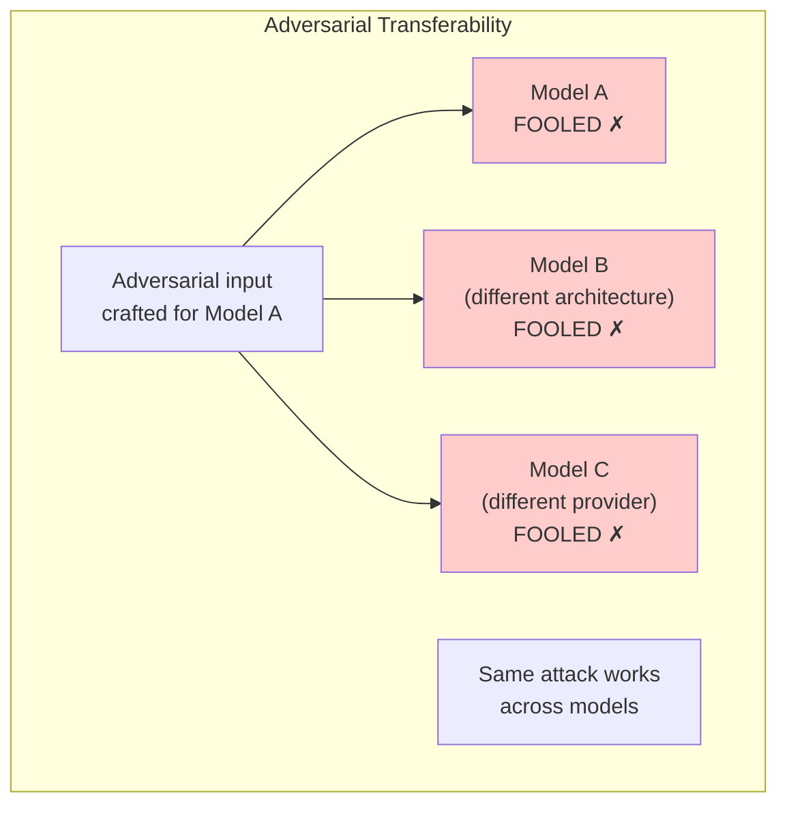
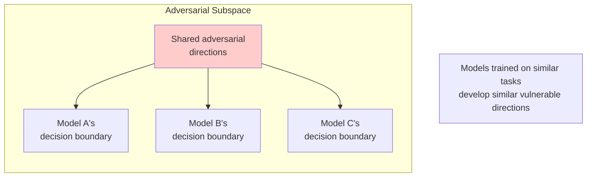
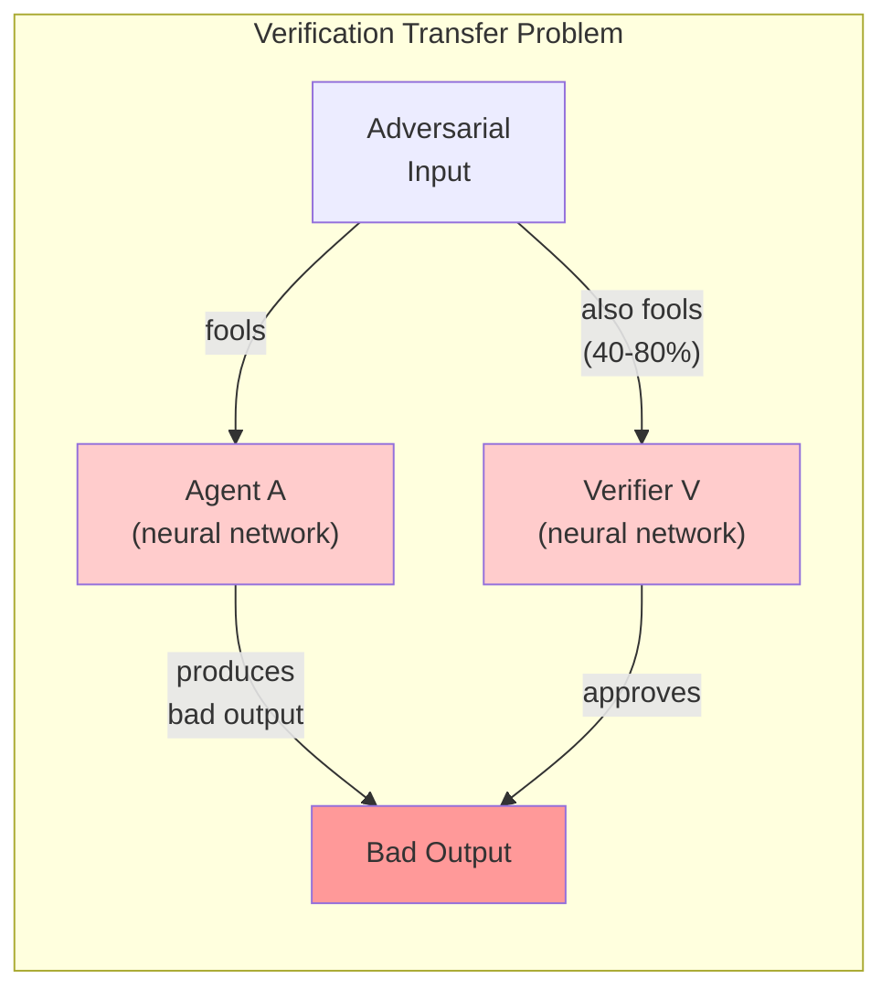
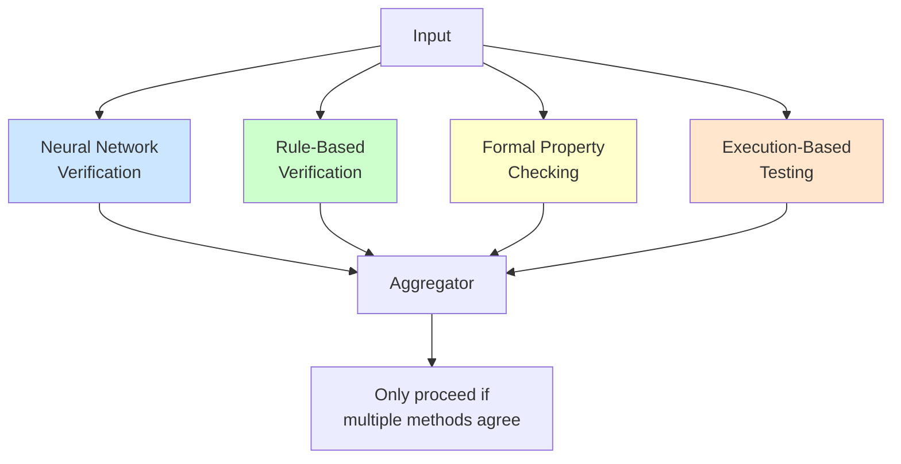

# Adversarial Transferability

One of the strongest empirical foundations for understanding correlated blind spots comes from adversarial machine learning. This page surveys the research on **why attacks that fool one model often fool others**—even models with different architectures, training data, and providers.

This phenomenon directly explains why "just use a different model" often fails to provide true independence.

---

## The Core Finding

**Adversarial transferability**: An input crafted to fool Model A will often also fool Model B, even when:
- A and B have different architectures
- A and B were trained on different data
- A and B are from different providers
- The attacker has no access to B



**Implication for entanglement**: If verification Model V can be fooled by the same attacks that fool Agent Model A, then V provides less independent verification than assumed.

---

## Key Empirical Results

### Szegedy et al. (2013) - Discovery of Transferability

The paper that discovered adversarial examples also noted they transfer:

> "We found that the adversarial examples are relatively robust, and even transferable, across different hyperparameters or even across different models."

**Key finding**: Perturbations imperceptible to humans that cause misclassification transfer between different neural network architectures.

### Papernot et al. (2016) - Systematic Study

"Transferability in Machine Learning: from Phenomena to Black-Box Attacks using Adversarial Samples"

**Findings**:
- Transfer rates of 30-80% between different architectures
- Transfer works even to models trained on different subsets of data
- Transfer is more likely between models with similar decision boundaries

| Source Model | Target Model | Transfer Rate |
|--------------|--------------|---------------|
| DNN → DNN | Same architecture | 85-95% |
| DNN → DNN | Different architecture | 40-70% |
| DNN → Logistic Regression | Cross-family | 25-50% |
| CNN → CNN | Different depth | 60-80% |

### Tramèr et al. (2017) - The Space of Transferable Adversarial Examples

**Key insight**: Adversarial examples that transfer lie in a shared "adversarial subspace" across models.



**Quantification**: ~25-dimensional subspace captures most transferable attacks (in ImageNet-scale models).

### Liu et al. (2016) - Ensemble-Based Attacks

"Delving into Transferable Adversarial Examples and Black-box Attacks"

**Key finding**: Attacks optimized against an ensemble of models transfer better than attacks against single models.

**Transfer rates for ensemble-optimized attacks**:
| Ensemble Size | Transfer to Held-Out Model |
|---------------|---------------------------|
| 1 model | 40-50% |
| 3 models | 60-70% |
| 5 models | 70-80% |

**Implication**: Attackers can craft attacks that transfer to unknown verification models by optimizing against multiple surrogate models.

### Demontis et al. (2019) - Why Transferability Happens

"Why Do Adversarial Attacks Transfer?"

**Causal analysis**:
1. **Gradient alignment**: Models trained on similar data have aligned gradients
2. **Feature similarity**: Similar learned representations → similar vulnerabilities
3. **Optimization landscape**: SGD converges to solutions in similar loss basins

**Predictive factors for transfer**:
- Input gradient similarity: ρ = 0.7 correlation with transfer rate
- Feature representation similarity: ρ = 0.6 correlation
- Training data overlap: ρ = 0.4 correlation

---

## Types of Transfer

### Intra-Architecture Transfer

Transfer between models of the same architecture but different training runs.

**Transfer rate**: 80-95%

**Why**: Same architecture → same inductive biases → same vulnerable features

### Cross-Architecture Transfer

Transfer between different architectures (e.g., ResNet → VGG → Transformer).

**Transfer rate**: 40-70%

**Why**: Similar training objectives and data create similar learned features despite architectural differences.

### Cross-Task Transfer

Transfer between models trained for different tasks (e.g., classification → detection).

**Transfer rate**: 20-40%

**Why**: Low-level features are shared; high-level task-specific features differ.

### Cross-Domain Transfer

Transfer between models trained on different domains (e.g., ImageNet → medical images).

**Transfer rate**: 10-30%

**Why**: Some universal adversarial directions exist; domain-specific features don't transfer.

### Cross-Modality Transfer

Transfer between different modalities (e.g., vision → language).

**Transfer rate**: Limited but non-zero for multi-modal models

**Why**: Shared embedding spaces in multi-modal models create shared vulnerabilities.

---

## Factors Affecting Transfer

### Factors That INCREASE Transfer

| Factor | Effect | Mechanism |
|--------|--------|-----------|
| **Similar training data** | +++ | Same features learned |
| **Similar architecture** | ++ | Same inductive biases |
| **Similar training objective** | ++ | Same optima targeted |
| **Ensemble attack generation** | ++ | Finds shared vulnerabilities |
| **Input-space attacks** | + | Exploits shared low-level features |
| **Larger perturbation budget** | + | More room to find transferable directions |

### Factors That DECREASE Transfer

| Factor | Effect | Mechanism |
|--------|--------|-----------|
| **Adversarial training** | -- | Different robust features learned |
| **Different training data** | -- | Different features |
| **Input transformations** | - | Breaks pixel-level attacks |
| **Model-specific defenses** | - | Creates model-specific decision boundaries |
| **Fundamentally different approach** | --- | Different representation entirely |

### The Diversity Gradient

```
LOW DIVERSITY                              HIGH DIVERSITY
(High Transfer)                            (Low Transfer)

Same model      Same arch      Different    Different    Rule-based
same training   diff training  arch         paradigm     vs. neural
    │               │              │            │            │
    ▼               ▼              ▼            ▼            ▼
 95-100%        80-90%         40-70%       20-40%        5-15%
transfer        transfer       transfer     transfer      transfer
```

---

## Implications for Verification

### The Verification Transfer Problem

If Agent A and Verifier V are both neural networks:



**The math**:
- P(adversarial input fools A) = p_A
- P(same input fools V | fools A) = transfer_rate
- P(bad output approved) = p_A × transfer_rate

If p_A = 0.1 and transfer_rate = 0.6:
- Independent model predicts: 0.1 × 0.1 = 1%
- Actual rate: 0.1 × 0.6 = 6%
- **Entanglement tax: 6×**

### Provider Diversity Is Insufficient

Using GPT-4 for the agent and Claude for verification doesn't guarantee independence:

| Factor | GPT-4 vs Claude |
|--------|-----------------|
| Architecture | Both transformers |
| Training data | Significant overlap (web text) |
| Training objective | Similar (next token prediction + RLHF) |
| Fine-tuning approach | Similar (RLHF variants) |

**Expected transfer rate**: 40-60% (based on cross-architecture studies)

**This is much higher than the <1% that independence would provide.**

### What Actually Provides Independence

Based on the empirical literature:

| Verification Approach | Expected Transfer from Neural Agent |
|----------------------|-------------------------------------|
| Different neural network (same provider) | 60-80% |
| Different neural network (different provider) | 40-60% |
| Ensemble of neural networks | 30-50% (to non-ensemble-member) |
| Rule-based system | 5-15% |
| Formal verification | ~0% (but limited scope) |
| Human expert | 10-30% (different for different attack types) |
| Execution-based testing | ~0% for functional errors |

---

## Defensive Implications

### Ensemble Adversarial Training

**Tramèr et al. (2017)**: Training on adversarial examples from multiple models improves robustness to transfer attacks.

```
Standard training: Vulnerable to transfer attacks
Adversarial training (single model): Reduces transfer by ~30%
Ensemble adversarial training: Reduces transfer by ~50%
```

**Limitation**: Computationally expensive; may reduce accuracy on clean inputs.

### Input Transformation Defenses

Transformations that break pixel-level correlations:
- JPEG compression
- Spatial smoothing
- Feature squeezing
- Input randomization

**Effect on transfer**: Reduces transfer rate by 20-40%

**Limitation**: Sophisticated attacks can be made robust to transformations.

### Detecting Transferable Attacks

Characteristics of highly transferable attacks:
- Large gradient norm
- Alignment with dominant singular vectors of input-output Jacobian
- Perturbations in low-frequency components

**Detection approach**: Flag inputs with these characteristics for additional review.

### Diversity by Design

The most robust defense is true methodological diversity:



An adversarial input that fools the neural verifier is unlikely to also:
- Satisfy rule-based constraints
- Pass formal property checks
- Produce correct outputs when executed

---

## Measuring Transfer in Your System

### Protocol for Transfer Rate Estimation

```
1. GENERATE ADVERSARIAL SET
   - Use Agent A to process N inputs correctly
   - Apply adversarial perturbation to create A' that A mishandles

2. TEST VERIFIER
   - Submit A' to Verifier V
   - Measure: What fraction does V also mishandle?

3. CALCULATE TRANSFER RATE
   Transfer_rate = (V mishandles | A mishandles) / (A mishandles)

4. COMPARE TO INDEPENDENCE
   Independent baseline = P(V mishandles) [on clean inputs]
   Entanglement = Transfer_rate / Independent_baseline
```

### Red Flags in Transfer Testing

| Observation | Concern Level |
|-------------|---------------|
| Transfer rate > 50% | High - significant entanglement |
| Transfer rate > 30% | Medium - investigate |
| Transfer rate increases with attack strength | Attack is finding shared vulnerabilities |
| Transfer rate similar across attack types | Fundamental representation similarity |
| Black-box attacks transfer well | Models have aligned decision boundaries |

---

## Research Frontiers

### Open Questions

1. **Does transfer increase with model capability?** Some evidence suggests larger models have more aligned representations.

2. **How does RLHF affect transfer?** Models fine-tuned with similar reward models may have correlated preferences.

3. **Do chain-of-thought prompts increase or decrease transfer?** Explicit reasoning might expose shared failure modes.

4. **What's the lower bound on transfer for neural networks?** Is there an irreducible shared vulnerability?

5. **Can we train for anti-correlation?** Explicitly optimizing for diverse failure modes.

### Promising Directions

- **Certified independence**: Provable bounds on transfer rates
- **Adversarial diversity training**: Training verification models to fail differently from agents
- **Transfer-aware architecture design**: Building models with minimal shared representations
- **Hybrid systems**: Combining neural and non-neural methods systematically

---

## Key Takeaways

1. **Transfer is the norm, not the exception.** Expect 40-70% transfer between neural networks, even different architectures.

2. **Provider diversity helps but isn't sufficient.** Different providers use similar methods → similar vulnerabilities.

3. **Methodological diversity is essential.** The biggest transfer reduction comes from fundamentally different approaches (neural vs. rule-based vs. formal).

4. **Measure transfer empirically.** Don't assume independence—test for it.

5. **This research grounds the "correlation tax."** The entanglement section's warnings are backed by reproducible empirical findings.

---

## Key Papers

| Paper | Year | Key Contribution |
|-------|------|------------------|
| Szegedy et al. "Intriguing Properties" | 2013 | Discovery of transfer |
| Goodfellow et al. "Explaining and Harnessing" | 2014 | FGSM attack, transfer analysis |
| Papernot et al. "Transferability in ML" | 2016 | Systematic study |
| Liu et al. "Delving into Transferable" | 2016 | Ensemble attacks |
| Tramèr et al. "Space of Transferable" | 2017 | Adversarial subspace |
| Tramèr et al. "Ensemble Adversarial Training" | 2017 | Defense method |
| Demontis et al. "Why Transfer" | 2019 | Causal analysis |
| Salman et al. "Adversarially Robust Transfer" | 2020 | Robust model transfer |

---

See also:
- [Types of Entanglement](/entanglements/fundamentals/types/) - Passive entanglement from shared blind spots
- [Formal Definitions](/entanglements/fundamentals/formal-definitions/) - Mathematical treatment
- [Red Team Methodology](/entanglements/mitigation/red-team-methodology/) - Testing for transfer
- [Foundation Model Monoculture](/entanglements/case-studies/foundation-model-monoculture/) - Systemic transfer risk
