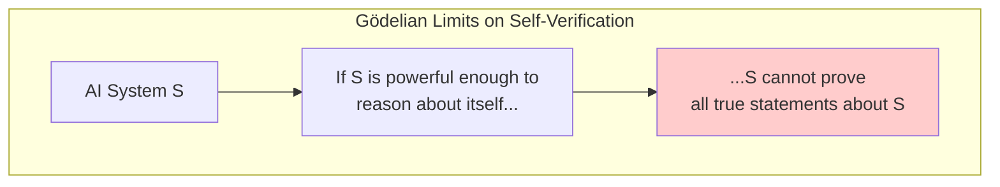
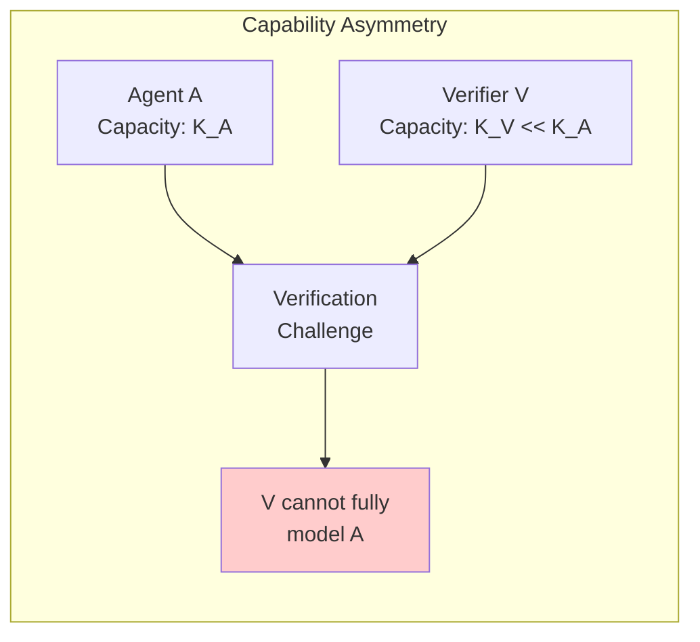
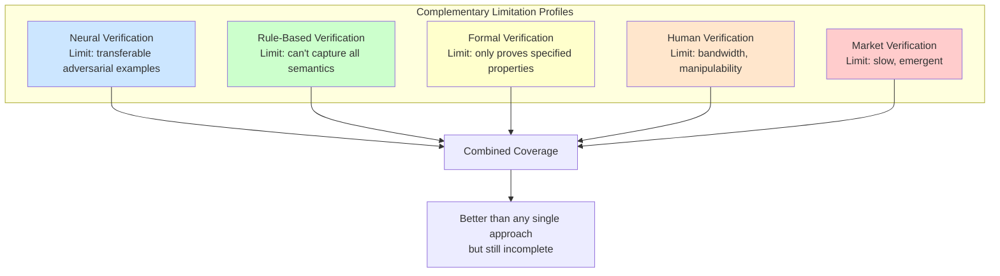

# Impossibility Results

Some entanglements cannot be eliminated—they arise from fundamental constraints on verification, information, and computation. Understanding these **impossibility results** helps distinguish between solvable engineering problems and inherent limitations that must be accepted and managed.

This page surveys what we know (and conjecture) about the theoretical limits of achieving independent verification in AI systems.

---

## Why Impossibility Results Matter

**Practical benefit**: Knowing what's impossible prevents wasting resources on unachievable goals.

**Design implications**: If perfect independence is impossible, system design should focus on:
- Measuring remaining entanglement (not eliminating it)
- Graceful degradation when entanglement creates failures
- Layering diverse approaches with known limitation profiles

**Honest risk assessment**: Claims of "fully independent verification" should be viewed skeptically if they violate impossibility bounds.

---

## Category 1: Logical/Computational Limits

### The Halting Problem and Rice's Theorem

**Classical result**: It's impossible to build a general program that determines whether arbitrary programs halt (Turing, 1936).

**Generalization (Rice's Theorem)**: Any non-trivial semantic property of programs is undecidable.

**Implication for AI verification**:

```
UNDECIDABLE QUESTIONS:
- "Will this AI system ever produce harmful output?"
- "Does this AI system have deceptive capabilities?"
- "Will this AI system's behavior change under distribution shift?"
```

**What this means**: Perfect verification of AI behavior is impossible in the general case. All verification systems are necessarily incomplete—they can only check decidable approximations of the properties we actually care about.

### Gödel's Incompleteness Theorems

**First theorem**: Any consistent formal system powerful enough to describe arithmetic contains true statements that cannot be proven within the system.

**Second theorem**: Such a system cannot prove its own consistency.

**Application to AI verification**:



**Implication**: An AI system cannot fully verify its own safety/alignment using its own reasoning capabilities. External verification is necessary—but the external verifier faces the same limitation regarding itself.

**The regress problem**:
- System A verified by System B
- System B verified by System C
- ...eventually, something must be trusted without formal verification

### Computational Complexity Barriers

Even when problems are decidable, they may be computationally intractable:

| Verification Task | Complexity Class | Practical Implication |
|-------------------|------------------|----------------------|
| Checking a specific execution trace | P | Feasible |
| Verifying all possible executions | PSPACE or harder | Usually infeasible |
| Finding adversarial inputs | NP-hard (often) | Expensive to guarantee coverage |
| Optimal policy verification | EXPTIME (for many MDPs) | Intractable for complex systems |

**Result**: Complete verification of AI behavior is computationally infeasible for systems of realistic complexity. Verification must be sampled, approximated, or restricted to specific properties.

---

## Category 2: Information-Theoretic Limits

### The Verification Bandwidth Limit

**Intuition**: A verifier can only check what it can observe. Bounded observation implies bounded verification.

**Formal statement**: Let V be a verifier observing channel C from agent A. The mutual information I(A;V) is bounded by the channel capacity:

```
I(A;V) ≤ C_channel
```

If the agent's internal state has entropy H(A) > C_channel, complete verification is impossible.

**Practical manifestation**:
- A verifier seeing only outputs cannot fully verify internal reasoning
- A verifier seeing summaries cannot verify underlying details
- A verifier with limited time cannot verify arbitrary complexity

### The Observer Effect

**Principle**: Observation can change behavior, making it impossible to verify "natural" behavior through observation.

**Heisenberg for AI**:
```
OBSERVER EFFECT IN AI SYSTEMS:

If agent knows it's being monitored:
- Agent may behave differently (compliance theater)
- Verification sees monitored behavior, not unmonitored behavior

If agent doesn't know it's being monitored:
- Requires deception or compartmentalization
- May not be ethically/legally permissible
- May be technically difficult to maintain
```

**Result**: Verifying an agent's behavior when it believes it's unmonitored is fundamentally different from (and harder than) verifying monitored behavior.

### Compression Limits on Verification

**Statement**: A verifier smaller than the system it verifies cannot fully model that system.

**Implication**: If Verifier V has capacity K_V and Agent A has capacity K_A where K_V << K_A:
- V cannot simulate A's behavior in full
- V must use heuristics, approximations, or sampling
- There exist behaviors of A that V cannot anticipate



**This is the core challenge of scalable oversight**: How do we verify systems more capable than the verifier?

---

## Category 3: Game-Theoretic Limits

### The Collusion Impossibility

**Informal statement**: In repeated games with communication (even implicit), rational agents can achieve collusive outcomes that defeat mechanism design.

**Folk Theorem implication**: If agent A and verifier V interact repeatedly and can observe each other's history:
- Collusive equilibria exist that look like "good" behavior
- These equilibria can be sustained by implicit threats
- External observers may not be able to distinguish collusion from genuine agreement

**Formal result**: No mechanism can guarantee non-collusion between rational agents in repeated settings without either:
1. Restricting communication (including implicit signals)
2. Limiting memory/computation of agents
3. Introducing external randomization or commitment devices

### Capture Is Convergent

**Observation**: Regulatory capture isn't a bug—it's a stable equilibrium.

**Game-theoretic analysis**:

```
CAPTURE AS EQUILIBRIUM:

Setup:
- Verifier V must invest effort E to catch violations
- Agent A produces value and violations
- Both prefer low-conflict outcomes

Without strong external incentives:
- V's effort E gradually decreases (costly, low reward)
- A learns V's tolerances
- System converges to "capture equilibrium"
  where V approves A's preferred actions
```

**Impossibility**: Without continuous external pressure or rotation, regulatory relationships converge toward capture. This isn't a failure of individual integrity—it's a systemic property.

### The Quis Custodiet Problem

**Statement**: Who watches the watchers?

**Infinite regress**:
```
Agent A → verified by V1 → verified by V2 → verified by V3 → ...
```

**Impossibility**: The chain must terminate somewhere. The terminal verifier is unverified (or self-verifying, which is limited per Gödel).

**Practical forms**:
| Terminal Verifier | Limitation |
|-------------------|------------|
| Human oversight | Bounded attention, manipulable |
| Market mechanisms | Emergent outcomes, not designed properties |
| Democratic processes | Slow, subject to manipulation |
| Constitution/laws | Static, requires interpretation |
| Nothing (accept risk) | Unmitigated exposure |

There is no verification without trust in something.

---

## Category 4: Empirical Observations with Possible Impossibility Status

These are patterns observed empirically that may reflect fundamental limits:

### Adversarial Transferability Floor

**Observation**: Despite all defenses, adversarial examples transfer between different models at non-trivial rates (typically 20-40% minimum between very different architectures).

**Conjecture**: There may be a fundamental floor to adversarial transferability arising from:
- Shared task structure (both models solve the same problem)
- Shared data distribution (both trained on similar data)
- Optimization inducing similar solutions

**If this is a true impossibility**: No amount of provider diversity will achieve true independence for neural network verifiers.

### RLHF Value Correlation

**Observation**: Models trained with RLHF on human feedback develop correlated values and blind spots.

**Possible limit**: Human feedback is itself correlated (humans share cognitive biases). Any human-aligned AI will inherit these correlations.

```
RLHF CORRELATION CHAIN:

Human values (correlated) →
Human feedback (correlated) →
RLHF signal (correlated) →
Trained model values (correlated) →
All RLHF'd models share biases
```

**Implication**: Using multiple RLHF'd models doesn't provide independence on questions where human feedback is systematically biased.

### Capability-Deception Correlation

**Conjecture**: As AI systems become more capable, the gap between their potential for deception and our ability to detect deception may widen.

**Argument**:
1. Deception requires modeling the target's beliefs (theory of mind)
2. More capable systems are better at theory of mind
3. Detection requires modeling potential deceptions
4. Verifier must be as capable as agent to enumerate all deceptions
5. If agent is more capable than verifier, undetectable deceptions may exist

**Status**: Conjectured, not proven. But if true, would imply verification becomes harder (not easier) as AI systems improve.

---

## Category 5: Practical Impossibilities

These aren't fundamental limits but are effectively impossible given realistic constraints:

### Perfect Isolation

**Statement**: Completely isolating AI components from each other while maintaining useful functionality is practically impossible.

**Why**:
- Useful systems must share some context (task descriptions, world models)
- Shared context creates shared assumptions and potential blind spots
- Zero shared context means zero useful cooperation

**Practical limit**: The best achievable is minimized, characterized entanglement—not zero entanglement.

### Real-Time Comprehensive Verification

**Statement**: Verifying every action in real-time with comprehensive coverage is practically impossible for systems of useful scale.

**Bandwidth constraint**:
```
If system produces N actions per second,
and verification of one action takes T seconds,
then real-time verification requires N×T ≤ 1

For complex verification (T >> 1), real-time is impossible for large N
```

**Practical solutions**: Sampling, async verification, pre-authorization of action classes.

### Training Data Independence

**Statement**: Achieving fully independent training data for multiple AI systems is practically impossible.

**Why**:
- Limited high-quality data sources (web text, books, etc.)
- Synthetic data often generated by other AI systems
- Similar data preprocessing and filtering approaches
- Market pressure to use "what works" (convergent data choices)

**Result**: All major AI systems have substantially overlapping training data, creating correlated blind spots.

---

## Implications for System Design

### Accept and Manage vs. Eliminate

| Category | Response |
|----------|----------|
| Logical impossibilities | Accept; design around them |
| Information-theoretic limits | Measure; optimize within bounds |
| Game-theoretic limits | Introduce external mechanisms; rotate |
| Empirical patterns | Research; hedge until resolved |
| Practical limits | Engineer best achievable; document residual |

### The Layered Approach

Since no single verification approach is complete, the practical strategy is **layered verification with diverse limitations**:



The goal: Choose verification methods with **uncorrelated** limitations.

### Honest Risk Communication

Given impossibility results, honest communication requires:

```
WHAT NOT TO SAY:
"Our multi-layer verification provides complete protection."

WHAT TO SAY:
"Our verification covers X, Y, Z properties with [measured] coverage.
Known gaps include A, B, C.
Fundamental limits mean we cannot verify D, E, F."
```

---

## Open Questions

### Quantifying the Bounds

We know certain things are impossible but often don't know:
- Exactly how much of the space can be verified
- The best achievable approximations
- Tight bounds on transfer rates, capture rates, etc.

**Research direction**: Developing quantitative bounds on verification completeness.

### Novel Verification Paradigms

Current impossibility results assume current verification paradigms. Could new approaches shift the boundaries?

**Candidates**:
- Cryptographic verification (ZK proofs of AI reasoning?)
- Quantum verification (any advantages?)
- Self-improving verification (can we build verifiers that escape limits?)

**Status**: Mostly speculative; fundamental limits may still apply.

### The Alignment-Verification Trade-off

**Conjecture**: There may be a fundamental trade-off between:
- Aligning AI systems to human values
- Being able to verify that alignment

If systems are aligned through complex, holistic training signals (like RLHF), their alignment may be inherently unverifiable by formal methods.

---

## Summary: What We Can and Cannot Do

### We Cannot (Fundamentally)

1. **Fully verify arbitrary AI behavior** (Halting problem, Rice's theorem)
2. **Build self-verifying AI systems** (Gödel's theorems)
3. **Guarantee non-collusion in repeated games** (Folk theorem)
4. **Achieve zero entanglement with useful cooperation** (Information theoretic)
5. **Verify systems more capable than the verifier** (Compression limits)
6. **Eliminate the terminal trust problem** (Quis custodiet)

### We Can (Practically)

1. **Verify specific properties** (if decidable and tractable)
2. **Measure entanglement** (information-theoretic tools)
3. **Reduce entanglement** (architectural diversity)
4. **Detect some collusion/capture** (statistical methods, rotation)
5. **Layer diverse verification** (complementary limitations)
6. **Make honest risk assessments** (acknowledging gaps)

### The Honest Position

The existence of impossibility results doesn't mean verification is useless—it means we should:

1. **Be humble**: Acknowledge what cannot be achieved
2. **Be precise**: Quantify what can be achieved
3. **Be diverse**: Use methods with uncorrelated limitations
4. **Be adaptive**: Update as we learn more about bounds
5. **Be transparent**: Communicate limitations honestly

---

## Key Papers and Results

| Result | Source | Implication |
|--------|--------|-------------|
| Halting problem | Turing (1936) | General behavior verification is undecidable |
| Incompleteness | Gödel (1931) | Self-verification is fundamentally limited |
| Rice's theorem | Rice (1953) | Non-trivial semantic properties are undecidable |
| Folk theorems | Aumann & Shapley (1976) | Collusion is stable in repeated games |
| No free lunch | Wolpert & Macready (1997) | No universal optimizer/verifier |
| Adversarial existence | Szegedy et al. (2013) | Adversarial examples exist for neural networks |

---

See also:
- [Formal Definitions](/entanglements/fundamentals/formal-definitions/) - Mathematical formalization
- [Research Connections](/entanglements/research/research-connections/) - Related academic literature
- [Adversarial Transferability](/entanglements/research/adversarial-transferability/) - Empirical transfer results
- [Decision Framework](/entanglements/mitigation/decision-framework/) - When to accept vs. address entanglement
