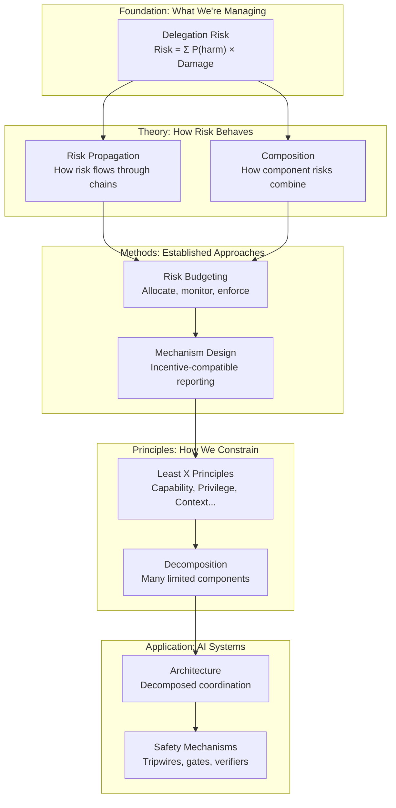
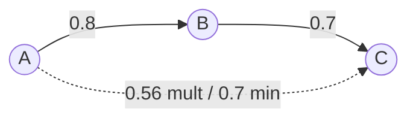
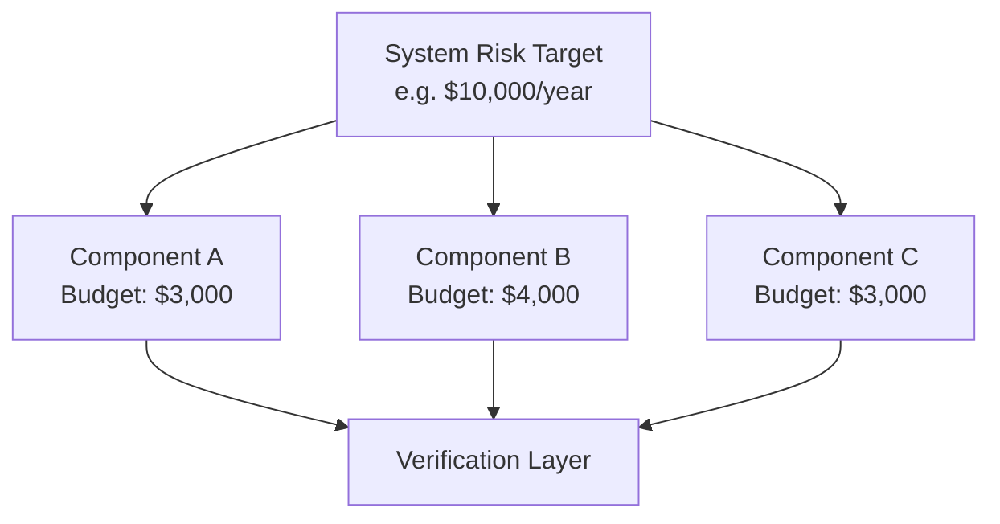
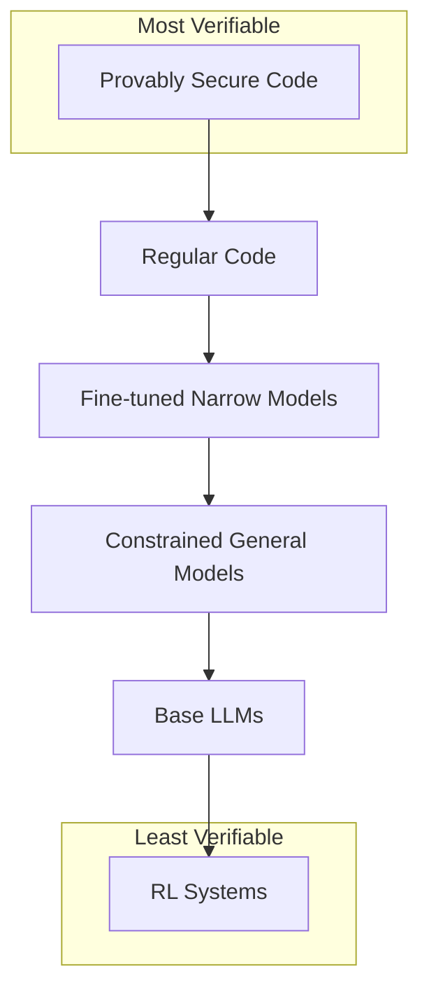
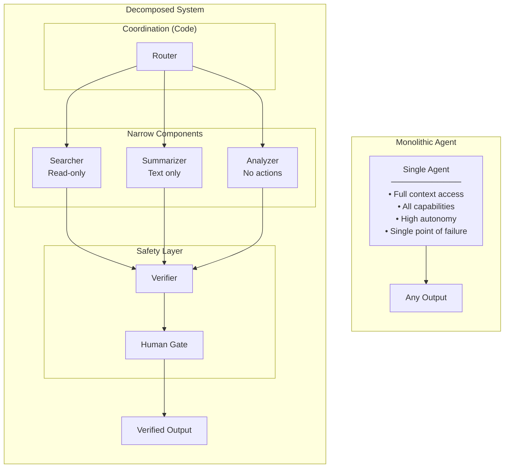

# Core Concepts

This page introduces the key ideas without mathematical formalism. For quantitative details, see [Delegation Risk](/delegation-risk/overview/).

## Framework Overview

How all the pieces fit together:

**Reading the diagram**: Delegation Risk is the foundation. Theory explains how it behaves. Methods provide established approaches from other fields. Principles give actionable constraints. Application shows how to build systems (with AI as primary focus).

## Delegation Risk

When you delegate a task, you're accepting **risk**—the potential for harm if the delegate fails or misbehaves.

**Delegation Risk** quantifies this: for each delegate, sum over all possible bad outcomes, weighted by their probability. A delegate with access to your bank account has higher Delegation Risk than one that can only read public web pages.

:::tip
Risk is finite and should be budgeted. Just as organizations allocate compute and money, they should allocate delegation risk—tracking how much they're accepting, from which delegates, for what purposes.
:::

### The Formula

**Delegation Risk = Σ P(harm mode) × Damage(harm mode)**

For each way something could go wrong (harm mode), multiply:
- The probability it happens
- The damage if it does

Sum across all harm modes to get total Delegation Risk.

### Example: Employee with Check-Writing Authority

| Harm Mode | Probability | Damage | Risk Contribution |
|-----------|-------------|--------|-------------------|
| Clerical error | 0.01 | $1,000 | $10 |
| Unauthorized payment | 0.001 | $50,000 | $50 |
| Fraud | 0.0001 | $500,000 | $50 |

**Delegation Risk** = $10 + $50 + $50 = **$110** expected cost

This doesn't mean you'll lose $110. It means that over many such delegations, you'd expect $110 in losses on average. You can compare this to the value the delegation provides and decide if it's worth it.

## Risk Propagation

When delegates delegate to other delegates, risk relationships form networks. If A trusts B with weight 0.8, and B trusts C with weight 0.7, how much should A trust C?

Different rules give different answers:
- **Multiplicative**: 0.8 × 0.7 = 0.56 (each stage is independent risk)
- **Minimum**: min(0.8, 0.7) = 0.7 (chain only as strong as weakest link)
- **Discounted**: More complex models accounting for path length

The right rule depends on what "trust" means in your context. The framework provides formal tools for reasoning about these relationships.

Choosing a propagation rule

| Rule | Formula | Best when... |
|------|---------|--------------|
| **Multiplicative** | T(A→C) = T(A→B) × T(B→C) | Each delegation is independent risk; default choice |
| **Minimum** | T(A→C) = min(T(A→B), T(B→C)) | Chain only as strong as weakest link |
| **Discounted** | T(A→C) = T(A→B) × T(B→C) × δⁿ | Longer paths inherently less trustworthy |
| **Maximum path** | T(A→C) = max over all paths | Any valid route suffices |

Most systems should start with **multiplicative** propagation—it's intuitive, conservative, and composes well.

:::note[Related: Social Choice Theory]
Trust aggregation across multiple delegates relates to [social choice theory](https://en.wikipedia.org/wiki/Social_choice_theory)—how to combine individual inputs into collective outcomes. [Arrow's impossibility theorem](https://en.wikipedia.org/wiki/Arrow%27s_impossibility_theorem) has implications for trust aggregation: no perfect rule exists.
:::

## Decomposition Over Monoliths

A single powerful delegate is dangerous because it concentrates capability, context, and control. If it fails or acts against you, the damage is unbounded.

**Decomposition** breaks this pattern:
- Split tasks across many specialized components
- Each component has limited capability and context
- No single component can cause catastrophic harm
- Components can't easily coordinate against the system

Think of it like [separation of powers](https://en.wikipedia.org/wiki/Separation_of_powers) in government, or [microservices](https://en.wikipedia.org/wiki/Microservices) in software architecture.

### Example: Organizational Analogy

| Aspect | Centralized | Decomposed |
|--------|-------------|------------|
| **Single point of failure** | CEO makes all decisions | Authority distributed across roles |
| **Blast radius** | Bad CEO decision affects everything | Bad decision contained to department |
| **Coordination risk** | CEO can pursue personal agenda | Requires multiple people to collude |
| **Verification** | Must verify CEO's judgment on everything | Verify narrow, specific behaviors |

The same logic applies to software systems and AI agents.

## The "Least X" Principles

Security engineering has the [principle of least privilege](https://en.wikipedia.org/wiki/Principle_of_least_privilege): give each component minimum necessary access. We extend this across multiple dimensions:

- **Least Capability**: Minimum ability to take actions
- **Least Privilege**: Minimum permissions and access rights
- **Least Context**: Minimum information about the broader system
- **Least Persistence**: Minimum state maintained across invocations
- **Least Autonomy**: Minimum ability to act without oversight
- **Least Connectivity**: Minimum communication paths between components

Each principle bounds a different attack surface. Applied together, they create components that are limited in what they can do, know, remember, and coordinate.

Why each principle matters

| Principle | What it limits | Risk bounded |
|-----------|---------------|--------------|
| Least Capability | Ability to act | Direct damage from actions |
| Least Privilege | Access rights | Scope of potential harm |
| Least Context | System knowledge | Strategic planning against system |
| Least Persistence | Memory across calls | Long-term planning, accumulating leverage |
| Least Autonomy | Unsupervised action | Scope of damage before intervention |
| Least Connectivity | Communication paths | Coordination between components |

## Risk Budgeting

Borrowed from finance and nuclear safety: set a total acceptable risk level for the system, then allocate risk budgets to components.

Key requirements:
- **Compositional guarantees**: Component risks must aggregate predictably
- **Principled allocation**: Methods like [Euler allocation](/cross-domain-methods/euler-allocation/) ensure budgets sum correctly
- **Incentive-compatible reporting**: Mechanisms that make honest risk reporting optimal
- **Verification infrastructure**: Independent confirmation that claimed levels match reality
- **Conservative margins**: Buffer for uncertainty and unknowns

:::note
This isn't theoretical—nuclear plants operate at 10⁻⁹ failure probability per reactor-year by flowing system targets down to component budgets through fault trees.
:::

## Architectural Safety

The central claim: safety can be a property of system architecture, not just individual component behavior.

If you can't guarantee a delegate is trustworthy, you can still:
- Limit what they can access (least privilege)
- Limit what they know (least context)
- Limit what they can coordinate (decomposition)
- Limit how much damage they can cause (risk budgets)
- Verify their behavior matches claims (verification layers)

:::caution
These structural constraints provide defense in depth. They don't replace selecting trustworthy delegates—they bound the damage when trust is misplaced.
:::

---

## Application to AI Systems

The framework applies generally, but AI systems are our primary focus. For AI specifically:

### Verifiability Hierarchy

Not all implementations are equally trustworthy:

1. **Provably secure code** — Mathematical guarantees of correctness
2. **Regular code** — Auditable, testable, deterministic
3. **Fine-tuned narrow models** — Predictable within a specific domain
4. **Constrained general models** — LLMs with extensive prompting and evaluation
5. **Base LLMs** — General capability, harder to verify
6. **RL systems** — Learned policies, least predictable

:::note[Design Principle]
Use the most verifiable implementation that achieves the required functionality. Don't use a frontier LLM for tasks that can be done with code or a narrow model.
:::

When to use each level

| Level | Use when... | Example |
|-------|-------------|---------|
| Provably secure code | Correctness is critical, logic is simple | Access control checks, rate limiters |
| Regular code | Behavior is fully specifiable | Data transformation, API routing |
| Fine-tuned narrow models | Task is well-defined, training data exists | Sentiment classification, entity extraction |
| Constrained general models | Judgment needed, outcomes recoverable | Draft generation, summarization |
| Base LLMs | Maximum flexibility needed, heavy oversight | Creative tasks, complex reasoning |
| RL systems | Learning from feedback is essential | Rarely recommended for safety-critical paths |

### Architectural Spectrum: Monolithic vs Decomposed

Real systems exist on a spectrum. This diagram shows two stylized endpoints:

| Aspect | Monolithic | Decomposed |
|--------|------------|------------|
| **Single point of failure** | Yes—one bad output, system fails | No—failure isolated to component |
| **Attack surface** | Entire model capability | Only exposed component interfaces |
| **Verification** | Must verify everything the model can do | Verify narrow, specific behaviors |
| **Blast radius** | Unlimited—model can do anything | Bounded—each component has limits |
| **Coordination risk** | Model coordinates with itself | Components can't easily collude |

---

## What This Framework Provides

1. **Vocabulary**: Precise terms for discussing risk, delegation, and containment
2. **Theory**: Mathematics for risk propagation, capability quantification, and optimization
3. **Methods**: Established approaches adapted from finance, nuclear safety, mechanism design
4. **Principles**: Actionable design constraints (the "Least X" family)
5. **Patterns**: Decomposed coordination, verification layers, safety mechanisms

The goal is infrastructure for safely delegating at scale—not a complete solution to trust, but a foundation for managing risk as capabilities increase.

### The Optimization Problem

The framework isn't just about minimizing risk—it's about **maximizing capability subject to risk constraints**:

$$\max \text{Capability} \quad \text{s.t.} \quad \text{DelegationRisk} \leq \text{Budget}$$

Where **Capability = Power × Agency**:
- **Power**: Ability to achieve diverse goals (what can the system accomplish?)
- **Agency**: Coherence of goal-pursuit (how optimizer-like is the system?)

See [Agent, Power, and Authority](/power-dynamics/agent-power-formalization/) for full formalization.

---

## Key Takeaways

:::note[Key Takeaways]
1. **The goal is maximizing capability subject to risk constraints**: Not minimizing risk to zero
2. **Capability = Power × Agency**: We want high power, minimum necessary agency
3. **Delegation Risk quantifies the downside**: Risk = Σ P(harm) × Damage
4. **Decompose, don't centralize**: Many limited components are safer than one powerful delegate
5. **Apply "Least X" principles**: Minimize capability, privilege, context, persistence, autonomy, connectivity
6. **Budget both risk AND power**: Allocate, verify, and enforce limits on both sides
7. **High power + low agency may be optimal**: "Strong tools" provide capability without coherent optimization pressure
:::

## See Also

- [Introduction](/getting-started/introduction/) — The full problem statement and approach
- [Delegation Risk Overview](/delegation-risk/overview/) — The quantitative foundation
- [Least X Principles](/design-patterns/least-x-principles/) — Deep dive into each principle
- [Quick Start](/design-patterns/tools/quick-start/) — Apply these concepts step-by-step
