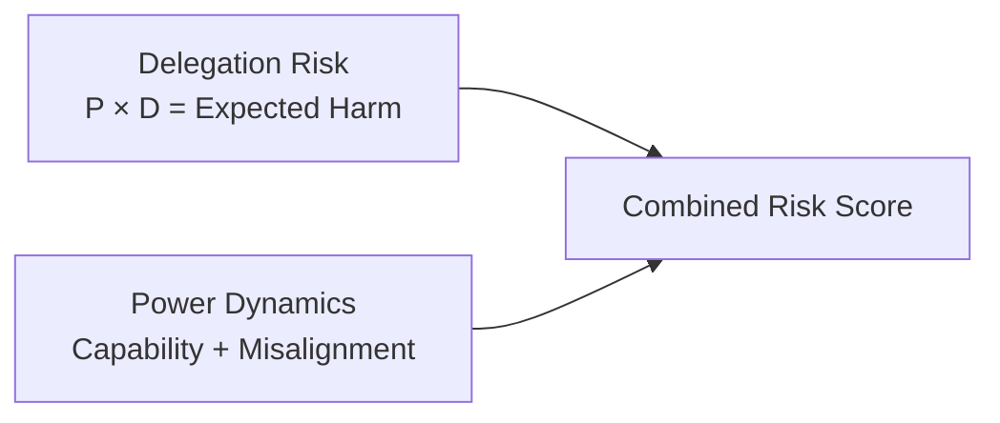
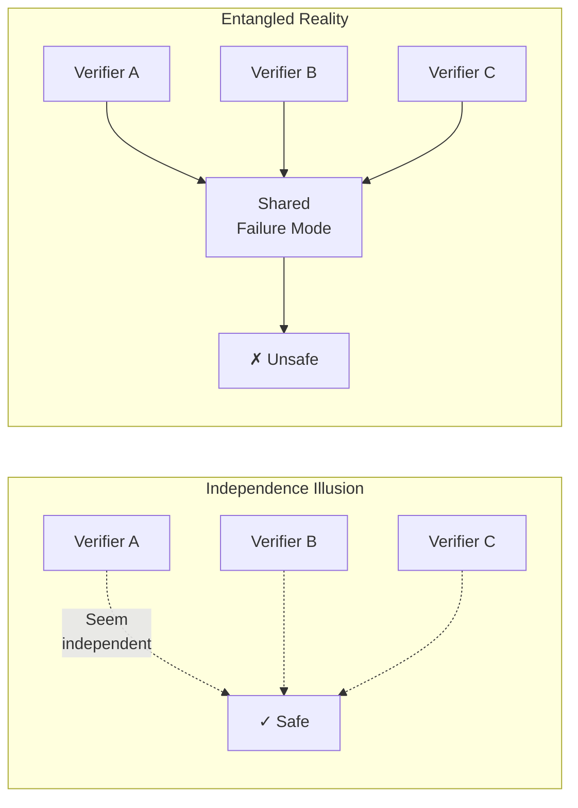

# How Sections Connect

This page explains why the documentation is organized the way it is and how the pieces fit together.

## The Core Logic

The Delegation Risk Framework follows a specific logical structure:

```mermaid
flowchart LR
    subgraph Problem["1. Problem"]
        P1[Delegation creates risk]
        P2[Risk compounds through hierarchies]
        P3[Independence assumptions often fail]
    end

    subgraph Quantify["2. Quantify"]
        Q1[Define harm modes]
        Q2[Estimate probabilities]
        Q3[Calculate total risk]
    end

    subgraph Constrain["3. Constrain"]
        C1[Set risk budgets]
        C2[Allocate to components]
        C3[Verify constraints hold]
    end

    subgraph Mitigate["4. Mitigate"]
        M1[Apply design patterns]
        M2[Monitor for drift]
        M3[Respond to incidents]
    end

    Problem --> Quantify --> Constrain --> Mitigate
```

Each major section corresponds to one or more steps in this logic.

---

## Section Relationships

### Getting Started → Everything Else
**What it provides:** The conceptual vocabulary and intuition needed to understand any other section.

**Key insight:** "Delegation risk is quantifiable using probability × damage, summed across harm modes."

Without this foundation, the math in Delegation Risk will seem arbitrary and the patterns in Design Patterns will seem unmotivated.

### Delegation Risk ↔ Power Dynamics
**Relationship:** Complementary quantification approaches.

- **Delegation Risk** asks: "How much harm could happen?"
- **Power Dynamics** asks: "How much capability does each component have?"

Together they answer: "What's the worst-case if this component defects, and how likely is that?"

### Entanglements → Design Patterns
**Relationship:** Problem definition → Solution catalog.

**Entanglements** explains why naive safety approaches fail—components that seem independent actually share failure modes, creating correlated risks that multiply.

**Design Patterns** provides solutions that actually work given entanglement constraints.

:::tip
If you read Design Patterns without understanding Entanglements, you'll miss why certain patterns (like diverse verification) are necessary.
:::

### Theory Sections → Case Studies
**Relationship:** Abstract concepts → Concrete examples.

Each case study illustrates concepts from the theory sections:

| Case Study | Illustrates |
|------------|-------------|
| Sydney | Constraint failures, harm mode analysis |
| Code Review Bot | Design patterns in practice |
| Nuclear Safety | Cross-domain method applicability |
| Financial Failures | Entanglement risks |

### Cross-Domain Methods → Everything
**Relationship:** External validation and borrowed techniques.

Cross-Domain Methods shows that delegation risk isn't novel—nuclear safety, finance, and other fields have grappled with similar problems for decades. This section provides:

- Proven techniques we can adapt
- Historical examples of what works (and fails)
- Confidence that risk budgeting is achievable

### Research → Experimental
**Relationship:** Theoretical foundations → Practical tools.

**Research** provides the academic grounding: linear logic for consumable resources, mechanism design for incentive compatibility, formal verification limits.

**Experimental** takes these ideas and makes them practical: Squiggle distributions, calibration tools, Monte Carlo analysis.

---

## The "Why This Order" Explanation

### Why Theory Before Application?

You could jump straight to Design Patterns. Many readers do. But without theory:

- Patterns seem like arbitrary rules rather than principled solutions
- You won't know which patterns apply to your situation
- You'll miss dangerous edge cases the patterns are designed for

The theory sections exist to make pattern selection principled rather than guesswork.

### Why Entanglements Gets Its Own Section?

Entanglement is subtle enough that it deserves extended treatment. Many systems that look safe under independence assumptions become dangerous when components share failure modes.

The "Independence Illusion" diagram in the Entanglements index illustrates why this matters:

### Why Case Studies Are Application, Not Theory?

Case studies aren't about proving the theory—they're about showing how to apply it. Each case study is a worked example:

1. Here's a real (or realistic) system
2. Here's how delegation risk analysis applies
3. Here's what we learn about design

This is why Case Studies depends on both Theory and Design Patterns.

---

## Common Reading Mistakes

### Mistake 1: Jumping to Design Patterns
**Problem:** You implement patterns without understanding why they work.
**Result:** Patterns applied incorrectly or in wrong situations.
**Fix:** Read at least Core Concepts first.

### Mistake 2: Skipping Entanglements
**Problem:** You assume your verification layers are independent.
**Result:** Correlated failures that bypass all your safety measures.
**Fix:** Read Entanglements before finalizing architecture.

### Mistake 3: Reading Research First
**Problem:** You get lost in theory without practical grounding.
**Result:** Can't connect abstract concepts to real systems.
**Fix:** Read Theory and Application sections first.

### Mistake 4: Only Reading Case Studies
**Problem:** You learn specific examples but not general principles.
**Result:** Can't apply lessons to your different situation.
**Fix:** Use case studies to reinforce, not replace, theory.

---

## Quick Navigation

From here, you can:

- **Start learning:** [Core Concepts](/getting-started/core-concepts/)
- **See all paths:** [Reading Order](/getting-started/reading-order/)
- **Jump to patterns:** [Design Patterns](/design-patterns/) (if you already understand the basics)
- **See the map:** [Site Map](/reference/site-map/)
