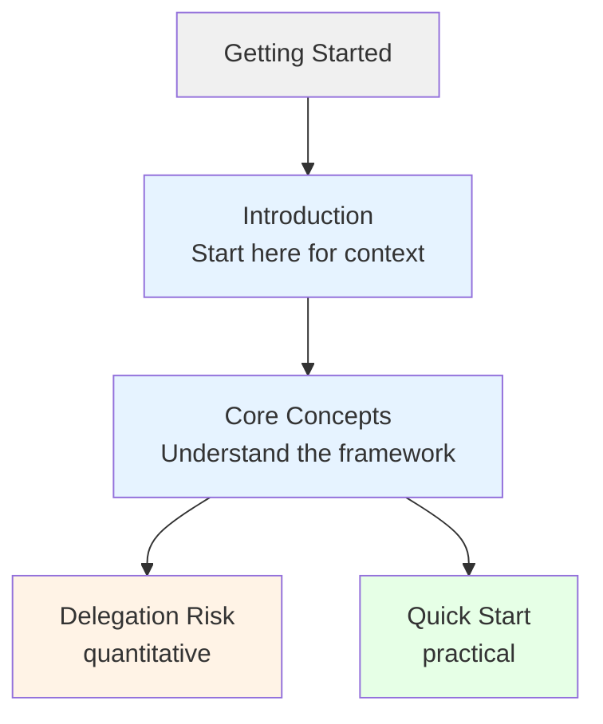

This section helps you understand Delegation Risk at whatever depth you need.

## Choose Your Path

### Quick Understanding (5-10 minutes)
If you want the core ideas fast:
1. **[Five-Minute Intro](/getting-started/five-minute-intro/)** — The essential concepts in one page

### Solid Foundation (30-60 minutes)
If you're evaluating whether this framework is useful:
1. **[Introduction](/getting-started/introduction/)** — The problem we're solving and our approach
2. **[Core Concepts](/getting-started/core-concepts/)** — Key ideas with visual framework diagram
3. **[FAQ](/getting-started/faq/)** — Common objections answered

### Ready to Apply (2-3 hours)
If you want to use this framework on a real system:
1. **[Introduction](/getting-started/introduction/)** — Problem context
2. **[Core Concepts](/getting-started/core-concepts/)** — The conceptual foundation
3. **[Delegation Risk](/delegation-risk/)** — Quantitative details
4. **[Quick Start](/design-patterns/tools/quick-start/)** — Step-by-step application checklist

## Section Contents

| Page | Purpose | Reading Time |
|------|---------|--------------|
| [Introduction](/getting-started/introduction/) | Why delegation risk matters, the core problem | 10 min |
| [Five-Minute Intro](/getting-started/five-minute-intro/) | Compressed overview for busy readers | 5 min |
| [Core Concepts](/getting-started/core-concepts/) | Visual framework, key ideas without math | 20 min |
| [FAQ](/getting-started/faq/) | Objections, edge cases, clarifications | 15 min |
| [Glossary](/getting-started/glossary/) | Term definitions (reference) | — |
| [Reading Order](/getting-started/reading-order/) | Prerequisites and goal-based paths | 5 min |
| [How Sections Connect](/getting-started/how-sections-connect/) | Understanding the logical structure | 10 min |
| [Quick Reference](/getting-started/quick-reference/) | Formulas, flowcharts, checklists | 5 min |
| [Minimal Framework](/getting-started/minimal-framework/) | The 80/20 version for small teams | 10 min |
| [Common Mistakes](/getting-started/common-mistakes/) | What teams get wrong | 15 min |
| [For Engineers](/getting-started/for-engineers/) | Implementation-focused path | 15 min |
| [Examples Catalog](/getting-started/examples-catalog/) | Index of all worked examples | — |

## How This Section Connects

## Next Steps

Once you understand the basics:
- **Want the math?** → [Delegation Risk](/delegation-risk/) for quantitative foundations
- **Want to apply it?** → [Design Patterns](/design-patterns/) for practical guidance
- **Want examples?** → [Case Studies](/case-studies/) for real-world applications
