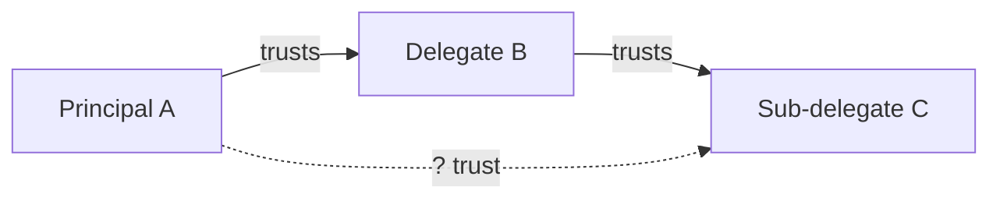

# Introduction

## The Problem

Delegation is everywhere. Organizations delegate to employees. Governments delegate to agencies. Software systems delegate to subsystems. And increasingly, AI agents delegate to other AI agents.

Every delegation involves risk. When you delegate a task, you're accepting potential downside—the delegate might fail, make mistakes, or act against your interests. The same capabilities that make a delegate useful make failures potentially serious.

**Capability without containment**: A highly capable delegate can accomplish impressive tasks—but those same capabilities enable serious harm if something goes wrong. An employee with signing authority can commit fraud. A software system with database access can corrupt data. An AI agent that can write code can write malicious code.

**Delegation without verification**: When delegates delegate to other delegates, risk relationships multiply. If A trusts B, and B trusts C, how much should A trust C? Most systems have no principled answer.

**Autonomy without accountability**: As delegates operate with less oversight, we need structural guarantees—not just hopes—that they remain within acceptable risk bounds.

The goal isn't to prevent delegation. It's to ensure that as we delegate more—to people, systems, and AI—we have infrastructure to do so safely.

:::note
This framework focuses on **structural** safety—architectural properties that bound potential harm regardless of delegate behavior. It complements, rather than replaces, efforts to select trustworthy delegates.
:::

## The Approach

This framework proposes **structural constraints** as the foundation for managing delegation risk. Rather than relying solely on:

- Selecting trustworthy delegates (which may not scale or generalize)
- Oversight of every action (which doesn't scale)
- Post-hoc detection of problems (which may be too late)

We focus on **architectural properties** that make dangerous behavior difficult or impossible, regardless of delegate intentions.

The core ideas:

1. **Risk as a quantifiable resource**: Every delegation involves risk. We can measure it, budget it, and optimize it—just like compute or money.

2. **Containment through decomposition**: Instead of one powerful delegate handling everything, decompose tasks across many limited components. No single component has enough capability, context, or connectivity to cause catastrophic harm.

3. **Principles that bound behavior**: The "Least X" family of principles (least privilege, least capability, least context, etc.) provides a systematic framework for limiting what each component can do.

4. **Cross-domain wisdom**: Nuclear safety, financial risk management, and mechanism design have decades of experience managing quantified risk. We adapt their methods.

## Primary Application: AI Systems

While this framework applies to delegation generally, **AI systems are our primary focus**. AI agents present delegation challenges at unprecedented scale:

- **Capabilities expanding rapidly**: AI capabilities grow faster than our ability to verify them
- **Agent-to-agent delegation**: When AI agents delegate to other AI agents, risk relationships become complex networks
- **Reduced human oversight**: As systems become more autonomous, structural constraints must replace human monitoring
- **Unknown failure modes**: We're building systems we don't fully understand

The framework provides infrastructure for safely deploying AI at scale—not by solving alignment, but by bounding the damage from any single component.

## Who This Is For

This framework is relevant for:

- **Risk managers** thinking about delegation in any domain
- **AI safety researchers** working on scalable containment approaches
- **ML engineers** building agentic systems who want principled safety constraints
- **Organizations** deploying AI systems that need risk management frameworks
- **Policy makers** looking for concrete technical approaches to AI governance

What each audience will find most useful

| Audience | Start with | Key sections |
|----------|------------|--------------|
| **Risk managers** | Delegation Risk Overview | Cross-domain methods, risk budgeting |
| **AI safety researchers** | Delegation Risk Overview | Risk inheritance, optimization, formal properties |
| **ML engineers** | Least X Principles | AI architecture examples, implementation patterns |
| **Organizations** | Risk Budgeting Overview | Euler allocation, mechanism design, empirical tests |
| **Policy makers** | Core Concepts | Applications, Related Approaches |

## How to Read This Documentation

The documentation is organized from **general theory to specific applications**:

**Delegation Risk Theory → Cross-Domain Methods → Design Principles → Applications → AI Systems → Implementation**

Section details

### Delegation Risk Theory
The mathematical foundation. Delegation Risk = Σ P(harm) × Damage. How to quantify, compose, and optimize delegation risk.

### Cross-Domain Methods
Proven approaches from finance (Euler allocation), nuclear safety (fault trees, PRA), and mechanism design (incentive compatibility). How other domains manage comparable risks.

### Design Principles
The "Least X" principles: least privilege, least capability, least context, least autonomy. Actionable constraints you can apply immediately.

### Applications
How the framework applies beyond AI: organizational trust, criminal justice, open source governance, and more. Demonstrates the generality of the approach.

### AI Systems
Specific guidance for AI: decomposed coordination, safety mechanisms, worked examples of AI architectures using the framework.

### Implementation
Practical guidance: empirical validation approaches, cost-benefit analysis, and roadmap for adoption.

## Key Insight

The central insight is that **safety can be architectural, not just behavioral**.

We don't need perfect trust if we can build systems where:
- No delegate has enough power to cause catastrophic harm
- Delegates can't coordinate to amplify their power
- Risk relationships are explicit and bounded
- Failures are contained and recoverable

:::tip[Key Insight]
Safety can be **architectural**, not just behavioral. Even if we can't guarantee a delegate is trustworthy, we can build systems where no component has enough power to cause catastrophic harm.
:::

This doesn't replace efforts to select trustworthy delegates—it complements them. Structural constraints provide defense in depth.

## Getting Started

:::tip[Getting Started]
If you're new, start with:
1. [Core Concepts](/getting-started/core-concepts/) — Key ideas without mathematical formalism
2. [Delegation Risk Overview](/framework/overview/) — The quantitative foundation
3. [Least X Principles](/applying/least-x-principles/) — Actionable design constraints
:::

---

## Key Takeaways

:::note[Key Takeaways]
1. **Risk is quantifiable**: Delegation Risk = Σ P(harm) × Damage
2. **Safety can be structural**: Architectural constraints can bound harm regardless of delegate behavior
3. **Decomposition limits risk**: No single component should have enough power to cause catastrophe
4. **Cross-domain methods work**: Nuclear, finance, and mechanism design have solved similar problems
5. **AI is our primary application**: The framework is general but AI systems are our focus
:::

## Further Reading

### Key Background
- Gwern. [*Why Tool AIs Want to Be Agent AIs*](https://gwern.net/tool-ai) — Economic pressures toward agentic AI
- Greenblatt, R., et al. (2024). [*AI Control*](https://arxiv.org/abs/2312.06942) — Safety despite potential scheming
- Drexler, K.E. (2019). [*Comprehensive AI Services*](https://www.fhi.ox.ac.uk/reframing/) — Narrow services approach

### Related Concepts
- [Defense in Depth](https://en.wikipedia.org/wiki/Defense_in_depth_(computing)) — Multiple independent safety barriers
- [Separation of Powers](https://en.wikipedia.org/wiki/Separation_of_powers) — Distributing authority to prevent concentration
- [Principal-Agent Problem](https://en.wikipedia.org/wiki/Principal%E2%80%93agent_problem) — Information asymmetry in delegation

See the [full bibliography](/reference/bibliography/) for comprehensive references.

---

## See Also

- [Core Concepts](/getting-started/core-concepts/) — Key ideas without mathematical formalism
- [Quick Start](/applying/tools/quick-start/) — Step-by-step application checklist
- [Glossary](/getting-started/glossary/) — Terminology reference
