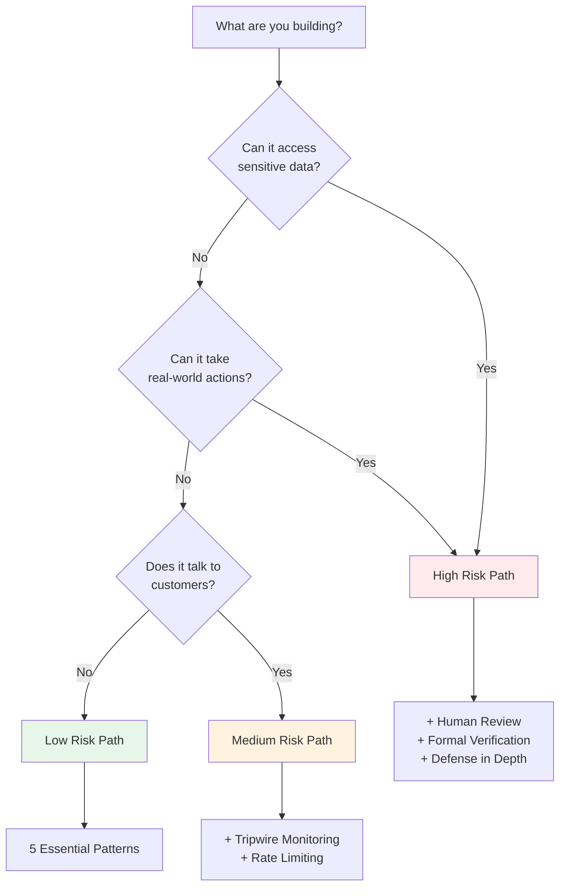

# Minimal Viable Framework

You don't need all 45 patterns. Here's what actually matters.

---

## The Core Insight (30 seconds)

**Delegation Risk = Σ P(harm) × Damage**

Every time you delegate to an AI system, you're accepting expected harm in exchange for capability. Make this tradeoff explicit.

---

## The 5 Essential Patterns

If you implement nothing else, implement these:

### 1. Least Privilege
**Give the minimum permissions needed for the task.**

```
❌ AI has admin access to everything
✓ AI can only read/write files in /workspace
```

### 2. Human Escalation
**High-stakes decisions go to humans.**

```
❌ AI executes all actions autonomously
✓ Actions over $1000 require human approval
```

### 3. Output Filtering
**Check outputs before they reach the world.**

```
❌ AI response goes directly to user
✓ Filter checks for PII, harmful content, policy violations
```

### 4. Sandboxing
**Limit what can go wrong.**

```
❌ AI runs on production server
✓ AI runs in isolated container with no network access
```

### 5. Audit Logging
**Record everything for when things go wrong.**

```
❌ No logs, can't investigate incidents
✓ All inputs, outputs, and decisions logged with timestamps
```

---

## Can I Skip...?

### Entanglements Section?
**Skip if:** Your system has < 3 components, or you use completely different models for each component.

**Don't skip if:** You have multiple AI verifiers, use the same base model in multiple places, or components share training data.

### Power Dynamics Section?
**Skip if:** You just want to implement patterns, not understand the theory.

**Don't skip if:** You need to justify decisions to stakeholders or want to optimize capability/risk tradeoffs.

### Research Section?
**Skip if:** You're implementing, not doing research.

**Read if:** You want to understand the theoretical foundations or contribute improvements.

### Cross-Domain Methods?
**Skip if:** You trust the patterns as-is.

**Read if:** You want to understand why these methods work (nuclear, finance precedents).

---

## Low-Risk vs High-Risk Decision



---

## Minimum Viable Implementation Checklist

### Phase 1: Foundation (1 day)
- [ ] Define your harm modes (what could go wrong?)
- [ ] Set a risk budget (how much harm is acceptable?)
- [ ] Implement least privilege (minimum permissions)

### Phase 2: Safety Basics (1 week)
- [ ] Add output filtering
- [ ] Implement human escalation for high-stakes
- [ ] Set up audit logging
- [ ] Create a sandbox environment

### Phase 3: Monitoring (2 weeks)
- [ ] Add basic anomaly detection
- [ ] Set up alerting for unusual patterns
- [ ] Review logs weekly

### Phase 4: Iteration (Ongoing)
- [ ] Track actual vs. expected harm
- [ ] Adjust risk budgets based on data
- [ ] Add patterns as needed

---

## When to Expand

Add more patterns when:

| Signal | Suggested Addition |
|--------|-------------------|
| Failures are correlated | Read Entanglements, add diversity |
| Human review bottleneck | Add AI verifiers, graduated autonomy |
| Novel attacks detected | Add tripwires, adversarial testing |
| Cascading failures | Add bulkheads, blast radius containment |
| Trust is miscalibrated | Add trust decay, capability sunset |

---

## What This Framework Is NOT

- **Not an alignment solution** — Assumes components may be misaligned
- **Not formal verification** — Probabilistic, not provable
- **Not a substitute for good models** — Better models reduce accident risk
- **Not zero-risk** — Manages risk, doesn't eliminate it

---

## Quick Start Reading Path

1. **This page** (you're here) — 10 min
2. **[Quick Reference](/getting-started/quick-reference/)** — 5 min
3. **[Quick Start Guide](/design-patterns/tools/quick-start/)** — 15 min
4. **Implement the 5 essential patterns** — 1-5 days

**Total: You can have a working risk framework in a week.**

---

## See Also

- [Quick Reference](/getting-started/quick-reference/) — Formulas and checklists
- [Common Mistakes](/getting-started/common-mistakes/) — What to avoid
- [Design Patterns Index](/design-patterns/) — Full pattern catalog (when you need more)
