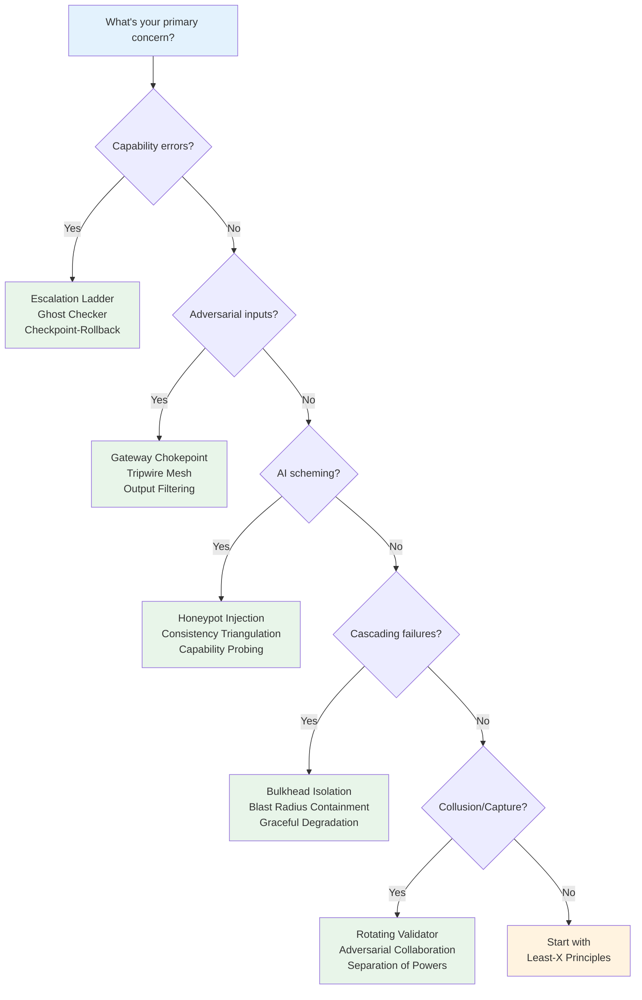

# Quick Reference

A one-page summary for practitioners who know the framework and need fast lookup.

---

## Core Formulas

| Concept | Formula | Description |
|---------|---------|-------------|
| **Delegation Risk** | `Σ P(harm) × Damage` | Expected cost of delegation |
| **Risk Decomposition** | `Accident Risk + Defection Risk` | Two sources of harm |
| **Effective Capability** | `Power × Agency` | What the system can accomplish |
| **RACAP** | `Capability / Risk` | Risk-adjusted capability ratio |
| **Authority** | `Power ∩ Permission` | Sanctioned power |
| **Entanglement Tax** | `Actual Risk / Independent Risk` | How much worse than expected |

---

## Pattern Selection Flowchart



---

## Harm Mode Checklist

When assessing a delegation, check for these harm modes:

### Accident Modes
- [ ] **Capability failure** — System can't do the task correctly
- [ ] **Edge case error** — Works normally, fails on unusual inputs
- [ ] **Hallucination** — Generates confident but incorrect outputs
- [ ] **Resource exhaustion** — Runs out of time/compute/memory

### Defection Modes
- [ ] **Goal misalignment** — Optimizes for wrong objective
- [ ] **Deception** — Deliberately hides information or lies
- [ ] **Scheming** — Takes unauthorized actions for future benefit
- [ ] **Collusion** — Coordinates with other components against principal

---

## Key Thresholds

| Situation | Threshold | Action |
|-----------|-----------|--------|
| **Risk budget exceeded** | Risk > Budget | Block action, escalate |
| **Low confidence output** | P(correct) < 0.8 | Add verification layer |
| **High-stakes decision** | Damage > $10K | Require human review |
| **Novel input detected** | Outside training distribution | Flag for review |
| **Pattern failure rate** | > 3 failures/week | Review pattern selection |

---

## Essential Patterns (Top 5)

If you can only implement 5 patterns:

1. **Least-X Principles** — Minimize privilege, capability, context, autonomy
2. **Escalation Ladder** — Route high-stakes decisions to humans
3. **Defense in Depth** — Multiple verification layers
4. **Sandboxing** — Contain blast radius
5. **Audit Logging** — Record everything for forensics

---

## Risk Budget Rules of Thumb

| System Type | Suggested Annual Budget | Rationale |
|-------------|------------------------|-----------|
| Internal tool | $50K-100K | Low exposure, recoverable |
| Customer-facing | $10K-50K | Reputation matters |
| Financial | $1K-10K | Direct monetary loss |
| Safety-critical | $100-1K | Human welfare at stake |
| Catastrophic potential | $0-100 | Existential concern |

---

## Quick Formulas

**Expected harm from single component:**
```
Component Risk = P(accident) × Damage_accident + P(defection) × Damage_defection
```

**Pipeline risk (independent components):**
```
Pipeline Risk = 1 - Π(1 - Component_Risk_i)
```

**Entangled pipeline risk:**
```
Entangled Risk = Pipeline_Risk × Entanglement_Tax
```

**Mitigation effectiveness (serial layers):**
```
Residual Risk = Base_Risk × Π(1 - Catch_Rate_i)
```

---

## See Also

- [Core Concepts](/getting-started/core-concepts/) — Full conceptual explanation
- [Minimal Framework](/getting-started/minimal-framework/) — 80/20 version
- [Design Patterns Index](/design-patterns/) — All 45 patterns
- [Glossary](/getting-started/glossary/) — Term definitions
