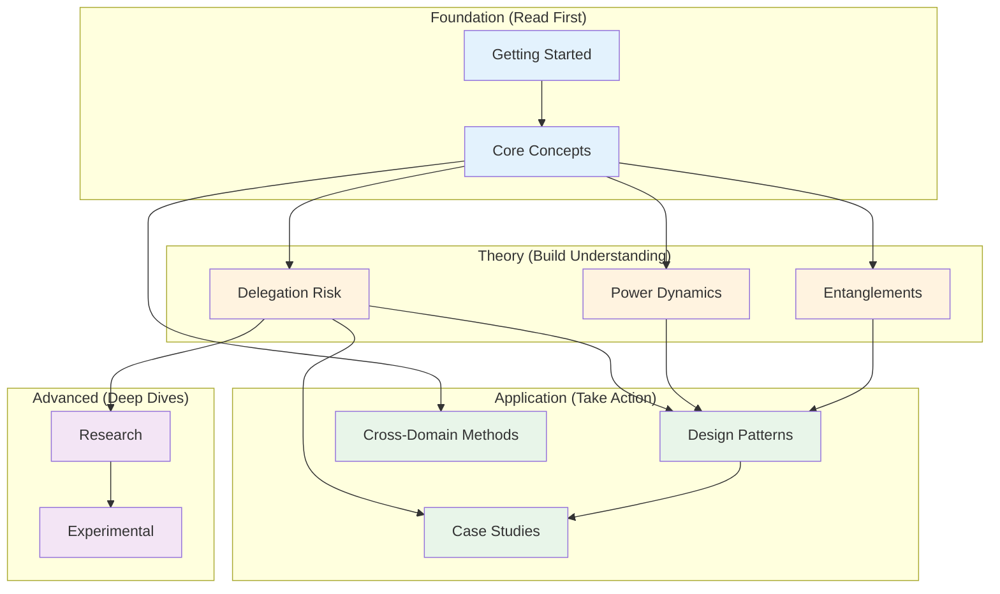

# Reading Order & Prerequisites

This guide helps you navigate the 162-page documentation site efficiently by showing dependencies between sections and suggesting paths based on your goals.

## Section Dependency Graph

## Prerequisites by Section

| To Read... | First Understand... | Time Investment |
|------------|---------------------|-----------------|
| **Core Concepts** | Nothing (start here) | 20 min |
| **Delegation Risk** | Core Concepts | 45 min + Core |
| **Power Dynamics** | Core Concepts | 30 min + Core |
| **Entanglements** | Core Concepts | 60 min + Core |
| **Design Patterns** | Core Concepts + at least one of (DR, PD, or ENT) | 2+ hours |
| **Case Studies** | Core Concepts + Design Patterns | 1-2 hours |
| **Cross-Domain Methods** | Core Concepts | 30-60 min |
| **Research** | All theory sections | 5+ hours |

---

## Paths by Goal

### "I'm building an AI system from scratch"
1. [Core Concepts](/getting-started/core-concepts/) — Understand the framework
2. [Design Patterns Index](/design-patterns/) — See what patterns exist
3. [Least-X Principles](/design-patterns/least-x-principles/) — Core design philosophy
4. [Quick Start](/design-patterns/tools/quick-start/) — Step-by-step checklist
5. [Entanglements](/entanglements/) — Avoid correlated failures

**Total time:** 2-3 hours

### "I'm assessing risk in an existing system"
1. [Core Concepts](/getting-started/core-concepts/) — Framework basics
2. [Delegation Risk Overview](/delegation-risk/overview/) — Quantification approach
3. [Risk Decomposition](/delegation-risk/risk-decomposition/) — How to break down risk
4. [Case Studies](/case-studies/) — See examples
5. [Cost-Benefit Tool](/design-patterns/tools/cost-benefit/) — Evaluate mitigations

**Total time:** 2-3 hours

### "I'm skeptical this framework works"
1. [FAQ](/getting-started/faq/) — Common objections answered
2. [Sydney Case Study](/case-studies/ai-systems/case-study-sydney/) — Real-world failure analysis
3. [Nuclear Safety PRA](/cross-domain-methods/nuclear-safety-pra/) — Similar methods that work
4. [Lessons from Failures](/cross-domain-methods/lessons-from-failures/) — Historical context
5. [Research](/research/) — Theoretical foundations

**Total time:** 2-3 hours

### "I want to understand the math"
1. [Core Concepts](/getting-started/core-concepts/) — Conceptual foundation
2. [Delegation Risk Overview](/delegation-risk/overview/) — Formulas
3. [Delegation Walkthrough](/delegation-risk/walkthrough/) — Worked examples
4. [Risk Decomposition](/delegation-risk/risk-decomposition/) — Formal treatment
5. [Power Dynamics](/power-dynamics/) — Agency formalization
6. [Experimental Estimates](/experimental/probabilistic-estimation/) — Squiggle distributions

**Total time:** 4-6 hours

### "I want to apply this to my organization"
1. [Core Concepts](/getting-started/core-concepts/) — Basics
2. [Quick Start](/design-patterns/tools/quick-start/) — Practical checklist
3. [Human Systems Case Studies](/case-studies/human-systems/) — Organizational examples
4. [Cost-Benefit Tool](/design-patterns/tools/cost-benefit/) — ROI analysis
5. [Entanglements: Mitigation](/entanglements/mitigation/) — How to fix issues

**Total time:** 3-4 hours

### "I'm a researcher"
1. [Core Concepts](/getting-started/core-concepts/) — Framework overview
2. [All Theory Sections](/delegation-risk/) — Full understanding
3. [Research Index](/research/) — Open problems
4. [Potential Projects](/research/potential-projects/) — Contribution ideas
5. [Experimental](/experimental/) — Probabilistic methods

**Total time:** 10+ hours

---

## Section Overviews

### Getting Started (Foundation)
**What you'll learn:** The core problem (managing risk when delegating to AI systems), the basic formula, and key concepts like harm modes, defection risk, and risk budgets.

**Key pages:** Introduction, Core Concepts, FAQ

### Delegation Risk (Theory)
**What you'll learn:** How to quantify delegation risk mathematically, decompose it into components, and track risk through hierarchical systems.

**Prerequisites:** Core Concepts

**Key pages:** Overview, Walkthrough, Risk Decomposition

### Power Dynamics (Theory)
**What you'll learn:** How to formalize agent power, authority, and the "Strong Tools Hypothesis" about capability constraints.

**Prerequisites:** Core Concepts

**Key pages:** Agent Power Formalization, Strong Tools Hypothesis

### Entanglements (Theory)
**What you'll learn:** How correlated components undermine safety assumptions, how to detect entanglement, and how to mitigate it.

**Prerequisites:** Core Concepts

**Key pages:** Index (Independence Illusion), Detection, Mitigation

### Design Patterns (Application)
**What you'll learn:** 45 patterns for building safer delegation systems, organized by threat model.

**Prerequisites:** Core Concepts + at least one theory section

**Key pages:** Index (pattern matrix), Least-X Principles, Tools

### Case Studies (Application)
**What you'll learn:** How these concepts apply to real AI systems (Sydney, code review bots) and human systems (nuclear, finance).

**Prerequisites:** Core Concepts + Design Patterns recommended

### Cross-Domain Methods (Application)
**What you'll learn:** How mature risk management fields (nuclear, finance, carbon budgets) handle similar problems.

**Prerequisites:** Core Concepts

### Research (Advanced)
**What you'll learn:** Theoretical foundations, open problems, and connections to academic literature.

**Prerequisites:** All theory sections

### Experimental (Advanced)
**What you'll learn:** Probabilistic estimation tools, Squiggle distributions, and uncertainty quantification.

**Prerequisites:** Research section recommended

---

## Quick Reference

| If you have... | Read... |
|----------------|---------|
| 5 minutes | [Five-Minute Intro](/getting-started/five-minute-intro/) |
| 30 minutes | Introduction + Core Concepts |
| 2 hours | Foundation + one theory section + Quick Start |
| Half a day | Foundation + all theory + Design Patterns index |
| Full day | Everything except Research and Experimental |

---

## See Also

- [Site Map](/reference/site-map/) — Visual map of all content
- [Glossary](/getting-started/glossary/) — Term definitions
- [FAQ](/getting-started/faq/) — Common questions
