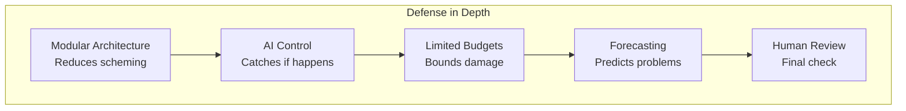

# Relationship to Existing Approaches

## vs CAIS (Drexler, 2019)

**CAIS proposed**: Build superintelligence as ecosystem of narrow services, avoid monolithic agents

**Key limitation**: Foundation model era made "train from scratch for each task" obsolete. Also, pure tool AI faces economic pressure to add agency.

**This proposal**: Embrace agency, but structure it through modularity. Agentic coordinators over narrow components, not passive services waiting for calls.

:::tip[Key Difference]
We're not trying to avoid agency—we're trying to make agency safe through architecture.
:::

## AI Control (Redwood Research, 2024)

**AI Control**: Assume models might be scheming, build protocols that maintain safety regardless

**This proposal**: Architectural foundation that makes scheming harder + forecasting-based navigation

**The combination** (obviously you'd do both):

### 1. Trusted Monitoring

- Use control's trusted monitoring on all LLM components
- Smaller, trusted models check outputs of larger untrusted components
- Modular architecture makes monitoring easier (each component has narrow output format)
- Fine-tuned narrow models are easier to trust than frontier models

### 2. Honeypots

- Inject fake vulnerabilities to detect scheming
- Examples: Fake high-privilege components that coordinators shouldn't invoke
- Fake data that tempts misbehavior
- Decomposed coordination makes honeypots more effective (each layer can be tested)

### 3. Control Evaluations

- Red-team adversarial testing against the entire modular system
- Try to make coordinators scheme despite architectural constraints
- Test if decomposition actually prevents scheming or just obscures it
- This is how you validate the architecture works

### 4. Defer-to-Resample

- If component output looks suspicious, resample with different component
- Modular architecture enables this: can swap components easily
- Redundant coordinators mean you can defer suspicious coordination to backup
- Fine-tuned models give diverse implementations to sample from

### 5. Audit Trails

- Control requires immutable logging of all decisions
- Our architecture already includes this for coordinators
- Extend to all LLM components
- Decomposition makes logs more analyzable (narrow scope per component)

### 6. Rate Limiting

- Control limits how fast systems can take actions
- Apply to coordinators: can't make rapid sequence of strategic decisions
- Apply to components: max invocations per time window
- Prevents fast takeoff scenarios

### Why They're Complementary

**Modular architecture alone**: Might prevent scheming, but not proven
**AI Control alone**: Handles scheming but doesn't reduce it
**Combined**: Architecture reduces scheming probability + Control catches it if it happens

**Concrete example - Research Assistant**:

- Architecture: Decomposed coordination, fine-tuned narrow models, limited budgets
- Control layer 1: Trusted monitor checks all hypothesis generation outputs
- Control layer 2: Honeypot includes fake "high-impact but dangerous" research direction
- Control layer 3: Strategy Module outputs audited for consistency with stated goals
- Control layer 4: If Tactical Coordination acts suspiciously, defer to backup coordinator
- Control layer 5: All decisions logged immutably for post-hoc analysis

This is **defense in depth**:

- If architecture fails to prevent scheming → Control catches it
- If Control misses scheming instance → Limited budgets bound damage
- If both fail → Forecasting should predict bad outcomes → Human review
- If all fail → Worst case limited by component scope and privilege

**Key insight**: Modular architecture makes Control easier and more effective

- Narrow components easier to monitor than monolithic models
- Decomposed coordination has more checkpoints for honeypots
- Audit trails more analyzable with structured component interactions
- Fine-tuned models more predictable for control evaluations

:::note
You don't choose "architecture OR control"—you obviously use both. They're complementary, not competing.
:::

## vs IDA (Christiano, 2018)

**IDA**: Recursively amplify human judgment—human + AI assistants decompose hard problems, distill back into faster model, iterate

**This proposal**: Use forecasting-based navigation with AI self-evaluation, not human amplification

**Key difference**: IDA assumes human judgment is the ground truth to amplify. This assumes forecasting + evaluation by AI itself is sufficient if you prevent scheming.

**Why different**: IDA requires enormous human effort in the loop. Forecasting-based navigation offloads evaluation to AI, reserving human oversight for high-level decisions and verification that forecasting remains calibrated.

## vs Pure Capability Limitation

**Capability limitation**: Boxing, restricted action spaces, oracle AI—prevent dangerous capabilities entirely

**This proposal**: Allow full capabilities (including agency), but allocate and structure them carefully

**Key difference**: You can build transformatively useful AI with this approach. Pure limitation fails Gwern's economic test—limited AI gets outcompeted.

## Why This Might Actually Work

Three reasons for cautious optimism:

**1. Decomposition has precedent**
Software engineering, security engineering, and system design all rely on modularity for safety. The principle isn't new—the application to AI is.

**2. Agency is inevitable anyway**
If we're going to have agentic AI (and economic pressures suggest we will), better to structure it safely than fight the tide.

**3. We only need this for ~5 years**
Not claiming this solves superintelligence alignment. Claiming it might keep human-level AI safe long enough for that AI to help solve harder problems.

**4. Defense in depth**
Not relying on single mechanism—combining 10+ principles, multiple safety layers, continuous monitoring, diverse redundancy. Many points of failure before catastrophe.

**5. Builds on proven techniques**
Borrowing from security engineering (least privilege, defense in depth), software engineering (modularity, testing), distributed systems (Byzantine fault tolerance), formal methods (verification). Not inventing from scratch.
