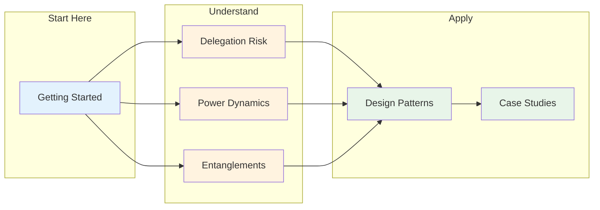

import { Card, CardGrid } from '@astrojs/starlight/components';

:::note[About This Documentation]
This is early-stage, exploratory work—created rapidly with LLM assistance. The core ideas seem promising, but the framework is largely untested for AI systems specifically. See [About This Site](/reference/about-this-site/) for epistemic status and limitations.
:::

## The Problem

Every delegation involves risk. When you delegate a task—to an employee, a contractor, a software system, or an AI agent—you're accepting potential downside in exchange for capability you don't have or can't apply yourself.

This creates fundamental challenges:

- **Capability without containment**: The same capabilities that make a delegate useful make failures potentially serious
- **Delegation without verification**: When delegates delegate to other delegates, risk relationships multiply without principled bounds
- **Autonomy without accountability**: Less oversight requires structural guarantees, not just hopes

These challenges appear across domains: organizational management, software systems, supply chains, and increasingly, AI agents that plan, execute, and delegate to other AI systems.

---

## The Approach

This framework proposes **structural constraints** as the foundation for managing delegation risk. Rather than relying solely on:

- Selecting trustworthy delegates (which may not scale)
- Oversight of every action (which doesn't scale)
- Post-hoc detection of problems (which may be too late)

We focus on **architectural properties** that bound potential harm regardless of delegate behavior.

<CardGrid>
  <Card title="Risk as a Resource" icon="seti:notebook">
    Every delegation involves risk. We can measure it, budget it, and optimize it—just like compute or money. [Delegation Risk](/delegation-risk/overview/) quantifies what you're betting on each delegate.
  </Card>
  <Card title="Containment via Decomposition" icon="puzzle">
    Instead of one powerful delegate, decompose tasks across many limited components. No single component has enough capability, context, or connectivity to cause catastrophic harm.
  </Card>
  <Card title="Principles that Bound Behavior" icon="list-format">
    The ["Least X" principles](/design-patterns/least-x-principles/)—least privilege, least capability, least context—systematically limit what each component can do.
  </Card>
  <Card title="Cross-Domain Wisdom" icon="open-book">
    Nuclear safety, financial risk, and mechanism design have decades of experience. We adapt their [proven methods](/cross-domain-methods/overview/) to delegation problems.
  </Card>
</CardGrid>

---

## Key Insight

**Safety can be architectural, not just behavioral.**

We may not need perfect trust if we can build systems where:
- No delegate has enough power to cause catastrophic harm
- Delegates can't easily coordinate to amplify their power
- Risk relationships are explicit and bounded
- Failures are contained and recoverable

This could provide defense in depth regardless of delegate reliability—though whether it works in practice depends on implementation details.

---

## Primary Application: AI Systems

While the framework applies generally, **AI systems are our primary focus**. AI systems may present delegation challenges at unusual scale:

- Capabilities expanding rapidly—whether verification is keeping pace is unclear
- Agents delegating to other agents in complex networks
- Potentially reduced human oversight as systems become more autonomous
- Possible unknown failure modes in systems we don't fully understand

None of these claims are certain, but if even some hold, having infrastructure for managing Delegation Risk seems valuable. The framework aims to help deploy AI more safely—not by solving alignment, but by bounding the damage from any single component.

---

## Navigate This Site

**[See full reading order →](/getting-started/reading-order/)** | **[Site Map →](/reference/site-map/)**

---

## Documentation Structure

<CardGrid stagger>
  <Card title="Delegation Risk Theory" icon="document">
    The mathematical foundation: Delegation Risk = Σ P(harm) × Damage. Quantification, composition, optimization.
  </Card>
  <Card title="Cross-Domain Methods" icon="random">
    Proven approaches from finance (Euler allocation), nuclear safety (fault trees), and mechanism design (incentive compatibility).
  </Card>
  <Card title="Design Principles" icon="approve-check">
    The "Least X" principles: least privilege, least capability, least context, least autonomy. Actionable constraints.
  </Card>
  <Card title="Applications" icon="open-book">
    How the framework applies: organizational trust, criminal justice, open source, and more.
  </Card>
  <Card title="AI Systems" icon="setting">
    Specific guidance for AI: decomposed coordination, safety mechanisms, worked examples.
  </Card>
  <Card title="Implementation" icon="rocket">
    Practical guidance: empirical validation, cost-benefit analysis, adoption roadmap.
  </Card>
</CardGrid>

---

## Who This Is For

- **Risk managers** thinking about delegation in any domain
- **AI safety researchers** working on scalable containment approaches
- **ML engineers** building agentic systems with principled constraints
- **Organizations** deploying AI that need risk management frameworks
- **Policy makers** looking for concrete technical approaches

---

## Quick Paths

<CardGrid>
  <Card title="5-Minute Introduction" icon="rocket">
    Short on time? Get the core ideas in one page. [Read the 5-minute intro →](/getting-started/five-minute-intro/)
  </Card>
  <Card title="Ready to Implement?" icon="laptop">
    Step-by-step checklist for applying the framework. [Quick Start →](/design-patterns/tools/quick-start/)
  </Card>
  <Card title="Have Questions?" icon="information">
    Common objections answered. [Read the FAQ →](/getting-started/faq/)
  </Card>
  <Card title="Evaluate the ROI" icon="seti:notebook">
    Concrete cost-benefit analysis with real numbers. [See the analysis →](/design-patterns/tools/cost-benefit/)
  </Card>
</CardGrid>

---

## Case Studies

Learn from real-world examples:

- **[Sydney (Failure)](/case-studies/ai-systems/case-study-sydney/)** — What happens when constraints are missing
- **[Code Review Bot (Success)](/case-studies/ai-systems/case-study-success/)** — 8 months in production, 12 attacks blocked
- **[Support Bot (Near-Miss)](/case-studies/ai-systems/case-study-near-miss/)** — $50,000 error caught by verification
- **[Content Moderator (Drift)](/case-studies/ai-systems/case-study-drift/)** — How small changes compound into big problems

---

## Start Reading

1. **[Introduction](/getting-started/introduction/)** — The full problem statement and approach
2. **[Delegation Risk Overview](/delegation-risk/overview/)** — The mathematical foundation
3. **[Design Principles](/design-patterns/least-x-principles/)** — Actionable constraints

**Navigation Guides**: [Reading Order](/getting-started/reading-order/) · [How Sections Connect](/getting-started/how-sections-connect/) · [Site Map](/reference/site-map/)

**Interactive Tools**: [Delegation Risk Calculator](/design-patterns/tools/delegation-risk-calculator/) · [Risk Inheritance](/design-patterns/tools/trust-propagation/) · [Tradeoff Frontier](/design-patterns/tools/tradeoff-frontier/)

---

## Download

Prefer offline reading? Download the complete documentation:

<CardGrid>
  <Card title="PDF Book" icon="document">
    Best for printing and desktop reading. Includes all diagrams and formatted for book-style layout.

    [Download PDF →](https://github.com/quantified-uncertainty/delegation-risk-framework/releases/latest/download/delegation-risk-framework-book.pdf)
  </Card>
  <Card title="EPUB" icon="open-book">
    Best for e-readers (Kindle, Kobo) and mobile devices.

    [Download EPUB →](https://github.com/quantified-uncertainty/delegation-risk-framework/releases/latest/download/delegation-risk-framework-book.epub)
  </Card>
</CardGrid>
