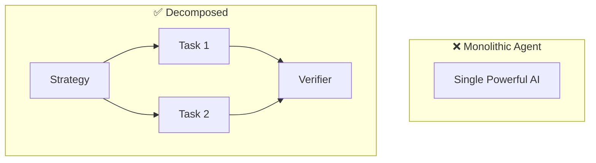
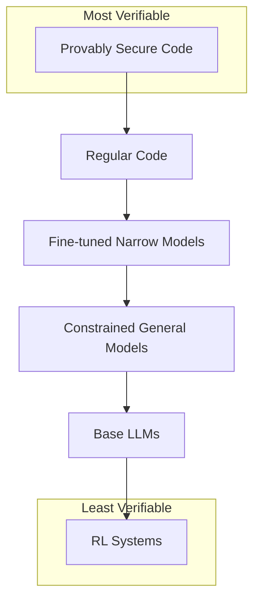
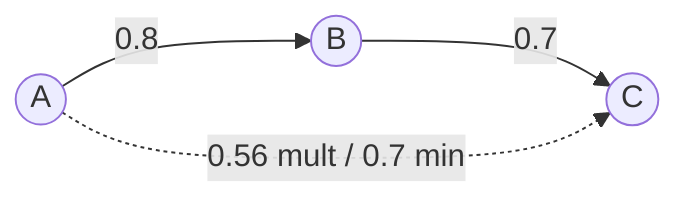
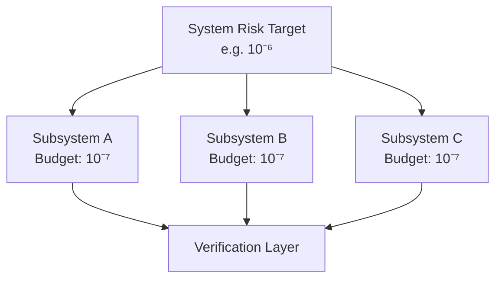

# Core Concepts

This page introduces the key ideas without mathematical formalism. For the quantitative details, see [Trust Calculus](/trust-calculus/overview/).

## Trust as a Resource

When you delegate a task to an AI system, you're extending **trust**. Trust isn't abstract—it's the potential for harm if the system fails or misbehaves.

**Expected Trust Exposure (ETE)** is a way to quantify this: for each component, sum over all possible bad outcomes, weighted by their probability. A component with access to your bank account has higher ETE than one that can only read public web pages.

:::tip
Trust is finite and should be budgeted. Just as organizations allocate compute and money, they should allocate trust—tracking how much they're extending, to which components, for what purposes.
:::

## Decomposition Over Monoliths

A single powerful AI agent is dangerous because it concentrates capability, context, and control. If it fails or schemes, the damage is unbounded.

**Decomposed coordination** breaks this pattern:
- Split tasks across many specialized components
- Each component has limited capability and context
- No single component can cause catastrophic harm
- Components can't easily coordinate against the system

Think of it like separation of powers in government, or microservices in software architecture. The coordinator itself is decomposed—strategy, tactics, verification, and aggregation handled by different components with different implementations.

## The "Least X" Principles

Security engineering has the principle of least privilege: give each component minimum necessary access. We extend this across multiple dimensions:

- **Least Intelligence**: Minimum cognitive capability needed
- **Least Privilege**: Minimum permissions and access rights
- **Least Context**: Minimum information about the broader system
- **Least Persistence**: Minimum state maintained across invocations
- **Least Autonomy**: Minimum ability to act without oversight
- **Least Connectivity**: Minimum communication paths between components
- **Least Compute**: Bounded computational resources

Each principle bounds a different attack surface. Applied together, they create components that are limited in what they can do, know, remember, and coordinate.

Why each principle matters

| Principle | What it limits | Attack surface bounded |
|-----------|---------------|----------------------|
| Least Intelligence | Optimization power | Ability to find exploits or deceptive strategies |
| Least Privilege | Access rights | Direct damage from compromised component |
| Least Context | System knowledge | Strategic planning against the system |
| Least Persistence | Memory across calls | Long-term scheming, accumulating leverage |
| Least Autonomy | Unsupervised action | Scope of damage before human intervention |
| Least Connectivity | Communication paths | Coordination between components |
| Least Compute | Processing resources | Brute-force attacks, complex planning |

## Verifiability Hierarchy

Not all implementations are equally trustworthy:

1. **Provably secure code** — Mathematical guarantees of correctness
2. **Regular code** — Auditable, testable, deterministic
3. **Fine-tuned narrow models** — Predictable within a specific domain
4. **Constrained general models** — LLMs with extensive prompting and evaluation
5. **Base LLMs** — General capability, harder to verify
6. **RL systems** — Learned policies, least predictable

:::note[Design Principle]
Use the most verifiable implementation that achieves the required functionality. Don't use a frontier LLM for tasks that can be done with code or a narrow model.
:::

When to use each level

| Level | Use when... | Example |
|-------|-------------|---------|
| Provably secure code | Correctness is critical, logic is simple | Access control checks, rate limiters |
| Regular code | Behavior is fully specifiable | Data transformation, API routing |
| Fine-tuned narrow models | Task is well-defined, training data exists | Sentiment classification, entity extraction |
| Constrained general models | Judgment needed, outcomes recoverable | Draft generation, summarization |
| Base LLMs | Maximum flexibility needed, heavy oversight | Creative tasks, complex reasoning |
| RL systems | Learning from feedback is essential | Rarely recommended for safety-critical paths |

## Trust Propagation

When components delegate to other components, trust relationships form networks. If A trusts B with weight 0.8, and B trusts C with weight 0.7, how much should A trust C?

Different rules give different answers:
- **Multiplicative**: 0.8 × 0.7 = 0.56 (each stage is independent risk)
- **Minimum**: min(0.8, 0.7) = 0.7 (chain is only as strong as weakest link)
- **Discounted**: More complex models accounting for path length

The right rule depends on what "trust" means in your context. The framework provides formal tools for reasoning about these relationships.

Choosing a propagation rule

| Rule | Formula | Best when... |
|------|---------|--------------|
| **Multiplicative** | T(A→C) = T(A→B) × T(B→C) | Each delegation is independent risk; default choice |
| **Minimum** | T(A→C) = min(T(A→B), T(B→C)) | Chain only as strong as weakest link |
| **Discounted** | T(A→C) = T(A→B) × T(B→C) × δⁿ | Longer paths inherently less trustworthy |
| **Maximum path** | T(A→C) = max over all paths | Any valid route suffices |

Most systems should start with **multiplicative** propagation—it's intuitive, conservative, and composes well.

## Risk Budgeting

Borrowed from finance and nuclear safety: set a total acceptable risk level for the system, then allocate budgets to components.

Key requirements:
- **Compositional guarantees**: Component risks must aggregate predictably
- **Principled allocation**: Methods like Euler decomposition ensure budgets sum correctly
- **Incentive-compatible reporting**: Mechanisms that make honest risk reporting optimal
- **Verification infrastructure**: Independent confirmation that claimed levels match reality
- **Conservative margins**: Buffer for uncertainty and unknown unknowns

:::note
This isn't theoretical—nuclear plants operate at 10⁻⁹ failure probability per flight hour by flowing system targets down to component budgets through fault trees.
:::

## Architectural Safety

The central claim: safety can be a property of system architecture, not just individual component behavior.

If you can't guarantee an AI system is aligned, you can still:
- Limit what it can access (least privilege)
- Limit what it knows (least context)
- Limit what it can coordinate (decomposition)
- Limit how much damage it can cause (trust budgets)
- Verify its behavior matches claims (verification layers)

:::caution
These structural constraints provide defense in depth. They don't replace alignment research—they buy time and bound damage while we work on deeper solutions.
:::

## What This Framework Provides

1. **Vocabulary**: Precise terms for discussing trust, delegation, and containment
2. **Principles**: Actionable design constraints (the "Least X" family)
3. **Formal tools**: Mathematics for trust propagation and optimization
4. **Architectural patterns**: Decomposed coordination, forecasting-based navigation
5. **Cross-domain wisdom**: Adapted methods from finance, nuclear safety, security engineering

The goal is infrastructure for safely deploying AI at scale—not a complete solution to AI safety, but a foundation for managing risk as systems become more capable.
