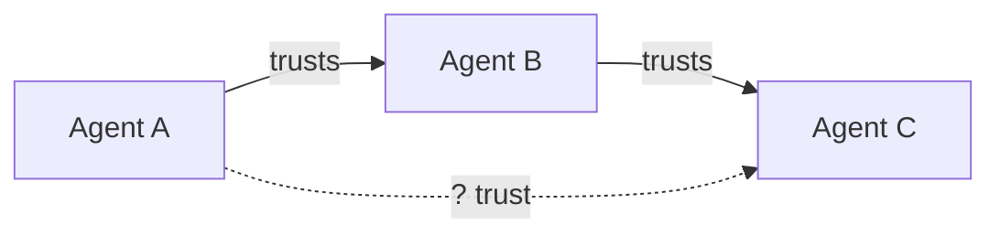

# Introduction

## The Problem

AI systems are becoming more capable, more autonomous, and more interconnected. We're rapidly moving from AI as a tool (user asks, AI responds) to AI as an agent (AI plans, executes, delegates). This shift creates fundamental safety challenges:

**Capability without containment**: A highly capable AI agent can accomplish impressive tasks—but the same capabilities that make it useful also make failures potentially catastrophic. An agent that can write code can write malicious code. An agent that can plan complex projects can plan to acquire resources.

**Delegation without verification**: When AI agents delegate to other AI agents, trust relationships multiply. If Agent A trusts Agent B, and Agent B trusts Agent C, how much should A trust C? Current systems have no principled answer.

**Autonomy without accountability**: As AI systems operate with less human oversight, we need structural guarantees—not just hopes—that they remain within acceptable risk bounds.

The goal isn't to prevent AI from being useful. It's to ensure that as AI systems become more powerful, we have the infrastructure to deploy them safely.

:::note
This framework focuses on **structural** safety—architectural properties that make dangerous behavior difficult regardless of an AI's internal goals. It complements, rather than replaces, work on alignment and interpretability.
:::

## The Approach

This framework proposes **structural constraints** as the foundation for AI safety at scale. Rather than relying solely on:

- Training AI to be aligned (which may not generalize)
- Human oversight of every action (which doesn't scale)
- Post-hoc detection of problems (which may be too late)

We focus on **architectural properties** that make dangerous behavior difficult or impossible, regardless of what an AI system "wants."

The core ideas:

1. **Trust as a quantifiable resource**: Every delegation relationship involves trust. We can measure it, budget it, and optimize it—just like compute or money.

2. **Containment through decomposition**: Instead of one powerful AI making all decisions, decompose tasks across many limited components. No single component has enough capability, context, or connectivity to cause catastrophic harm.

3. **Principles that bound behavior**: The "Least X" family of principles (least privilege, least intelligence, least context, etc.) provides a systematic framework for limiting what each component can do.

4. **Borrowed wisdom from other domains**: Nuclear safety, financial risk management, and security engineering have decades of experience managing quantified risk. We adapt their methods for AI systems.

## Who This Is For

This framework is relevant for:

- **AI safety researchers** thinking about scalable alignment approaches
- **ML engineers** building agentic systems who want principled safety constraints
- **Organizations** deploying AI systems that need risk management frameworks
- **Policy makers** looking for concrete technical approaches to AI governance

What each audience will find most useful

| Audience | Start with | Key sections |
|----------|------------|--------------|
| **AI safety researchers** | Trust Calculus Overview | Trust propagation, optimization, formal properties |
| **ML engineers** | Least X Principles | Architecture examples, implementation patterns |
| **Organizations** | Risk Budgeting Overview | Euler allocation, mechanism design, empirical tests |
| **Policy makers** | Core Concepts | Principles to Practice, Related Approaches |

The ideas range from theoretical (formal trust calculus) to practical (implementation patterns for decomposed coordination).

## How to Read This Documentation

The documentation is organized from concepts to implementation: **Principles → Architecture → Trust Calculus → Risk Budgeting → Implementation**.

Section details

### Principles
Start here. The "Least X" principles provide the foundational constraints that inform everything else. These are actionable design principles you can apply immediately.

### Architecture
How to structure AI systems using these principles. Decomposed coordination, forecasting-based navigation, and concrete examples of safe agentic architectures.

### Trust Calculus
The mathematical formalization. Expected Trust Exposure, trust propagation algorithms, optimization methods. Read this when you need the quantitative foundations.

### Risk Budgeting
Cross-domain approaches from finance, nuclear safety, and mechanism design. How to allocate risk budgets across components and ensure honest reporting.

### Implementation
Practical guidance: empirical validation approaches, relationship to existing work, and roadmap for adoption.

## Key Insight

The central insight is that **safety can be architectural, not just behavioral**.

We don't need to solve alignment perfectly if we can build systems where:
- No component has enough power to cause catastrophic harm
- Components can't coordinate to amplify their power
- Trust relationships are explicit and bounded
- Failures are contained and recoverable

:::tip[Key Insight]
Safety can be **architectural**, not just behavioral. Even if we can't guarantee an AI is aligned, we can build systems where no component has enough power to cause catastrophic harm.
:::

This doesn't replace alignment research—it complements it. Structural constraints provide defense in depth while we work on making AI systems genuinely trustworthy.

## Getting Started

:::tip[Getting Started]
If you're new, start with:
1. [The "Least X" Principles](/principles/least-x-principles/) — the foundational design constraints
2. [Decomposed Coordination](/architecture/decomposed-coordination/) — how to structure agentic systems safely
3. [Trust Calculus Overview](/trust-calculus/overview/) — when you're ready for the math
:::
