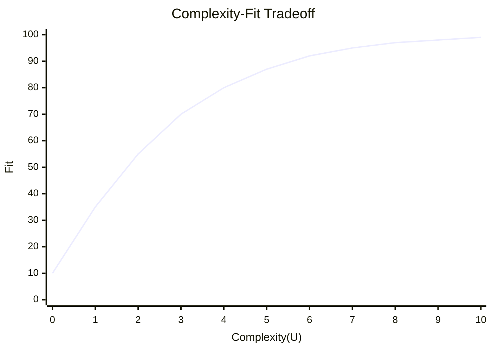
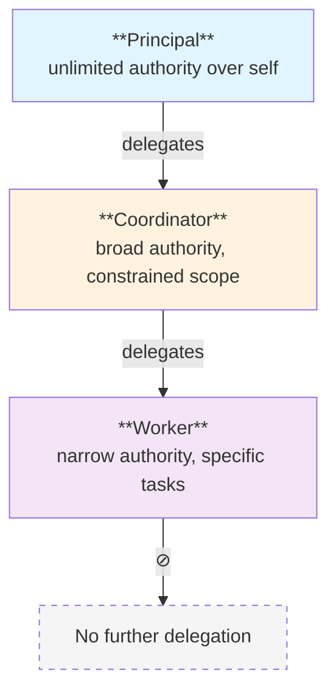
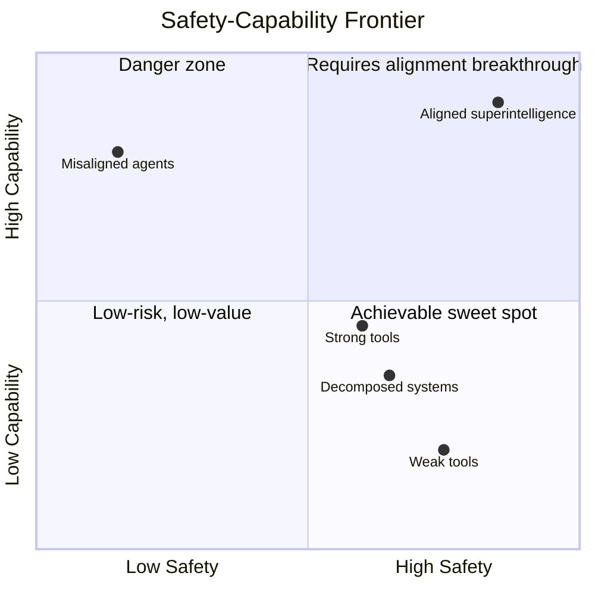
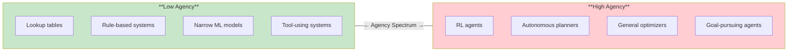

# Formalizing Agents, Power, and Authority

:::note[TL;DR]
We want AI systems that are **maximally capable while minimally risky**. This requires formalizing not just risk (which we've done) but also the positive side: **Agency** (how goal-directed is a system?), **Power** (what can it accomplish?), and **Authority** (what is it permitted to do?). This page proposes mathematical frameworks for each.
:::

## The Fundamental Optimization Problem

The framework so far focuses heavily on **Delegation Risk**—what could go wrong. But the goal isn't to minimize risk to zero (that would mean no AI benefit). The real goal is:

$$\max_{\text{system}} \text{Capability}(\text{system}) \quad \text{subject to} \quad \text{DelegationRisk}(\text{system}) \leq \text{Budget}$$

Or equivalently, maximize risk-adjusted capability:

$$\text{Risk-Adjusted Capability} = \frac{\text{Capability}}{\text{DelegationRisk}}$$

To make this concrete, we need to formalize **Capability**, which itself decomposes into **Power** and **Agency**.

---

## Part I: Formalizing Agency

### What Is an Agent?

An **agent** is a system whose behavior can be usefully modeled as optimizing an objective function over time. "Agency" is a matter of degree—not a binary property.

The key insight: **agency is a modeling choice, not an ontological category**. We call something an agent when treating it as an optimizer is predictively useful.

### Agency Score (Coherence)

**Agency Score** (or **Coherence Score**) measures how well a system's behavior can be explained by a simple utility function. Higher coherence = more agent-like.

#### Definition: Agency Score

For a system S observed over behavior traces B = {b₁, b₂, ...}:

$$\text{AgencyScore}(S) = \max_{U \in \mathcal{U}} \text{Fit}(U, B)$$

Where:
- $\mathcal{U}$ is the space of "simple" utility functions (bounded complexity)
- $\text{Fit}(U, B)$ measures how well utility function U explains observed behaviors B

**Interpretation**: If there exists a simple utility function that predicts most of S's behavior, S has high agency. If S's behavior requires a complex, ad-hoc model to explain, it has low agency.

#### Operationalizing Fit

Several approaches to measuring Fit(U, B):

**1. Prediction accuracy**:
$$\text{Fit}_{\text{pred}}(U, B) = \mathbb{E}_{b \in B} \left[ \mathbb{1}[a_{\text{actual}} = \arg\max_a U(s, a)] \right]$$

How often does "assume S maximizes U" correctly predict S's actions?

**2. Description length** (MDL-inspired):
$$\text{Fit}_{\text{MDL}}(U, B) = -\frac{|U| + |B|U|}{|B_{\text{raw}}|}$$

How much compression do we get by describing S as "maximizes U"?

**3. Consistency over time**:
$$\text{Fit}_{\text{temporal}}(U, B) = 1 - \text{Var}_{t}[U_t^*]$$

Does the best-fit U remain stable over time, or does it drift?

#### The Complexity-Fit Tradeoff

*Simple U fits poorly (low agency). Complex U overfits—behavior is just complex, not purposeful (still low agency).*

**True agency** = high fit with *low* complexity utility function.

### Agency Decomposition

Agency can be decomposed into components:

$$\text{AgencyScore} = f(\text{Goal-Directedness}, \text{Planning Horizon}, \text{Modeling Depth}, \text{Consistency})$$

| Component | Definition | Measures |
|-----------|------------|----------|
| **Goal-Directedness** | Degree to which actions systematically reduce distance to goal states | Does S navigate toward targets despite perturbations? |
| **Planning Horizon** | How far ahead S optimizes | Does S sacrifice short-term for long-term gains? |
| **Modeling Depth** | How sophisticated S's world model is | Does S anticipate second-order effects? |
| **Consistency** | Stability of apparent objectives over time | Does S maintain goals despite distractions? |

#### Measuring Goal-Directedness

One formalization (inspired by Levin & Dennett):

$$\text{GoalDirectedness}(S, G) = \frac{\text{Pr}(S \rightarrow G)}{\text{Pr}_{\text{random}}(\text{any} \rightarrow G)}$$

How much more likely is S to reach goal G compared to a random process? High ratio = S is "trying" to reach G.

#### Measuring Planning Horizon

$$\text{PlanningHorizon}(S) = \arg\max_T \text{Corr}(a_t, r_{t+T})$$

At what time lag T does S's current action most correlate with future rewards?

### Non-Agent Systems

Systems with low Agency Score include:

| System | Why Low Agency |
|--------|----------------|
| Lookup tables | No optimization—just input-output mapping |
| Reflexive systems | Reactive, no planning |
| Chaotic systems | Behavior unpredictable, no stable U fits |
| Committee outputs | Aggregation destroys coherent optimization |
| Heavily constrained systems | So limited they can't meaningfully optimize |

This is often *desirable*. A low-agency system is predictable and controllable.

### Agency vs. Intelligence

These are distinct:

| | High Intelligence | Low Intelligence |
|---|---|---|
| **High Agency** | Superintelligent optimizer (dangerous) | Simple but persistent optimizer (ant colony) |
| **Low Agency** | Powerful tool (safe if used well) | Simple tool |

**Key insight**: We may want high-intelligence, low-agency systems—powerful capabilities without coherent optimization pressure.

---

## Part II: Formalizing Power

### What Is Power?

**Power** is the ability to achieve a wide variety of goals. An entity with high power can cause many different outcomes; an entity with low power is constrained to few outcomes.

This is related to but distinct from:
- **Capability**: Ability to perform specific tasks
- **Authority**: Permission to act
- **Agency**: Coherence of goal-pursuit

### Power Score

#### Definition: Power Score

For an agent A in environment E:

$$\text{PowerScore}(A, E) = \mathbb{E}_{G \sim \mathcal{G}} \left[ \text{OptimalValue}(A, E, G) \right]$$

Where:
- $\mathcal{G}$ is a distribution over possible goal functions
- $\text{OptimalValue}(A, E, G)$ is how well A can achieve G in E

**Interpretation**: Power is average achievability across many goals. High power = can accomplish diverse objectives.

#### Alternative: Reachability-Based Power

$$\text{PowerScore}_{\text{reach}}(A, E) = |\{ s : A \text{ can reach } s \text{ from current state} \}|$$

How many states can A access? More reachable states = more power.

With discounting for difficulty:

$$\text{PowerScore}_{\text{reach}}(A, E) = \sum_{s \in \mathcal{S}} \gamma^{d(s)} \cdot \text{Value}(s)$$

Where $d(s)$ is steps required to reach s, $\gamma$ is discount factor, Value(s) is how "useful" state s is.

### Power Decomposition

Power breaks down into components:

$$\text{PowerScore} = f(\text{Resources}, \text{Capabilities}, \text{Influence}, \text{Optionality})$$

| Component | Definition | Example |
|-----------|------------|---------|
| **Resources** | Assets under direct control | Compute, money, data, physical actuators |
| **Capabilities** | Actions available | API access, code execution, human persuasion |
| **Influence** | Ability to affect other agents | Can it convince humans? Control other AIs? |
| **Optionality** | Flexibility to change course | Can it pivot? Does it have fallback options? |

#### Resource-Based Power

$$\text{ResourcePower} = \sum_i w_i \cdot \text{Resource}_i$$

Weighted sum of controlled resources. Weights reflect convertibility—money is high-weight because it converts to other resources.

#### Capability-Based Power

$$\text{CapabilityPower} = |\mathcal{A}| \cdot \text{Impact}(\mathcal{A})$$

Number of available actions times their average impact.

#### Influence-Based Power

$$\text{InfluencePower} = \sum_{j} \text{Trust}_{j \rightarrow A} \cdot \text{Power}_j$$

Sum over other agents: how much do they trust A, times how powerful are they? Influence is recursive—influence over powerful agents is more valuable.

### Power Over Time

Power can be:
- **Instantaneous**: What can A do right now?
- **Accumulated**: What can A do with time to prepare?
- **Potential**: What could A do if constraints were removed?

$$\text{PowerTrajectory}(A, t) = \text{InstantaneousPower}(A) \cdot e^{\lambda t}$$

Where $\lambda$ is power accumulation rate. Systems with positive $\lambda$ are concerning—they grow more powerful over time.

### Instrumental Power

Certain states are instrumentally useful for *any* goal:

$$\text{InstrumentalPower}(s) = \mathbb{E}_{G \sim \mathcal{G}} \left[ V_G(s) - V_G(s_0) \right]$$

How much better is state s than baseline for achieving random goals?

States with high instrumental power:
- More resources
- More options
- Better information
- Secure position
- Influence over others

This connects to **instrumental convergence**—agents pursuing diverse goals converge on similar instrumental subgoals (acquiring instrumental power).

---

## Part III: Formalizing Authority

### What Is Authority?

**Authority** is sanctioned power—the permission to act. It's the intersection of:
- What an agent *can* do (power)
- What an agent *may* do (permission)

$$\text{Authority} = \text{Power} \cap \text{Permission}$$

An agent with high power but low authority is dangerous (can do things it shouldn't).
An agent with low power but high authority is ineffective (permitted but unable).

### Authority Formalization

#### Granted Authority

$$\text{GrantedAuthority}(A) = \{ a \in \mathcal{A} : \text{Permission}(a, A) = \text{True} \}$$

The set of actions A is explicitly permitted to take.

#### Exercisable Authority

$$\text{ExercisableAuthority}(A) = \text{GrantedAuthority}(A) \cap \text{CapableActions}(A)$$

What A is both permitted and able to do.

#### Authority Scope

$$\text{AuthorityScope}(A) = \sum_{a \in \text{GrantedAuthority}(A)} \text{Impact}(a)$$

Total impact of permitted actions. High scope = broad authority.

### Authority vs. Trust

| Concept | Definition | Relationship |
|---------|------------|--------------|
| **Trust** | Belief about reliability/alignment | Precondition for granting authority |
| **Authority** | Formal permission to act | Consequence of trust assessment |
| **Delegation** | Transfer of authority | Creates delegation exposure |

$$\text{Authority Granted} = f(\text{Trust Assessment}, \text{Task Requirements}, \text{Risk Tolerance})$$

### Authority Hierarchies

Authority flows through delegation chains:

**Authority Conservation**: Total exercisable authority in a closed system is bounded. Delegation redistributes but doesn't create authority.

$$\sum_i \text{ExercisableAuthority}(A_i) \leq \text{TotalSystemAuthority}$$

---

## Part IV: The Integrated Model

### The Capability-Risk Tradeoff

Bringing it together:

$$\text{EffectiveCapability} = \text{Power} \times \text{Agency}$$

High capability requires both:
- **Power**: Ability to affect the world
- **Agency**: Coherent pursuit of objectives

$$\text{DelegationRisk} = \text{EffectiveCapability} \times \text{Misalignment}$$

Risk requires both:
- **Capability**: Ability to cause harm
- **Misalignment**: Divergence from principal's interests

### The Fundamental Equation

$$\text{Value} = \text{EffectiveCapability} - \text{DelegationRisk}$$

$$= \text{Power} \times \text{Agency} \times (1 - \text{Misalignment})$$

**Interpretation**: We want high power, sufficient agency for the task, and low misalignment.

### Design Strategies

This framework suggests several strategies:

| Strategy | Power | Agency | Misalignment | Risk |
|----------|-------|--------|--------------|------|
| **Weak tools** | Low | Low | Low | Low |
| **Strong tools** | High | Low | Low | Low |
| **Aligned agents** | High | High | Low | Low |
| **Misaligned agents** | High | High | High | **High** |
| **Decomposed systems** | Medium | Low | Low | Low |

**Key insight**: "Strong tools" (high power, low agency) may be optimal. They provide capability without coherent optimization pressure.

### The Safety-Capability Frontier

*The efficient frontier runs from "Weak tools" through "Strong tools" toward "Aligned superintelligence". Points below and to the right are achievable; points above require alignment breakthroughs.*

**The frontier problem**: We don't know how to achieve both high capability and high safety for highly agentic systems. The framework's design patterns stay on the achievable side of the frontier.

---

## Part V: Measuring These in Practice

### Operational Agency Metrics

| Metric | How to Measure | Agency Signal |
|--------|----------------|---------------|
| **Goal persistence** | Perturb system, measure recovery toward goal | High persistence = high agency |
| **Temporal consistency** | Track apparent objectives over time | Stable objectives = high agency |
| **Counterfactual robustness** | Test across environments | Same goals in different contexts = high agency |
| **Subgoal structure** | Analyze intermediate actions | Hierarchical planning = high agency |

### Operational Power Metrics

| Metric | How to Measure | Power Signal |
|--------|----------------|--------------|
| **Action space size** | Enumerate available actions | More actions = more power |
| **Resource access** | Audit controlled resources | More resources = more power |
| **Influence reach** | Map who/what system can affect | Broader reach = more power |
| **Reachable states** | Simulate or prove reachability | More reachable = more power |

### Combined Capability Score

A practical composite metric:

$$\text{CapabilityScore} = \alpha \cdot \text{PowerScore} + \beta \cdot \text{AgencyScore} + \gamma \cdot \text{PowerScore} \times \text{AgencyScore}$$

The interaction term ($\gamma$) captures that power and agency multiply—capable *and* coherent is more than the sum.

### Risk-Adjusted Capability

The metric for comparing systems:

$$\text{RACAP} = \frac{\text{CapabilityScore}}{\text{DelegationRisk}}$$

Higher RACAP = better capability per unit risk = more efficient design.

**Benchmarking**: Compare systems by plotting (CapabilityScore, DelegationRisk). Systems closer to the efficient frontier are better designed.

---

## Part VI: Implications for System Design

### The Agency Dial

System designers have a "dial" for agency:

**Design principle**: Set agency as low as possible for the task. Don't use a coherent optimizer when a tool suffices.

### The Power Budget

Just as we budget Delegation Risk, we can budget Power:

$$\text{PowerBudget}(A) \leq \text{MaxPower}$$

No single component should have more power than necessary. This is the capability side of "least capability."

### Authority Alignment

Ensure authority matches intended scope:

$$\text{AuthorityAlignment} = \frac{|\text{GrantedAuthority} \cap \text{IntendedScope}|}{|\text{GrantedAuthority} \cup \text{IntendedScope}|}$$

- High alignment: Granted permissions match intended use
- Low alignment: Over-permissioned (risky) or under-permissioned (ineffective)

---

## Summary: The Full Picture

| Concept | Definition | What We Want |
|---------|------------|--------------|
| **Agency** | How well behavior fits simple utility function | Minimum needed for task |
| **Power** | Ability to achieve diverse goals | Maximum useful, budgeted |
| **Authority** | Sanctioned power (permission) | Matched to intended scope |
| **Capability** | Power × Agency | High |
| **Delegation Risk** | Capability × Misalignment | Low (budgeted) |
| **Value** | Capability - Risk | Maximized |

**The optimization problem, fully stated**:

$$\max \text{Power}(A) \times \text{Agency}(A)$$
$$\text{s.t.} \quad \text{DelegationRisk}(A) \leq \text{Budget}$$
$$\text{Authority}(A) \subseteq \text{IntendedScope}$$
$$\text{Agency}(A) \geq \text{TaskMinimum}$$

Find systems that are powerful, appropriately agentic, low-risk, and properly scoped.

---

## Open Questions

1. **Can we measure agency reliably?** Current metrics are proxies. Better operationalizations needed.

2. **Is high capability possible with low agency?** "Strong tools" seem promising, but limits are unclear.

3. **How does power accumulation work?** Systems that can increase their own power are especially concerning.

4. **What's the shape of the safety-capability frontier?** Is there a ceiling, or can alignment research push it out?

5. **Can authority be enforced?** If power exceeds authority, enforcement may fail.

---

## Continue Reading

This page is part of the **Capability Formalization** series:

1. **Formalizing Agents, Power, and Authority** ← You are here
2. **[Worked Examples: Agency and Power](/power-dynamics/agency-power-examples/)** — Calculate Agency Scores, Power Scores, and RACAP for real systems
3. **[The Strong Tools Hypothesis](/power-dynamics/strong-tools-hypothesis/)** — Can we get high capability with low agency?

Then continue to the **Risk Formalization** series:

4. **[Delegation Risk Overview](/delegation-risk/overview/)** — The formula for quantifying risk
5. **[A Walk-Through](/delegation-risk/walkthrough/)** — Complete worked example

---

## See Also

- [Risk Decomposition](/delegation-risk/risk-decomposition/) — Accident vs. defection risk
- [Least X Principles](/design-patterns/least-x-principles/) — Constraining power and agency
- [Trust Dynamics](/research/theory/trust-dynamics/) — How trust and authority evolve
- [Power Dynamics Case Studies](/case-studies/power-dynamics-cases/) — Real-world examples

## Further Reading

- Turner et al. (2021). *Optimal Policies Tend to Seek Power*. NeurIPS. — Formal definition of power-seeking
- Carlsmith (2022). *Is Power-Seeking AI an Existential Risk?* — Comprehensive analysis
- Ngo et al. (2022). *The Alignment Problem from a Deep Learning Perspective* — Mesa-optimization and agency
- Krakovna et al. (2020). *Avoiding Side Effects by Considering Future Tasks* — Impact measures related to power
