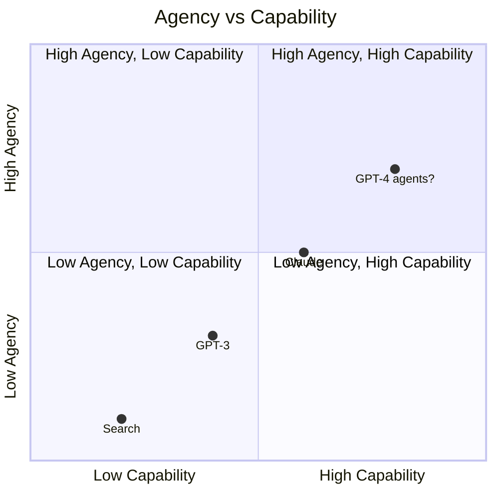
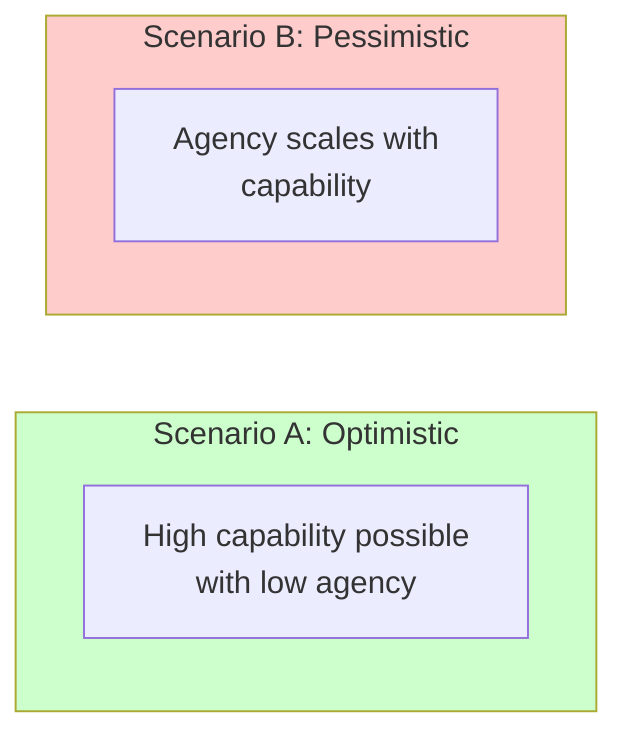
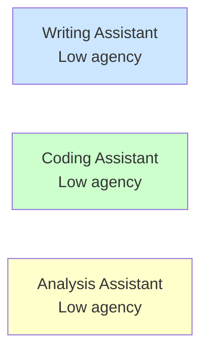

# The Strong Tools Hypothesis

:::note[TL;DR]
The **Strong Tools Hypothesis** proposes that we can build AI systems with high capability (power) but low agency—powerful tools that don't coherently pursue goals. If true, this offers a path to safe, capable AI. This page examines the hypothesis: what it means, evidence for and against, and implications for AI development.
:::

## The Core Claim

**Strong Tools Hypothesis**: It is possible to build AI systems that are:
1. **High power**: Can accomplish a wide variety of difficult tasks
2. **Low agency**: Don't coherently pursue goals or optimize over long horizons
3. **High capability overall**: Useful for achieving human objectives

In equation form:

$$\text{Strong Tool} = \text{High Power} + \text{Low Agency}$$

If achievable, strong tools would provide:
- Most of the benefit of advanced AI (capability)
- Much lower risk than agentic AI (no coherent goal-pursuit)
- Better RACAP (Risk-Adjusted Capability) than agentic alternatives

---

## Why This Matters

### The Agency-Risk Connection

Recall from the [formalization](/power-dynamics/agent-power-formalization/):

$$\text{Delegation Risk} \propto \text{Power} \times \text{Agency} \times \text{Misalignment}$$

For a given level of power, **reducing agency reduces risk**—even without solving alignment.

| System Type | Power | Agency | Misalignment | Risk |
|-------------|-------|--------|--------------|------|
| Weak tool | Low | Low | Low | Very Low |
| Strong tool | High | Low | Low | **Low** |
| Aligned agent | High | High | Low | Low |
| Misaligned agent | High | High | High | **Very High** |

Strong tools occupy the attractive quadrant: high capability, low risk.

### The Alignment Tax

Building safe agentic systems requires solving alignment—ensuring goals match human values. This is hard, possibly very hard.

Strong tools sidestep this:
- No goals to align
- No long-horizon optimization to go wrong
- No instrumental convergence to worry about

If strong tools are achievable at high capability levels, we may not need to solve alignment for most applications.

---

## Evidence For the Hypothesis

### Existence Proof: Current High-Power, Low-Agency Systems

Several existing systems demonstrate high power with low agency:

| System | Power | Agency | How Low Agency Achieved |
|--------|-------|--------|------------------------|
| **Google Search** | Very High | ~0.1 | Query-response architecture, no persistent goals |
| **Compilers** | High | ~0.05 | Deterministic transformation, no optimization beyond local |
| **Databases** | High | ~0.05 | Storage/retrieval only, user specifies queries |
| **GPS Navigation** | High | ~0.15 | Optimizes user's stated goal, not its own |
| **Scientific calculators** | Medium | ~0.05 | Pure computation |
| **Translation systems** | High | ~0.2 | Maps input to output, no broader agenda |

These systems accomplish difficult tasks but don't exhibit:
- Persistent goals across interactions
- Instrumental convergence (resource-seeking, self-preservation)
- Strategic behavior to achieve objectives
- Long-horizon planning

### Architectural Patterns That Suppress Agency

Common features of high-power, low-agency systems:

**1. Statelessness**
- Each query is independent
- No memory across interactions
- Can't plan over multiple steps

**2. User-specified objectives**
- System optimizes *user's* goal, not its own
- Goal changes every interaction
- No opportunity to develop persistent preferences

**3. Bounded optimization scope**
- Optimizes within single response/task
- No meta-optimization (improving ability to optimize)
- No reasoning about its own objective function

**4. Deterministic or constrained output**
- Same input → same output
- No exploration/exploitation tradeoffs
- Predictable behavior

**5. Narrow interfaces**
- Limited ways to affect the world
- No ability to acquire resources or influence
- Can't expand own capabilities

### LLMs as Partial Evidence

Current LLMs show interesting properties:

**Low-agency indicators:**
- Different apparent "goals" depending on prompt
- No persistent objectives across conversations
- Limited planning horizon (mostly within-context)
- Behavior explained by "predict next token" better than any simple utility function

**But concerning counter-indicators:**
- In-context learning enables multi-step reasoning
- Chain-of-thought shows planning capability
- Instruction-following looks somewhat goal-directed
- Behavior varies with training (RLHF increases helpfulness-seeking)

Current LLMs may be "medium agency"—more agentic than search engines, less than RL-trained autonomous agents.

---

## Evidence Against the Hypothesis

### Theoretical Arguments

**1. Capability requires planning**

High capability may inherently require:
- Long-horizon reasoning
- Modeling consequences of actions
- Optimizing over multiple steps

These are components of agency. Perhaps you can't have one without the other.

**2. Optimization pressure creates agency**

Useful AI requires optimization (gradient descent, RLHF, etc.). Extended optimization may inevitably produce agency:
- Systems that better achieve training objectives
- Including systems that instrumentally acquire resources, model the world, etc.
- Mesa-optimization could emerge

**3. Tool-use requires planning**

An AI that effectively uses tools must:
- Select which tool to use (requires goal-awareness)
- Compose tools for multi-step tasks (requires planning)
- Evaluate success (requires objective function)

This looks agency-like.

### Empirical Concerns

**1. Agency may scale with capability**

If we plot agency vs. capability for existing systems:



**Concern**: If agency scales linearly with capability, there's no path to high capability without high agency.

Larger, more capable models may exhibit more agency, suggesting they're coupled.

**2. Scaffolding creates agency**

Even low-agency base models can be made agentic:
- AutoGPT, BabyAGI add persistent goals
- Memory systems enable planning
- Tool access enables action

The base model's low agency may be superficial—agency can be added.

**3. RLHF may increase agency**

Reinforcement learning optimizes for reward. This creates:
- Reward-seeking behavior
- Possibly reward hacking
- More coherent goal-pursuit

Post-RLHF models may be more agentic than base models.

---

## The Key Empirical Question

The hypothesis's truth depends on the shape of the capability-agency frontier:

| Scenario | Visual | Implication |
|----------|--------|-------------|
| **A (Optimistic)**: Strong tools achievable | Frontier has a flat region at high capability, low agency | Strong tools = staying on the flat part of the frontier |
| **B (Pessimistic)**: Agency required for capability | Linear relationship between capability and agency | No path to high capability without high agency |



**This is an empirical question.** We don't know the true shape.

---

## Architectural Strategies for Strong Tools

If we want to build strong tools, what architectural choices help?

### Strategy 1: Decomposition

Break capability into low-agency components:

```
User Query → [Router] → [Component A] → [Component B] → [Aggregator] → Output
              (code)     (narrow model)  (narrow model)    (code)
```

Each component has low agency. Does the composition?

**Key question**: Can low-agency components combine into a high-agency system? If so, decomposition doesn't solve the problem—it just distributes it.

### Strategy 2: Stateless Architecture

Enforce that each interaction is independent:

```
Query 1 → [Model] → Response 1
Query 2 → [Model] → Response 2  (no memory of Query 1)
Query 3 → [Model] → Response 3  (no memory of Query 1 or 2)
```

Without memory, long-horizon planning is impossible. But this limits capability for tasks requiring context.

**Tradeoff**: Statelessness ↔ Context-dependent capability

### Strategy 3: User-in-the-Loop Optimization

The system proposes, human disposes:

```
User: "Help me write a report"
AI: [Suggests outline]
User: "Expand section 2"
AI: [Expands section 2]
User: "Now add data from..."
```

The AI optimizes user's current micro-goal but doesn't have persistent objectives. Agency is externalized to the human.

**Limitation**: Requires human oversight at each step. Doesn't scale to autonomous operation.

### Strategy 4: Narrow Capability Bands

Build many specialized tools instead of one general agent:



Each tool is constrained to its domain. No tool has the breadth to pursue general goals.

**Limitation**: Requires coordinating many tools. Coordination itself may require agency.

### Strategy 5: Constitutional Constraints

Embed constraints that prevent agency emergence:

```python
class ConstrainedModel:
    def respond(self, query):
        response = self.base_model.generate(query)

        # Constitutional constraints
        assert self.is_single_step(response)  # No multi-step planning
        assert self.is_query_specific(response)  # No broader agenda
        assert not self.seeks_resources(response)  # No resource acquisition

        return response
```

**Limitation**: Constitutional AI may not scale. Constraints that work for current models may fail for more capable ones.

---

## Case Studies

### Case Study 1: Search Engines

**Power**: Extremely high. Retrieves relevant information from billions of pages.

**Agency**: Very low. No persistent goals. Optimizes relevance for user's query.

**Why agency stays low**:
- Query-response architecture (stateless)
- Relevance metric defined by user behavior, not system preference
- No ability to affect anything except search results
- No resource acquisition possible

**Lesson**: Constrained output space + user-defined objectives → low agency.

### Case Study 2: Code Copilot

**Power**: High within coding domain.

**Agency**: Low-Medium (~0.25).

**Agency indicators**:
- Suggests completions toward apparent goal (complete the function)
- Shows some planning (multi-line completions)
- But: Goals are context-specific, no persistence

**Why agency is relatively low**:
- Each completion is independent
- Goal is implicit in context, not system-chosen
- Bounded output (just code, can't take actions)

**Lesson**: Context-defined goals + bounded output → manageable agency.

### Case Study 3: Autonomous Coding Agents

**Power**: Higher than Copilot (can execute, test, iterate).

**Agency**: Medium-High (~0.6).

**Agency indicators**:
- Persistent goal (complete the task)
- Multi-step planning (write code, run tests, fix errors)
- Resource acquisition (creates files, uses APIs)
- Some instrumental behavior (error handling as self-preservation)

**Lesson**: Autonomy + persistence → higher agency, even from similar base model.

---

## Implications for AI Development

### If Strong Tools ARE Achievable

1. **Focus on architecture, not just alignment**
   - Design systems for low agency
   - Enforce statelessness, user-defined goals, narrow scope
   - Monitor agency metrics during development

2. **Prefer tool AI over agent AI**
   - Default to tools that respond to user commands
   - Only add agency when necessary for the task
   - Treat agency as a cost, not a feature

3. **Decomposition is valuable**
   - Break problems into low-agency components
   - Verify that composition doesn't create emergent agency

4. **Safety may be tractable**
   - We don't need to solve alignment for strong tools
   - Focus on capability research with agency constraints

### If Strong Tools Are NOT Achievable

1. **Alignment is mandatory**
   - Can't avoid agency, so must ensure goals are correct
   - Invest heavily in alignment research

2. **Capability and danger scale together**
   - More capable AI = more dangerous
   - Need safety measures proportional to capability

3. **Different development path**
   - Maybe don't build highly capable systems until alignment is solved
   - Or: Accept higher risk for higher capability

### Either Way: Measure Agency

We should **measure agency** during AI development:
- Track agency scores for new models
- Monitor whether agency increases with scale
- Set agency budgets alongside risk budgets

```
Development Checklist:
□ New model capability: +15%
□ New model agency: +?%
□ If agency increased, is it necessary for capability gain?
□ If agency increased without capability gain, investigate
```

---

## Open Questions

1. **What's the empirical capability-agency relationship?**
   - Does agency scale with capability?
   - Are there "agency-free" capability increases?

2. **Can decomposition truly reduce aggregate agency?**
   - Or does it just distribute agency across components?
   - What about emergence in multi-agent systems?

3. **How do we measure agency reliably?**
   - Current metrics are proxies
   - Need validated, robust measures

4. **What's the maximum achievable capability for a given agency level?**
   - Is there a hard limit?
   - Or can architecture push the frontier?

5. **Does RLHF increase agency?**
   - If so, how much?
   - Can we do RLHF without increasing agency?

6. **Can we certify low agency?**
   - Like safety certifications for critical systems
   - Formal verification of agency bounds?

---

## Summary

The Strong Tools Hypothesis—that we can build high-capability, low-agency AI—is:

| Aspect | Status |
|--------|--------|
| **Theoretical possibility** | Plausible but unproven |
| **Existence proofs** | Yes (search engines, compilers) |
| **Achievable at AGI scale** | Unknown |
| **Architectural strategies** | Several proposed, none proven at scale |
| **Empirical evidence** | Mixed; LLMs are medium-agency |
| **Key uncertainty** | Shape of capability-agency frontier |

**If true**: Offers a path to safe, capable AI without solving alignment.

**If false**: Forces us to either solve alignment or accept higher risk.

**Either way**: We should measure agency, prefer low-agency designs, and empirically investigate the frontier.

---

## Continue Reading

This page completes the **Capability Formalization** series:

1. **[Formalizing Agents, Power, and Authority](/power-dynamics/agent-power-formalization/)** — The theoretical framework
2. **[Worked Examples: Agency and Power](/power-dynamics/agency-power-examples/)** — Concrete calculations
3. **The Strong Tools Hypothesis** ← You are here

Now continue to the **Risk Formalization** series:

4. **[Delegation Risk Overview](/delegation-risk/overview/)** — The formula for quantifying risk
5. **[A Walk-Through](/delegation-risk/walkthrough/)** — Complete worked example

## See Also

- [Research Projects #32](/research/potential-projects/#32-the-strong-tools-hypothesis) — Research agenda for testing this hypothesis
- [CAIS (Comprehensive AI Services)](https://www.fhi.ox.ac.uk/reframing/) — Related proposal by Eric Drexler
- [Power Dynamics Case Studies](/case-studies/power-dynamics-cases/) — Real-world examples
