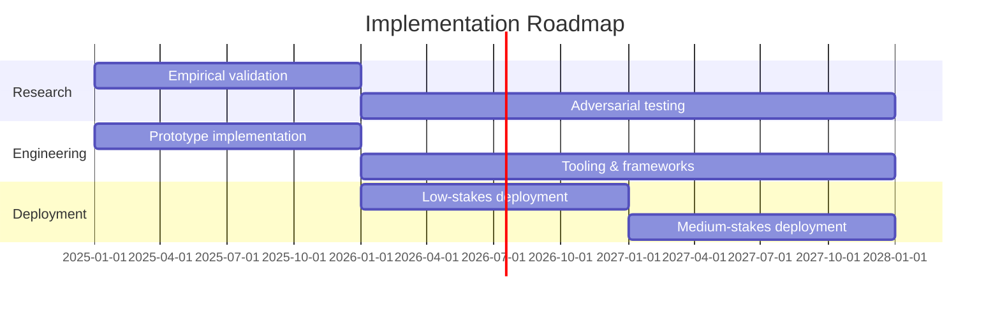

# Implementation Roadmap

## Why This Handles the Critical Period (2025-2030)

### Timeline Assumptions

- 2025-2027: AI reaches human-level capability in most cognitive domains
- 2027-2030: Potential for recursive self-improvement, but not yet realized
- Post-2030: Either we have safe AI that can help with harder alignment, or we're in trouble

The modular approach is specifically designed for this window. Here's why it might be sufficient:

**1. Prevents catastrophic failures during development**
Each iteration is safe even if not perfectly aligned. You get warning shots, not silent failures.

**2. Improves as capability increases**
Better models → better forecasting → better navigation. The system gets safer as it gets smarter (assuming no scheming).

**3. Enables recursive improvement**
Safe human-level AI can help design better modular architectures, improve forecasting, red-team its own security. You bootstrap safety research itself.

**4. Buys time for harder problems**
If we can maintain safety through 2030, we have capable AI assistants to help solve superintelligence alignment. We don't need the perfect solution now.

### The Key Bet

:::note[The Key Bet]
The architecture bets on: **Preventing scheming during the human-level period is tractable, and forecasting quality scales with capability.**
:::

If both hold, you get a window where:

- AI is useful enough to help with alignment research
- Dangerous enough to be existential risk if uncontrolled
- But controllable through decomposition + honest coordination + forecasting

That might be enough.

## Development Phases

### 2025-2026 (Near-term)

- Empirical validation of key assumptions
- Prototype implementation (at least one domain)
- Benchmark performance vs monolithic models
- Develop anti-scheming architectural patterns

### 2026-2028 (Medium-term)

- Scale to more complex systems
- Adversarial testing and red-teaming
- Deployment in medium-stakes applications
- Policy work: propose standards for high-risk AI deployment

### Success Criterion

:::tip
By 2028, demonstrate that modular architecture + honest agency + forecasting enables transformatively useful AI without catastrophic failures, with empirical evidence this scales to human-level capability.
:::

## What's Needed

### Empirical Research

- Scheming propensity in narrow vs broad contexts
- Does decomposition actually reduce scheming? (test monolithic vs modular)
- Forecasting capability for self-prediction with calibration tracking
- Performance benchmarks: modular vs monolithic (what's the cost?)
- Do fine-tuned narrow models behave more predictably than frontier models?
- Does temperature=0 (least surprise) prevent covert signaling?
- Byzantine coordinator voting: how many coordinators needed?
- Red-team testing: adversarial attacks on architectural patterns

### Engineering

- Prototype implementations proving feasibility (research assistant, code generation)
- Open-source frameworks for modular AI development
- Tooling for: decomposition boundary analysis, budget allocation, monitoring/alerting
- Anti-scheming architectural patterns codified and reusable
- Fine-tuning pipelines for creating 10+ task-specific models
- Formal verification tools for critical coordination logic
- Tripwire and circuit breaker implementations

### Policy and Standards

- Proposed safety requirements for high-stakes AI deployment
- Evaluation methodology for modular systems (how to assess safety?)
- Industry coordination on: minimum safety standards, shared red-teaming, incident reporting
- Regulatory frameworks: mandating modularity for critical applications?
- International standards: what should cross-border deployment require?

### Theory

- Formal models of compositional safety (how do safety properties compose?)
- Optimal decomposition theory (where to draw boundaries?)
- Bounds on forecasting accuracy requirements (how calibrated is "good enough"?)
- Analysis of economic incentives (why would companies adopt this?)
- Information-theoretic limits on coordination through bottlenecks
- Game-theoretic analysis of Byzantine coordinator voting
