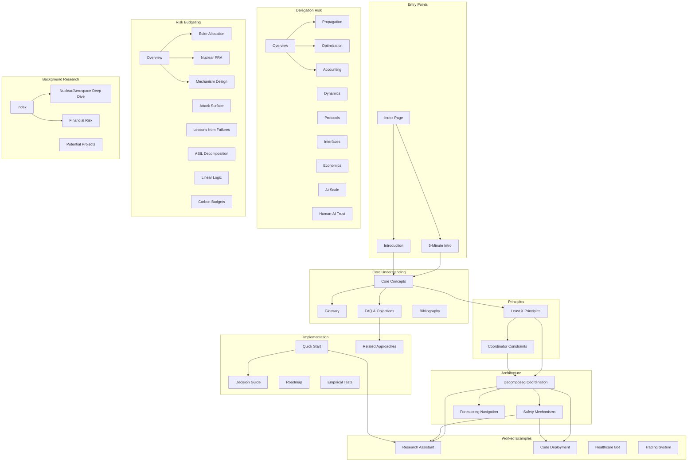

# Site Map & Concept Map

How the documentation is organized and how concepts relate to each other.

## Documentation Structure



## Reading Paths by Audience

### For New Readers
Start here for foundational understanding:

```
1. 5-Minute Intro → 2. Core Concepts → 3. Glossary → 4. Least X Principles
```

### For Busy Readers
Just want the essentials?

```
5-Minute Intro → Quick Start → FAQ
```

### For ML Engineers
Focus on practical implementation:

```
Quick Start → Decision Guide → Least X Principles →
Research Assistant Example → Code Deployment Example → Safety Mechanisms
```

### For Safety Researchers
Deep dive into the formal framework:

```
Core Concepts → Delegation Risk Overview → Risk Inheritance →
Trust Optimization → Coordinator Constraints → Empirical Tests
```

### For Organizations
Risk management perspective:

```
Introduction → Risk Budgeting Overview → Euler Allocation →
Lessons from Failures → Quick Start → Roadmap
```

### For Skeptics
Evidence and comparisons:

```
Introduction → FAQ → Related Approaches → Lessons from Failures →
Empirical Tests → Nuclear/Aerospace Deep Dive
```

## Concept Dependencies

What you need to understand before each major concept:

| Concept | Prerequisites | Recommended First |
|---------|--------------|-------------------|
| **Delegation Risk (Delegation Risk)** | None | Core Concepts |
| **Least X Principles** | Delegation Risk basics | Core Concepts |
| **Coordinator Constraints** | Least X Principles | Least X Principles |
| **Decomposed Coordination** | Least X, Coordinator | Both principle pages |
| **Risk Inheritance** | Delegation Risk, basic graph theory | Delegation Risk Overview |
| **Trust Optimization** | Inheritance, calculus | Risk Inheritance |
| **Euler Allocation** | Basic probability | Risk Budgeting Overview |
| **Fault Trees** | Probability, AND/OR logic | Nuclear Safety PRA |
| **Mechanism Design** | Game theory basics | Risk Budgeting Overview |

## Topic Index

### By Question

| Question | Pages |
|----------|-------|
| **What is this framework?** | Introduction, Core Concepts |
| **How do I apply it?** | Quick Start, Decision Guide, Principles to Practice |
| **What are the principles?** | Least X Principles, Coordinator Constraints |
| **Show me examples** | Research Assistant, Code Deployment, Case Studies (Sydney, Code Review Bot, Near-Miss, Drift) |
| **What's the math?** | Delegation Risk Overview, Risk Inheritance, Trust Optimization |
| **How does this relate to X?** | Related Approaches, Background Research |
| **What could go wrong?** | Anti-patterns, Lessons from Failures |
| **What's the evidence?** | Empirical Tests, Nuclear/Aerospace Deep Dive |
| **What's the roadmap?** | Roadmap, Potential Projects |

### By Keyword

| Keyword | Primary Page | Related Pages |
|---------|--------------|---------------|
| **Delegation Risk** | Delegation Risk Overview | Core Concepts, Trust Accounting |
| **Decomposition** | Decomposed Coordination | Core Concepts, Least X Principles |
| **Verification** | Safety Mechanisms | Trust Interfaces, Coordinator Constraints |
| **Byzantine** | Safety Mechanisms | Decomposed Coordination |
| **Fault Tree** | Nuclear Safety PRA | Euler Allocation, Risk Budgeting Overview |
| **Scheming** | Coordinator Constraints | Safety Mechanisms, Anti-patterns |
| **Human oversight** | Human-AI Trust | Coordinator Constraints, Safety Mechanisms |
| **Budget** | Risk Budgeting Overview | Euler Allocation, Trust Accounting |

## Page Status

| Section | Pages | Status |
|---------|-------|--------|
| **Overview** | 13 | Complete |
| **Principles** | 2 | Complete |
| **Architecture** | 7 | Complete |
| **Delegation Risk** | 10 | Most complete |
| **Risk Budgeting** | 9 | Complete |
| **Implementation** | 7 | Complete |
| **Background Research** | 6 | Complete |

## Quick Links

**Start here**:
- [5-Minute Introduction](/getting-started/five-minute-intro/)
- [Introduction](/getting-started/introduction/)
- [Core Concepts](/getting-started/core-concepts/)
- [Quick Start](/design-patterns/tools/quick-start/)

**Reference**:
- [Glossary](/getting-started/glossary/)
- [FAQ & Objections](/getting-started/faq/)
- [Anti-patterns](/case-studies/ai-systems/anti-patterns/)
- [Bibliography](/reference/bibliography/)
- [Decision Guide](/design-patterns/tools/decision-guide/)

**Deep dives**:
- [Delegation Risk Overview](/delegation-risk/overview/)
- [Risk Budgeting Overview](/cross-domain-methods/overview/)
- [Safety Mechanisms](/design-patterns/safety-mechanisms/)

**Interactive Tools**:
- [Delegation Risk Calculator](/design-patterns/tools/delegation-risk-calculator/)
- [Risk Inheritance](/design-patterns/tools/trust-propagation/)
- [Tradeoff Frontier](/design-patterns/tools/tradeoff-frontier/)
