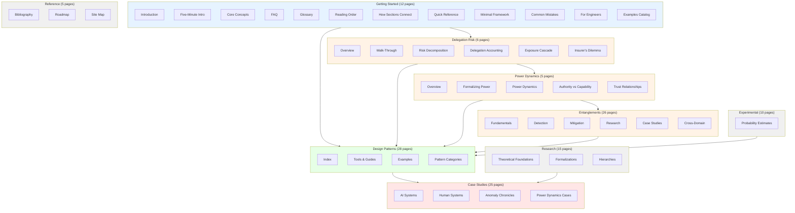
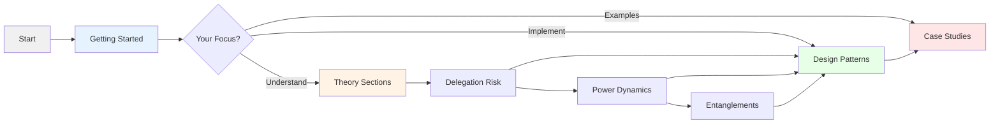

# Visual Site Map

Navigate the complete documentation structure at a glance.

---

## Site Overview

---

## Section Details

### Getting Started (Entry Points)

| Page | Focus | Time |
|------|-------|------|
| [Introduction](/getting-started/introduction/) | Problem statement | 10 min |
| [Five-Minute Intro](/getting-started/five-minute-intro/) | Quick overview | 5 min |
| [Core Concepts](/getting-started/core-concepts/) | Visual framework | 20 min |
| [FAQ](/getting-started/faq/) | Common questions | 15 min |
| [Glossary](/getting-started/glossary/) | Term definitions | Reference |
| [Reading Order](/getting-started/reading-order/) | Path guidance | 5 min |
| [How Sections Connect](/getting-started/how-sections-connect/) | Structure | 10 min |
| [Quick Reference](/getting-started/quick-reference/) | Cheat sheet | Reference |
| [Minimal Framework](/getting-started/minimal-framework/) | 80/20 version | 10 min |
| [Common Mistakes](/getting-started/common-mistakes/) | Anti-patterns | 15 min |
| [For Engineers](/getting-started/for-engineers/) | Implementation | 15 min |
| [Examples Catalog](/getting-started/examples-catalog/) | Example index | Reference |

### Delegation Risk (Theory)

| Page | Focus |
|------|-------|
| [Overview](/delegation-risk/overview/) | Core formula |
| [Walk-Through](/delegation-risk/walkthrough/) | Worked example |
| [Risk Decomposition](/delegation-risk/risk-decomposition/) | Accident vs defection |
| [Delegation Accounting](/delegation-risk/delegation-accounting/) | Risk budgets |
| [Exposure Cascade](/delegation-risk/exposure-cascade/) | Chain risk |
| [Insurer's Dilemma](/delegation-risk/insurers-dilemma/) | Who bears risk |

### Power Dynamics (Theory)

| Page | Focus |
|------|-------|
| [Overview](/power-dynamics/overview/) | Power formalization |
| [Formalizing Power](/power-dynamics/formalizing-power/) | Definitions |
| [Power Dynamics](/power-dynamics/power-dynamics/) | Relationships |
| [Authority vs Capability](/power-dynamics/authority-capability/) | Sanctioned power |
| [Trust Relationships](/power-dynamics/trust-relationships/) | Trust formalization |

### Entanglements (26 pages)

Organized into 6 subsections:

- **Fundamentals** — Core concepts, types, challenges
- **Detection** — Metrics, measuring entanglement
- **Mitigation** — Solutions, audit guides
- **Research** — Academic connections
- **Case Studies** — Historical examples
- **Cross-Domain** — Patterns from other fields

[Full Entanglements section](/entanglements/)

### Design Patterns (28 pages)

| Category | Examples |
|----------|----------|
| [Least-X Principles](/design-patterns/least-x-principles/) | Privilege, context, autonomy |
| [Structural Patterns](/design-patterns/structural/) | Bulkheads, firewalls |
| [Verification Patterns](/design-patterns/verification/) | Ghost checker, triangulation |
| [Monitoring Patterns](/design-patterns/monitoring/) | Tripwires, probing |
| [Recovery Patterns](/design-patterns/recovery/) | Rollback, degradation |
| [Multi-Agent Patterns](/design-patterns/multi-agent/) | Cross-validation |
| [Tools & Guides](/design-patterns/tools/quick-start/) | Implementation help |
| [Worked Examples](/design-patterns/examples/research-assistant-example/) | Concrete applications |

[Full Design Patterns section](/design-patterns/)

### Case Studies (25 pages)

| Category | Contents |
|----------|----------|
| [AI Systems](/case-studies/ai-systems/case-study-sydney/) | Sydney, Code Review Bot, Anti-patterns |
| [Human Systems](/case-studies/human-systems/nuclear-launch-authority/) | Nuclear, Jury, Organizations |
| [Anomaly Chronicles](/case-studies/anomaly-chronicles/) | Extended narrative scenario |
| [Power Dynamics Cases](/case-studies/power-dynamics-cases/) | Power in practice |

### Research (15 pages)

Theoretical foundations for formal treatment.

### Experimental (10 pages)

Probabilistic estimation tools and experiments.

### Reference (5 pages)

Bibliography, roadmap, site map.

---

## Reading Path Summary

---

## Page Counts by Section

| Section | Pages | Type |
|---------|-------|------|
| Getting Started | 12 | Entry |
| Delegation Risk | 6 | Theory |
| Power Dynamics | 5 | Theory |
| Entanglements | 26 | Theory |
| Design Patterns | 28 | Application |
| Case Studies | 25 | Examples |
| Research | 15 | Theory |
| Experimental | 10 | Tools |
| Reference | 5 | Meta |
| **Total** | **~132** | |

---

## See Also

- [How Sections Connect](/getting-started/how-sections-connect/) — Logical structure
- [Reading Order](/getting-started/reading-order/) — Prerequisites and paths
- [Site Map](/reference/site-map/) — Detailed page listing

