# Visualizing Delegation Hierarchies

:::note[Research Context]
This page surveys established techniques for visualizing hierarchical data, with discussion of their applicability to delegation risk systems. The field of hierarchy visualization has decades of research; we're exploring which approaches best communicate risk, permissions, and task decomposition.
:::

Effective visualization of delegation hierarchies needs to communicate multiple dimensions simultaneously: **structure** (who delegates to whom), **risk** (which components are dangerous), **permissions** (what access each component has), and **depth** (how deep the delegation chains go). No single visualization approach excels at all of these.

## The Visualization Challenge

A delegation risk diagram must convey:

| Dimension | What It Means | Visual Challenge |
|-----------|---------------|------------------|
| **Hierarchy** | Parent-child delegation relationships | Standard tree problem |
| **Risk level** | Expected harm from each component | Needs color, size, or annotation |
| **Permissions** | Read/write/execute/network access | Multiple boolean attributes |
| **Variable depth** | Some chains are deep, others shallow | Asymmetric layouts |
| **Cross-connections** | Coordination between branches | Edges that break tree structure |
| **Scale** | Real systems have dozens to hundreds of nodes | Cognitive load management |

---

## Key Interactive Examples

Before diving into details, explore these representative examples:

| Type | Best Example | What It Shows |
|------|--------------|---------------|
| **Tree Diagrams** | [D3 Collapsible Tree](https://observablehq.com/@d3/collapsible-tree) | Click to expand/collapse |
| **Treemaps** | [FinViz Stock Map](https://finviz.com/map.ashx) | Size = value, color = change |
| **Circle Packing** | [D3 Zoomable Circle Packing](https://observablehq.com/@d3/zoomable-circle-packing) | Nested containment |
| **Icicle Plots** | [D3 Zoomable Icicle](https://observablehq.com/@d3/zoomable-icicle) | Width = size, depth = level |
| **Risk-Specific** | [MITRE ATT&CK Navigator](https://mitre-attack.github.io/attack-navigator/) | Attack technique heatmap |

For a comprehensive comparison: [Hierarchy Visualization Comparison Tool](https://vis-uni-bamberg.github.io/hierarchy-vis/)

---

## Classic Tree Diagrams (Node-Link)

The traditional approach: nodes connected by edges showing parent-child relationships.

[](https://commons.wikimedia.org/wiki/File:Organizational_chart.svg)
*Classic organizational hierarchy - the visual metaphor most people recognize*

### Basic Example


### With Risk Encoding (Color + Annotations)

```mermaid
flowchart TD
    H[🏛️ Human Principal]
    H --> O[⚠️ Orchestrator]
    O --> A[Agent A]
    O --> B[Agent B]
    O --> C[⚠️ Agent C]
    A --> A1[Worker 1]
    A --> A2[Worker 2]
    B --> B1[Worker 3]
    C --> C1[Worker 4]
    C --> C2[⚠️ Worker 5]
    C --> C3[Worker 6]

    style H fill:#e3f2fd
    style O fill:#fff3e0
    style C fill:#fff3e0
    style C2 fill:#ffebee
    style A fill:#e8f5e9
    style B fill:#e8f5e9
    style A1 fill:#e8f5e9
    style A2 fill:#e8f5e9
    style B1 fill:#e8f5e9
    style C1 fill:#e8f5e9
    style C3 fill:#e8f5e9
```



**Legend:** Blue = oversight, Green = low risk, Orange = elevated risk, Red = high risk

### Variable Depth Example

Real delegation trees are asymmetric—some branches go deep, others are shallow:


**Strengths:**
- Intuitive—most people can read tree diagrams immediately
- Clear path tracing from root to any leaf
- Easy to add annotations (colors, sizes, labels)
- Works well for small-to-medium hierarchies (up to ~50 nodes)

**Weaknesses:**
- Space-inefficient (lots of whitespace)
- Deep trees become very tall or very wide
- Cross-connections create visual clutter

**Best for:** Communicating structure to general audiences, interactive diagrams where users can expand/collapse

**Research note:** [Nielsen Norman Group](https://www.nngroup.com/articles/treemaps/) confirms node-link diagrams remain the most intuitive for tracing hierarchical paths.

### Interactive Examples

- [D3 Collapsible Tree](https://observablehq.com/@d3/collapsible-tree) — Click to expand/collapse branches
- [D3 Tidy Tree](https://observablehq.com/@d3/tree) — Clean algorithmic layout

---

## Space-Filling Approaches

These techniques use all available space, encoding hierarchy through nesting rather than edges.

[](https://commons.wikimedia.org/wiki/File:United_States_Exports_Treemap_2017.svg)
*US exports by category (2017) - size shows export value, color shows category*

### Treemaps

[Invented by Ben Shneiderman in 1990](https://www.nngroup.com/articles/treemaps/), treemaps represent hierarchy as nested rectangles. Rectangle size encodes a quantitative value (e.g., risk budget, compute allocation).

**Conceptual Layout:**

```
┌─────────────────────────────────────────────────┐
│                   Root System                    │
├─────────────────────┬───────────────────────────┤
│                     │                           │
│    Agent A (40%)    │      Agent B (35%)        │
│  ┌───────┬───────┐  │  ┌─────────────────────┐  │
│  │ W1    │ W2    │  │  │                     │  │
│  │ (25%) │ (15%) │  │  │     W3 (35%)        │  │
│  └───────┴───────┘  │  │                     │  │
│                     │  └─────────────────────┘  │
├─────────────────────┴───────────────────────────┤
│              Agent C (25%)                       │
│  ┌─────────┬─────────┬─────────┐                │
│  │ W4 (8%) │ W5 (10%)│ W6 (7%) │                │
│  └─────────┴─────────┴─────────┘                │
└─────────────────────────────────────────────────┘
```

**Real-world example:** [FinViz Stock Market Treemap](https://finviz.com/map.ashx) — Shows market sectors and stock performance using size and color.

**For delegation risk:** Rectangle size = risk budget allocation, color = risk type or status.

**Interactive Examples:**
- [D3 Zoomable Treemap](https://observablehq.com/@d3/zoomable-treemap) — Click to zoom into sections
- [Treemap of Flare Classes](https://observablehq.com/@d3/treemap) — Software package hierarchy

---

### Icicle Plots

Horizontal rectangles cascading downward (or sideways). Width encodes size, vertical position encodes depth.

**Conceptual Layout:**

```
┌─────────────────────────────────────────────────────┐
│                    Root (100%)                       │
├──────────────────────┬──────────────────┬───────────┤
│    Agent A (40%)     │  Agent B (35%)   │ C (25%)   │
├───────────┬──────────┼──────────────────┼─────┬─────┤
│ W1 (25%)  │ W2 (15%) │    W3 (35%)      │W4   │W5   │
├───────────┴──────────┴──────────────────┴─────┴─────┤
│                    (leaf level)                      │
└─────────────────────────────────────────────────────┘
```

**Key advantage:** [Research found](https://arxiv.org/abs/1908.01277) icicle plots outperformed treemaps and sunbursts for hierarchy understanding tasks.

**For delegation risk:** Width = risk budget or capability scope, color = risk level, depth = delegation chain length.

**Interactive Examples:**
- [D3 Zoomable Icicle](https://observablehq.com/@d3/zoomable-icicle) — Click to zoom, shows 3 levels at a time
- [Icicle Chart Component](https://github.com/vasturiano/icicle-chart) — Standalone web component

---

### Circle Packing

Nested circles where children are packed inside their parent circle.

**Conceptual Layout:**

```
        ╭───────────────────────────────────╮
       ╱                                     ╲
      │    ╭─────────╮    ╭───────────────╮   │
      │   ╱           ╲  ╱                 ╲  │
      │  │  ╭───╮╭───╮│ │ ╭─────╮╭──────╮ │  │
      │  │  │ W1││ W2││ │ │ W3  ││  W4  │ │  │
      │  │  ╰───╯╰───╯│ │ ╰─────╯╰──────╯ │  │
      │   ╲  Agent A ╱   ╲    Agent B    ╱   │
      │    ╰─────────╯    ╰──────────────╯   │
       ╲              Root                  ╱
        ╰───────────────────────────────────╯
```

The "wasted" space actually [helps reveal hierarchy](https://www.data-to-viz.com/graph/circularpacking.html) better than treemaps—containment is visually obvious.

**For delegation risk:** The visual metaphor of "containing risk within boundaries" aligns naturally with framework concepts.

**Interactive Examples:**
- [D3 Zoomable Circle Packing](https://observablehq.com/@d3/zoomable-circle-packing) — Click to zoom in/out
- [D3 Circle Packing](https://observablehq.com/@d3/pack) — Static version
- [Circle Packing Gallery](https://d3-graph-gallery.com/circularpacking.html) — Multiple examples with code

---

## Radial Approaches

### Sunburst Charts

Concentric rings divided into segments, like a multi-layer pie chart.


*(Mermaid doesn't support true sunbursts—see interactive examples below)*

**Interactive Examples:**
- [D3 Zoomable Sunburst](https://observablehq.com/@d3/zoomable-sunburst) — Click segments to zoom
- [D3 Sunburst](https://observablehq.com/@d3/sunburst) — Static version

**For delegation risk:** Less recommended. Arc lengths are harder to compare than rectangles, and [research indicates](https://vis-uni-bamberg.github.io/hierarchy-vis/) rectangular layouts are often clearer.

---

### Chord Diagrams / Circos Plots

Nodes arranged on a circle, with arcs (chords) connecting related nodes. Excellent for showing cross-connections.

**Interactive Examples:**
- [D3 Chord Diagram](https://observablehq.com/@d3/chord-diagram) — Shows flows between groups
- [Circos](http://circos.ca/intro/features/) — The original genomics visualization tool

**For delegation risk:** Good for showing cross-branch coordination paths that break the tree structure.

---

## Risk-Specific Visualizations

Beyond general hierarchy techniques, some visualizations are designed specifically for risk:

### Fault Trees

Standard in nuclear and aerospace safety. AND/OR gates show how component failures combine:

```mermaid
flowchart TD
    TOP[🎯 System Failure]
    TOP --- OR1[OR Gate]

    OR1 --- PATH1[Path 1: All checks fail]
    OR1 --- PATH2[Path 2: Coordinator compromised]

    PATH1 --- AND1[AND Gate]
    AND1 --- A1[Review fails]
    AND1 --- A2[Tests fail]
    AND1 --- A3[Human approves]

    PATH2 --- AND2[AND Gate]
    AND2 --- B1[Coordinator schemes]
    AND2 --- B2[Evades monitoring]
```



**For delegation risk:** Directly applicable. See [Nuclear Safety PRA](/cross-domain-methods/nuclear-safety-pra/) for examples.

---

### Bow-Tie Diagrams

Shows causes on the left, the risk event in the center, and consequences on the right:

[](https://commons.wikimedia.org/wiki/File:Bow-tie_diagram_concept.jpg)
*Bow-tie diagram showing threats, barriers, event, and consequences (Wikimedia Commons)*

```mermaid
flowchart LR
    subgraph Causes
        C1[Capability too high]
        C2[Permissions too broad]
        C3[Monitoring gaps]
    end

    subgraph Controls["Preventive Controls"]
        P1[Capability limits]
        P2[Permission boundaries]
    end

    C1 --> P1
    C2 --> P2
    C3 --> P2

    P1 --> EVENT[⚠️ Harmful Action]
    P2 --> EVENT

    EVENT --> M1[Detection]
    EVENT --> M2[Containment]

    subgraph Mitigations["Mitigating Controls"]
        M1
        M2
    end

    M1 --> CONS1[Limited damage]
    M2 --> CONS2[Stopped spread]

    subgraph Consequences
        CONS1
        CONS2
    end
```



**For delegation risk:** Shows the full picture—what leads to harm, what prevents it, what limits damage.

---

### Risk Heat Maps / Matrices

The classic likelihood × impact matrix:

[](https://commons.wikimedia.org/wiki/File:Risk_Matrix_Simple.jpg)
*Simple risk matrix - likelihood vs. impact with color-coded severity (Wikimedia Commons)*


**For delegation risk:** Useful for comparing components, less useful for showing hierarchy.

---

## Security Industry Visualization Approaches

The IT security industry has developed sophisticated visualization techniques for showing risk, attack paths, and system relationships. Many of these directly apply to delegation risk.

### Attack Path Graphs

Security tools visualize how attackers can traverse systems to reach high-value targets. This maps directly to delegation chains.

[](https://commons.wikimedia.org/wiki/File:Virus_attack_tree.svg)
*Attack tree showing paths to system compromise (Wikimedia Commons)*

```mermaid
flowchart LR
    subgraph "Attack Path View"
        Entry[🌐 Internet-Exposed<br/>Service] --> Vuln1[Vulnerable<br/>Container]
        Vuln1 --> Priv[Privilege<br/>Escalation]
        Priv --> Lateral[Lateral<br/>Movement]
        Lateral --> Crown[👑 Crown Jewels<br/>Database]
    end

    style Entry fill:#ffebee
    style Vuln1 fill:#fff3e0
    style Priv fill:#fff3e0
    style Lateral fill:#fff3e0
    style Crown fill:#ffcdd2,stroke:#c62828,stroke-width:3px
```



**For delegation risk:** Model delegation chains as attack paths. "Shortest path to catastrophic harm" = which component chain could cause maximum damage fastest?

### Blast Radius Visualization

"Blast radius" shows the extent of damage if a component is compromised—what else is affected?

```mermaid
flowchart TD
    subgraph "Blast Radius from Compromised Coordinator"
        C[💥 Compromised<br/>Coordinator]
        C --> A1[Affected Agent 1]
        C --> A2[Affected Agent 2]
        C --> A3[Affected Agent 3]
        A1 --> W1[Worker 1]
        A1 --> W2[Worker 2]
        A2 --> W3[Worker 3]
        A3 --> W4[Worker 4]
        A3 --> W5[Worker 5]
    end

    style C fill:#d32f2f,color:#fff
    style A1 fill:#ff8a80
    style A2 fill:#ff8a80
    style A3 fill:#ff8a80
    style W1 fill:#ffcdd2
    style W2 fill:#ffcdd2
    style W3 fill:#ffcdd2
    style W4 fill:#ffcdd2
    style W5 fill:#ffcdd2
```



**For delegation risk:** "If this coordinator defects, what's exposed?" Expand outward from any node to show everything in its delegation subtree.

### MITRE ATT&CK Navigator (Coverage Heatmaps)

The [MITRE ATT&CK Navigator](https://mitre-attack.github.io/attack-navigator/) is a matrix heatmap showing attack techniques vs. tactics, color-coded by coverage, frequency, or risk.

[](https://commons.wikimedia.org/wiki/File:Feature-table-heatmap.svg)
*Example of a matrix heatmap - similar visual style to MITRE ATT&CK Navigator (Wikimedia Commons)*

| Initial Access | Execution | Persistence | Priv Esc | Defense Evasion | Lateral Movement |
|:---:|:---:|:---:|:---:|:---:|:---:|
| 🟢 Low | 🟡 Med | 🟢 Low | 🔴 High | 🟡 Med | 🔴 High |
| 🟢 Low | 🟢 Low | 🟡 Med | 🟡 Med | 🔴 High | 🟡 Med |
| 🟡 Med | 🔴 High | 🟢 Low | 🟢 Low | 🟡 Med | 🟢 Low |

*Each cell represents a technique; color indicates risk/coverage level*

**Features:**
- Overlay multiple "layers" (your coverage, adversary TTPs, gaps)
- Color intensity shows severity or frequency
- Interactive filtering and annotation

**For delegation risk:** Create a matrix of components vs. harm types. Color = risk level. Overlay accident risk and defection risk as separate layers.

**Try it:** [MITRE ATT&CK Navigator](https://mitre-attack.github.io/attack-navigator/)

### Cyber Kill Chain (Stage Diagrams)

[Lockheed Martin's Cyber Kill Chain](https://www.lockheedmartin.com/en-us/capabilities/cyber/cyber-kill-chain.html) shows attack progression as linear stages, with defenses mapped to each stage.

[](https://commons.wikimedia.org/wiki/File:The_Unified_Kill_Chain.png)
*The Unified Kill Chain - an expanded model combining multiple frameworks (Wikimedia Commons)*


**For delegation risk:** Map delegation stages (task receipt → decomposition → execution → aggregation → delivery) with controls at each stage.

### Permission/Access Graphs

Security tools visualize who can access what, showing permission relationships as graphs.


**For delegation risk:** Show what each component can access. Edge labels = permission type. Identify over-privileged components.

### Real-Time Network Topology

[](https://commons.wikimedia.org/wiki/File:NetworkTopologies.svg)
*Common network topology patterns - security tools show these dynamically with risk overlays (Wikimedia Commons)*

Tools like [Riverside](https://github.com/artemis19/riverside) (open source) and [Auvik](https://www.auvik.com/network-management-software/use-case/network-topology/) show live network topology with traffic flow.

**Key features:**
- Nodes appear/disappear as devices connect/disconnect
- Edge thickness = traffic volume
- Color = security status (normal/warning/alert)
- Time-travel to replay historical states

**For delegation risk:** Show delegation graph evolving in real-time as tasks spawn subtasks. Replay to understand what happened during an incident.

### Security Visualization Gallery

| Visualization | Best For | Example Tool |
|---------------|----------|--------------|
| **Attack path graph** | Showing routes to high-value targets | [BloodHound](https://specterops.io/bloodhound-community-edition/) |
| **Blast radius** | Impact analysis of compromised components | [Wiz](https://www.wiz.io/) |
| **Coverage heatmap** | Gaps in defense coverage | [MITRE Navigator](https://mitre-attack.github.io/attack-navigator/) |
| **Kill chain stages** | Linear progression with controls | Cyber Kill Chain |
| **Permission graph** | Access relationships | [Varonis](https://www.varonis.com/) |
| **Live topology** | Real-time system state | [Riverside](https://github.com/artemis19/riverside) |
| **Risk matrix** | Likelihood × Impact comparison | [Miro templates](https://miro.com/templates/risk-matrix/) |

### Adapting Security Visualizations for Delegation Risk

| Security Concept | Delegation Risk Analog |
|------------------|----------------------|
| Attack path to Domain Admin | Delegation chain to catastrophic harm |
| Blast radius of credential compromise | Impact zone if coordinator defects |
| MITRE technique coverage | Component coverage of harm modes |
| Kill chain stages | Task lifecycle stages |
| Permission graph | Component access rights |
| Choke points | High-leverage control points |
| Lateral movement | Cross-branch coordination |

---

## Encoding Risk and Permissions

Beyond structure, delegation diagrams need to encode risk levels and permissions:

### Visual Variables for Risk

| Variable | Example | Pros | Cons |
|----------|---------|------|------|
| **Color hue** | 🔴 High → 🟡 Medium → 🟢 Low | Intuitive | Colorblind issues |
| **Size** | Larger = more risk | Very salient | Conflicts with hierarchy |
| **Border thickness** | Thicker = higher risk | Works with fill | Subtle |
| **Warning badges** | ⚠️ on risky nodes | Clear meaning | Adds clutter |

### Visual Variables for Permissions

| Variable | Example | Best For |
|----------|---------|----------|
| **Border style** | Solid/dashed/dotted | Read/write/none |
| **Fill pattern** | Solid/outline/half | Access levels |
| **Small icons** | 🔒 🔑 👁️ | Semantic meaning |

### Combined Example

```mermaid
flowchart TD
    H["👤 Human<br/>Full Access"]
    H --> C["⚠️ Coordinator<br/>Read-All, Write-None"]
    C --> E1["Executor A<br/>Write: /src only"]
    C --> E2["Executor B<br/>Read-only"]
    C --> E3["⚠️ Executor C<br/>Network Access"]

    style H fill:#e3f2fd,stroke:#1565c0,stroke-width:3px
    style C fill:#fff3e0,stroke:#ef6c00,stroke-width:2px
    style E1 fill:#e8f5e9,stroke:#2e7d32,stroke-width:1px
    style E2 fill:#e8f5e9,stroke:#2e7d32,stroke-width:1px
    style E3 fill:#ffebee,stroke:#c62828,stroke-width:2px
```



---

## Recommendations for Delegation Risk

Based on this survey:

### For Documentation & Communication

**Use:** Node-link tree diagrams with:
- Color gradient (warm = high risk, cool = low)
- Warning badges on highest-risk nodes
- Dotted lines for cross-branch coordination
- Mermaid for simple diagrams, D3 for complex ones

### For Dashboards & Monitoring

**Consider:** Icicle plots or treemaps with:
- Width encoding risk budget
- Color encoding status (green/yellow/red)
- Interactive drill-down

### For Interactive Exploration

**Consider:** [D3 Zoomable Circle Packing](https://observablehq.com/@d3/zoomable-circle-packing) or [Collapsible Tree](https://observablehq.com/@d3/collapsible-tree)

---

## Further Reading

### Interactive Example Collections

- [D3 Hierarchy Examples](https://observablehq.com/@d3/gallery#hierarchies) — Official D3 gallery
- [D3 Graph Gallery: Hierarchy](https://d3-graph-gallery.com/hierarchy.html) — Code examples
- [Flourish Hierarchy Templates](https://flourish.studio/blog/hierarchy-diagrams-sunburst-packed-circle/) — No-code tools

### Research Papers

- Shneiderman, B. (1992). "Tree visualization with tree-maps." *ACM Transactions on Graphics*.
- [Wang et al. (2006)](https://dl.acm.org/doi/10.1145/1124772.1124851). "Visualization of large hierarchical data by circle packing." *CHI*.
- [Comparison Study (2019)](https://arxiv.org/abs/1908.01277). "Interactive Visualisation of Hierarchical Quantitative Data: An Evaluation."

### Comparison Tools

- [Effective Visualization of Hierarchies](https://vis-uni-bamberg.github.io/hierarchy-vis/) — Side-by-side comparison
- [Data Viz Catalogue: Hierarchy](https://datavizcatalogue.com/search/hierarchy.html) — When to use what

### Security Visualization Resources

- [BloodHound Documentation](https://bloodhound.readthedocs.io/) — Attack path analysis for Active Directory
- [MITRE ATT&CK Navigator](https://mitre-attack.github.io/attack-navigator/) — Interactive attack technique matrix
- [Cyber Kill Chain](https://www.lockheedmartin.com/en-us/capabilities/cyber/cyber-kill-chain.html) — Lockheed Martin's attack stage model
- [SecViz](https://secviz.org/) — Security visualization community and resources
- [Cambridge Intelligence: Cybersecurity](https://cambridge-intelligence.com/use-cases/cybersecurity/) — Graph visualization for security

---

## See Also

- [Framework Overview](/delegation-risk/overview/) — The delegation structures being visualized
- [Nuclear Safety PRA](/cross-domain-methods/nuclear-safety-pra/) — Fault tree examples
- [Exposure Cascade](/delegation-risk/exposure-cascade/) — How risk flows through hierarchies
