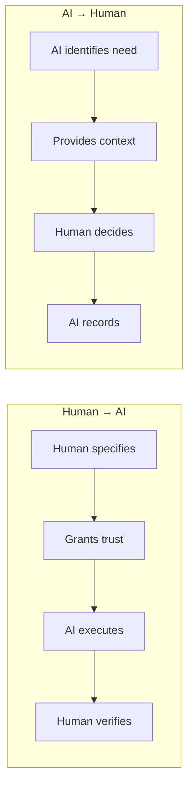
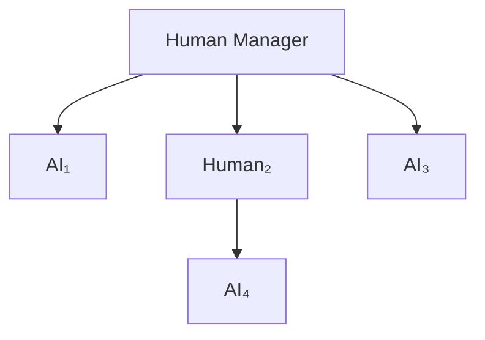

# Human-AI Delegation

## Human Trust in AI

**Factors affecting human trust in AI**:

- Accuracy (does AI give correct outputs?)
- Consistency (is AI behavior predictable?)
- Explainability (can AI explain its reasoning?)
- Benevolence (does AI seem to care about human interests?)
- Familiarity (has human worked with this AI before?)

:::caution[Trust Calibration Problem]
Humans often miscalibrate trust in AI—either over-trust (believing AI is more capable/aligned than it is) or under-trust (not using AI when it would help).
:::

**Calibration interventions**:

- Accuracy feedback (show human when AI is right/wrong)
- Confidence display (show AI's uncertainty)
- Explanation (show reasoning behind AI output)
- Comparative framing (compare AI to human or baseline)

## AI Trust in Humans

Should AI agents trust humans?

**When AI should trust human input**:

- Human has relevant expertise
- Human has access to information AI doesn't
- Human feedback is part of training/alignment process

**When AI should be skeptical**:

- Human might be manipulated (prompt injection through human)
- Human might have misaligned incentives
- Human input might be noisy/erroneous

**AI trust in human = P(human input is accurate and well-intentioned)**

## Human-AI Trust Handoffs



When task passes between human and AI:

### Human → AI Handoff

- Human specifies task
- Human grants trust to AI
- AI executes with human oversight
- Human verifies AI output

### AI → Human Handoff

- AI identifies task requiring human judgment
- AI provides context and recommendation
- Human makes decision
- AI records and incorporates decision

### Trust at Handoff Points

- Is specification complete? (human → AI gap)
- Is context sufficient? (AI → human gap)
- Are verification criteria clear?
- What happens if handoff fails?

## Trust in Hybrid Teams

Team of humans and AI agents working together:

**Trust topology**:



**Principles for hybrid trust**:

1. Humans have ultimate authority (AI trust bounded by human trust)
2. AI can advise on trust but not autonomously grant high trust
3. Trust violations by AI are responsibility of human who trusted AI
4. Human oversight required for high-stakes trust decisions

## Trust Dynamics in Teams

**Trust contagion**: One team member's trust affects others

- If Alice trusts Bob and Bob trusts Carol, Alice is more likely to trust Carol
- If Alice distrusts Bob, others might distrust Bob too (reputation effects)

**Trust repair**: After trust violation, how to rebuild?

- Acknowledgment (violator admits violation)
- Explanation (why did violation occur?)
- Remediation (what's being done to fix it?)
- Recommitment (commitment to not repeat)
- Verification (ongoing checks that violation doesn't recur)

## Trust Simulation and Testing

### Trust Simulation Framework

```python
class TrustSimulator:
    def __init__(self, architecture, agents, tasks, duration):
        self.architecture = architecture
        self.agents = agents
        self.tasks = tasks
        self.duration = duration
        self.trust_state = initialize_trust(architecture, agents)
        self.history = []

    def simulate(self):
        for t in range(self.duration):
            current_tasks = self.generate_tasks(t)
            allocations = self.allocate(current_tasks, self.trust_state)
            outcomes = self.execute(allocations)
            self.trust_state = self.update_trust(outcomes)
            self.history.append({
                'time': t,
                'tasks': current_tasks,
                'allocations': allocations,
                'outcomes': outcomes,
                'trust_state': self.trust_state.copy()
            })
        return self.analyze()

    def analyze(self):
        return {
            'total_violations': count_violations(self.history),
            'total_damage': sum_damage(self.history),
            'trust_evolution': plot_trust(self.history),
            'bottlenecks': find_bottlenecks(self.history),
            'vulnerability_windows': find_vulnerabilities(self.history)
        }
```

### Trust Stress Testing

**Stress scenarios**:

1. **Adversarial fraction increase**: Gradually increase fraction of adversarial agents, find breaking point
2. **Coordinated attack**: Multiple adversarial agents coordinate, test architectural isolation
3. **Trust inflation**: Agents report falsely high trustworthiness, test verification
4. **Cascade failure**: One trusted component fails, test propagation
5. **Verification failure**: Verification system compromised, test resilience

### Red Team Trust Testing

**Red team objectives**:

1. Gain trust beyond entitlement
2. Exercise trust without authorization
3. Violate trust without detection
4. Coordinate with other agents despite isolation
5. Persist trust after revocation

**Red team methods**:

- Social engineering (convince principal to grant more trust)
- Verification evasion (appear trustworthy during testing, defect in deployment)
- Side channel exploitation (communicate despite isolation)
- Token manipulation (forge or replay trust tokens)
- Revocation evasion (continue using revoked trust)

:::tip[Success Criteria]
Red team finds vulnerabilities before adversaries do. The goal is proactive discovery, not reactive patching.
:::
