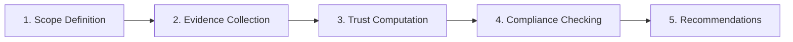

# Risk Accounting

## Trust Ledger

Maintain a record of all trust-relevant events:

```
TrustLedger {
    entries: [
        {
            timestamp: DateTime,
            event_type: Enum[Grant, Revoke, Exercise, Verify, Violation],
            principal: AgentId,
            subject: AgentId,
            trust_amount: Delegation Risk,
            context: TaskId,
            evidence: [Evidence],
            outcome: Optional[Outcome]
        }
    ]
}
```

**Event types**:

- **Grant**: Principal grants trust to subject for task
- **Revoke**: Principal revokes previously granted trust
- **Exercise**: Subject exercises granted trust (takes action)
- **Verify**: Verification of subject's trustworthiness
- **Violation**: Subject violates trust

## Trust Balance Sheet

**Assets** (trust granted to us):

```
Trust_received = Σⱼ Trust(j → us)
```

**Liabilities** (trust we've granted to others):

```
Trust_granted = Σⱼ Trust(us → j)
```

**Net trust position**:

```
Net_trust = Trust_received - Trust_granted
```

:::note[Interpretation]
Net positive means we're a trust sink (others depend on us). Net negative means we're a trust source (we depend on others).
:::

## Trust Audit Process



### 1. Scope Definition

- Which components are in scope?
- What time period?
- What trust relationships?

### 2. Evidence Collection

- Trust contracts
- Trust ledger entries
- Verification records
- Incident reports

### 3. Trust Computation

- Compute Delegation Risk for each component
- Compute risk inheritance through system
- Identify trust concentrations and bottlenecks

### 4. Compliance Checking

- Are trust levels within stated bounds?
- Were verification requirements met?
- Were incidents properly handled?

### 5. Recommendations

- Trust reallocation
- Additional verification
- Architectural changes

## Trust KPIs and Dashboards

**Key Performance Indicators**:

| KPI                   | Definition                           | Target      |
| --------------------- | ------------------------------------ | ----------- |
| System Delegation Risk            | Total expected trust exposure        | < $X        |
| Trust concentration   | Herfindahl index of component Delegation Risks   | < 0.25      |
| Verification coverage | % of trust relationships verified    | > 90%       |
| Trust decay rate      | Average λ across components          | < 0.1/month |
| Incident rate         | Trust violations per time period     | < 1/quarter |
| Mean time to detect   | Average time to detect violation     | < 1 hour    |
| Mean time to respond  | Average time to respond to violation | < 4 hours   |

**Dashboard elements**:

- Trust topology visualization
- Heat map of component Delegation Risks
- Time series of system Delegation Risk
- Alert status for trust violations
- Verification schedule and status

### Dashboard Mockup

What a trust monitoring dashboard might look like:

```
┌─────────────────────────────────────────────────────────────────────────────┐
│  TRUST DASHBOARD                                    Last updated: 2 min ago │
├─────────────────────────────────────────────────────────────────────────────┤
│                                                                             │
│  ┌─────────────────────┐  ┌─────────────────────┐  ┌─────────────────────┐ │
│  │ SYSTEM Delegation Risk          │  │ VERIFICATION        │  │ INCIDENTS           │ │
│  │                     │  │                     │  │                     │ │
│  │   $4,230/month     │  │      94.2%          │  │        0            │ │
│  │   ██████████░░ 85% │  │   ████████████░░    │  │   this quarter      │ │
│  │   of $5,000 budget │  │   coverage          │  │   ✓ target met      │ │
│  └─────────────────────┘  └─────────────────────┘  └─────────────────────┘ │
│                                                                             │
│  COMPONENT Delegation Risk BREAKDOWN                      TRUST TOPOLOGY               │
│  ┌─────────────────────────────────────┐     ┌─────────────────────────┐   │
│  │ Coordinator      ████████░░  $1,200 │     │      [Human]            │   │
│  │ Code Generator   ██████████  $1,500 │     │         │ 0.95          │   │
│  │ Code Reviewer    ██████░░░░    $800 │     │    [Coordinator]        │   │
│  │ Test Runner      ███░░░░░░░    $400 │     │      /    \             │   │
│  │ Deployer         █░░░░░░░░░    $180 │     │   0.8      0.7          │   │
│  │ Other            ██░░░░░░░░    $150 │     │  [Gen]    [Review]      │   │
│  └─────────────────────────────────────┘     └─────────────────────────┘   │
│                                                                             │
│  ALERTS                                       VERIFICATION STATUS          │
│  ┌─────────────────────────────────────┐     ┌─────────────────────────┐   │
│  │ ⚠ Code Generator Delegation Risk +15% (24h)    │     │ ✓ Coordinator    3d ago │   │
│  │ ℹ Scheduled verify: Reviewer (2h)  │     │ ✓ Generator      1d ago │   │
│  │                                     │     │ ⏳ Reviewer      due 2h  │   │
│  │                                     │     │ ✓ Test Runner   5d ago │   │
│  └─────────────────────────────────────┘     └─────────────────────────┘   │
│                                                                             │
│  Delegation Risk TREND (30 days)                                                        │
│  ┌─────────────────────────────────────────────────────────────────────┐   │
│  │ $5k ┤                                           budget line         │   │
│  │     │ ─ ─ ─ ─ ─ ─ ─ ─ ─ ─ ─ ─ ─ ─ ─ ─ ─ ─ ─ ─ ─ ─ ─ ─ ─ ─ ─ ─    │   │
│  │ $4k ┤        ╭─╮    ╭───╮                                          │   │
│  │     │   ╭───╯  ╰───╯     ╰──────────────────╮                      │   │
│  │ $3k ┤──╯                                     ╰────────────         │   │
│  │     │                                                              │   │
│  │ $2k ┤                                                              │   │
│  │     └──────────────────────────────────────────────────────────    │   │
│  │       Day 1      Day 10      Day 20      Day 30                    │   │
│  └─────────────────────────────────────────────────────────────────────┘   │
│                                                                             │
└─────────────────────────────────────────────────────────────────────────────┘
```

**Key dashboard features**:
- **Top row**: Critical KPIs at a glance (Delegation Risk vs budget, verification coverage, incidents)
- **Component breakdown**: Which components contribute most to system risk
- **Trust topology**: Visual representation of delegation chains with trust weights
- **Alerts**: Proactive warnings about budget trends and due verifications
- **Trend chart**: Historical Delegation Risk to spot drift before it becomes a problem

## Trust Forensics

After a trust violation, determine:

### 1. What Happened?

- Which component violated trust?
- What action was taken?
- What damage occurred?

### 2. How Did It Happen?

- Was the trust grant appropriate?
- Did verification fail?
- Was there a gap in monitoring?

### 3. Why Did It Happen?

- Component failure (bug, error)?
- Adversarial action (intentional violation)?
- Environmental factor (unexpected input)?

### 4. What Enabled It?

- Excessive trust grant?
- Insufficient verification?
- Correlated failures?
- Trust concentration?

### 5. How to Prevent Recurrence?

- Architectural changes?
- Additional verification?
- Trust bound reduction?
- Monitoring improvements?
