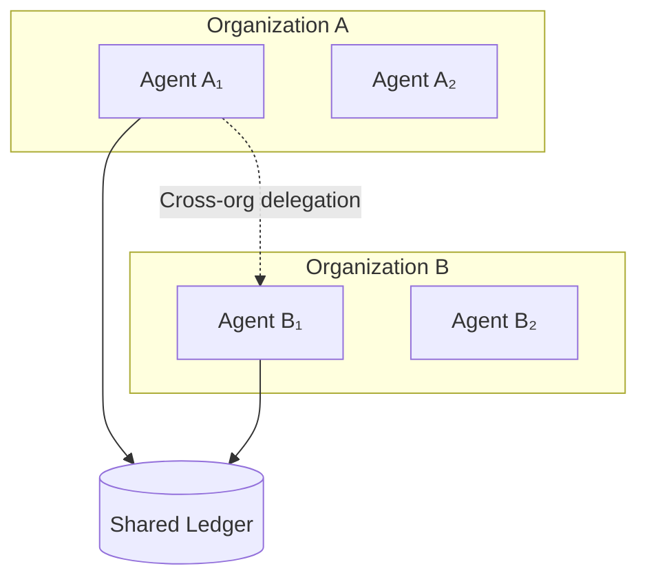

# Risk at Scale

## Trust and System Size

How does trust scale with system size n?

**Linear scaling**: Trust ∝ n

- Each additional component adds its own trust
- Total trust = Σᵢ Trust_i

**Superlinear scaling**: Trust ∝ n^α, α > 1

- Interaction effects
- Coordination enables attacks impossible for individuals
- Total trust grows faster than component count

**Sublinear scaling**: Trust ∝ n^α, α < 1

- Diversification effects
- Many components means errors average out
- Total trust grows slower than component count

**Which applies depends on**:

- Correlation structure (independent → sublinear, correlated → superlinear)
- Architecture (hierarchical → closer to linear, mesh → more interactions)
- Task type (independent tasks → sublinear, coordinated tasks → superlinear)

## Trust Concentration Limits

**Herfindahl-Hirschman Index for trust**:

```
HHI = Σᵢ (Trust_i / Trust_total)²
```

- HHI = 1: All trust in one component (maximum concentration)
- HHI = 1/n: Trust evenly distributed (minimum concentration)

**Regulatory analog**: Antitrust limits on market concentration

**Trust concentration limits**:

- No single component should have > X% of total trust
- HHI should be < Y

:::danger[Why Limit Concentration]
Single point of failure, harder to recover from violation, and too much power in one component. Concentration creates fragility.
:::

## Trust Bottleneck Analysis

**Identify bottlenecks**: Components where trust accumulates

**Bottleneck metric**:

```
Bottleneck_score_i = Trust_through_i / Trust_total
```

High score = lots of trust flows through this component.

**Bottleneck mitigation**:

- Redundancy (multiple components that can handle same flow)
- Bypass (alternative paths that don't go through bottleneck)
- Hardening (extra verification at bottleneck)

## Trust in Distributed Systems

**CAP theorem analog for trust**:

Can't simultaneously have all of:

- **Consistency**: All components have same trust view
- **Availability**: Trust decisions always possible
- **Partition tolerance**: System works despite communication failures

**Trade-offs**:

- CP: Consistent trust but might be unavailable during partitions
- AP: Available trust but might be inconsistent across partitions
- CA: Consistent and available but can't handle partitions

:::note
Practical choice: Most systems choose AP (eventual trust consistency). Accept that trust views may temporarily diverge during partitions.
:::

**Eventual trust consistency**: After partition heals, trust views converge.

## Multi-Principal Settings

When multiple principals delegate to shared agents:

**Principal 1**: Wants agent to do X
**Principal 2**: Wants agent to do Y
**Agent**: Must balance competing demands

**Trust complication**: Agent might prioritize one principal over another.

### Trust Allocation Among Principals

**Proportional**: Trust proportional to delegation volume

```
Trust_share_i = Volume_i / Σⱼ Volume_j
```

**Equal**: Each principal gets equal trust share

```
Trust_share_i = 1/n
```

**Priority-based**: Some principals have priority

```
Trust_share_i ∝ Priority_i
```

### Principal Conflicts

**Scenario**: Principal A wants agent to maximize revenue. Principal B wants agent to minimize risk. Agent can't fully satisfy both.

**Trust implications**:

- Agent might favor one principal (violating other's trust)
- Agent might compromise (partially violating both)
- Agent might be paralyzed (satisfying neither)

**Resolution mechanisms**:

- Explicit priority ordering
- Negotiated compromise function
- Separate agents for each principal
- Arbiter principal for conflicts

### Federated Trust



Multiple organizations share AI infrastructure but don't fully trust each other.

**Model**:

- Organization A has agents {A₁, A₂, ...}
- Organization B has agents {B₁, B₂, ...}
- Cross-organization delegation: Aᵢ delegates to Bⱼ

**Trust challenges**:

- A doesn't fully trust B's agents
- B doesn't fully trust A's oversight
- Neither trusts the other's verification

**Federated trust protocol**:

1. A specifies task and trust requirements
2. B proposes agent and trust contract
3. A and B agree on verification (possibly third party)
4. Task executes with joint monitoring
5. Outcomes logged to shared ledger

**Trust in shared ledger**: Both parties must trust the ledger. Blockchain/distributed ledger can provide this without trusting single party.
