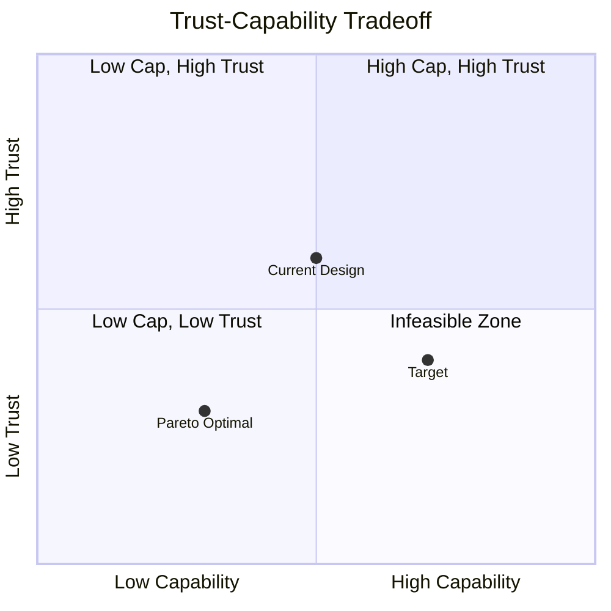

# Risk Optimization

## Trust as Objective Function

Frame trust minimization as optimization:

```
minimize: Σᵢ DR(component_i)
subject to:
    Capability(system) ≥ required_capability
    Σᵢ Cost(component_i) ≤ budget
    Architecture_constraints
```

**Decision variables**:

- Component selection (which implementations)
- Architecture (how components connect)
- Trust bounds (what each component can access)
- Verification investment (how much to verify each component)

## Trust Gradient Computation

For differentiable trust functions, compute gradients:

```
∂DR_system / ∂capability_i = marginal trust cost of capability i
```

:::tip
High gradient capabilities are expensive in trust terms—candidates for removal or externalization. Focus optimization effort on the capabilities that dominate your delegation risk budget.
:::

**Example**: System with components A, B, C

```
Delegation Risk = DR_A(cap_A) + DR_B(cap_B) + DR_C(cap_C) + interaction_terms

∂DR/∂cap_A = ∂DR_A/∂cap_A + Σⱼ ∂interaction_Aj/∂cap_A
```

If ∂DR/∂cap_A >> ∂DR/∂cap_B, reducing A's capability gives more trust reduction per unit capability lost.

## Trust-Capability Pareto Frontier

Plot achievable (capability, trust) pairs:



**Pareto efficient designs**: Can't reduce trust without reducing capability.

**Dominated designs**: Another design has both lower trust and higher capability.

**Goal**: Find designs on or near Pareto frontier.

## Trust Optimization Algorithms

### Algorithm 1: Greedy Trust Reduction

```
while trust_budget_exceeded:
    compute ∂DR/∂capability for all capabilities
    find capability c with highest gradient
    if removing c maintains minimum_capability:
        remove c
    else:
        find alternative implementation of c with lower trust
```

### Algorithm 2: Trust-Aware Architecture Search

```
for architecture in architecture_space:
    compute DR(architecture)
    compute Capability(architecture)
    if dominates_current_best:
        update_best(architecture)
return pareto_frontier
```

### Algorithm 3: Simulated Annealing for Trust

```
current = initial_architecture
temperature = high
while not converged:
    neighbor = random_modification(current)
    Δ_trust = DR(neighbor) - DR(current)
    Δ_capability = Capability(neighbor) - Capability(current)

    if Δ_trust < 0 and Δ_capability >= 0:
        current = neighbor  # Strictly better
    elif random() < exp(-Δ_trust / temperature):
        current = neighbor  # Accept worse with probability

    temperature *= cooling_rate
```

## Convexity and Trust Optimization

**Question**: Is trust minimization convex?

If Delegation Risk is convex in capabilities, optimization is tractable (gradient descent finds global optimum).

**Arguments for convexity**:

- Individual component Delegation Risk often convex (more capability → more risk, increasing rate)
- Sum of convex functions is convex

**Arguments against**:

- Interaction terms might be non-convex
- Discrete choices (which implementation) make problem combinatorial
- Verification effectiveness might have non-convex relationship with investment

:::note[Practical Approach]
Assume local convexity, use multiple random starts, verify solutions. Most real architectures have enough structure that local search finds good solutions.
:::

## Trust Sensitivity Analysis

How robust is optimal trust allocation to parameter changes?

**Parameters to vary**:

- Damage estimates (what if 2× higher?)
- Probability estimates (what if 2× more likely?)
- Verification effectiveness (what if 50% less effective?)
- Correlation structure (what if agents more correlated?)

**Sensitivity**: ∂(optimal_DR) / ∂(parameter)

High sensitivity parameters need better estimation or robust optimization.

**Robust trust optimization**:

```
minimize: max_{parameters ∈ uncertainty_set} DR(architecture, parameters)
```

Find architecture that minimizes worst-case trust over parameter uncertainty.
