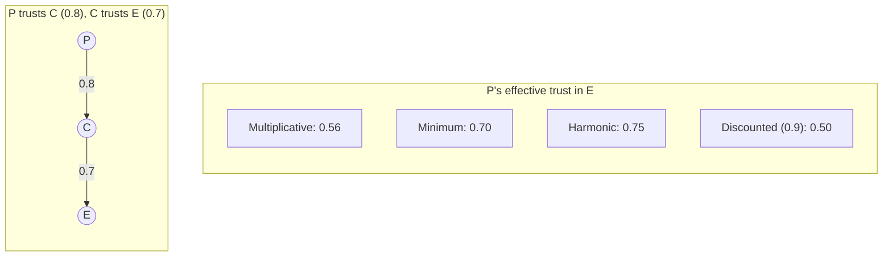
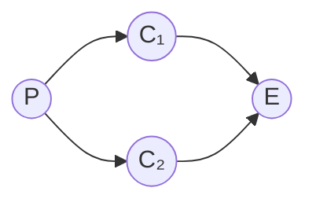

# Risk Inheritance Algorithms

Given a system of n components with pairwise trust relationships, how does risk inherit through delegation chains from principals to leaf executors? This is analogous to PageRank, electrical current flow, or heat diffusion—but with delegation-specific semantics.

## Setup

- **Nodes**: Components (including human principals and leaf executors)
- **Edges**: Trust relationships with weights w_ij ∈ [0, 1]
- **Sources**: Principals (infinite trust capacity)
- **Sinks**: Executors (consume trust to act)

:::note[The Inheritance Question]
If principal P trusts coordinator C with weight 0.8, and C trusts executor E with weight 0.7, what's P's effective trust in E? And what risk does P inherit from E's potential harm modes?
:::

## Candidate Propagation Rules

### Rule 1: Multiplicative (Independent Stages)

```
Trust(P→E via C) = Trust(P→C) × Trust(C→E) = 0.8 × 0.7 = 0.56
```

Interpretation: Each stage is an independent filter. If P→C passes 80% of good intent and C→E passes 70%, total passage is 56%.

### Rule 2: Minimum (Bottleneck)

```
Trust(P→E via C) = min(Trust(P→C), Trust(C→E)) = min(0.8, 0.7) = 0.7
```

Interpretation: Chain is only as strong as weakest link.

### Rule 3: Harmonic Mean (Balanced)

```
Trust(P→E via C) = 2 × Trust(P→C) × Trust(C→E) / (Trust(P→C) + Trust(C→E)) = 2×0.8×0.7/1.5 = 0.747
```

Interpretation: Balanced combination that penalizes extreme asymmetry.

### Rule 4: Discounted Multiplicative

```
Trust(P→E via C) = Trust(P→C) × Trust(C→E) × discount^depth = 0.8 × 0.7 × 0.9 = 0.504
```

Interpretation: Each hop adds overhead/uncertainty beyond the multiplication.

### Comparing the Rules

The choice of propagation rule significantly affects trust calculations. Here's the same network under different rules:



| Rule | Formula | Result | Best When |
|------|---------|--------|-----------|
| **Multiplicative** | 0.8 × 0.7 | **0.56** | Stages filter independently; conservative |
| **Minimum** | min(0.8, 0.7) | **0.70** | Bottleneck matters most; optimistic |
| **Harmonic** | 2×0.8×0.7/(0.8+0.7) | **0.75** | Balanced view; penalizes asymmetry |
| **Discounted** | 0.8×0.7×0.9 | **0.50** | Long chains are inherently risky |

**Recommendation**: Use **multiplicative** for safety-critical systems (most conservative). Use **minimum** when you trust verification at each stage. Use **discounted** when chain length itself is a concern.

## Multi-Path Trust

When multiple paths exist from P to E:



**Option 1: Maximum Path**

```
Trust(P→E) = max(Trust(P→E via C₁), Trust(P→E via C₂))
```

Best path dominates. Problem: Ignores that having two paths might increase confidence.

**Option 2: Independence Combination**

```
Trust(P→E) = 1 - (1 - Trust_via_C₁)(1 - Trust_via_C₂)
```

Probability at least one path is trustworthy. Problem: Assumes independence.

**Option 3: Weighted Average**

```
Trust(P→E) = Σᵢ wᵢ × Trust_via_Cᵢ / Σᵢ wᵢ
```

Where weights reflect path reliability or capacity.

**Option 4: Dempster-Shafer Combination**

Treat each path as evidence source, combine using Dempster's rule:

```
m(A) = [Σ_{B∩C=A} m₁(B)×m₂(C)] / [1 - Σ_{B∩C=∅} m₁(B)×m₂(C)]
```

Handles conflicting evidence better than naive probability.

## Trust PageRank

Adapt PageRank for trust networks:

```
Trust_i = (1-d)/n + d × Σⱼ Trust_j × w_ji / Σₖ w_jk
```

Where:

- d is damping factor (typically 0.85)
- w_ji is trust weight from j to i
- Denominator normalizes outgoing trust

**Interpretation**: Component i's trustworthiness is weighted sum of trust received from components that trust it, normalized by how much trust those components give out total.

**Modification for principals**: Principals have fixed trust (don't receive from network):

```
Trust_principal = 1.0 (fixed)
Trust_component = (1-d) × baseline + d × Σⱼ Trust_j × w_ji / Σₖ w_jk
```

**Iterative computation**: Start with uniform trust, iterate until convergence.

## Trust Conductance (Electrical Analogy)

Trust as current, trust relationships as conductances.

```
Trust_flow_ij = conductance_ij × (Trust_potential_i - Trust_potential_j)
```

**Kirchhoff's laws for trust**:

- Conservation: Trust into node = Trust out of node (except sources/sinks)
- Potential: Sum of trust drops around any cycle = 0

**Solving**: Given principal trust potentials and executor ground, solve linear system for trust flows.

**Advantage**: Principled handling of complex topologies with multiple paths and cycles.

**Equivalent resistance**: Trust from P to E through network = potential difference / total flow. Lower resistance = higher effective trust.

## Practical Algorithm

```python
def propagate_trust(graph, principals, executors, method='multiplicative'):
    """
    Compute effective trust from principals to executors.

    graph: dict of dict, graph[i][j] = trust weight from i to j
    principals: list of principal node ids
    executors: list of executor node ids
    method: 'multiplicative', 'minimum', 'pagerank'

    Returns: dict of (principal, executor) -> effective_trust
    """

    if method == 'multiplicative':
        # BFS/DFS with path multiplication
        effective = {}
        for p in principals:
            for e in executors:
                paths = find_all_paths(graph, p, e)
                path_trusts = [prod(graph[path[i]][path[i+1]]
                                   for i in range(len(path)-1))
                              for path in paths]
                # Combine paths (max, independence, etc.)
                effective[(p,e)] = 1 - prod(1 - t for t in path_trusts)
        return effective

    elif method == 'pagerank':
        # Iterative PageRank-style
        n = len(graph)
        trust = {node: 1.0 if node in principals else 0.5
                for node in graph}

        for _ in range(100):  # Until convergence
            new_trust = {}
            for node in graph:
                if node in principals:
                    new_trust[node] = 1.0
                else:
                    incoming = sum(trust[j] * graph[j].get(node, 0)
                                  / sum(graph[j].values())
                                  for j in graph if node in graph[j])
                    new_trust[node] = 0.15 + 0.85 * incoming
            trust = new_trust

        return {(p, e): trust[e] for p in principals for e in executors}
```

## Risk Inheritance Under Adversarial Conditions

Standard propagation assumes passive components. With adversarial components:

**Threat model**: Up to f of n intermediate components are adversarial.

**Byzantine risk inheritance**:

- Require agreement among multiple paths
- Discount any path that passes through potentially adversarial component
- Use threshold signatures: k of n paths must agree

:::caution[Sybil Resistance]
Adversary might create many fake components to gain trust. Mitigate by: trust only accumulates slowly (rate limiting), new components start with minimal trust, and trust transfer requires stake/collateral.
:::

---

:::note[Related: Trust and Reputation Systems]
Trust propagation in AI systems builds on decades of research in [reputation systems](https://en.wikipedia.org/wiki/Reputation_system) (eBay, Airbnb), [web of trust](https://en.wikipedia.org/wiki/Web_of_trust) (PGP), and [recommender systems](https://en.wikipedia.org/wiki/Recommender_system). Key lessons: reputation is contextual (good in one domain ≠ good in another), gaming is inevitable (Goodhart's law), and cold-start is hard. [EigenTrust](https://en.wikipedia.org/wiki/EigenTrust) pioneered PageRank-style trust in P2P networks.
:::

---

## Further Reading

### Network Science
- [PageRank](https://en.wikipedia.org/wiki/PageRank) — The original link-based trust algorithm
- [Centrality Measures](https://en.wikipedia.org/wiki/Centrality) — Different ways to measure node importance
- Kleinberg, J. (1999). *Authoritative Sources in a Hyperlinked Environment*. JACM. — HITS algorithm

### Trust & Reputation
- [EigenTrust](https://en.wikipedia.org/wiki/EigenTrust) — Distributed trust computation
- [Sybil Attack](https://en.wikipedia.org/wiki/Sybil_attack) — When adversaries create fake identities
- Resnick, P., et al. (2000). *Reputation Systems*. Communications of the ACM.

### Formal Methods
- [Dempster-Shafer Theory](https://en.wikipedia.org/wiki/Dempster%E2%80%93Shafer_theory) — Evidence combination under uncertainty
- [Markov Chains](https://en.wikipedia.org/wiki/Markov_chain) — Mathematical foundation for PageRank-style propagation

### Interactive Tool
- [Risk Inheritance Calculator](/design-patterns/tools/trust-propagation/) — Compute effective trust through your network

See the [full bibliography](/reference/bibliography/) for comprehensive references.
