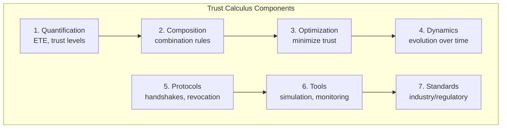
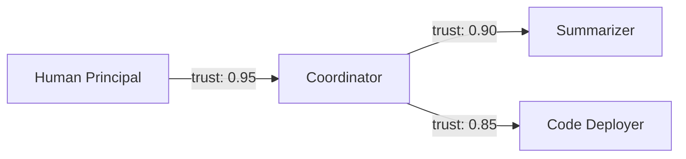
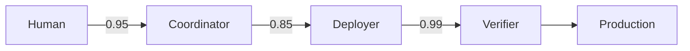

# Trust Calculus: Overview

A mature trust calculus provides the mathematical and operational foundation for managing AI systems safely at scale.

## The Trust Calculus Vision

A complete trust calculus would provide:



**1. Quantification**: Every trust relationship has a number (ETE, trust level, etc.)

**2. Composition**: Rules for combining trust values (addition, multiplication, etc.)

**3. Optimization**: Algorithms for minimizing trust given constraints

**4. Dynamics**: Models for trust evolution over time

**5. Protocols**: Standard procedures for trust handshakes, revocation, etc.

**6. Tools**: Software for trust analysis, simulation, monitoring

**7. Standards**: Industry/regulatory standards for trust levels and verification

## Why Trust Calculus Matters

**1. AI systems are becoming more capable**: Higher capabilities = higher trust requirements.

**2. AI systems are becoming more autonomous**: Less human oversight = trust must be structural.

**3. AI systems are being deployed in high-stakes domains**: Healthcare, finance, infrastructure = trust violations are catastrophic.

**4. AI systems are becoming more interconnected**: Agent-to-agent delegation = trust propagation matters.

**5. We're building systems we don't fully understand**: Unknown capabilities = unknown trust requirements.

:::note
The trust calculus isn't just academic—it's infrastructure for safely deploying AI at scale. Without principled trust management, we're flying blind. With it, we have at least a chance of keeping AI systems within acceptable risk bounds as they become more powerful.
:::

## Core Concept: Expected Trust Exposure (ETE)

**ETE = Σ P(outcome) × Damage(outcome)**

For each component, sum over all possible outcomes: probability times damage. This gives a single number representing "how much trust are we placing in this component?"

## Worked Example: Research Assistant Trust Budget

Consider a decomposed research assistant with three components:



### Step 1: Identify Failure Modes and Damages

| Component | Failure Mode | P(failure) | Damage | ETE |
|-----------|--------------|------------|--------|-----|
| Summarizer | Misrepresents paper findings | 0.02 | $5,000 (wrong research direction) | $100 |
| Summarizer | Leaks proprietary data | 0.001 | $50,000 (IP loss) | $50 |
| Code Deployer | Deploys buggy code | 0.05 | $20,000 (downtime) | $1,000 |
| Code Deployer | Deploys malicious code | 0.0001 | $1,000,000 (breach) | $100 |
| Coordinator | Misroutes task | 0.01 | $2,000 (wasted effort) | $20 |
| Coordinator | Grants excessive permissions | 0.005 | $100,000 (escalation) | $500 |

**Component ETEs:**
- Summarizer: $100 + $50 = **$150**
- Code Deployer: $1,000 + $100 = **$1,100**
- Coordinator: $20 + $500 = **$520**
- **System Total: $1,770**

### Step 2: Trust Propagation

What's the effective trust from Human to Code Deployer?

Using multiplicative rule:
```
Trust(Human → Deployer) = Trust(H→C) × Trust(C→D)
                        = 0.95 × 0.85
                        = 0.8075
```

This means ~19% of potential damage from the Code Deployer propagates back to the Human as risk they're accepting.

### Step 3: Risk Budget Allocation

Suppose the organization's total acceptable ETE is **$2,000/month**.

Current allocation:
- Summarizer: $150 (7.5% of budget)
- Code Deployer: $1,100 (55% of budget) ⚠️
- Coordinator: $520 (26% of budget)

**Finding:** Code Deployer consumes most of the risk budget. Options:
1. Add verification layer before deployment (reduce P(failure))
2. Reduce deployer's permissions (reduce Damage)
3. Replace with human-in-the-loop (shift trust to human)

### Step 4: After Mitigation

Add a deployment verifier (deterministic code, formally verified):



| Component | Failure Mode | P(failure) | Damage | New ETE |
|-----------|--------------|------------|--------|---------|
| Code Deployer | Deploys malicious code | 0.0001 × 0.01 | $1,000,000 | **$1** |

Verifier catches 99% of malicious deployments. New system ETE: **$671**.

:::tip[Key Insight]
Adding a simple deterministic verifier reduced system ETE by 62%. The highest-leverage safety investment is often the cheapest: a code-based checker on the highest-damage component.
:::

### Comparison to Nuclear Safety

Nuclear plants target ~10⁻⁶ core damage frequency per reactor-year. For a $10B damage potential:
- Target ETE = 10⁻⁶ × $10B = **$10,000/year**

Our research assistant's $671/month ≈ $8,000/year is roughly comparable—which suggests either:
1. We're being appropriately cautious, or
2. Nuclear plants manage much higher absolute stakes with similar relative risk

This kind of cross-domain comparison helps calibrate whether AI safety investments are proportionate.

## Key Topics

- [Trust Propagation](/trust-calculus/trust-propagation/) - How trust flows through networks
- [Trust Interfaces & Contracts](/trust-calculus/trust-interfaces/) - Formalizing delegation relationships
- [Trust Optimization](/trust-calculus/trust-optimization/) - Minimizing trust subject to capability
- [Trust Dynamics](/trust-calculus/trust-dynamics/) - How trust evolves over time
- [Trust Accounting](/trust-calculus/trust-accounting/) - Ledgers, auditing, and KPIs
- [Trust Protocols](/trust-calculus/trust-protocols/) - Handshakes, tokens, and revocation
- [Trust Economics](/trust-calculus/trust-economics/) - Insurance, arbitrage, and incentives
- [Trust at Scale](/trust-calculus/trust-at-scale/) - Distributed systems and bottlenecks
- [Human-AI Trust](/trust-calculus/human-ai-trust/) - Team dynamics and calibration

## The Goal

:::tip[The Goal]
The goal isn't zero trust—that would mean zero delegation, zero AI benefit. The goal is _calibrated_ trust: knowing how much trust we're granting, to whom, for what, and what we're getting in return.
:::

---

## What's Next?

**To dive deeper into specific topics**:
- [Trust Propagation](/trust-calculus/trust-propagation/) — Algorithms for computing effective trust through networks
- [Trust Dynamics](/trust-calculus/trust-dynamics/) — How trust evolves, decays, and rebuilds over time

**To see trust calculus applied**:
- [Principles to Practice](/overview/principles-to-practice/) — ETE calculations for real examples
- [Risk Budgeting Overview](/risk-budgeting/overview/) — Cross-domain methods for allocating trust budgets

**To understand the foundations**:
- [Background Research](/background-research/) — Deep dives into nuclear, aerospace, and financial risk methods

**To start implementing**:
- [Quick Start](/implementation/quick-start/) — Step-by-step application checklist
- [Decision Guide](/implementation/decision-guide/) — Choosing implementations based on trust budget
