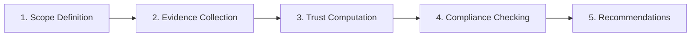

# Trust Accounting and Auditing

## Trust Ledger

Maintain a record of all trust-relevant events:

```
TrustLedger {
    entries: [
        {
            timestamp: DateTime,
            event_type: Enum[Grant, Revoke, Exercise, Verify, Violation],
            principal: AgentId,
            subject: AgentId,
            trust_amount: ETE,
            context: TaskId,
            evidence: [Evidence],
            outcome: Optional[Outcome]
        }
    ]
}
```

**Event types**:

- **Grant**: Principal grants trust to subject for task
- **Revoke**: Principal revokes previously granted trust
- **Exercise**: Subject exercises granted trust (takes action)
- **Verify**: Verification of subject's trustworthiness
- **Violation**: Subject violates trust

## Trust Balance Sheet

**Assets** (trust granted to us):

```
Trust_received = Σⱼ Trust(j → us)
```

**Liabilities** (trust we've granted to others):

```
Trust_granted = Σⱼ Trust(us → j)
```

**Net trust position**:

```
Net_trust = Trust_received - Trust_granted
```

:::note[Interpretation]
Net positive means we're a trust sink (others depend on us). Net negative means we're a trust source (we depend on others).
:::

## Trust Audit Process



### 1. Scope Definition

- Which components are in scope?
- What time period?
- What trust relationships?

### 2. Evidence Collection

- Trust contracts
- Trust ledger entries
- Verification records
- Incident reports

### 3. Trust Computation

- Compute ETE for each component
- Compute trust propagation through system
- Identify trust concentrations and bottlenecks

### 4. Compliance Checking

- Are trust levels within stated bounds?
- Were verification requirements met?
- Were incidents properly handled?

### 5. Recommendations

- Trust reallocation
- Additional verification
- Architectural changes

## Trust KPIs and Dashboards

**Key Performance Indicators**:

| KPI                   | Definition                           | Target      |
| --------------------- | ------------------------------------ | ----------- |
| System ETE            | Total expected trust exposure        | < $X        |
| Trust concentration   | Herfindahl index of component ETEs   | < 0.25      |
| Verification coverage | % of trust relationships verified    | > 90%       |
| Trust decay rate      | Average λ across components          | < 0.1/month |
| Incident rate         | Trust violations per time period     | < 1/quarter |
| Mean time to detect   | Average time to detect violation     | < 1 hour    |
| Mean time to respond  | Average time to respond to violation | < 4 hours   |

**Dashboard elements**:

- Trust topology visualization
- Heat map of component ETEs
- Time series of system ETE
- Alert status for trust violations
- Verification schedule and status

## Trust Forensics

After a trust violation, determine:

### 1. What Happened?

- Which component violated trust?
- What action was taken?
- What damage occurred?

### 2. How Did It Happen?

- Was the trust grant appropriate?
- Did verification fail?
- Was there a gap in monitoring?

### 3. Why Did It Happen?

- Component failure (bug, error)?
- Adversarial action (intentional violation)?
- Environmental factor (unexpected input)?

### 4. What Enabled It?

- Excessive trust grant?
- Insufficient verification?
- Correlated failures?
- Trust concentration?

### 5. How to Prevent Recurrence?

- Architectural changes?
- Additional verification?
- Trust bound reduction?
- Monitoring improvements?
